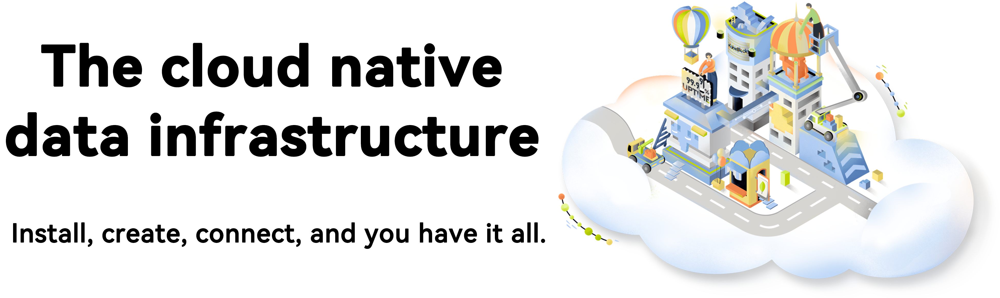

# KubeBlocks

- [KubeBlocks](#kubeblocks)
  - [What is KubeBlocks](#what-is-kubeblocks)
    - [Why you need KubeBlocks](#why-you-need-kubeblocks)
    - [Goals](#goals)
    - [Key features](#key-features)
  - [Get started with KubeBlocks](#get-started-with-kubeblocks)
  - [Community](#community)
  - [Contributing to KubeBlocks](#contributing-to-kubeblocks)
  - [License](#license)

## What is KubeBlocks

KubeBlocks is an open-source, cloud-native data infrastructure designed to help application developers and platform engineers manage database and analytical workloads on Kubernetes. It is cloud-neutral and supports multiple cloud service providers, offering a unified and declarative approach to increase productivity in DevOps practices.

The name KubeBlocks is derived from Kubernetes and LEGO blocks, which indicates that building database and analytical workloads on Kubernetes can be both productive and enjoyable, like playing with construction toys. KubeBlocks combines the large-scale production experiences of top cloud service providers with enhanced usability and stability.

### Why you need KubeBlocks

Kubernetes has become the de facto standard for container orchestration. It manages an ever-increasing number of stateless workloads with the scalability and availability provided by ReplicaSet and the rollout and rollback capabilities provided by Deployment. However, managing stateful workloads poses great challenges for Kubernetes. Although statefulSet provides stable persistent storage and unique network identifiers, these abilities are far from enough for complex stateful workloads.

To address these challenges, and solve the problem of complexity, KubeBlocks introduces ReplicationSet and ConsensusSet, with the following capabilities:

- Role-based update order reduces downtime caused by upgrading versions, scaling, and rebooting.
- Maintains the status of data replication and automatically repairs replication errors or delays.

### Goals

- Enhance stateful workloads on Kubernetes, being open-source and cloud-neutral.
- Manage data infrastructure without a high cognitive load of cloud computing, Kubernetes, and database knowledge.
- Reduce costs by only paying for the infrastructure and increasing the utilization of resources with flexible scheduling.
- Support the most popular RDBMS, NoSQL, streaming and analytical systems, and their bundled tools.
- Provide the most advanced user experience based on the concepts of IaC and GitOps.

### Key features

- Be compatible with AWS, GCP, Azure, and Alibaba Cloud.
- Supports MySQL, PostgreSQL, Redis, MongoDB, Kafka, and more.
- Provides production-level performance, resilience, scalability, and observability.
- Simplifies day-2 operations, such as upgrading, scaling, monitoring, backup, and restore.
- Contains a powerful and intuitive command line tool.
- Sets up a full-stack, production-ready data infrastructure in minutes.

## Get started with KubeBlocks

[Quick Start](./docs/user_docs/quick-start/) shows you the quickest way to get started with KubeBlocks.

## Community

- KubeBlocks [Slack Channel](https://kubeblocks.slack.com/ssb/redirect)
- KubeBlocks Github [Discussions](https://github.com/apecloud/kubeblocks/discussions)

## Contributing to KubeBlocks

Your contributions and suggestions are welcomed and appreciated.

- See the [Contributing Guide](docs/CONTRIBUTING.md) for details on typical contribution workflows.
- See the [Developer Guide](docs/DEVELOPING.md) to get started with building and developing.

## License

KubeBlocks is under the GNU Affero General Public License v3.0.
See the [LICENSE](./LICENSE) file for details.
