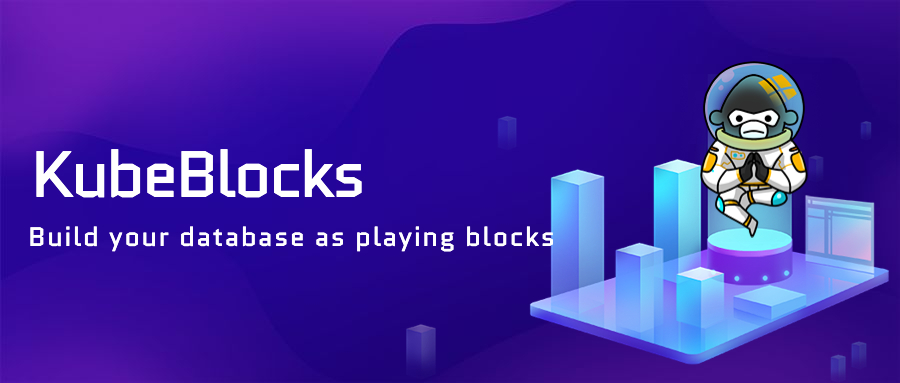

# KubeBlocks

- [KubeBlocks](#kubeblocks)
  - [What is KubeBlocks](#what-is-kubeblocks)
    - [Goals](#goals)
    - [Key Features](#key-features)
  - [Documents](#documents)
    - [Quick start with KubeBlocks](#quick-start-with-kubeblocks)
    - [Introduction](#introduction)
    - [Installation](#installation)
    - [User documents](#user-documents)
    - [Design proposal](#design-proposal)
  - [Community](#community)
  - [Contributing to KubeBlocks](#contributing-to-kubeblocks)
  - [License](#license)

## What is KubeBlocks
KubeBlocks is an open-source and cloud-prem tool that helps application developers and platform engineers build and manage Kubernetes native data platforms. Based on the best experience of public cloud fully managed services, KubeBlocks improves the service availability, resource utilization, and developer productivity of data platforms on Kubernetes.
### Goals
Our goals are to: 
- Improve Kubernetes' ability to manage stateful applications in an open-source and cloud-neutral manner
- Manage data platforms without a high cognitive load of cloud computing, Kubernetes, and database knowledge 
- Be community-driven, embracing extensibility, and providing domain functions without vendor lock-in
- Reduce costs by only paying for the infrastructure and increasing the utilization of resources with flexible scheduling
- Support the most popular databases, analytical software, and their bundled tools
- Provide the most advanced user experience based on the concept of IaC and GitOps
### Key Features
- Running in Kubernetes clusters on public clouds such as AWS/GCP/Azure
- 50% cost down under the same workload, compared with fully managed database services
- A Kubernetes-style declarative API
- Provide kbcli, an easy-to-use intuitive command-line tool
- A complete experience of Day-2 automated operation and maintenance
- Supports mainstream open-source database software, among which the experience of using KubeBlocks to manage MySQL database targets that of AWS Aurora.
  - KubeBlocks supports asynchronous replication and synchronous replication with ReplicationSet and ConsensusSet
  - KubeBlocks deploys MySQL to 3 available zones and ensures availability when a single AZ is unavailable (RTO is less than 30 seconds)
  - KubeBlocks supports role configuration and complex topological relationships of Leader, Follower, and Learner

For detailed feature information, see [Feature list](https://github.com/apecloud/kubeblocks/blob/support/rewrite_kb_introduction/docs/user_docs/Introduction/feature_list.md)

## Documents
### Quick start with KubeBlocks
TODO 
### Introduction
[Introduction](https://github.com/apecloud/kubeblocks/blob/main/docs/user_docs/Introduction/introduction.md) is a detailed information on KubeBlocks.
### Installation
[Installation](https://github.com/apecloud/kubeblocks/tree/main/docs/user_docs/installation) document for install KubeBlocks, playground, kbctl, and create database clusters.
### User documents
[User documents](https://github.com/apecloud/kubeblocks/tree/main/docs/user_docs) for instruction to use KubeBlocks.
### Design proposal
[Design proposal](https://github.com/apecloud/kubeblocks/tree/main/docs/design_docs) for design motivation and methodology.

## Community
- KubeBlocks [Slack Channel](https://kubeblocks.slack.com/ssb/redirect)
- KubeBlocks Github [Discussions](https://github.com/apecloud/kubeblocks/discussions)
- Questions tagged [#KubeBlocks](https://stackoverflow.com/questions/tagged/KubeBlocks) on StackOverflow
- Follow us on Twitter [@KubeBlocks](https://twitter.com/KubeBlocks)
## Contributing to KubeBlocks
Your contributions and suggestions are welcomed and appreciated.
- See the [Contributing Guide](docs/CONTRIBUTING.md) for details on typical contribution workflows.
- See the [Development Guide](docs/DEVELOPING.md) to get started with building and developing.
- See the [Docs Contributing Guide](docs/CONTRIBUTING_DOCS.md) to get started with contributing to the KubeBlocks docs.

## License
KubeBlocks is under the Apache 2.0 license. See the [LICENSE](./LICENSE) file for details.