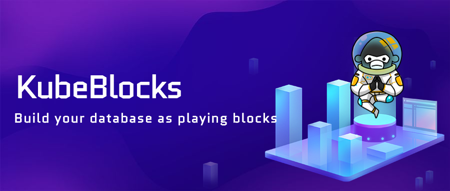

# KubeBlocks

- [What is KubeBlocks](#what-is-kubeblocks)
  - [Goals](#goals)
  - [Key Features](#key-features)
- [Documents](#documents)
  - [Quick start with KubeBlocks](#quick-start-with-kubeblocks)
  - [Introduction](#introduction)
  - [Installation](#installation)
  - [User documents](#user-documents)
  - [Design proposal](#design-proposal)
- [Community](#community)
- [Contributing to KubeBlocks](#contributing-to-kubeblocks)
- [License](#license)

## What is KubeBlocks
**KubeBlocks**, is an open-source cloud-prem tool that helps application developers and platform engineers build and manage Kubernetes native data platforms. KubeBlocks is cloud neutral, allowing users to operate resources from public cloud vendors through a unified interface, and the implementation of basic functions always takes into account the best practices of each public cloud infrastructure.

### Goals
- Enable developers using one platform to manage any database engines used
- Provide consistent and easy-to-use declarative API
- Create and use database clusters within minutes without a deep knowledge of Kubernetes
- Relieve the burden of maintaining miscellaneous operators
- Be community driven, open, and cloud neutral
- Embrace extensibility and provide domain functions without vendor lock-in
- Gain new contributors
### Key Features
- Runs on a Kubernetes base on any cloud
- Defines each supported database engine through a declarative API
- Integrated DevOps tools and processes,such as Prometheus, Grafana and AlertManager for monitoring and alarming
- Compatible with MySQL, PostgreSQL, Redis, MongoDB and other database engines
- Accesses and manages any new database engines or plugins by defining CRD
- High availability, based on the consistency X-Paxos protocol
- Database life cycle management
- Backup and restore
- Supports resource overcommitment
- Managed and optimized database security
- Provides kbcli, an easy-to-use CLI command line tool

For detailed feature information, see [Feature list](https://github.com/apecloud/kubeblocks/blob/support/rewrite_kb_introduction/docs/user_docs/Introduction/feature_list.md)

## Documents
### Quick start with KubeBlocks
TODO 
### Introduction
[Introduction](https://github.com/apecloud/kubeblocks/blob/main/docs/user_docs/Introduction/introduction.md) is a detailed information on KubeBlocks.
### Installation
[Installation](https://github.com/apecloud/kubeblocks/tree/main/docs/user_docs/installation) document for install KubeBlocks, playground, kbctl, and create database clusters.
### User documents
[User documents](https://github.com/apecloud/kubeblocks/tree/main/docs/user_docs) for instruction to use KubeBlocks.
### Design proposal
[Design proposal](https://github.com/apecloud/kubeblocks/tree/main/docs/design_docs) for design motivation and methodology.

## Community
- KubeBlocks [Slack Channel](https://kubeblocks.slack.com/ssb/redirect)
- KubeBlocks Github [Discussions](https://github.com/apecloud/kubeblocks/discussions)
- Questions tagged [#KubeBlocks](https://stackoverflow.com/questions/tagged/KubeBlocks) on StackOverflow
- Follow us on Twitter [@KubeBlocks](https://twitter.com/KubeBlocks)
## Contributing to KubeBlocks
Your contributions and suggestions are welcomed and appreciated.
- See the [Contributing Guide](docs/CONTRIBUTING.md) for details on typical contribution workflows.
- See the [Development Guide](docs/DEVELOPING.md) to get started with building and developing.
- See the [Docs Contributing Guide](docs/CONTRIBUTING_DOCS.md) to get started with contributing to the KubeBlocks docs.

## License
KubeBlocks is under the Apache 2.0 license. See the [LICENSE](./LICENSE) file for details.
