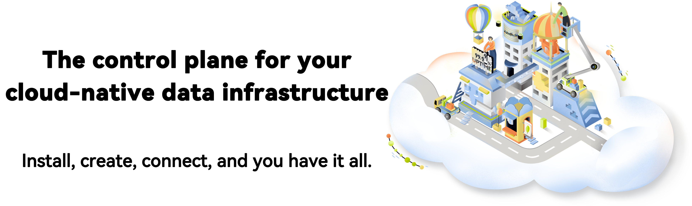

# KubeBlocks

## What is KubeBlocks

KubeBlocks is an open-source control plane software that runs and manages databases, message queues and other data infrastructure on K8s. The name KubeBlocks is inspired by Kubernetes and LEGO blocks, signifying that running and managing data infrastructure on K8s can be standard and productive, like playing with LEGO blocks. 

KubeBlocks could manage various type of engines, including RDBMSs (MySQL, PostgreSQL), Caches(Redis), NoSQLs (MongoDB), MQs(Kafka, Pulsar), and vector databases(Milvus, Qdrant, Weaviate), and the community is actively integrating more types of engines into KubeBlocks. Currently it has supported 32 types of engines!

The core of KubeBlocks is a K8s operator, which defines a set of CRDs to abstract the common attributes of various engines. KubeBlocks helps developers, SREs, and platform engineers deploy and maintain dedicated DBPaaS, and supports both public cloud vendors and on-premise environments.

### Why you need KubeBlocks

KubeBlocks integrates the most popular database/message-queue/data-processing engines and provides rich management functions, along with declarative APIs, on various environments. Furthermore, KubeBlocks offers the following benefits:

* Cost-effective
  
  KubeBlocks optimizes the kernel and parameters of MySQL and PostgreSQL databases for containerized and cloud environments, and its performance exceeds that of RDS with the same hardware (see our blogs for test reports).

* Reliability
  
  KubeBlocks supports high-availability cluster configurations for multiple database engines, and supports Raft replication cluster for MySQL to achieve enhanced availability with durability guarantees.

* Observability
  
  KubeBlocks collects monitoring metrics from richful data sources, integrates with the Prometheus stack, and provides insightful Grafana templates. In addition, troubleshooting tools such as slow logs are also provided.

* Extensibility
  
  KubeBlocks provides the addon mechanism for integrating new engines. So it can be extended to run the databases your project needs.

### Goals
- Being open and cloud-neutral
- Promoting the containerization of database workloads
- Promoting IaC and GitOps in the field of databases
- Reducing the cost of using databases
- Smoothing the learning curve of managing databases

### Key features

- Be compatible with AWS, GCP, Azure, and more
- Supports various data infrastructure systems, including MySQL, PostgreSQL, Redis, MongoDB, Kafka, Pulsar and more
- Provides production-level performance, resilience, scalability, and observability
- Simplifies day-2 operations, such as upgrading, scaling, monitoring, backup, and restore
- Contains a powerful and intuitive command line tool
  
## Get started with KubeBlocks

[Quick Start](https://kubeblocks.io/docs/preview/user_docs/try-out-on-playground/try-kubeblocks-on-your-laptop) shows you the quickest way to get started with KubeBlocks.

## Community

- KubeBlocks [Slack Channel](https://join.slack.com/t/kubeblocks/shared_invite/zt-23vym7xpx-Xu3xcE7HmcqGKvTX4U9yTg)
- KubeBlocks Github [Discussions](https://github.com/apecloud/kubeblocks/discussions)

## Contributing to KubeBlocks

Your contributions are welcomed and appreciated.

- See the [Contributor Guide](docs/CONTRIBUTING.md) for details on typical contribution workflows.
- See the [Developer Guide](docs/DEVELOPING.md) to get started with building and developing.

## Report Vulnerability

We consider security is a top priority issue. If you come across a related issue, please create a [Report a security vulnerability](https://github.com/apecloud/kubeblocks/security/advisories/new) issue.

## License

KubeBlocks is under the GNU Affero General Public License v3.0.
See the [LICENSE](./LICENSE) file for details.
