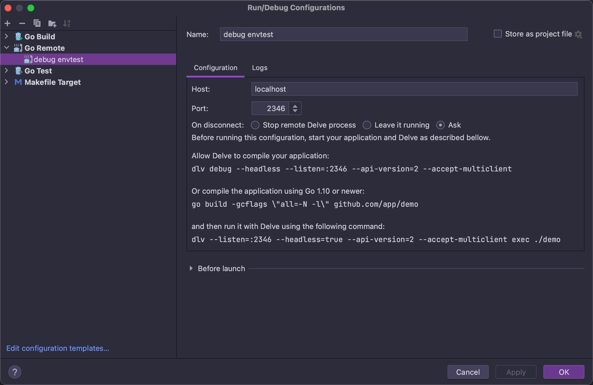

## Debug
We can use [Delve](https://github.com/go-delve/delve) for Go debugging.

### Install Delve
- Follow the [General install instructions](https://github.com/go-delve/delve/tree/master/Documentation/installation).
  > Make sure `PATH` containers `$GOPATH/bin` which will allow you to run Go binary executables without specifying the absolute path.
- If you are using macOS, you can install via HomeBrew with the following command :
    ```shell
    brew install delve
    ```
- Check your installation
    ```shell
    dlv version
    ```

### Start a delve debug server
You can start a delve debug server for running and debugging specific package or [envtest](https://book.kubebuilder.io/reference/envtest.html).

#### Debug specific package
```shell
make run-delve GO_PACKAGE=./cmd/manager/main.go
```

#### Pass arguments
```shell
 make run-delve GO_PACKAGE=./cmd/cli/main.go ARGUMENTS='cluster create test-cluster --termination-policy=Halt'
```

#### Debug envtest
```shell
make test-delve TEST_PACKAGES=./controllers/apps/...
```
> Unlike `go test` supports multiple packages, `Delve` needs a single executable to work, it only supports single package.

#### Change debug server port
You can change debug server port for `make run-delve` and `make test-delve`.
```shell
make run-delve DEBUG_PORT=2347
```
After bug server started, it will show the listen address:
```shell
API server listening at: [::]:2347
```

### Connect the debug server with a frontend client
`Delve` support lots of code editors ([editor plugins for Delve](https://github.com/go-delve/delve/blob/master/Documentation/EditorIntegration.md)), you can choose your favorite editor to connect with the listen address for debugging.

This section introduces how to start debugging with the Delve CLI, GoLand and VSCode. Please refer to the Delve or editors documentation for more details.

#### Delve CLI

```shell
$ dlv connect 127.0.0.1:2345
Type 'help' for list of commands.
(dlv) break cluster_controller.go:303
(dlv) continue
(dlv) next
(dlv) ......
```

#### JetBrains GoLand / IntelliJ IDEA with go plugin

Click Run — Edit configurations, add new debug configuration, select "Go Remote":


Add debug server listen address to `Host` and `Port`


And then set breakpoints, and run debug.


#### VSCode
Create/modify .vscode/launch.json file for connecting debug server:

```json
{
    "version": "0.2.0",
    "configurations": [
        {
            "name": "debug envtest",
            "type": "go",
            "request": "attach",
            "mode": "remote",
            "remotePath": "",
            "port": 2346,
            "host": "127.0.0.1",
            "showLog": true,
            "trace": "log",
            "logOutput": "rpc"
        }
    ]
}
```
Set breakpoints and run `Start Debugging`.

