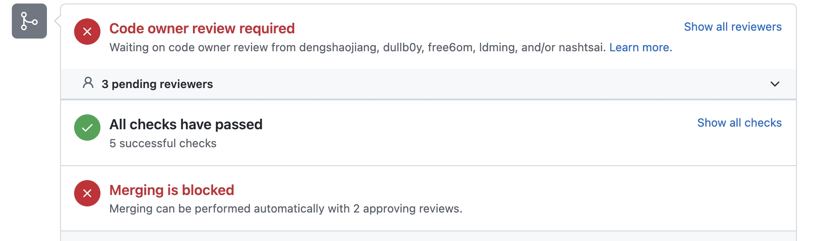

# Contributing KubeBlocks
First, thank you for contributing to KubeBlocks! 
This document provides the guidelines for how to contribute to KubeBlocks. 

- [Workflow](#workflow)
  - [Open an issue](#open-an-issue)
    - [Check for existing issues](#check-for-existing-issues)
    - [Issue types](#issue-types)
  - [Make your changes](#make-your-changes)
  - [Submit a pull-requests](#submit-a-pull-requests)
    - [Format the pull request title](#format-the-pull-request-title)
    - [Make sure CI checks passed](#make-sure-ci-checks-passed)
    - [Wait code review finished](#wait-code-review-finished)
    - [Merge to the main branch](#merge-to-the-main-branch)
- [Legal](#legal)

## Workflow
Contributing to KubeBlocks through issues and pull-requests, make sure you are familiar with Github and the [pull request workflow](https://docs.github.com/en/get-started/quickstart/github-flow).

To submit a proposed change, read the following workflow.

### Open an issue
#### Check for existing issues
- Before you create a new issue, please do a search in [open issues](https://github.com/apecloud/kubeblocks/issues) to see if the issue or feature request has already been filed.
- If you find your issue already exists, make relevant comments or add your [reaction](https://github.blog/2016-03-10-add-reactions-to-pull-requests-issues-and-comments/).
- If you can not find you issue exists, [choose the specific issue type]((https://github.com/apecloud/kubeblocks/issues/new/choose)) and open a new issue.

#### Issue types
Currently, there are 4 types of issues:
- **Bug report**: You’ve found a bug with the code, and want to report or track the bug. Show more details, let us know about an unexpected error, a crash, or an incorrect behavior.
- **Feature request**: Suggest a new feature. This allows feedback from others before code is written.
- **Document request**: Contribute to the [KubeBlocks documentation](https://kubeblocks.io/docs/overview).
- **Report a security vulnerability**: Review our security policy first and then report a vulnerability.

### Make your changes
- Fork the KubeBlocks repository to your Github account, create a new branch and clone to your host.
  - Branch naming style should match the pattern: `feature/|bugfix/|release/|hotfix/|support/|dependabot/`. KubeBlocks performs a pull request check to verify the pull request branch name.
- See the [Developing KubeBlocks docs](./DEVELOPING.md) for more information about setting up a KubeBlocks development environment.
- Make your changes.
- Update relevant documentation for the change.
- Make sure all tests and checks are passed.
    ```shell
    cd kubeblocks
    make reviewable
    ```


### Submit a pull-requests
Submit the branch as a pull request to the main KubeBlocks repository.
#### Format the pull request title
The pull request title must follow the format outlined in the [conventional commits spec](https://www.conventionalcommits.org/en/v1.0.0/). Because KubeBlocks squashes commits before merging branches, this means that only the pull request title must conform to this format. KubeBlocks performs a pull request check to verify the pull request title in case you forget.

The following are all good examples of pull request titles:
```shell
feat(apps): add foo bar baz feature
fix(kbcli): fix foo bar baz bug
chore: tidy up Makefile
docs: fix typos
```

#### Make sure CI checks passed
Wait for the CI process to finish and make sure all checks are green.




#### Wait code review finished
All pull requests should be reviewed, a pull request need at least approved by **two maintainers** before merging.


#### Merge to the main branch
All pull requests are squashed and merged, after code review finished, the pull request will be merged into the main branch.

## Legal
TODO: add `DCO`(The Developer Certificate of Origin) or `CLA`(Contributor License Agreement)
