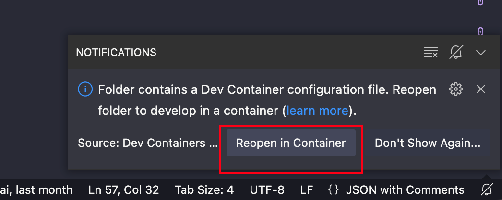
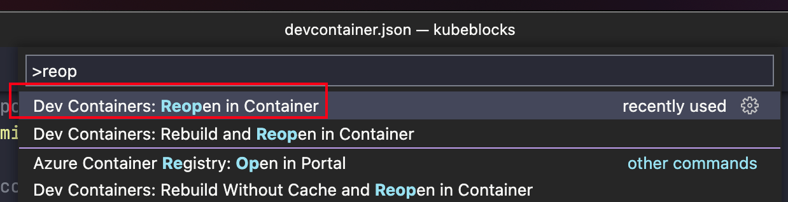
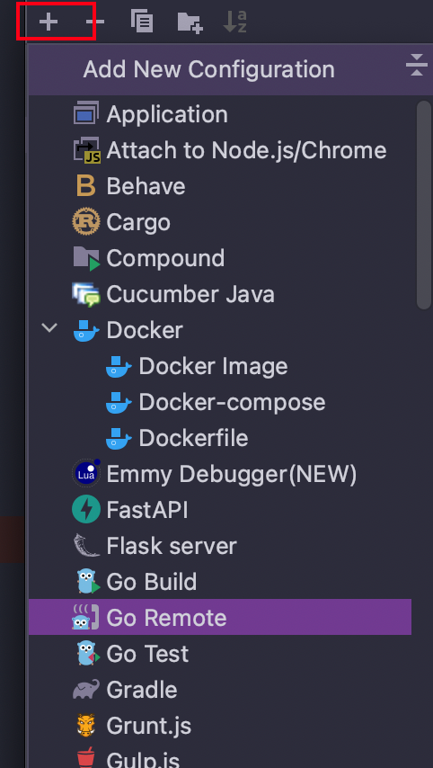
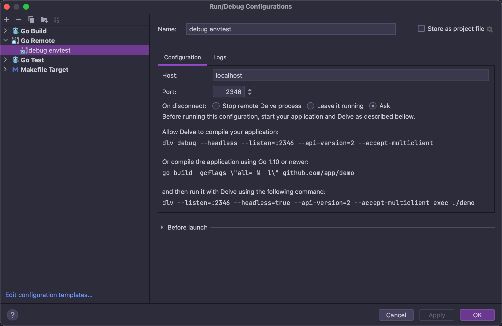
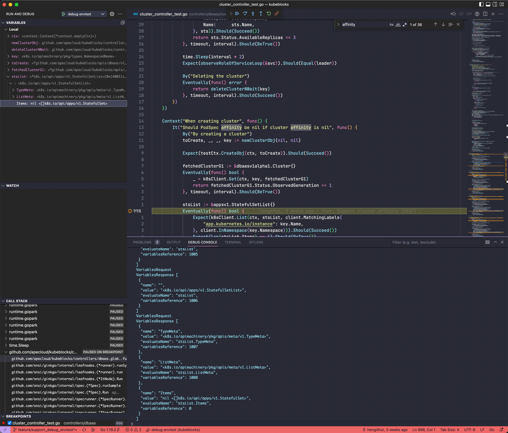

# Developing KubeBlocks
This document covers basic needs to work with KubeBlocks codebase.

- [Setup development environment](#setup-development-environment)
  - [Bring your own toolbox](#bring-your-own-toolbox)
    - [Docker environment](#docker-environment)
    - [Go (Golang)](#go-golang)
    - [Installing Make](#installing-make)
  - [Using VSCode and development container](#using-vscode-and-development-container)
    - [Setup the development container](#setup-the-development-container)
    - [Customizing your dev container](#customizing-your-dev-container)
      - [Using a custom dev container image](#using-a-custom-dev-container-image)
      - [Connecting existing kubernetes Cluster](#connecting-existing-kubernetes-cluster)
  - [Setup a Kubernetes development environment](#setup-a-kubernetes-development-environment)
- [Basics](#basics)
  - [Kubebuilder](#kubebuilder)
  - [Makefile](#makefile)
  - [[TODO] dbctl](#todo-dbctl)
  - [Code style](#code-style)
  - [Building local binaries](#building-local-binaries)
- [Test](#test)
  - [Envtest](#envtest)
  - [Use existing kubernetes cluster](#use-existing-kubernetes-cluster)
  - [Check test code coverage](#check-test-code-coverage)
- [Debug](#debug)
  - [Start a delve debug server](#start-a-delve-debug-server)
  - [Connect the debug server with a frontend client](#connect-the-debug-server-with-a-frontend-client)
    - [Delve CLI](#delve-cli)
    - [JetBrains GoLand / IntelliJ IDEA with go plugin](#jetbrains-goland--intellij-idea-with-go-plugin)
    - [VSCode](#vscode)


## Setup development environment
There are two options for getting an environment up and running for KubeBlocks development.

### Bring your own toolbox
To build `KubeBlocks` on your own host, needs to install the following tools:
- Docker
- Go
- Make

#### Docker environment
1. Install [Docker](https://docs.docker.com/install/)
    > For Linux, you'll have to configure docker to run without `sudo` for the KubeBlocks build scripts to work. Follow the instructions to [manage Docker as a non-root user](https://docs.docker.com/engine/install/linux-postinstall/#manage-docker-as-a-non-root-user).
2. Create your [Docker Hub account](https://hub.docker.com/signup) if you don't already have one.

#### Go (Golang)
1. Download and install [Go 1.18 or later](https://golang.org/doc/install#tarball).
2. Install [Delve](https://github.com/go-delve/delve/tree/master/Documentation/installation) for Go debugging, if de
3. Install [golangci-lint](https://golangci-lint.run/usage/install).

#### Installing Make
KubeBlocks uses `make` for a variety of build and test actions, and needs to be installed as appropriate for your platform:

- Linux
  1. Install the `build-essential` package:
     ```shell
     sudo apt-get install build-essential
     ```
- macOS
  1. Ensure that build tools are installed:
     ```shell
     xcode-select --install
     ```
  2. When completed, you should see `make` and other command line developer tools in `/usr/bin`.

### Using VSCode and development container
If you are using Visual Studio Code, you can connect to a [development container](https://code.visualstudio.com/docs/devcontainers/containers) configured for KuberBlocks development. With development container, you don't need to manually install all of the tools and frameworks needed.

#### Setup the development container
1. Install VSCode [Dev Containers extension](https://marketplace.visualstudio.com/items?itemName=ms-vscode-remote.remote-containers)
2. Open the KubeBlocks project folder in VSCode
    - VSCode will detect the presence of a dev container definition in the repo and will prompt you to reopen the project in a container:
      
    - Alternatively, you can open the command palette and use the Remote-Containers: Reopen in Container command:
      
    - VSCode will pull image and start dev cotnainer automatically, once the container is loaded, open an integrated terminal in VS Code and you're ready to develop KubeBlocks in a containerized environment.

#### Customizing your dev container
##### Using a custom dev container image
The [devcontainer.json](../.devcontainer/devcontainer.json) uses the latest image from [ApeCloud Dokcer hub](https://hub.docker.com/r/apecloud/kubeblocks-dev), you can customize image to suit your need. 
1. Edit the [docker/Dockerfile-dev](../docker/Dockerfile-dev) dev container image definition, you can change the `[Option]` configuration or install additional tools.
    ```Dockerfile
    # Copy library scripts to execute
    COPY library-scripts/*.sh library-scripts/*.env /tmp/library-scripts/

    # [Option] Install zsh
    ARG INSTALL_ZSH="true"

    # [Optional] Uncomment the next line to use go get to install anything else you need
    # RUN go get -x <your-dependency-or-tool>

    # [Optional] Uncomment this section to install additional OS packages.
    # RUN apt-get update && export DEBIAN_FRONTEND=noninteractive \
    #     && apt-get -y install --no-install-recommends <your-package-list-here>

    # [Optional] Uncomment this line to install global node packages.
    # RUN su vscode -c "source /usr/local/share/nvm/nvm.sh && npm install -g <your-package-here>" 2>&
    ```
2. Build a new image using updated `Dockerfile`, and replace the `"image"` property in [devcontainer.json](../.devcontainer/devcontainer.json).
    ```json
    {
        // Update to your dev container image
        "image": "docker.io/apecloud/kubeblocks-dev:latest",
    }

    ```
3. Rebuild and reopen the workspace in the dev container via the command palette and the `Remote-Containers: Rebuild and Reopen` in Container command.
4. When you are satisfied with your changes, you can optionally publish your container image to your own registry to speed up rebuilding the container when you only want to make changes to the `devcontainer.json` configuration in the future. For a docker image named `docker.io/xxxx/kubeblocks-dev`:
    ```shell
    make build-dev-image DEV_CONTAINER_IMAGE_NAME=docker.io/xxxx/kubeblocks-dev
    ```

##### Connecting existing kubernetes Cluster
If you want to reuse an existing Kubernetes config, such as your [`EKS`](https://aws.amazon.com/eks/) cluste or local [`Minikube`](https://minikube.sigs.k8s.io/docs/) cluster, you can configure the `devcontainer.json` copy those settings into the dev container. This requires:

1. Enabling the `SYNC_LOCALHOST_KUBECONFIG` environment variable
2. Bind mounting the locations of your Kubernetes and Minikube config paths to `/home/kubeblocks/.kube-localhost` and `/home/kubeblocks/.minikube-localhost` respectively.
    - You don't need to bind the Minikube path if you're not using it.
    ```json
    "containerEnv": {
        // Uncomment to overwrite devcontainer .kube/config and .minikube certs with the localhost versions
        // each time the devcontainer starts, if the respective .kube-localhost/config and .minikube-localhost
        // folders respectively are bind mounted to the devcontainer.
        "SYNC_LOCALHOST_KUBECONFIG": "true",
    },

    ...

    "mounts": [
    // Uncomment to clone local .kube/config into devcontainer
    "type=bind,source=${env:HOME}${env:USERPROFILE}/.kube,target=/home/kubeblocks/.kube-localhost",

    // Uncomment to additionally clone minikube certs into devcontainer for use with .kube/config
    "type=bind,source=${env:HOME}${env:USERPROFILE}/.minikube,target=/home/kubeblocks/.minikube-localhost"

    ]
    ```
> ⚠ The `SYNC_LOCALHOST_KUBECONFIG` option only supports providing the dev container with the snapshot configuration from the host and does not support updating the host Kubernetes configuration from the dev container directly.
   


### Setup a Kubernetes development environment
To run `KubeBlocks`, you needs a Kubernetes 1.24.1+ cluster for development, [`Minikube`](https://minikube.sigs.k8s.io/docs/) and [`k3d`](https://k3d.io/stable/) are recommanded.


## Basics
### Kubebuilder
KubeBlocks is using kubebuilder as the operator framework, before your start to code, suggest to read [kubebuilder books](https://book.kubebuilder.io/).

### Makefile
KubeBlocks includes a [Makefile](../Makefile) in the root of the repo. This serves as a high-level interface for common commands. Running `make help` will produce a list of make targets with descriptions. These targets will be referenced throughout this document.
### [TODO] dbctl

### Code style
First, read the Go (Golang) coding guidelines again, looking for any style violations. It's easier to remember a style rule once you've violated it.

Run our suite of linters:

``` shell
make lint
```
This is not a fast command. On my machine, at the time of writing, it takes about a full minute to run. You can instead run

### Building local binaries
```shell
make all
```


## Test
KubeBlocks uses make for a variety of test actions.

### Envtest
Setting up a local control plane and test all modules:
```shell
make test
```
Test specific packages:

```shell
# Directory `controllers` contains many packages, it will build and run each package individually.
make test TEST_MODULE=./controllers/

# Test single package
make test-delve TEST_MODULE=./controllers/dbaas/
```

### Use existing kubernetes cluster
```shell
make test-current-ctx
```
Instead of setting up a local control plane, this command will point to the control plane of an existing cluster by `$HOME/.kube/config`.

### Check test code coverage

```shell
make cover-report
```
This command will generate a coverage report file `cover.html`, and open by your default browser automatically.


## Debug
### Start a delve debug server
You can start a delve debug server for debuging controller or envtest.

- debug for controller
    ```shell
    make run-delve
    ```

- debug for envtest
    ```shell
    make test-delve TEST_MODULE=./controllers/dbaas/
    ```
> Unlike `go test` supports multiple packages, `Delve` needs a single executable to work, it only support single package.


After bug server started, it will show the listen address:
```shell
API server listening at: [::]:2345
```


### Connect the debug server with a frontend client
`Delve` support lots of code editors ([editor plugins for Delve]((https://github.com/go-delve/delve/blob/master/Documentation/EditorIntegration.md))), you can choose your favourite editor to connect with the listen address for debugging. [frontend client].

This section introduces how to start debugging with the Delve CLI, Goland and VSCode. Please refer to the Delve or editors documentation for more details.

#### Delve CLI

```shell
➜  ~ dlv connect 127.0.0.1:2346
Type 'help' for list of commands.
(dlv) break cluster_controller.go:303
(dlv) continue
(dlv) next
(dlv) ......
```

#### JetBrains GoLand / IntelliJ IDEA with go plugin

Click Run — Edit configurations, add new debug configuration, select "Go Remote":


Add debug server listen address to `Host` and `Port`


And then set breakpoints, and run debug.


#### VSCode
Create/modify .vscode/launch.json file for connecting debug server:

```json
{
    "version": "0.2.0",
    "configurations": [
        {
            "name": "debug envtest",
            "type": "go",
            "request": "attach",
            "mode": "remote",
            "remotePath": "",
            "port": 2346,
            "host": "127.0.0.1",
            "showLog": true,
            "trace": "log",
            "logOutput": "rpc"
        }
    ]
}
```
Set breakpoints and run `Start Debuging`.

