# Failure simulation and automatic recovery

As an open-source data management platform, Kubeblocks currently supports over thirty database engines and is continuously expanding. Due to the varying high availability capabilities of databases, KubeBlocks has designed and implemented a high availability (HA) system for database instances. The KubeBlocks HA system uses a unified HA framework to provide high availability for databases, allowing different databases on KubeBlocks to achieve similar high availability capabilities and experiences.

This tutorial uses Apecloud MySQL as an example to demonstrate its fault simulation and recovery capabilities.

## Recovery simulation

:::note

The faults here are all simulated by deleting pods. When there are sufficient resources, the fault can also be simulated by machine downtime or container deletion, and its automatic recovery is the same as described here.

:::

### Before you start

* [Install KubeBlocks](./../../installation/install-kubeblocks.md).
* [Create an ApeCloud MySQL RaftGroup Cluster](./../cluster-management/create-and-connect-an-apecloud-mysql-cluster.md).
* Run `kubectl get cd apecloud-mysql -o yaml` to check whether _rolechangedprobe_ is enabled in the ApeCloud MySQL RaftGroup Cluster (it is enabled by default). If the following configuration exists, it indicates that it is enabled:

  ```bash
  probes:
    roleProbe:
      failureThreshold: 2
      periodSeconds: 1
      timeoutSeconds: 1
  ```

### Leader pod fault

***Steps:***

1. View the pod role of the ApeCloud MySQL RaftGroup Cluster. In this example, the leader pod's name is `mycluster-mysql-1`.

    ```bash
    kubectl get pods --show-labels -n demo | grep role
    ```

    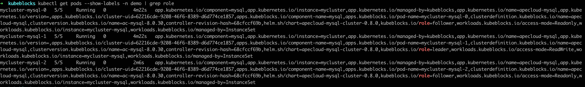
2. Delete the leader pod `mycluster-mysql-1` to simulate a pod fault.

    ```bash
    kubectl delete pod mycluster-mysql-1 -n demo
    ```

    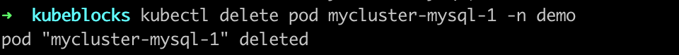
3. Check the status of the pods and RaftGroup Cluster connection.

    The following example shows that the roles of pods have changed after the old leader pod was deleted and `mycluster-mysql-0` is elected as the new leader pod.

    ```bash
    kubectl get pods --show-labels -n demo | grep role
    ```

    

    Connect to this cluster to check the pod roles and status. This cluster can be connected within seconds.

    ```bash
    kubectl get secrets -n demo mycluster-conn-credential -o jsonpath='{.data.\username}' | base64 -d
    >
    root

    kubectl get secrets -n demo mycluster-conn-credential -o jsonpath='{.data.\password}' | base64 -d
    >
    pt2mmdlp4

    kubectl exec -ti -n demo mycluster-mysql-0 -- bash

    mysql -uroot -pt2mmdlp4
    ```

    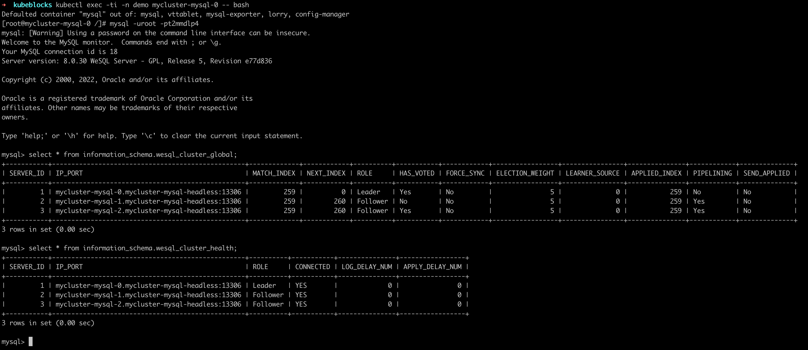

   ***How the automatic recovery works***

   After the leader pod is deleted, the ApeCloud MySQL RaftGroup Cluster elects a new leader. In this example, `mycluster-mysql-0` is elected as the new leader. KubeBlocks detects that the leader has changed, and sends a notification to update the access link. The original exception node automatically rebuilds and recovers to the normal RaftGroup Cluster state. It normally takes 30 seconds from exception to recovery.

### Single follower pod exception

***Steps:***

1. View the pod role again and in this example, the follower pods are `mycluster-mysql-1` and `mycluster-mysql-2`.

    ```bash
    kubectl get pods --show-labels -n demo | grep role
    ```

    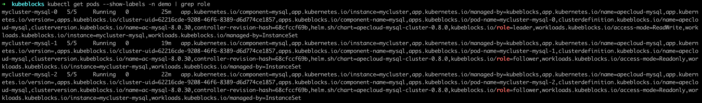
2. Delete the follower pod `mycluster-mysql-1`.

    ```bash
    kubectl delete pod mycluster-mysql-1 -n demo
    ```

    
3. Open another terminal page and view the pod status. You can find the follower pod `mycluster-mysql-1` is `Terminating`.

    ```bash
    kubectl get pod -n demo
    ```

    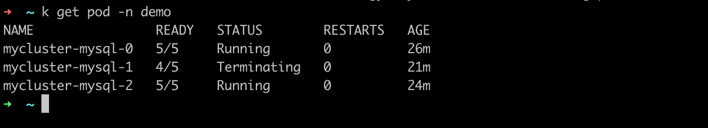

    View the pod roles again.

    

4. Connect to this cluster and you can find this single follower exception doesn't affect the R/W of the cluster.

    ```bash
    kubectl exec -ti -n demo mycluster-mysql-0 -- bash

    mysql -uroot -pt2mmdlp4
    ```

    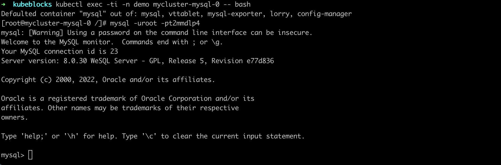

   ***How the automatic recovery works***

   One follower exception doesn't trigger re-electing of the leader or access link switch, so the R/W of the cluster is not affected. Follower exception triggers recreation and recovery. The process takes no more than 30 seconds.

### Two pods exception

The availability of the cluster generally requires the majority of pods to be in a normal state. When exceptions occur to the majority of pods, the original leader will be automatically downgraded to a follower. Therefore, the exceptions of any two pods result in only one follower pod remaining.

In this way, whether exceptions occur to one leader and one follower or two followers, failure performance and automatic recovery are the same.

***Steps:***

1. View the pod role again. In this example, the follower pods are `mycluster-mysql-1` and `mycluster-mysql-2`.

    ```bash
    kubectl get pods --show-labels -n demo | grep role
    ```

    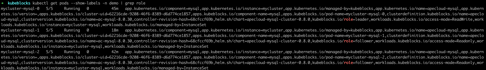
2. Delete these two follower pods.

    ```bash
    kubectl delete pod mycluster-mysql-1 mycluster-mysql-2 -n demo
    ```

    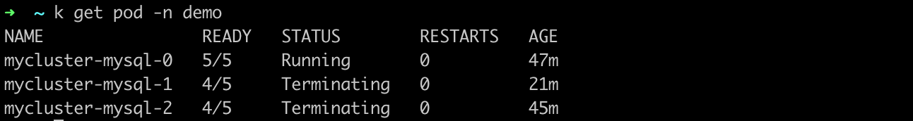
3. Open another terminal page and view the pod status. You can find the follower pods `mycluster-mysql-1` and `mycluster-mysql-2` is `Terminating`.

    ```bash
    kubectl get pod -n demo
    ```

    

    View the pod roles and you can find a new leader pod is selected.

    ```bash
    kubectl get pods --show-labels -n demo | grep role
    ```

    

4. Connect to this cluster after a few seconds and you can find the pods in the RaftGroup Cluster work normally again.

    ```bash
    kubectl exec -ti -n demo mycluster-mysql-0 -- bash

    mysql -uroot -pt2mmdlp4
    ```

    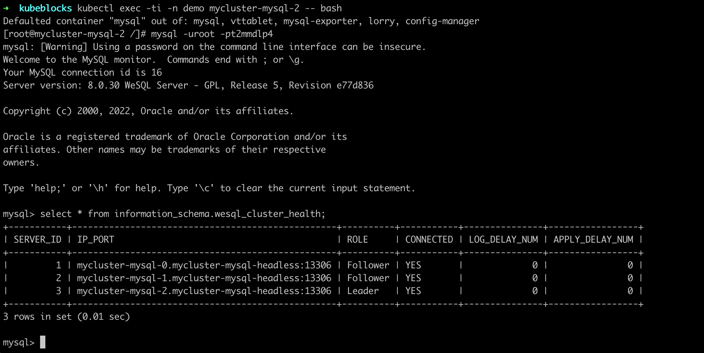

   ***How the automatic recovery works***

   When exceptions occur to two pods of the ApeCloud MySQL RaftGroup Cluster, all pods are unavailable and the cluster R/W is unavailable. After the recreation of pods, a new leader is elected to recover to R/W status. The process takes less than 30 seconds.

### All pods exception

***Steps:***

1. View the role of pods.

    ```bash
    kubectl get pods --show-labels -n demo | grep role
    ```

    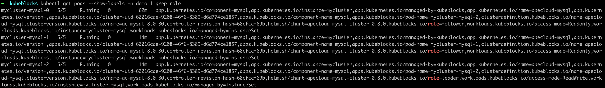
2. Delete all pods.

    ```bash
    kubectl delete pod mycluster-mysql-1 mycluster-mysql-0 mycluster-mysql-2 -n demo
    ```

    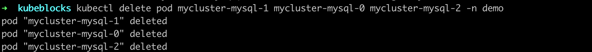
3. Open another terminal page and view the pod status. You can find the pods are terminating.

    ```bash
    kubectl get pod -n demo
    ```

    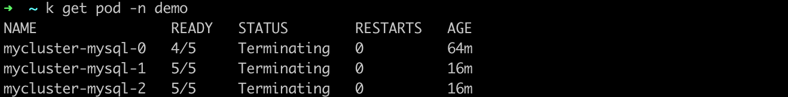
4. View the pod roles and you can find a new leader pod is elected.

    ```bash
    kubectl get pods --show-labels -n demo | grep role
    ```

    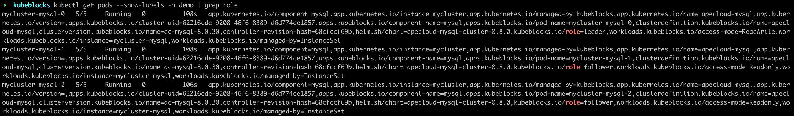
5. Connect to this cluster after a few seconds and you can find the pods in this cluster work normally again.

    ```bash
    kubectl exec -ti -n demo mycluster-mysql-0 -- bash

    mysql -uroot -pt2mmdlp4
    ```

    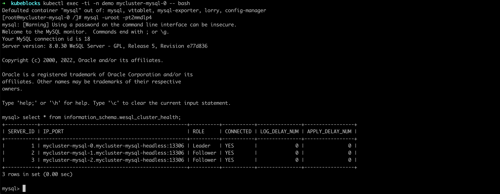

   ***How the automatic recovery works***

   Every time all pods are deleted, recreation is triggered. And then ApeCloud MySQL automatically completes the cluster recovery and the election of a new leader. Once a new leader is elected, KubeBlocks detects this new leader and updates the access link. This process takes less than 30 seconds.
