# Failure simulation and automatic recovery

As an open-source data management platform, Kubeblocks currently supports over thirty database engines and is continuously expanding. Due to the varying high availability capabilities of databases, KubeBlocks has designed and implemented a high availability (HA) system for database instances. The KubeBlocks HA system uses a unified HA framework to provide high availability for databases, allowing different databases on KubeBlocks to achieve similar high availability capabilities and experiences.

This tutorial uses MySQL Community edition as an example to demonstrate its fault simulation and recovery capabilities.

## Recovery simulation

:::note

The faults here are all simulated by deleting pods. When there are sufficient resources, the fault can also be simulated by machine downtime or container deletion, and its automatic recovery is the same as described here.

:::

### Before you start

* [Install KubeBlocks](./../../installation/install-kubeblocks.md).
* [Create a MySQL Replication Cluster](./../cluster-management/create-and-connect-a-mysql-cluster.md).
* Run `kubectl get cd mysql -o yaml` to check whether _rolechangedprobe_ is enabled in the MySQL Replication Cluster (it is enabled by default). If the following configuration exists, it indicates that it is enabled:

  ```bash
  probes:
    roleProbe:
      failureThreshold: 2
      periodSeconds: 1
      timeoutSeconds: 1
  ```

### Primary pod fault

***Steps:***

1. View the pod role of the MySQL Replication Cluster. In this example, the primary pod's name is `mycluster-mysql-0`.

    ```bash
    kubectl get pods --show-labels -n demo | grep role
    ```

    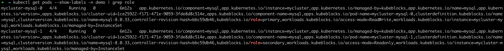
2. Delete the primary pod `mycluster-mysql-0` to simulate a pod fault.

    ```bash
    kubectl delete pod mycluster-mysql-0 -n demo
    ```

    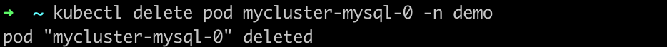
3. Check the status of the pods and Replication Cluster connection.

    The following example shows that the roles of pods have changed after the old primary pod was deleted and `mycluster-mysql-1` is elected as the new primary pod.

    ```bash
    kubectl get pods --show-labels -n demo | grep role
    ```

    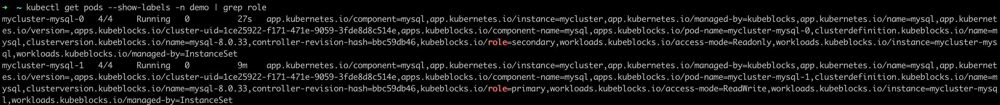

   ***How the automatic recovery works***

   After the primary pod is deleted, the MySQL Replication Cluster elects a new primary pod. In this example, `mycluster-mysql-0` is elected as the new primary pod. KubeBlocks detects that the primary pod has changed, and sends a notification to update the access link. The original exception node automatically rebuilds and recovers to the normal Replication Cluster state. It normally takes 30 seconds from exception to recovery.

### Secondary pod exception

***Steps:***

1. View the pod role again and in this example, the secondary pod is `mycluster-mysql-0`.

    ```bash
    kubectl get pods --show-labels -n demo | grep role
    ```

    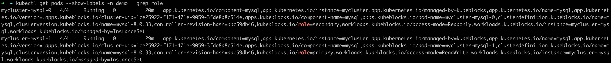
2. Delete the secondary pod `mycluster-mysql-0`.

    ```bash
    kubectl delete pod mycluster-mysql-0 -n demo
    ```

    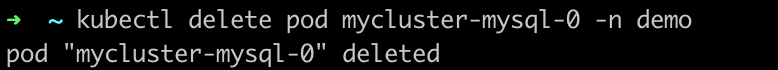
3. Open another terminal page and view the pod status. You can find the secondary pod `mycluster-mysql-0` is `Terminating`.

    ```bash
    kubectl get pod -n demo
    ```

    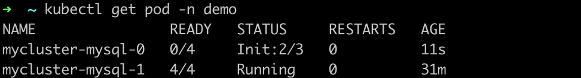

    View the pod roles again.

    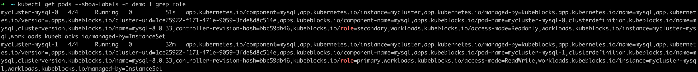

   ***How the automatic recovery works***

   One secondary pod exception doesn't trigger re-electing of the primary pod or access link switch, so the R/W of the cluster is not affected. The secondary pod exception triggers recreation and recovery. The process takes no more than 30 seconds.

### Both pods exception

***Steps:***

1. View the role of pods.

    ```bash
    kubectl get pods --show-labels -n demo | grep role
    ```

    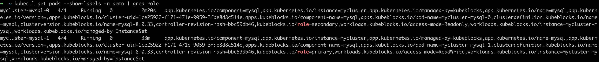
2. Delete both pods.

    ```bash
    kubectl delete pod mycluster-mysql-0 mycluster-mysql-1 -n demo
    ```

    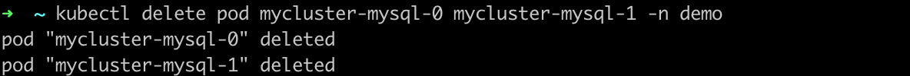
3. Open another terminal page and view the pod status. You can find the pods are terminating.

    ```bash
    kubectl get pod -n demo
    ```

    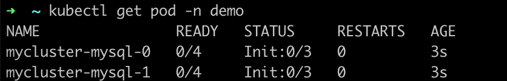
4. View the pod roles and you can find a new primary pod is elected.

    ```bash
    kubectl get pods --show-labels -n demo | grep role
    ```

    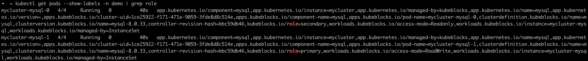

   ***How the automatic recovery works***

   Every time both pods are deleted, recreation is triggered. And then MySQL automatically completes the cluster recovery and the election of a new primary pod. Once a new primary pod is elected, KubeBlocks detects this new pod and updates the access link. This process takes less than 30 seconds.
