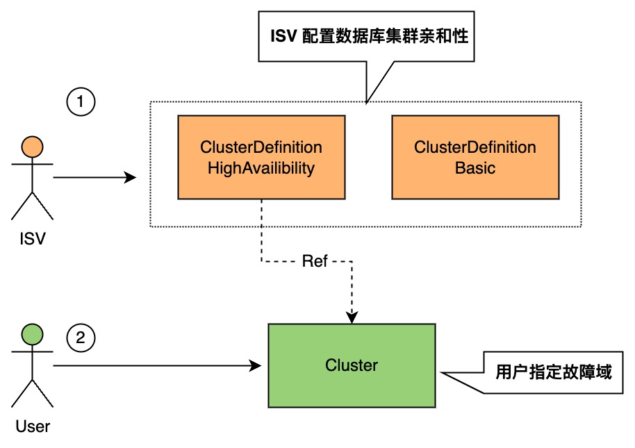

# 变更记录
|  版本   | 时间  | 变更记录  |
|  ----  | ----  | ----|
| 1.0.0  | 2022.8.19 | 初始版本|
| 0.1.1  | 2022.8.24 | 简化 RoleGroup 和可用区的亲和性定义|
| 0.1.2  | 2022.8.26 | 使用 topologyKey 和 topologySpreadConstraints 做抽象; 亲和性定义到 ClusterDefinition 的 PodSpec 对象里|
| 0.1.3  | 2022.08.29 | 去除 ClusterDefinition 的 RoleGroup 设计, 并基于新的 ClusterDefinition 做亲和性定义|

# 提案评审信息
|  评审人   | 必选/可选 评审者 | 是否通过？| 评审日期
|  ----  | ----  | ----| ----|
| dullboy  | 必选 | [ ] 通过</br>[ ] [] 评审意见待解决 | |
| 聪心  | 必选 | [ ] 通过</br>[ ] [] 评审意见待解决 | |
| 蟾兔  | 必选 | [ ] 通过</br>[ ] [] 评审意见待解决 | |


# 提案概览
本文提出一种基于 ClusterDefinition API 扩展数据库集群亲和性定义, 通过简易且贴合数据库业务场景的抽象实现数据库集群实例的亲和性描述, 最终通过 Operator 实现到 Kubernetes 原生亲和性配置的转化.

# 术语及概念
- ClusterDefinition API:  DBaaS  数据数据库集群的抽象定义, 用于描述数据库集群拓扑及生命周期 (详见 DBaaSv0-通用数据库集群生命周期方案).
- Cluster: ClusterDefinition 内概念, 表示一个数据库集群, 包含一个或者多个 Component
- Component: ClusterDefinition API 内概念,  表示一个数据库集群里不同模块, 每个 Component 包含一个或多个 RoleGroup 的集合，下属 RoleGroup 通常具有相似的运维表现
- RoleGroup: ClusterDefinition API 内概念, 一组同类的物理节点的集合，下属节点运维表现完全一致
- Cluster API: 终端用户创建的数据库集群的描述定义 (详见 Cluster API).
- Failure Domain: 故障域, 是基础设施中可能发生故障的区域或组件, 比如说云服务中的 Region、Zone、Node、Rack 等.

# 设计目标与动机
Kubernetes 默认调度器和亲和性定义都是面向 Pod, 数据库集群的拓扑结构多样且复杂, 直接使用原生的亲和性定义会非常繁琐, 且定义不统一. 需要基于数据库集群的拓扑和业务特点来做统一抽象设计, 方便 ISV 集成和终端用户使用.

## 目标需求
- 基于 ClusterDefinition API 和 Cluster API 扩展亲和性定义, 满足主流数据库不同部署场景的亲和性描述, 并且使用简单.
- 在 Operator 层实现数据库集群实例亲和性描述到基础工作负载的亲和性描述转换, 完全适配 Kubernetes 原生调度器.
## 非目标需求
- 不涉及 ClusterDefinition API 中 Components 之间的亲和性设计, 后续根据需求场景再进行设计扩展.
- 不涉及跨 Kubernetes 集群内调度, 未来在联邦调度提案中设计支持.

# 提案背景与限制说明
## 提案背景
ClusterDefinition API 作为通用数据库集群抽象, 定义了角色组合和之间的拓扑. Cluster API 作为用户申请数据库集群的接口.
Kubernetes 提供了 Pod 级别的亲和性支持, 分别有以下几种定义:
- `NodeAffinity` 提供 Pod 与特点 node 的亲和性, 详见 [node-affinity](https://kubernetes.io/docs/concepts/scheduling-eviction/assign-pod-node/#node-affinity)
- `PodAffinity` 和 `PodAntiAffinity` 提供 Pod 与 Pod 之间的亲和性和反亲和性, 详见 [inter-pod-affinity-and-anti-affinity](https://kubernetes.io/docs/concepts/scheduling-eviction/assign-pod-node/#inter-pod-affinity-and-anti-affinity)
- topologySpreadConstraints 相比以上三种能力提供更加细粒度的调度控制, 能够更好做到高可用和资源利用率上的平衡. 比如将 256 个 mongos 物理实例节点, 如何在不同 node 里均匀分布. 详见 [Pod Topology Spread Constraints](https://kubernetes.io/docs/concepts/scheduling-eviction/topology-spread-constraints/)
- `topologyKey` 用来定义故障域, 可以用于 `PodAffinity` `PodAntiAffinity` `topologySpreadConstraints` 等定义之下.

## 替代方案
直接使用 Kubernetes 原生的 Pod 级别亲和性配置.

## 用户故事
亲和性控制往往都非常业务相关, 一般会主要考虑**可用性**、**资源利用**、**稳定性**, 云厂商还会额外考虑**售卖成功率**. 亲和性控制就是通过数据库集群下所有物理实例节点在不同故障域下的分布,  下面会通过不同故障域来介绍数据库常见业务场景.

### 场景 1: Node 级别亲和性
- **不同角色实例之间强制打散**
  - 主节点和容灾节点一般需要强制打散, 保证高可用. 比如 RDS、Redis 的主备节点
  - Quorum-Based 内核的数据库集群一般要求强制打散 (包括只读), 保证高可用. 比如 MongoDB 副本集、ETC、ZooKeeper.
- **不同角色实例之间尽量打散**
  - RDS 主实例和只读实例一般尽量打散, 保证资源利用率
- **同类角色实例之间的亲和性**
  - 无状态的 RoleGroup, 比如 Redis 集群版本的 Proxy 和 MongoDB 集群版的 mongos, 节点规模, 为了提高可用性和资源利用率, 需要实例节点可以在少量主机中均匀打散分布.
### 场景 2: Zone 级别亲和性
用户一般会根据自己业务情况来选择数据库的可用区部署拓扑
- **不同角色实例之间强制打散, 支持跨可用区容灾**
  - 用户业务在多个可用区进行容灾控制, 比如一些金融用户需要三可用区容灾
- **不同角色实例之间尽量打散**
  - 用户有 Node 级别容灾需求但是不太关心是否跨可用区容灾
- **指定可用区部署**
  - 用户业务在可用区 A, 希望数据库也都部署在可用区 A, 可以保证就近访问, 特别是对于网络敏感的业务
### 场景 3: 业务自定义故障域亲和性
- **业务独占**
  - 用户对数据库业务进行了分组, 比如某核心在线 APP 业务数据库不希望和其他业务数据库混用机器, 会独占一个节点组
- **VM 虚拟机相关故障域打散**
  - 用户为了将业务涉及到的 VM  实例分散部署在不同的物理服务器上，以此保证业务的高可用性和底层容灾能力. 比如阿里云为 ECS 提供的部署集 (Deployment Set) 功能, 让用户可以选择在宿主机、vSwtich、机架等层面进行 ECS 部署打散.

**总的来看, 故障域会多样, 并且有自定义的场景; 不同类型的数据库物理实例在同一个故障域也会有不同的亲和性需求.**


# 架构设计
结合 ClusterDefinition API 设计和用户场景, 数据库集群实例的亲和性控制, 就是控制数据库集群下物理实例节点在 `node` `zone` 等空间维度上的拓扑分布.
在实际使用场景中, ISV 更加清楚如何通过不同类型实例的打散策略来实现数据库集群的高可用, 比如主备节点强制打散, MySQL 三节点三可用区部署可以实现三可用区容灾.
而终端用户更加关心实际的故障域, 数据库实例容灾是 node 级别的, 还是机架级别的.  

所以基于实际的使用场景, 整体设计将数据库集群亲和性配置分为两部分:
1. **扩展 ClusterDefinition, 补充亲和性定义, 让 ISV 能够定义数据库集群内不同类别实例节点的亲和性关系**
2. **扩展 Cluster, 让用户可以指定数据库集群部署的故障域**



## API 定义
### ClusterDefinition 扩展
整体上看 ClusterDefinition API 做了如下扩展:
- **跳过 `RoleGroup` 这层抽象, 只定义 Component 下物理实例节点的亲和性**
  - 从 ClusterDefinition 设计上, RoleGroup 之间是有亲和性需求的, 比如 primary 和 secondary
  - 但是会导致亲和性定义繁琐, 并且 Component 内物理实际节点进行亲和性控制就可以满足 95% 以上的实际问题. 
- **通过 `topologySpreadConstraint` 对只有均分分布需要的实例节点进行打散控制, 比如下面示例的 mongos.**
- **`isAntiAffinity` 升级为 `podAntiAffinity` 提供反亲和控制, 可以通过设置 `required` 强制打散, 设置 `preferred` 尽量打散.**
- **默认缺省配置场景下, 数据库集群实例尽量均匀打散部署**

```yaml
# upgrade API version to v1alpha2
apiVersion: "dbaas.infracreate.com/v1alpha2"
kind:       "ClusterDefinition"
metadata:
  name:      "a-vendor-highavalibility-mongodbcluster"
spec:
  ......
  components:
  - typeName: mongos
    # Use topologySpreadConstraints to make pods evenly spread
    topologySpreadConstraint:
      maxSkew: 1
      whenUnsatisfiable: DoNotSchedule
        
  - typeName: configserver
    # deprecated isAntiAffinity
    # isAntiAffinity: true
    # Use podAntiAffinity: required to make pods mutually-exclusive
    podAntiAffinity: required
     
  - typeName: shard
    roleGroups:
    - primary
    - secondary
    - hidden
    - readonly
    # deprecated isAntiAffinity
    # isAntiAffinity: true
    # Use podAntiAffinity: required to make pods mutually-exclusive
    podAntiAffinity: required
```

所有的配置都在 spec.components[*] 之下,  相关字段说明如下表格所示:
|  字段名称   | 是否必填 | 默认值 | 可选值| 描述
|  ----  | ----  | ----| ----| ----|
| podAntiAffinity | 否 | preferred |- required</br>- preferred |当前 component 下物理实例节点反亲和定义 |
| topologySpreadConstraint.maxSkew  | 否 | 1 | 大于 0 的整数 | 详见 [spread-constraint-definition](https://kubernetes.io/docs/concepts/scheduling-eviction/topology-spread-constraints/#spread-constraint-definition)|
| topologySpreadConstraint.whenUnsatisfiable | 否 | DoNotSchedule | - DoNotSchedule</br>- ScheduleAnyway | 详见 [spread-constraint-definition](https://kubernetes.io/docs/concepts/scheduling-eviction/topology-spread-constraints/#spread-constraint-definition)|


### Cluster 扩展
Cluster 来定义拓扑范围和拓扑级别, 让用户可以指定拓扑 Key 和拓扑范围. 详细扩展说明如下所示:
- 定义 `affinity` 对象, 对象下分别包含 `topologyKeys` 和 `nodeLabels` 两个字段
- `topologyKeys` 定义亲和性的故障域. **如果 nodeLabels 下的标签 key 和 topologyKeys 下的一致, topologyKeys 下对于标签将会没有作用, 比如下面例子 topologyKeys 下的 zone 将会不生效.**
- `nodeLabels` 指定数据库集群的 node 亲和性标签, 可以用于指定拓扑域的场景, 比如下面的例子表示, 数据库集群需要部署在 us-east-1a 可用区
```yaml
# API scope: namespaced

apiVersion: dbaas.infracreate.com/v1alpha1
kind: Cluster
metadata:
  name: mongo-cluster-idxxxxx
  namespace: default
spec:
  clusterDefinitionRef: "a-vendor-highavalibility-mongodbcluster" 
  appVersionRef: "appversion-mongodb-3.4" 
  affinity:
    # choose topologyKey for `topologySpreadConstraint` and `podAntiAffinity`
    topologyKeys:
    - node
    - zone

    # land instances on the nodes having the `zone: us-east-1a` label
    nodeLabels:
    - zone: us-east-1a
```
如上面示例所示, 新增了 `affinity` 部分, 下面包含 `topologyKeys` 和 `topologyLabels` 两个字段, 字段说明如下:

|  字段名称   | 是否必填 | 默认值 | 可选值| 描述
|  ----  | ----  | ----| ----| ----|
| topologyKeys | 是 |  | |当前 component 下物理实例节点反亲和定义 |
| topologySpreadConstraint.maxSkew  | 否 | 1 | 大于 0 的整数 | 指定数据库集群亲和性所使用的 topologyKey 列表|
| nodeLabels | 否 |  |  | 指定数据库集群亲和性所需要的 node 标签列表|


### 亲和性相关标签配置
#### 标签信息 
##### 节点标签
- 用户定义的故障域标签, 需要提前对 node 打标. 可以参考 [Kubernetes Well-Known Labels](https://kubernetes.io/docs/reference/labels-annotations-taints/#topologykubernetesiozone)
##### Pod 标签
在对于基础工作负载上, 比如现在是 StatefulSet 和 Deployment, 添加上以下标签:
- **集群实例名**: app.kubernetes.io/name: "clustername_abc"
- **集群实例 Component type**: app.kubernetes.io/component: "mongos" 
#### 导入方式
- demo 环境下通过文档引导用户配置相关标签
- 正式环境通过需要正式打标


### 亲和性转换详情
这部分介绍在 ClusterDefinition 和 Cluster 扩展的亲和性定义对应的原生 kubernetes 亲和性定义, 下面都以最终 Pod Spec 为例.

#### 缺省配置情况
缺省情况取值如下:
- Cluster API 指定 topologyKeys, nodeLabels 不传
- ClusterDefinition 不做配置, 相关字段都取默认值
缺省配置下, 单个 component 内的物理实例节点会均匀分布和尽量打散:
```yaml
spec:
  # Enenly spread in a component
  topologySpreadConstraints: 
  - topologyKey: ${topologyKey}
    maxSkew: 1
    whenUnsatisfiable: DoNotSchedule
    labelSelector:
      matchLabels:
        app.kubernetes.io/name: ${cluster_name}
        app.kubernetes.io/component: ${component_type}

  # Preferred scatter in a component
  affinity:
    podAntiAffinity:
      preferredDuringSchedulingIgnoredDuringExecution:
      - podAffinityTerm:
          labelSelector:
            matchLabels:
              app.kubernetes.io/name: ${cluster_name}
              app.kubernetes.io/component: ${component_type} 
          topologyKey: ${topologyKey}
        weight: 100 
```

#### podAntiAffinity 为 required
相比缺省配置, preferredDuringSchedulingIgnoredDuringExecution 变为 requiredDuringSchedulingIgnoredDuringExecution 即可
```yaml
spec:
  # Enenly spread in a component
  topologySpreadConstraints: 
  - topologyKey: ${topologyKey}
    maxSkew: 1
    whenUnsatisfiable: DoNotSchedule
    labelSelector:
      matchLabels:
        app.kubernetes.io/name: ${cluster_name}
        app.kubernetes.io/component: ${component_type}

  # Preferred scatter in a component
  affinity:
    podAntiAffinity:
      requiredDuringSchedulingIgnoredDuringExecution:
      - podAffinityTerm:
          labelSelector:
            matchLabels:
              app.kubernetes.io/name: ${cluster_name}
              app.kubernetes.io/component: ${component_type} 
          topologyKey: ${topologyKey}
        weight: 100 
```

#### 用户指定多个 topologyKeys
topologySpreadConstraints 和 podAntiAffinity 会按照每个 topologyKey 生成对应配置, 比如 topologyKeys 指定为 [node, zone], 那么生成的配置如下所示:
```yaml
spec:
  # Enenly spread in a component
  topologySpreadConstraints: 
  - topologyKey: zone
    maxSkew: 1
    whenUnsatisfiable: DoNotSchedule
    labelSelector:
      matchLabels:
        app.kubernetes.io/name: ${cluster_name}
        app.kubernetes.io/component: ${component_type}
  - topologyKey: node
    maxSkew: 1
    whenUnsatisfiable: DoNotSchedule
    labelSelector:
      matchLabels:
        app.kubernetes.io/name: ${cluster_name}
        app.kubernetes.io/component: ${component_type}

  # Preferred scatter in a component
  affinity:
    podAntiAffinity:
      preferredDuringSchedulingIgnoredDuringExecution:
      - podAffinityTerm:
          labelSelector:
            matchLabels:
              app.kubernetes.io/name: ${cluster_name}
              app.kubernetes.io/component: ${component_type} 
          topologyKey: zone
        weight: 100 
      - podAffinityTerm:
          labelSelector:
            matchLabels:
              app.kubernetes.io/name: ${cluster_name}
              app.kubernetes.io/component: ${component_type} 
          topologyKey: node
        weight: 100 
```

#### 指定 node 标签过滤
以用户指定可用区场景为例, 用户指定 nodeLabels 为 topology.kubernetes.io/zone: us-east-1a
```yaml
spec:
  # Enenly spread in a component
  topologySpreadConstraints: 
  - topologyKey: ${topologyKey}
    maxSkew: 1
    whenUnsatisfiable: DoNotSchedule
    labelSelector:
      matchLabels:
        app.kubernetes.io/name: ${cluster_name}
        app.kubernetes.io/component: ${component_type}

  # Preferred scatter in a component
  affinity:
    nodeAffinity:
      requiredDuringSchedulingIgnoredDuringExecution:
        nodeSelectorTerms:
        - matchExpressions:
          - key: topology.kubernetes.io/zone
            operator: In
            values:
            - us-east-1a
    podAntiAffinity:
      preferredDuringSchedulingIgnoredDuringExecution:
      - podAffinityTerm:
          labelSelector:
            matchLabels:
              app.kubernetes.io/name: ${cluster_name}
              app.kubernetes.io/component: ${component_type} 
          topologyKey: ${topologyKey}
        weight: 100 
```


## 开发计划
## 技术指标
## 历史方案迁移（如有）
*（如果现有方案将替换历史方案，需考虑历史迁移）*
## 测试计划
- 测试更新的前提条件
- 单元测试方案
- 集成测试方案
- 端到端测试方案
- 故障注入测试方案（如有）


# 其他说明
## 提案注意事项/限制条件/警告（如有）
## 风险与规避措施（如有）
## 数据库安全（如有）
## 部署历史（如有）
*（基于已有的内容，做了哪些修改/优化）*
## 需要的基础设施（如有）
## 参考文档/文献（如有）