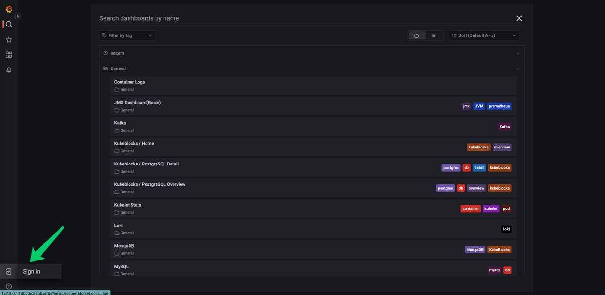

# Configure monitoring

This tutorial takes Oracle MySQL as an example and explains how to configure monitoring in KubeBlocks. You can refer to [the full PR](https://github.com/apecloud/learn-kubeblocks-addon/tree/main/tutorial-4-monitor-cluster/oracle-mysql).

## Before you start

1. Knowledge about basic Kubernetes concepts, such as Pod and Sidecar.
2. Finish [Tutorial 1](./how-to-add-an-add-on.md).
3. Knowledge about basic monitoring system concepts, such as Prometheus and Grafana.

## Introduction

Monitoring is an essential part of Kubernetes observability. It helps developers check the system's operational status to quickly identify issues.

Kubeblocks currently integrates Prometheus and Grafana as add-ons. In this tutorial, you will learn how to integrate the Prometheus/Grafana solution.

### Prometheus Overview

Prometheus provides an open-source monitoring solution that integrates metric collection, metric storage, and alert capabilities.

It is widely used in cloud-native, containerized, and microservices architectures. With Prometheus, developers and operations teams can monitor the performance and health status of applications in real-time, so as to quickly identify and resolve issues to ensure application reliability and availability. Prometheus is usually used with Grafana to create powerful monitoring and observability solutions.

### Grafana Overview

Grafana is an open-source analytics and monitoring platform widely used for visualizing time series data. It allows users to create interactive and customizable dashboards to monitor and analyze data from various sources.

:paperclip: Table 1. Terminology

| Term | Description |
| :--  | :---------- |
| Prometheus Exporter | Prometheus Exporter is a component that collects monitoring data and provides data to external entities using the Prometheus monitoring specification. <br /> For more details, refer to [Prometheus  Exporter List](https://prometheus.io/docs/instrumenting/exporters/). |
| Prometheus Metrics | Prometheus Metrics are data points used for monitoring and performance analysis. They typically include request counts, response times, CPU usage, and memory usage. |
| Grafana Dashboard | Grafana Dashboard is a visualization interface used to present data. It is commonly used for monitoring and analyzing various time series data. |

Prometheus in KubeBlocks has already been configured with scraping jobs, so developers only need to configure the Exporter. In KubeBlocks, the Exporter is deployed as a sidecar alongside the main container of the database engine in the same Pod.

## Configure Exporter

First, choose an Exporter. This tutorial is based on Oracle MySQL, so a MySQL Exporter is needed.

### Configure Exporter version

Modify ClusterVersion (`clusterversion.yaml`).

You can find an appropriate Exporter from open-source communities(e.g., [Prometheus in Docker](https://hub.docker.com/u/prom)).

```yaml
componentVersions:
- componentDefRef: mysql-compdef
  versionsContext:
    containers:
    - name: mysql-container
      image: ...
      imagePullPolicy: ..
    - name: mysql-exporter               
      image: prom/mysqld-exporter:v0.14.0
```

Specify the image of mysql-exporter as prom/mysqld-exporter with the version 0.14.0.

### Add an Exporter container

Modify `clusterdefinition.yaml` and configure mysql-exporter in Sidecar form.

```yaml
podSpec:
  containers:
    # mysql container and other containers ->
    - name: mysql-exporter
      ports:
        - name: metrics
          containerPort: 9104
          protocol: TCP
      env:
        - name: "MYSQL_MONITOR_USER"
          valueFrom:
            secretKeyRef:
              name: $(CONN_CREDENTIAL_SECRET_NAME)
              key: username
        - name: "MYSQL_MONITOR_PASSWORD"
          valueFrom:
            secretKeyRef:
              name: $(CONN_CREDENTIAL_SECRET_NAME)
              key: password          
        - name: "DATA_SOURCE_NAME"
          value: "$(MYSQL_MONITOR_USER):$(MYSQL_MONITOR_PASSWORD)@(localhost:3306)/"
```

As shown from Line 4 to 21, a new container has been added to the original PodSpec. `DATA_SOURCE_NAME` is an environment variable specific to the mysql-exporter.

:::caution

Different Exporters require different environment variables, and they need to be configured based on specific features of each Exporter.

As mentioned, this tutorial uses mysql exporter 0.14.0. In the latest mysql exporter version 0.15.0, the variable `DATA_SOURCE_NAME` is no longer supported.

:::

### Configure monitor parameters

Modify `clusterdefinition.yaml` and configure `monitor` parameters.

```yaml
componentDefs:
  - name: mysql-compdef
    characterType: mysql
    service: ..
    monitor:
      exporterConfig:
        scrapePort: 9104        # Listening port of the Exporter, used by Prometheus to pull data
        scrapePath: "/metrics"  # Path of the Exporter path, used by Prometheus to pull data
```

KubeBlocks supports multiple monitoring solutions. To use the open-source Prometheus/Grafana solution, configure the listening port and metrics path in `monitor`, which should correspond to the container-port specified in [2. Add an Exporter container](#2-add-an-exporter-container).

## Configure Grafana Dashboard

### Obtain Grafana Dashboard configurations

Grafana Dashboard can help users monitor, analyze, and understand data in real-time. For popular databases, various dashboard configuration files (in JSON format) can be easily found.

- [Official Website of Grafana](https://grafana.com/grafana/dashboards).
- [KubeBlocks Dashboard](https://github.com/apecloud/kubeblocks-mixin).

### Add to your cluster

Import the downloaded JSON files on the Grafana Dashboard page or configure them in your cluster template.

The latter option is more versatile, as the same configuration can be reused for any cluster generated through the template.

Therefore, two files are added to the existing Helm chart.

- dashboards: Save dashboard JSON files.
- grafana: Create a ConfigMap to store the contents of dashboard JSON files.

```yaml
tree oracle-mysql
.
├── Chart.yaml
├── dashboards
│   └── mysql.json
├── templates
│   ├── NOTES.txt   
│   ├── _helpers.tpl
│   ├── clusterdefinition.yaml
│   └── clusterversion.yaml
│   └── grafana
│       └── configmap-dashboards.yaml
└── values.yaml

4 directories, 8 files
```

## Monitor cluster data

### Prepare the environment and enable Prometheus monitoring components

Run `kbcli addon list` to check if the following add-ons are enabled (status: Enabled):

```bash
kbcli addon list
>
...
grafana                        Helm   Enabled                   true  
alertmanager-webhook-adaptor   Helm   Enabled                   true    
prometheus                     Helm   Enabled    alertmanager   true
...
```

If not (status: `Disabled`), enable them one by one.

```bash
kbcli addon enable prometheus
kbcli addon enable alertmanager-webhook-adaptor
kbcli addon enable grafana
```

Then you can have access to the integrated three dashboards:

```bash
kbcli dashboard list
>
NAME                                 NAMESPACE   PORT    CREATED-TIME
kubeblocks-grafana                   kb-system   13000   Jul 24,2023 11:38 UTC+0800
kubeblocks-prometheus-alertmanager   kb-system   19093   Jul 24,2023 11:38 UTC+0800
kubeblocks-prometheus-server         kb-system   19090   Jul 24,2023 11:38 UTC+0800
```

### Create a database cluster

1. Install a cluster template.

   ```bash
   helm install oracle-mysql ./path-to-your-helm-chart/oracle-mysql
   ```

2. Enable monitoring function.

   Opt 1. Enable when creating a cluster

   ```bash
   kbcli cluster create mycluster --cluster-definition='oracle-mysql' --monitor='true'
   ```

   Opt 2. Enable in an existing cluster

   ```bash
   kbcli cluster update mycluster --monitor='true'
   ```

3. Open the dashboard

   ```bash
   # View available dashboards
   kbcli dashboard list
   >
   NAME                                      NAMESPACE        PORT        CREATED-TIME
   kubeblocks-grafana                        default          3000        Jan 13,2023 10:53 UTC+0800
   kubeblocks-prometheus-alertmanager        default          9093        Jan 13,2023 10:53 UTC+0800
   kubeblocks-prometheus-server              default          9090        Jan 13,2023 10:53 UTC+0800

   # Select Grafana and open the web console in the default browser
   kbcli dashboard open kubeblocks-grafana
   ```

4. Sign in to the dashboard



:::note

If the dashboard requires a login, use the following username and password.

```bash
Username: admin 
Password: kubeblocks
```

:::

## Summary

This tutorial explains how to quickly adapt the Prometheus/Grafana solution to monitor your database cluster. KubeBlocks will also introduce a monitoring solution based on OpenTelemetry in the future. Stay tuned for updates.

## References

1. [Prometheus](https://prometheus.io/).
2. [Grafana Dashboard](https://grafana.com/grafana/dashboards/).
3. [Create a dashboard](https://grafana.com/docs/grafana/latest/dashboards/build-dashboards/create-dashboard/).

## Appendix

### A.1 Disable cluster monitoring

In KubeBlocks, you can enable or disable monitoring for a specific cluster using kbcli.

```bash
kbcli cluster update mycluster --monitor='false'
```
