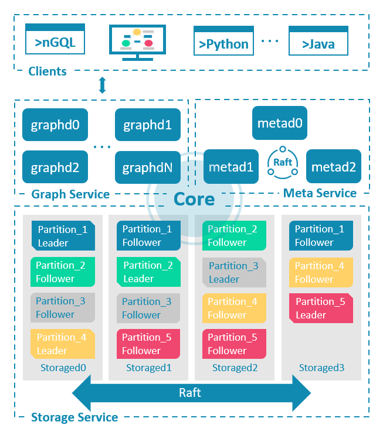
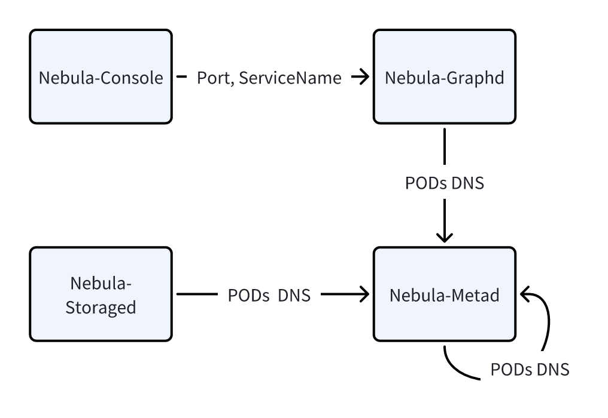

# Multi-component configuration

So far, you've learned the definition, backup, and configuration of single-component clusters (e.g., Oracle-MySQL).

This tutorial takes NebulaGraph as an example to demonstrate how to integrate a multi-component cluster and address several common issues in multi-component configurations. You can find more details in [this repository](https://github.com/apecloud/kubeblocks-addons/tree/main/addons/nebula).

## Before you start

- Finish [Tutorial 1](./how-to-add-an-add-on.md).
- Knowledge about basic KubeBlocks concepts, such as ClusterDefinition, Cluster, ComponentRef, and Component.

## NebulaGraph Architecture

First, take a look at the overall architecture of NebulaGraph.

NebulaGraph applies the separation of storage and computing architecture and consists of three services: the Graph Service, the Meta Service, and the Storage Service. The following figure shows the architecture of a typical NebulaGraph cluster.



- Metad: It is a component based on the Raft protocol and is responsible for data management tasks such as Schema operations, cluster management, and user permission management.
- Graphd: It is the compute component and is responsible for handling query requests, including query parsing, validation, and generating and executing query plans.
- Storaged: It is the distributed storage component based on Multi Group Raft, responsible for storing data.

If the client is considered, the fourth component is:

- Client: It is a stateless component used to connect to Graphd and send graph queries.

## Configure cluster typology

Now you've learned the four components of NebulaGraph, and how each component is started and configured.

Similar to a single-component cluster, you can quickly assemble the definition for a multi-component cluster.

```yaml
apiVersion: apps.kubeblocks.io/v1alpha1
kind: ClusterDefinition
metadata:
  name: nebula
spec:
  componentDefs:
    - name: nebula-console    # client
      workloadType: Stateless
      characterType: nebula
      podSpec: ...
    - name: nebula-graphd     # graphd
      workloadType: Stateful
      podSpec: ...
    - name: nebula-metad      # metad
      workloadType: Stateful
      podSpec: ...
    - name: nebula-storaged   # storaged
      workloadType: Stateful
      podSpec: ...
---
apiVersion: apps.kubeblocks.io/v1alpha1
kind: ClusterVersion
metadata:
  name: nebula-3.5.0
spec:
  clusterDefinitionRef: nebula   # clusterdef name
  componentVersions:
    - componentDefRef: nebula-console  # Specify image for client
      versionsContext:
        containers:
        - name: nebula-console
          image: ...
    - componentDefRef: nebula-graphd  # Specify image for graphd
      versionsContext:
        containers:
        - name: nebula-graphd
          image: 
    - componentDefRef: nebula-metad   # Specify image for metad
      versionsContext:
        containers:
        - name: nebula-metad
          image: ...
    - componentDefRef: nebula-storaged  # Specify image for storaged
      versionsContext:
        containers:
        - name: nebula-storaged
          image: ...
```

The above YAML file provides an outline of the ClusterDefinition and ClusterVersion for NebulaGraph. Corresponding to Figure 1., four components (including the client) and their version information are specified.

If each component can be started independently, the information provided in Figure 2. would be sufficient.

However, it can be observed that in a multi-component cluster, there are often inter-component references. So, how to specify the references thereof?

## Configure inter-component references

As discovered, components may refer to each other and Figure 3. shows the inter-component references in a NebulaGraph cluster. For example,

1. Nebula-Console needs to know the port number and service name of Nebula-Graphd.
2. Nebula-Graphd needs to know the DNS of each Pod of Nebula-Metad. 
3. Nebula-Storaged also needs to know the DNS of each Pod of Nebula-Metad.



Therefore, three common types of inter-component references are: \

1. **Service Reference**
   e.g., Nebula-Console needs to obtain the service name of Nebula-Graphd.
2. **HostName Reference**
   e.g., Nebula-Graphd needs to configure the DNS of all Pods of Nebula-metad. This reference typically points to a stateful component.
3. **Field Reference**
   e.g., Nebula-Console needs to obtain a service port name of Nebula-Graphd.

To ensure that the cluster starts normally, the above information needs to be injected into the Pod through environment variables (whether it is loaded through configmap or defined as pod env).

In KubeBlocks, the `ComponentDefRef` API can be used to achieve the goal. It introduces the following APIs:

- `componentDefName`, used to specify the name of the component definition that is being referenced to.
- `componentRefEnv`, which defines a set of environment variables that need to be injected.
  - `name` defines the name of the injected environment variable.
  - `valueFrom` defines the source of the variable value.

Next, you will learn how `ComponentDefRef` deals with the three types of references mentioned above.

### Service Reference

Case 1: Nebula-Console needs to obtain the service name of Nebula-Graphd.

When defining `nebula-console`, add the following definitions (as `componentDefRef` shows):

```yaml
    - name: nebula-console
      workloadType: Stateless
      characterType: nebula
      componentDefRef:
        - componentDefName: nebula-graphd
          componentRefEnv:
            - name: GRAPHD_SVC_NAME
              valueFrom:
                type: ServiceRef
```

- Specify the component that is being referenced to as `nebula-graphd`.
- The name of the injected environment variable is `GRAPHD_SVC_NAME`.
- The value type of the variable is `ServerRef`, indicating that the value comes from the service name of the referenced component.

:::note

In KubeBlocks, if you've defined the `service` for a component, when you create a cluster, KubeBlocks will create a service named `{clusterName}-{componentName}` for that component.

:::

### HostName Reference

Case 2: Nebula-Graphd needs to configure the DNS of all PODs of Nebula-Metad.

```yaml
    - name: nebula-graphd
      workloadType: Statelful    
      componentDefRef:
        - componentDefName: nebula-metad
          componentRefEnv:
            - name: NEBULA_METAD_SVC
              valueFrom:
                type: HeadlessServiceRef
                format: $(POD_FQDN):9559    # Optional, specify value format
```

- Specify the component that is being referenced to as nebula-metad.
- The name of the injected environment variable is NEBULA_METAD_SVC.
- The value type of the variable is HeadlessServiceRef.
  - It indicates that the value comes from the FQDN of all Pods of the referenced component, and multiple values are connected with , by default.
  - If the default FQDN format does not meet your needs, customize the format through format (as shown in Line 9).

:::note

KubeBlocks provides three built-in variables as placeholders and they will be replaced with specific values when the cluster is created:
- ${POD_ORDINAL}, which is the ordinal number of the Pod.
- ${POD_NAME}, which is the name of the Pod, formatted as `{clusterName}-{componentName}-{podOrdinal}`.
- ${POD_FQDN}, which is the Fully Qualified Domain Name (FQDN) of the Pod.

In KubeBlocks, each stateful component has a Headless Service named `headlessServiceName = {clusterName}-{componentName}-headless` by default.

Therefore, the format of the Pod FQDN of each stateful component is:
`POD_FQDN = {clusterName}-{componentName}-{podIndex}.{headlessServiceName}.{namespace}.svc`.

:::

### Field Reference

Case 3: Nebula-Console needs to obtain a service port name of Nebula-Graphd.

When defining `nebula-console` , add the following configurations (as `componentDefRef` shows):

```yaml
    - name: nebula-console
      workloadType: Stateless
      characterType: nebula
      componentDefRef:
        - componentDefName: nebula-graphd
          componentRefEnv:
            - name: GRAPHD_SVC_PORT
              valueFrom:
                type: FieldRef
                fieldPath: $.componentDef.service.ports[?(@.name == "thrift")].port
```

- Specify the component that is being referenced to as `nebula-graphd`.
- The name of the injected environment variable is `GRAPHD_SVC_PORT`.
- The value type of the variable is `FieldRef`, indicating that the value comes from a certain property value of the referenced component and is specified by `fieldPath`.

`fieldPath` provides a way to parse property values through JSONPath syntax.
When parsing JSONPath, KubeBlocks registers two root objects by default:

- **componentDef**, the componentDef object being referenced.
- **components**, all components corresponding to the componentDef in the created cluster.

Therefore, in `fieldPath`, you can use `$.componentDef.service.ports[?(@.name == "thrift")].port` to obtain the port number named `thrift` in the service defined by this component.

## Summary

This tutorial takes NebulaGraph as an example and introduces several types and solutions of inter-component references.

In addition to NebulaGraph, engines like GreptimDB, Pulsar, RisingWave and StarRocks also adopt `componentDefRef` API to deal with component references. You can also refer to their solutions.

For more information about the `componentDefRef`, refer to [ComponentDefRef API](https://kubeblocks.io/docs/release-0.6/developer_docs/api-reference/cluster#apps.kubeblocks.io/v1alpha1.ComponentDefRef).

## Appendix

### A1. YAML tips

Since Nebula-Graphd, Nebula-Metad and Nebula-Storaged all require the FQDN of each Pod in Nebula-Metad, you don't need to configure them repeatedly.

Quickly configure them with YAML anchors.

```yaml
- name: nebula-graphd
  # ...
  componentDefRef:
    - &metadRef # Define an anchor with `&`
      componentDefName: nebula-metad
      componentRefEnv:
        - name: NEBULA_METAD_SVC
          valueFrom:
            type: HeadlessServiceRef
            format: $(POD_FQDN){{ .Values.clusterDomain }}:9559
            joinWith: ","
- name: nebula-storaged
  componentDefRef:
    - *metadRef # Use the anchor with `*` to avoid duplication
```
