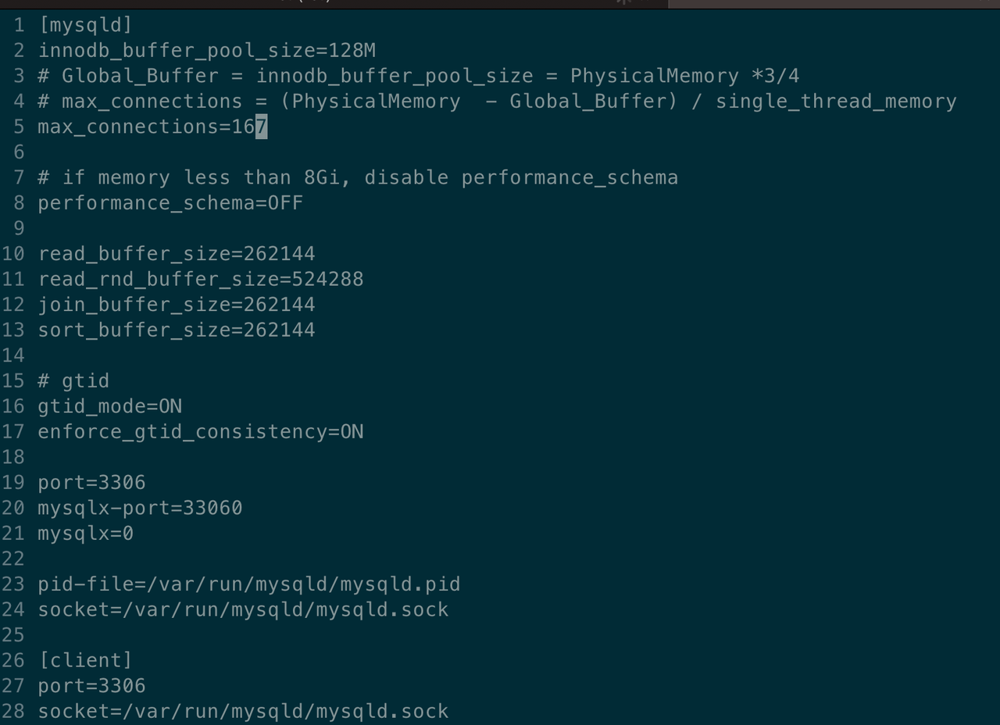
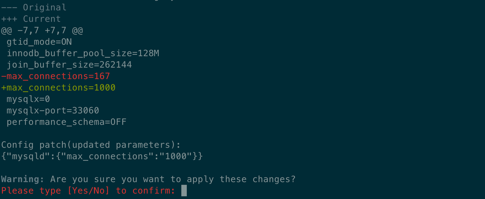

# Parameter configuration

This tutorial takes Oracle MySQL as an example and explains how to configure parameter templates and parameters in KubeBlocks. You can find [the full PR here](https://github.com/apecloud/learn-kubeblocks-addon/tree/main/tutorial-3-config-and-reconfig/).

## Before you start

1. Grasp basic concepts of Kubernetes, such as Pod and ConfigMap.
2. Finish configurations in [Configure parameter template](./parameter-template.md).
3. (Optional) Know something about Go Template.
4. (Optional)Know something about CUE Lang.

## Introduction

KubeBlocks adds configurations by mounting the ConfigMap to the volume. With a Kubernetes-Native concept that `ConfigMap is the only source of truth`, it centralizes entry for parameter changes in the ConfigMap to prevent configuration drifting. Therefore, the order below illustrates how KubeBlocks performs parameter reconfiguration:

1. Configure parameter values in the ConfigMap.
2. Derive parameter configurations (add/delete/update) based on ConfigMap modifications.
3. Apply the parameter configurations to the engine.

Different parameters require different configuration methods:

- Static parameters require a cluster restart (cold update).
- Dynamic parameters require a parameter refresh (hot update).

Table 1 lists four common hot update methods, including UNIX Signal, SQL, Auto, etc. Currently, engines in KubeBlocks can implement one or more of these methods. For example, to apply dynamic configuration in PostgreSQL, you can use:

- UNIX Signal: Send a `SIGHUP` signal.
- Tools: Call `pg_ctl` command.
- SQL: Execute SQL statements to directly update parameters.

:paperclip: Table 1. Summary of Parameter Hot Updates

| Methods     | Descriptions | Applicability |
| :---------- | :----------- | :------------ |
| Unix Signal | For example, PostgreSQL. <br /> If you need to reload the configuration file after parameter configuration, send a `SIGHUP` signal to PG. | Applicable to engines that support Unix Signal updates. |
| SQL         | For example, MySQL. <br /> Perform parameter configurations through the SQL statement `SET GLOBAL <var> =<value>`. | Applicable to most RDBMS engines. <br /> **Note**: The `execSQL` interface is required. Currently, KubeBlocks only supports MySQL and PostgreSQL. |
| Tools       | For example, Redis or MongoDB. <br /> Related tools are provided for configuring parameters. | Implemented via custom scripts or local tools, highly versatile. |
| Auto        | The engine itself watches for changes in configuration files, and updates automatically when a change is detected. | Dependent on whether the engine supports automatic loading. |

As mentioned in [Parameter template](./parameter-template.md), Kubernetes does not synchronously update ConfigMap changes to the Pod. For KubeBlocks, it not only needs to distinguish the way parameters are configured but also needs to watch whether the corresponding configurations are synchronized to the Pod.

Now take a look at how KubeBlocks manages parameter configurations through the `ConfigConstraint` API.

## ConfigConstraint

As a multi-engine platform, KubeBlocks needs to get the following information to better support parameter configuration:

1. Format of configuration files:

   Different configuration files have different structures. KubeBlocks parses files based on their structure to deduce the information about each configuration (add/delete/update).

2. Effect scope of parameters:

   Be clear which parameters are dynamic, which are static, and which are immutable. KubeBlocks specifies the effect scope of parameters to determine how they quickly take effect.

3. Methods for dynamic parameter changes:

   As shown in Table 1., parameters can be dynamically configured in various ways. Therefore, specify different dynamic configuration methods for different engines.

4. Definition of parameter validation rules:

   It's important to define validation rules for parameters. In a production environment, developers often fail to start databases due to typos in parameter values. Parameter validation therefore adds a layer of protection by performing checks in advance to prevent such mistakes.

:::note

KubeBlocks creates a config-manager sidecar for components that have configured ConfigConstraint. It is used to detect file updates, send signals, and execute updated scripts.

:::

The information is included in `ConfigConstraint` (parameter constraints) as shown below. The four sections correspond to the four key configuration details mentioned above.

```yaml
apiVersion: apps.kubeblocks.io/v1alpha1
kind: ConfigConstraint
metadata:
  name: oracle-mysql-config-constraints
spec:
  #1. Specify the file format as INI and only focus on the `mysqld` section
  formatterConfig:
    format: ini
    iniConfig:
      sectionName: mysqld

  #2. Specify the dynamic parameter configuration method for MySQL, using `reload-script` to execute SQL statements
  reloadOptions:
    tplScriptTrigger:
      sync: true
      # Specify which script file to use for configuration
      scriptConfigMapRef: oracle-mysql-reload-script
      namespace: {{ .Release.Namespace }}

  ##3.1 Configure static parameters
  staticParameters:
    - open_files_limit
    - performance_schema
    - enforce_gtid_consistency

  ##3.2 Configure dynamic parameters
  dynamicParameters:
    - innodb_buffer_pool_size
    - max_connections
    - gtid_mode

  ##4. Define parameter validation rules with a CUE template
  cfgSchemaTopLevelName: MysqlParameter
  configurationSchema:
    cue: |-
      {{- .Files.Get "config/oracle-mysql-config-constraint.cue" | nindent 6 }}
```

Each API is to be explained in the following tutorial.

### FormatterConfig

FormatterConfig describes the configuration file format, such as `ini`, `yaml`, `json`, `xml`, `properties`.

The file itself is just a text and requires different parsers.

When KubeBlocks detects a configuration file change, it deduces the parameter configuration (add/delete/update) based on the format and notifies the Pod to update.

For example, MySQL's adjustable parameters take the `ini` format and only parse the `mysqld` information.

```bash
  formatterConfig:
    format: ini               # Format of the configuration file and ini, xml, yaml, json and hcl are supported
    iniConfig:
      sectionName: mysqld     # If the ini format is adopted, there might be multiple sections and sectionName is required
```

### ReloadOptions

ReloadOptions describes the method of dynamic parameter configuration.

Table 1 above summarizes 4 common methods of dynamic parameter configuration. KubeBlocks, accordingly, supports multiple configuration methods.

- tplScriptTrigger: Configures parameter by template files.
- shellTrigger: Configures parameters by executing scripts.
- unixSignalTrigger: Configures parameters through UNIX Signal.
- None: AutoLoad mode, which is automatically configured by the database engine.

***Example***

- tplScriptTrigger

  This example chooses `tplScriptTrigger` to configure parameters by defining the content in the template file.

  ```bash
    reloadOptions:
      tplScriptTrigger:                                 # Configure parameters by template file
        sync: true                                      # Synchronou reloading
        scriptConfigMapRef: oracle-mysql-reload-script  # The referenced template file 
        namespace: {{ .Release.Namespace }}
  ```

- shellTrigger

  `shellTrigger` performs dynamic parameter configuration by shell scripts, which is a general method since most databases support configuring parameters through clients.

  ```yaml
    reloadOptions:
      shellTrigger:
        sync: true
        command:
          - "update-dynamic-config.sh" 
  ```

:::note

The scripts in Reloadptions will be loaded to the Pod and executed by the config-manager sidecar mentioned before.

:::

### Static/Dynamic Parameters

KubeBlocks supports configuring dynamic, static and immutable parameters and such effect scope is used to identify the parameter type and to determine how the parameter reconfiguration takes effect.

KubeBlocks includes multiple parameter reloading strategies and applies the appropriate strategy based on the reconfiguration contents.

This example lists some common MySQL parameters, such as the static parameter `performance_schema` and the dynamic parameter `max_connection`.

If the parameter list is too long, it is recommended to use the `.Files.Get` function.

```yaml
  ##3.1 Configure static parameter list
  staticParameters:
    - open_files_limit
    - performance_schema
    - enforce_gtid_consistency

  ##3.2 Configure dynamic parameter list
  dynamicParameters:
    - innodb_buffer_pool_size
    - max_connections
    - gtid_mode
```

### ConfigurationSchema

During the configuration process, starting a cluster may fail due to entering an invalid parameter value.

KubeBlocks provides ConfigurationSchema for validating parameter effectiveness. KubeBlocks uses CUE for verification. It works by describing the type, default value and range of each parameter to prevent problems caused by an invalid parameter value.

This example illustrates the configuration for verifying MySQL parameter values.

```yaml
#MysqlParameter: {

    // Sets the autocommit mode
    autocommit?: string & "0" | "1" | "OFF" | "ON"

    open_files_limit: int | *5000

    // Enables or disables the Performance Schema
    performance_schema: string & "0" | "1" | "OFF" | "ON" | *"0"
    
    // The number of simultaneous client connections allowed.
    max_connections?: int & >=1 & <=100000    
    ...
 }
```

For example, the example above defines some constraints for the parameter `performance_schem` in MySQL.

- Type: string
- Available values: ON, OFF, 0, 1
- Default value: 0

```yaml
    // Enables or disables the Performance Schema
    performance_schema: string & "0" | "1" | "OFF" | "ON" | *"0"
```

## How to configure parameters

Better user experience, KubeBlocks offers kbcli for your convenient parameter management.

### Create a cluster

Both kbcli and Helm are supported.

<Tabs>

<TabItem value="kbcli" label="kbcli" default>

```bash
kbcli cluster create mycluster --cluster-definition='oracle-mysql' --cluster-version oracle-mysql-8.0.32
```

</TabItem>

<TabItem value="Helm" label="Helm">

```bash
helm install oracle-mysql path-to-your-helm-chart/oracle-mysql
```

</TabItem>

</Tabs>

### View parameter configuration

View the detailed configuration of a cluster, including the configuration template name and constraint name.

```bash
kbcli cluster describe-config mycluster
>
ConfigSpecs Meta:
CONFIG-SPEC-NAME   FILE     ENABLED   TEMPLATE                       CONSTRAINT                        RENDERED                            COMPONENT    CLUSTER
mysql-config       my.cnf   true      oracle-mysql-config-template   oracle-mysql-config-constraints   mycluster-mysql-comp-mysql-config   mysql-comp   mycluster

History modifications:
OPS-NAME   CLUSTER   COMPONENT   CONFIG-SPEC-NAME   FILE   STATUS   POLICY   PROGRESS   CREATED-TIME   VALID-UPDATED
```

### Configure parameters

For example, configure the max_connection of MySQL.

Based on the above configuration,

- max_connection is a dynamic parameter.
- The value range is [1, 10000].

:::note

For KubeBlocks v0.6.0 and above, run `kbcli cluster edit-config` to configure the parameter.

:::

```bash
kbcli cluster edit-config mycluster
```

In the interactive editing interface, edit max_connection as 1000.



Save the changes and confirm the information to realize the parameter reconfiguration.



### View the change history

View the parameter configurations again. Besides the parameter template, the history and detailed information are also recorded.

```bash
kbcli cluster describe-config mycluster
>
ConfigSpecs Meta:
CONFIG-SPEC-NAME   FILE     ENABLED   TEMPLATE                       CONSTRAINT                        RENDERED                            COMPONENT    CLUSTER
mysql-config       my.cnf   true      oracle-mysql-config-template   oracle-mysql-config-constraints   mycluster-mysql-comp-mysql-config   mysql-comp   mycluster

History modifications:
OPS-NAME                        CLUSTER     COMPONENT    CONFIG-SPEC-NAME   FILE     STATUS    POLICY   PROGRESS   CREATED-TIME                 VALID-UPDATED
mycluster-reconfiguring-7p442   mycluster   mysql-comp   mysql-config       my.cnf   Succeed            1/1        Aug 25,2023 18:27 UTC+0800   {"my.cnf":"{\"mysqld\":{\"max_connections\":\"1000\"}}"}
```

## Reference

- [Configure a Pod to Use a ConfigMap](https://kubernetes.io/docs/tasks/configure-pod-container/configure-pod-configmap/)
- [CUE Lang Overview](https://cuetorials.com/zh/overview/)
- [KubeBlocks ApeCloud MySQL Configuration](https://kubeblocks.io/docs/preview/user_docs/kubeblocks-for-mysql/configuration)

## Appendix

### A.1 How to view the reconfiguration process

Parameter configuration is a type of KubeBlocks operations, shorten as ops.

After the kbcli reconfiguration command is performed, a Configuration ops is generated in KubeBlocks.

As shown in Section 3.5, an ops named `mycluster-reconfiguring-7p442` is generated and you can run the command below to view the process, including the changes, policy and time.

```bash
kbcli cluster describe-op <your-reconfig-ops-name>
```

### A.2 Compare the difference between two changes

Run `diff-config` to view the difference between two changes

```bash
kbcli cluster diff-config <your-reconfig-ops1> <your-reconfig-ops2>
```
