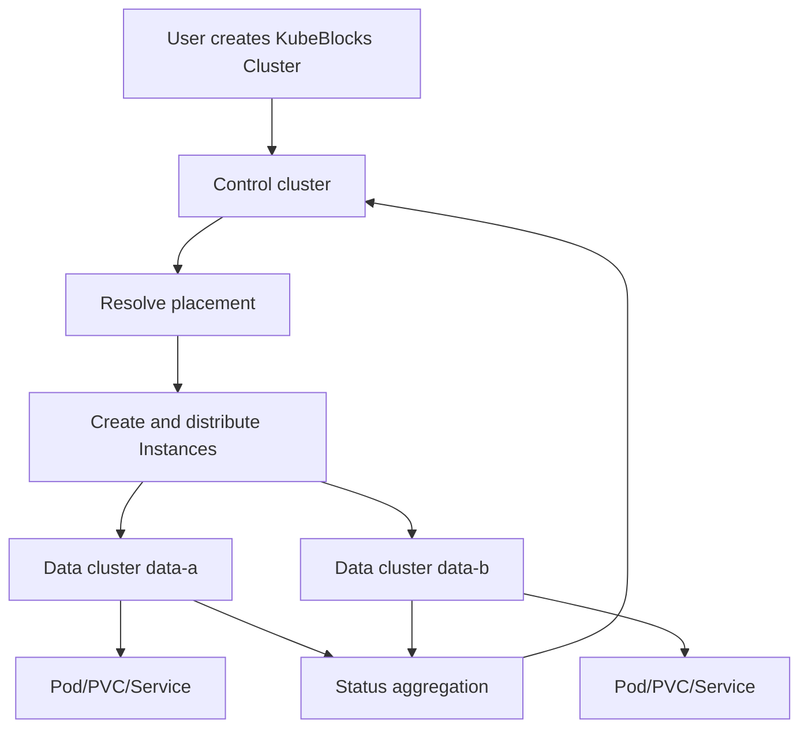

# Multi-Cluster Support Through the Instance API

KubeBlocks 1.1 introduces multi-cluster support through the experimental `Instance` API. A single KubeBlocks control plane can manage database instances that run in multiple Kubernetes clusters.

Users still create a normal KubeBlocks `Cluster`. The difference is that each database instance can be placed into one of the configured data clusters while the desired state and aggregated status stay in the control cluster.

## Why This Helps

Many database platforms eventually outgrow a single Kubernetes cluster. Common reasons include:

* capacity limits in one Kubernetes cluster;
* failure-domain isolation across availability zones or data centers;
* separate resource pools for different teams or hardware types;
* the need for one operational view across multiple clusters;
* gradual migration from single-cluster to multi-cluster database management.

KubeBlocks multi-cluster support lets platform teams expand the runtime boundary without changing the user-facing `Cluster` API.

## What It Does

KubeBlocks uses three concepts:

| Concept | Meaning |
| --- | --- |
| Control cluster | The Kubernetes cluster where KubeBlocks manager runs and where users create KubeBlocks `Cluster` objects. |
| Data cluster | A Kubernetes cluster where database pods, PVCs, and related runtime objects are created. |
| Placement | A KubeBlocks annotation that tells the manager which data clusters can run the database instances. |

Multi-cluster support depends on the new `Instance` API. Each database instance becomes an `Instance` object that KubeBlocks can distribute to a selected data cluster.



KubeBlocks decides which data cluster receives each instance. After an instance reaches a data cluster, normal Kubernetes scheduling still decides which node runs the pod.

## How to Use It

### Step 1: Prepare a kubeconfig secret

Create a kubeconfig that contains contexts for all data clusters, then store it as a secret in the KubeBlocks namespace.

```bash
kubectl -n kb-system create secret generic kubeblocks-multicluster-kubeconfig \
  --from-file=kubeconfig=/path/to/multicluster.kubeconfig
```

The secret key must be `kubeconfig`.

### Step 2: Enable multi-cluster in Helm values

```yaml
multiCluster:
  kubeConfig: kubeblocks-multicluster-kubeconfig
  mountPath: /var/run/secrets/kubeblocks.io/multicluster
  contexts: data-a,data-b
  contextsDisabled: ""
```

Install or upgrade KubeBlocks:

```bash
helm upgrade --install kubeblocks kubeblocks/kubeblocks --version 1.1.0 \
  -n kb-system --create-namespace \
  -f values-multicluster.yaml
```

The important fields are:

* `multiCluster.kubeConfig`: secret name that contains the kubeconfig.
* `multiCluster.contexts`: comma-separated list of data-cluster contexts KubeBlocks may use.
* `multiCluster.contextsDisabled`: comma-separated list of contexts temporarily disabled for scheduling.

### Step 3: Create a cluster with placement

Add the placement annotation and enable the Instance API on the component.

```yaml
apiVersion: apps.kubeblocks.io/v1
kind: Cluster
metadata:
  name: redis-mc
  namespace: demo
  annotations:
    apps.kubeblocks.io/multi-cluster-placement: data-a,data-b
spec:
  terminationPolicy: Delete
  clusterDef: redis
  topology: replication
  componentSpecs:
    - name: redis
      serviceVersion: "7.2.4"
      enableInstanceAPI: true
      replicas: 2
      resources:
        requests:
          cpu: "500m"
          memory: 512Mi
        limits:
          cpu: "500m"
          memory: 512Mi
      volumeClaimTemplates:
        - name: data
          spec:
            accessModes:
              - ReadWriteOnce
            resources:
              requests:
                storage: 20Gi
```

The placement annotation value is a comma-separated list of kubeconfig context names. In this example, KubeBlocks can place Redis instances in `data-a` and `data-b`.

Placement semantics:

* Instances are distributed round-robin by ordinal across the listed contexts (`contexts[ordinal % N]`). Each distributed object carries its assigned context in its own `apps.kubeblocks.io/multi-cluster-placement` annotation, which you can use to verify placement.
* If the annotation is present but empty, KubeBlocks automatically assigns a subset of the configured contexts (sized by the largest component replica count) and writes it back to the cluster annotation.
* Every component and sharding template in a placement-enabled cluster must set `enableInstanceAPI: true`; otherwise reconciliation fails with `the multi-cluster object is only supported for components that enable the instance API`.

Placement details:

* Instances are distributed across the listed contexts by ordinal (`contexts[ordinal % len(contexts)]`), and each placed object carries the `apps.kubeblocks.io/multi-cluster-placement` annotation with its assigned context, so placement is directly observable.
* If the annotation is present but empty, KubeBlocks assigns contexts automatically: it selects up to `maxReplicas` contexts from the configured list and writes them back to the annotation.
* All components and shardings of a multi-cluster cluster must set `enableInstanceAPI: true`; otherwise reconciliation fails with `the multi-cluster object is only supported for components that enable the instance API`.

### Step 4: Verify placement and status

Check the control cluster:

```bash
kubectl get cluster redis-mc -n demo
kubectl get instances.workloads.kubeblocks.io -n demo
kubectl get components -n demo
```

Check each data cluster by switching context:

```bash
kubectl --context data-a get pod,pvc -n demo
kubectl --context data-b get pod,pvc -n demo
```

The control cluster should show the unified KubeBlocks status, while each data cluster should contain the runtime resources assigned to it.

## Sharded Clusters

For sharded clusters, enable the Instance API in the sharding template.

```yaml
apiVersion: apps.kubeblocks.io/v1
kind: Cluster
metadata:
  name: redis-sharding-mc
  namespace: demo
  annotations:
    apps.kubeblocks.io/multi-cluster-placement: data-a,data-b
spec:
  clusterDef: redis
  topology: sharding
  shardings:
    - name: shard
      shardingDef: redis-sharding
      shards: 2
      template:
        componentDef: redis
        serviceVersion: "7.2.4"
        enableInstanceAPI: true
        replicas: 2
```

## Common Use Cases

### Spread replicas across failure domains

Map `data-a` and `data-b` to Kubernetes clusters in different zones or data centers. KubeBlocks can then place database instances across those clusters.

### Manage multiple resource pools from one control plane

Use different data clusters for different hardware, storage classes, or teams. Users still create a standard KubeBlocks `Cluster`; platform owners control eligible placement with annotations and Helm configuration.

### Gradually adopt multi-cluster

Existing single-cluster databases can continue running without placement annotations. New databases that need cross-cluster placement can opt in by adding placement and enabling the Instance API.

## Notes

* Multi-cluster support requires `enableInstanceAPI: true` on target components.
* Placement selects Kubernetes clusters, not nodes. Node scheduling is still handled by the target data cluster.
* Data clusters must have the required CRDs, RBAC, storage classes, network access, and controllers.
* For production workloads, specify placement explicitly instead of relying on automatic placement.
* Temporarily disable a data cluster by adding its context to `multiCluster.contextsDisabled`.
