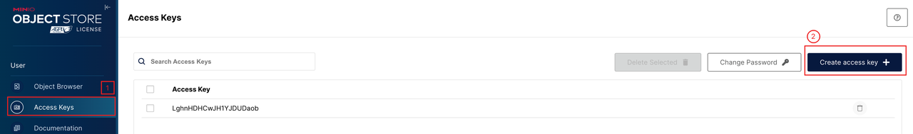
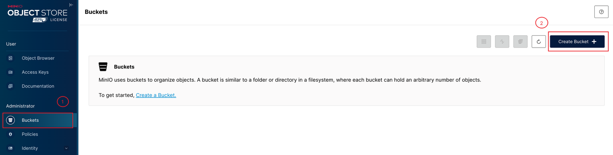
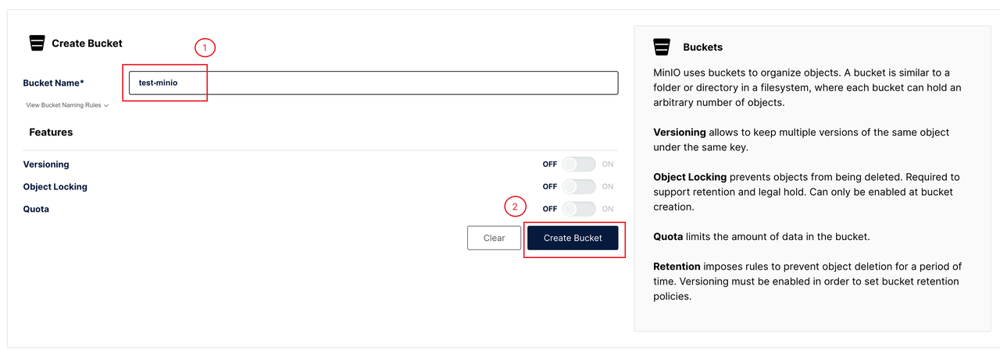

import Tabs from '@theme/Tabs';
import TabItem from '@theme/TabItem';

# Introduction

BackupRepo is the storage repository for backup data. Currently, KubeBlocks supports configuring various object storage services as backup repositories, including OSS (Alibaba Cloud Object Storage Service), S3 (Amazon Simple Storage Service), COS (Tencent Cloud Object Storage), GCS (Google Cloud Storage), OBS (Huawei Cloud Object Storage), MinIO, and other S3-compatible services. Additionally, it also supports using Kubernetes-native PVCs as backup repositories.

You can create multiple BackupRepos to suit different scenarios. For example, based on different businesses, the data of business A is stored in repository A, and the data of business B is stored in repository B. Or you can configure multiple repositories by region to realize geo-disaster recovery. But it is required to specify backup repositories when you create a backup. You can also create a default backup repository and KubeBlocks uses this default repository to store backup data if no specific repository is specified.

## Before you start

Make sure you have all the following prepared.

* [Install kbcli](./../../installation/install-with-kbcli/install-kbcli.md)
* [Install kubectl](https://kubernetes.io/docs/tasks/tools/#kubectl)
* [Install Helm](https://helm.sh/docs/intro/install/)
* Install KubeBlocks by [kbcli](./../../installation/install-with-kbcli/install-kubeblocks-with-kbcli.md) or by [Helm](./../../installation/install-with-helm/install-kubeblocks-with-helm.md)

## Install MinIO

If you don't have an object storage service from a cloud provider, you can deploy the open-source service MinIO in Kubernetes and use it to configure BackupRepo. If you are using an object storage service provided by a cloud provider, directly skip to [Configure BackupRepo](#configure-backuprepo).

***Steps***

1. Install MinIO in the `kb-system` namespace.

   ```bash
   helm repo add kubeblocks-apps https://jihulab.com/api/v4/projects/152630/packages/helm/stable
   helm install minio kubeblocks-apps/minio --namespace kb-system --create-namespace --set "extraEnvVars[0].name=MINIO_BROWSER_LOGIN_ANIMATION" --set "extraEnvVars[0].value=off"
   ```

   Get the initial username and password:

   ```bash
   # Initial username
   echo $(kubectl get secret --namespace kb-system minio -o jsonpath="{.data.root-user}" | base64 -d)

   # Initial password
   echo $(kubectl get secret --namespace kb-system minio -o jsonpath="{.data.root-password}" | base64 -d)
   ```

2. Generate credentials.

   Access the login page by running `kubectl port-forward --namespace default svc/minio 9001:9001` and then accessing `127.0.0.1:9001`.

   Once you are logged in to the dashboard, you can generate an `access key` and `secret key`.

   

3. Create a bucket.

   Create a bucket named `test-minio` for the test.

   
   

  :::note

  The access address (endpoint) for the installed MinIO is `http://minio.kb-system.svc.cluster.local:9000`, which will be used to configure BackupRepo. In this case, `kb-system` is the name of the namespace where MinIO is installed.

  :::


## Configure BackupRepo

With object storage services prepared, it's time to configure BackupRepo. KubeBlocks provides two ways for the configuration:

* Automatic BackupRepo configuration during KubeBlocks installation;
* Manual BackupRepo configuration for on-demand scenarios.
  
### Access BackupRepo

There are two methods to access remote object storage:

* Use command-line tools to directly access remote storage.
* Mount the remote storage to the local system with a CSI driver, allowing the work processes to access the remote storage as if it were local files.
  
The two access methods are referred to as "Tool" and "Mount". When creating BackupRepo, you can specify the access method through the `accessMethod` field, which can not be changed after creation.

Generally, it is recommended to use the "Tool" method as it does not require installing an additional CSI driver, thus reducing dependencies.

However, as backup and restore tasks require running in the namespace of the database cluster, using the "Tool" approach automatically synchronizes the necessary credentials for accessing the remote storage as secret resources in those namespaces. These credentials are used by the data transfer tool. If you have concerns about security risks associated with synchronizing secrets in a multi-tenant environment, you can choose to use the "Mount" method.

### Automatic BackupRepo configuration

You can specify the BackupRepo information in a YAML configuration file when installing KubeBlocks, and KubeBlocks will create the BackupRepo and automatically install the necessary CSI Driver based on the provided configuration.

1. Prepare the configuration file.

   Taking AWS S3 as an example, the configuration file `backuprepo.yaml` is:

    ```yaml
    backupRepo:
      create: true
      storageProvider: s3
      config:
        region: cn-northwest-1
        bucket: test-kb-backup
      secrets:
        accessKeyId: <ACCESS KEY>
        secretAccessKey: <SECRET KEY>
    ```

    * `region`: specifies the region where S3 is located.
    * `bucket`: specifies the bucket name of S3.
    * `accessKeyId`: specifies the Access Key of AWS.
    * `secretAccessKey`: specifies the Secret Key of AWS.
    * `storageProvider`：specifies the object storage provider, which is S3 in this case.

:::note

* For KubeBlocks v0.7.0, the available `storageProvider` options are `s3`, `cos`, `gcs-s3comp`, `obs`, `oss`, `minio`, and `pvc`.
* For different `storageProvider`, the configuration may differ. `config` and `secrets` in the above example are applied to S3.
* Execute the command `kubectl get storageproviders.storage.kubeblocks.io` to view the supported `storageProvider` options.

:::

2. Specify the configuration file when installing KubeBlocks.

   ```bash
   kbcli kubeblocks install -f backuprepo.yaml
   ```

   Use the command below to check the BackupRepo after installation.
   
   <Tabs>

   <TabItem value="kbcli" label="kbcli" default>

   ```bash
   kbcli backuprepo list
   ```

   </TabItem>

   <TabItem value="kubectl" label="kubectl">

   ```bash
   kubectl get backuprepo
   ```

   </TabItem>

   </Tabs>

### Manual BackupRepo configuration

If you do not configure the BackupRepo information when installing KubeBlocks, you can manually configure it by the following instructions.

1. Install the S3 CSI driver (only used in the Mount method).

    <Tabs>

    <TabItem value="kbcli" label="kbcli" default>

    ```bash
    # Enable the CSI-S3 add-on
    kbcli addon enable csi-s3

    # You can add flags to customize the installation of this add-on
    # CSI-S3 installs a daemonSet Pod on all nodes by default and you can set tolerations to install it on the specified node
    kbcli addon enable csi-s3 \
      --tolerations '[{"key":"taintkey","operator":"Equal","effect":"NoSchedule","value":"true"}]' \
      --tolerations 'daemonset:[{"key":"taintkey","operator":"Equal","effect":"NoSchedule","value":"true"}]'

    # View the status of CSI-S3 driver and make sure it is Enabled
    kbcli addon list csi-s3
    ```

    </TabItem>

    <TabItem value="Helm" label="Helm">

    ```bash
    helm repo add kubeblocks https://jihulab.com/api/v4/projects/85949/packages/helm/stable
    helm install csi-s3 kubeblocks/csi-s3 --version=0.7.0 -n kb-system

    # You can add flags to customize the installation of this add-on
    # CSI-S3 installs a daemonSet Pod on all nodes by default and you can set tolerations to install it on the specified node
    --set-json tolerations='[{"key":"taintkey","operator":"Equal","effect":"NoSchedule","value":"taintValue"}]'
    --set-json daemonsetTolerations='[{"key":"taintkey","operator":"Equal","effect":"NoSchedule","value":"taintValue"}]'
    ```

    </TabItem>

    </Tabs>

2. Create BackupRepo.

    <Tabs>

    <TabItem value="kbcli" label="kbcli" default>

      <Tabs>

      <TabItem value="S3" label="S3" default>

      ```bash
      kbcli backuprepo create my-repo \
        --provider s3 \
        --region cn-northwest-1 \
        --bucket test-kb-backup \
        --access-key-id <ACCESS KEY> \
        --secret-access-key <SECRET KEY> \
        --access-method Tool \ # Mount is also acceptable
        --default
      ```

      </TabItem>

      <TabItem value="OSS" label="OSS">

      ```bash
      kbcli backuprepo create my-repo \
        --provider oss \
        --region cn-zhangjiakou \
        --bucket  test-kb-backup \
        # --endpoint https://oss-cn-zhangjiakou-internal.aliyuncs.com \ can show the specified oss endpoint
        --access-key-id <ACCESS KEY> \
        --secret-access-key <SECRET KEY> \
        --access-method Tool \ 
        --default
      ```

      </TabItem>

      <TabItem value="OBS" label="OBS">

      ```bash
      kbcli backuprepo create my-repo \
        --provider obs \
        --region cn-north-4 \
        --bucket  test-kb-backup \
        --access-key-id <ACCESS KEY> \
        --secret-access-key <SECRET KEY> \
        --access-method Tool \
        --default
      ```

      </TabItem>

      <TabItem value="COS" label="COS">

      ```bash
      kbcli backuprepo create my-repo \
        --provider cos \
        --region ap-guangzhou \
        # In COS, the naming format of a bucket is <BucketName-APPID>，where APPID is automatically generated by Tencent Cloud
        # When setting up, first create the bucket through Tencent Cloud's console and obtain the bucket name
        --bucket  test-kb-backup \ 
        --access-key-id <ACCESS KEY> \
        --secret-access-key <SECRET KEY> \
        --access-method Tool \
        --default
      ```

      </TabItem>

      <TabItem value="GCS" label="GCS">

      ```bash
      # The current GCS is the S3-compatible version provided by Google Cloud
      kbcli backuprepo create my-repo \
        --provider gcs \
        --region auto \
        --bucket  test-kb-backup \
        --access-key-id <ACCESS KEY> \
        --secret-access-key <SECRET KEY> \
        --access-method Tool \
        --default
      ```

      </TabItem>

      <TabItem value="MinIO" label="MinIO">

      ```bash
      kbcli backuprepo create my-repo \
        --provider minio \
        --endpoint <ip:port> \    # The access address for the deployed MinIO is: http://minio.kb-system.svc.cluster.local:9000
        --bucket test-minio \
        --access-key-id <ACCESS KEY> \
        --secret-access-key <SECRET KEY> \
        --access-method Tool \
        --default
      ```

      </TabItem>

      <TabItem value="PVC" label="PVC">

      ```bash
      kbcli backuprepo create --provider pvc \
        --storage-class-name "nfs-storage" \
        --access-mode "ReadWriteMany" \
        --volume-capacity "100Gi" \
        --default
      ```

      </TabItem>
      </Tabs>

      The above command creates a default backup repository `my-repo`.

      * `my-repo` is the name of the created backup repository. If you do not specify a name, the system creates a random name, following the format `backuprepo-xxxxx`.
      * `--default` means that this repository is set as the default repository. Note that there can only be one default global repository. If there exist multiple default repositories, KubeBlocks cannot decide which one to use (similar to the default StorageClass of Kubernetes), which further results in backup failure. Using kbcli to create BackupRepo can avoid such problems because kbcli checks whether there is another default repository before creating a new one.
      * `--provider` specifies the storage type, i.e. `storageProvider`, and is required for creating a BakcupRepo. The available values are `s3`, `cos`, `gcs-s3comp`, `obs`, `oss`, and `minio`. Parameters for different storage providers vary and you can run `kbcli backuprepo create --provider STORAGE-PROVIDER-NAME -h` to view the flags for different storage providers. Please note that `--provider` is mandatory in configuration.

      After `kbcli backuprepo create` is executed successfully, the system creates the K8s resource whose type is `BackupRepo`. You can modify the annotation of this resource to adjust the default repository.

      ```bash
      # Cancel the default repository
      kubectl annotate backuprepo old-default-repo \
        --overwrite=true \
        dataprotection.kubeblocks.io/is-default-repo=false
      ```

      ```bash
      # Set a new default repository
      kubectl annotate backuprepo backuprepo-4qms6 \
        --overwrite=true \
        dataprotection.kubeblocks.io/is-default-repo=true
      ```

    </TabItem>

    <TabItem value="kubectl" label="kubectl">

      `kubectl` is another option to create BackupRepo, but the commands do not include parameter and default repository verification compared with kbcli, which is not convenient. It is recommended to use kbcli.

      <Tabs>

      <TabItem value="S3" label="S3" default>

      ```bash
      # Create a secret to save the access key for S3
      kubectl create secret generic s3-credential-for-backuprepo \
        -n kb-system \
        --from-literal=accessKeyId=<ACCESS KEY> \
        --from-literal=secretAccessKey=<SECRET KEY>

      # Create the BackupRepo resource
      kubectl apply -f - <<-'EOF'
      apiVersion: dataprotection.kubeblocks.io/v1alpha1
      kind: BackupRepo
      metadata:
        name: my-repo
        annotations:
          dataprotection.kubeblocks.io/is-default-repo: "true"
      spec:
        storageProviderRef: s3
        accessMethod: Tool
        pvReclaimPolicy: Retain
        volumeCapacity: 100Gi
        config:
          bucket: test-kb-backup
          endpoint: ""
          mountOptions: --memory-limit 1000 --dir-mode 0777 --file-mode 0666
          region: cn-northwest-1
        credential:
          name: s3-credential-for-backuprepo
          namespace: kb-system
      EOF
      ```

      </TabItem>

      <TabItem value="OSS" label="OSS">

      ```bash
      # Create a secret to save the access key for OSS
      kubectl create secret generic oss-credential-for-backuprepo \
        -n kb-system \
        --from-literal=accessKeyId=<ACCESS KEY> \
        --from-literal=secretAccessKey=<SECRET KEY>

      # Create the BackupRepo resource
      kubectl apply -f - <<-'EOF'
      apiVersion: dataprotection.kubeblocks.io/v1alpha1
      kind: BackupRepo
      metadata:
        name: my-repo
        annotations:
          dataprotection.kubeblocks.io/is-default-repo: "true"
      spec:
        storageProviderRef: oss
        accessMethod: Tool
        pvReclaimPolicy: Retain
        volumeCapacity: 100Gi
        config:
          bucket: test-kb-backup
          mountOptions: ""
          endpoint: ""
          region: cn-zhangjiakou
        credential:
          name: oss-credential-for-backuprepo
          namespace: kb-system
      EOF
      ```

      </TabItem>

      <TabItem value="OBS" label="OBS">

      ```bash
      # Create a secret to save the access key for OBS
      kubectl create secret generic obs-credential-for-backuprepo \
      -n kb-system \
      --from-literal=accessKeyId=<ACCESS KEY> \
      --from-literal=secretAccessKey=<SECRET KEY>

      # Create the BackupRepo resource
      kubectl apply -f - <<-'EOF'
      apiVersion: dataprotection.kubeblocks.io/v1alpha1
      kind: BackupRepo
      metadata:
        name: my-repo
        annotations:
          dataprotection.kubeblocks.io/is-default-repo: "true"
      spec:
        storageProviderRef: obs
        accessMethod: Tool
        pvReclaimPolicy: Retain
        volumeCapacity: 100Gi
        config:
          bucket: test-kb-backup
          mountOptions: ""
          endpoint: ""
          region: cn-north-4
        credential:
          name: obs-credential-for-backuprepo
          namespace: kb-system
      EOF
      ```

      </TabItem>

      <TabItem value="COS" label="COS">

      ```bash
      # Create a secret to save the access key for COS
      kubectl create secret generic cos-credential-for-backuprepo \
        -n kb-system \
        --from-literal=accessKeyId=<ACCESS KEY> \
        --from-literal=secretAccessKey=<SECRET KEY>

      # Create the BackupRepo resource
      kubectl apply -f - <<-'EOF'
      apiVersion: dataprotection.kubeblocks.io/v1alpha1
      kind: BackupRepo
      metadata:
        name: my-repo
        annotations:
          dataprotection.kubeblocks.io/is-default-repo: "true"
      spec:
        storageProviderRef: cos
        accessMethod: Tool
        pvReclaimPolicy: Retain
        volumeCapacity: 100Gi
        config:
          bucket: test-kb-backup
          mountOptions: ""
          endpoint: ""
          region: ap-guangzhou
        credential:
          name: cos-credential-for-backuprepo
          namespace: kb-system
      EOF
      ```

      </TabItem>

      <TabItem value="GCS" label="GCS">

      ```bash
      # Create a secret to save the access key for GCS
      kubectl create secret generic gcs-credential-for-backuprepo \
        -n kb-system \
        --from-literal=accessKeyId=<ACCESS KEY> \
        --from-literal=secretAccessKey=<SECRET KEY>

      # Create the BackupRepo resource
      kubectl apply -f - <<-'EOF'
      apiVersion: dataprotection.kubeblocks.io/v1alpha1
      kind: BackupRepo
      metadata:
        name: my-repo
        annotations:
          dataprotection.kubeblocks.io/is-default-repo: "true"
      spec:
        storageProviderRef: gcs
        accessMethod: Tool
        pvReclaimPolicy: Retain
        volumeCapacity: 100Gi
        config:
          bucket: test-kb-backup
          mountOptions: ""
          endpoint: ""
          region: auto
        credential:
          name: gcs-credential-for-backuprepo
          namespace: kb-system
      EOF
      ```

      </TabItem>

      <TabItem value="MinIO" label="MinIO">

      ```bash
      # Create a secret to save the access key for MinIO
      kubectl create secret generic minio-credential-for-backuprepo \
        -n kb-system \
        --from-literal=accessKeyId=<ACCESS KEY> \
        --from-literal=secretAccessKey=<SECRET KEY>

      # Create the BackupRepo resource
      kubectl apply -f - <<-'EOF'
      apiVersion: dataprotection.kubeblocks.io/v1alpha1
      kind: BackupRepo
      metadata:
        name: my-repo
        annotations:
          dataprotection.kubeblocks.io/is-default-repo: "true"
      spec:
        storageProviderRef: minio
        accessMethod: Tool
        pvReclaimPolicy: Retain
        volumeCapacity: 100Gi
        config:
          bucket: test-kb-backup
          mountOptions: ""
          endpoint: <ip:port>
        credential:
          name: minio-credential-for-backuprepo
          namespace: kb-system
      EOF
      ```

      </TabItem>

      </Tabs>

    </TabItem>

    </Tabs>

3. View the BackupRepo and its status. If the status is `Ready`, the BackupRepo is ready.

   <Tabs>

   <TabItem value="kbcli" label="kbcli" default>

   ```bash
   kbcli backuprepo list
   ```

   </TabItem>

   <TabItem value="kubectl" label="kubectl">

   ```bash
   kubectl get backuprepo
   ```

   </TabItem>

   </Tabs>
