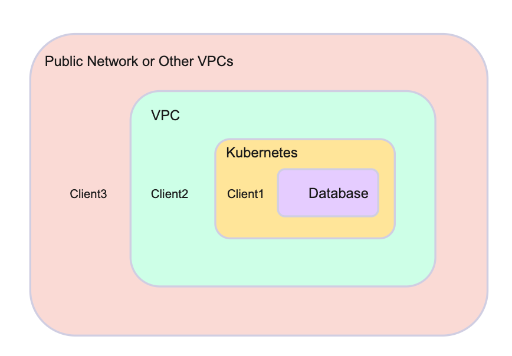

# Connect database in production environment

In the production environment, it is normal to connect a database with CLI and SDK clients. There are three scenarios.
- Scenario 1: Client1 and the database are in the same Kubernetes cluster. To connect client1 and the database, see [Procedure 3](#procedure-3-connect-database-in-the-same-kubernetes-cluster).
- Scenario 2: Client2 is outside the Kubernetes cluster, but it is in the same VPC as the database. To connect client2 and the database, see [Procedure 5](#procedure-5-client-outside-the-kubernetes-cluster-but-in-the-same-vpc-as-the-kubernetes-cluster).
- Scenario 3: Client3 and the database are in different VPCs, such as other VPCs or the public network. To connect client3 and the database, see [Procedure 4](#procedure-4-connect-database-with-clients-in-other-vpcs-or-public-networks).

See the figure below to get a clear image of the network location.


## Procedure 3. Connect database in the same Kubernetes cluster

You can connect with the database ClusterIP or domain name. To check the database endpoint, use ```kbcli cluster describe ${cluster-name}```.

```bash
kbcli cluster describe x
>
Name: x         Created Time: Mar 01,2023 11:45 UTC+0800
NAMESPACE   CLUSTER-DEFINITION   VERSION           STATUS    TERMINATION-POLICY
default     apecloud-mysql       ac-mysql-8.0.30   Running   Delete

Endpoints:
COMPONENT   MODE        INTERNAL                                 EXTERNAL
x           ReadWrite   x-mysql.default.svc.cluster.local:3306   <none>

Topology:
COMPONENT   INSTANCE    ROLE     STATUS    AZ                NODE                                                       CREATED-TIME
mysql       x-mysql-0   leader   Running   cn-northwest-1b   ip-10-0-2-184.cn-northwest-1.compute.internal/10.0.2.184   Mar 01,2023 11:45 UTC+0800

Resources Allocation:
COMPONENT   DEDICATED   CPU(REQUEST/LIMIT)   MEMORY(REQUEST/LIMIT)   STORAGE-SIZE   STORAGE-CLASS
mysql       false       1 / 1                1Gi / 1Gi               data:10Gi      <none>

Images:
COMPONENT   TYPE    IMAGE
mysql       mysql   registry.cn-hangzhou.aliyuncs.com/apecloud/apecloud-mysql-server:8.0.30-5.alpha2.20230105.gd6b8719.2

Events(last 5 warnings, see more:kbcli cluster list-events -n default x):
TIME   TYPE   REASON   OBJECT   MESSAGE
```

## Procedure 4. Connect database with clients in other VPCs or public networks

You can enable the External LoadBalancer of the cloud vendor.

:::note

The following command will create a LoadBalancer instance for the database instance, which will cause costs from your cloud vendor.

:::

```bash
kbcli cluster expose ${cluster-name} --type internet --enable=true
```
To disable the LoadBalancer instance, execute the following command.

```bash
kbcli cluster expose ${cluster-name} --type internet --enable=false
```

:::note

The instance is inaccessible after you disable the LoadBalancer instance.

:::

## Procedure 5. Client outside the Kubernetes cluster but in the same VPC as the Kubernetes cluster

A stable domain name for long-term connections is required. An Internal LoadBalancer provided by the cloud vendor can be used for this purpose.

:::note

The following command will create a LoadBalancer instance for the database instance, which will cause costs from your cloud vendor.

:::

```bash
kbcli cluster expose ${cluster-name} --type vpc --enable=true
```

To disable the LoadBalancer instance, execute the following command.

:::note

Once disabled, the instance is not accessible.

:::

```bash
kbcli cluster expose ${cluster-name} --type vpc --enable=false
```