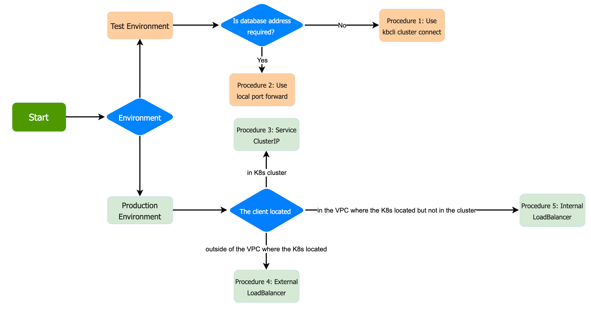

# Overview of Database Connection
After the deployment of KubeBlocks and creating clusters, the database runs on Kubernetes as a Pod. You can connect to the database via client interface or kbcli. 
As the figure below indicates, you must be clear with the purpose of connecting the database.
  - To take a trial of KubeBlocks, and test the database function, or benchmarking with low flow testing, see Connect database in testing environment.
  - To connect database in production environment, or for high flow pressure test, see Connect database in production environment.
