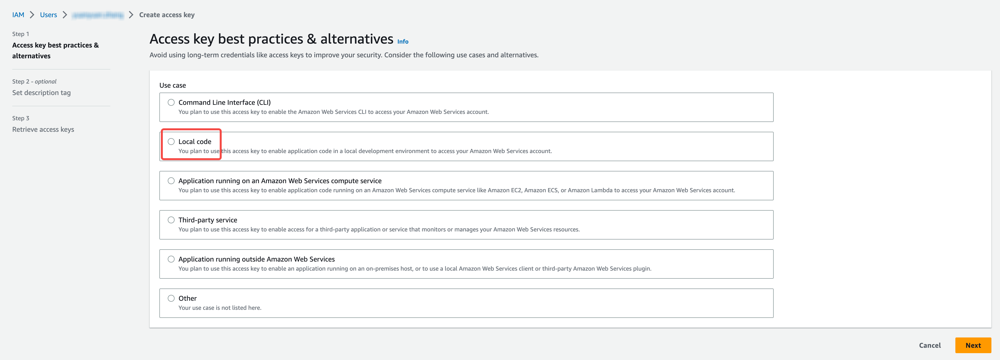

import Tabs from '@theme/Tabs';
import TabItem from '@theme/TabItem';

# Prerequisite

## Check your permission

<Tabs>
<TabItem value="EKS" label="EKS" default>

Fault injection requires `local code` permission. 

Go to [IAM](https://console.amazonaws.cn/iamv2/home?#/home) and click **Users** -> **User name** -> **Security credentials** -> **Create access key** and select **Local code**.



:::note

After a new access key is created, you need to set `aws configure` again.

:::

</TabItem>

<TabItem value="GKE" label="GKE">

Run the command below to verify whether your account has permission to create podchaos.

```bash
kubectl auth can-i create podchaos.chaos-mesh.org -n default --as "useraccont"
```

If the output is yes, you have the required permission.

If the output is no, follow the instructions below to solve this problem by deleting the verification process.

```bash
kubectl delete validatingwebhookconfigurations.admissionregistration.k8s.io chaos-mesh-validation-auth
```

If the output is `reauth related error`, it may relate to your GKE account permission. Reset your permission and clear the environment by running the commands below.

//TODO: 这里的重新设置权限需要说明吗？

```bash
rm -rf .config/gcloud

gcloud init

gcloud auth application-default login

export GOOGLE_PROJECT=xxx

kubectl delete secret cloud-key-secret-gcp
```

</TabItem>

## Enable Chaos Mesh

Both Helm and kbcli are provided as options to deploy Chaos Mesh.

Here we use ChaosMesh v2.5.2 and the DNS server is enabled for DNS fault injection.

<details open>
<summary>Helm</summary>

```bash
helm repo add chaos-mesh https://charts.chaos-mesh.org
kubectl create ns chaos-mesh
```

For installing ChaosMesh in Containerd, run the commands below.

```bash
helm install chaos-mesh chaos-mesh/chaos-mesh -n=chaos-mesh --version 2.5.2 --set chaosDaemon.privileged=true --set dnsServer.create=true --set chaosDaemon.runtime=containerd --set chaosDaemon.socketPath=/run/containerd/containerd.sock
```

For installing ChaosMesh in k3d/k3s, run the commands below.

```bash
helm install chaos-mesh chaos-mesh/chaos-mesh -n=chaos-mesh --version 2.5.2 --set chaosDaemon.privileged=true --set dnsServer.create=true --set chaosDaemon.runtime=containerd --set chaosDaemon.socketPath=/run/k3s/containerd/containerd.sock
```

</details>

<details>
<summary>kbcli</summary>

For installing ChaosMesh in Containerd, run the command below.

```bash
kbcli addon enable fault-chaos-mesh
```

For installing ChaosMesh in k3d/k3s, run the command below.

```bash
kbcli addon enable fault-chaos-mesh --set dnsServer.create=true --set chaosDaemon.runtime=containerd --set chaosDaemon.socketPath=/run/k3s/containerd/containerd.sock
```

//TODO: tolerations 目前集群创建不需要设置了，这里是否要调整？

If you set taints, you can set tolerations following the commands below.

```bash
# Chaos-mesh follows the tolerations of kubeblocks by default
# You can specify tolerations for four components of fault-chaos-mesh, controllerManager, chaosDaemon, dashboard, and dnsServer, according to your needs.
# Once a component is specified with tolerations, the default toleration of all components fails. It is recommended to spcify tolerations for four components or none.
kbcli addon enable fault-chaos-mesh \
--tolerations '[{"key":"kb-controller","operator":"Equal","effect":"NoSchedule","value":"true"}]' \
--tolerations 'chaosDaemon:[{"key":"kb-controller","operator":"Equal","effect":"NoSchedule","value":"true"},{"key":"kb-data","operator":"Equal","effect":"NoSchedule","value":"true"}]' \
--tolerations 'dashboard:[{"key":"kb-controller","operator":"Equal","effect":"NoSchedule","value":"true"}]' \
--tolerations 'dnsServer:[{"key":"kb-controller","operator":"Equal","effect":"NoSchedule","value":"true"}]' 
```
</details>