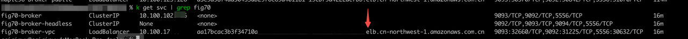
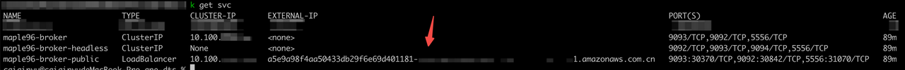

import Tabs from '@theme/Tabs';
import TabItem from '@theme/TabItem';

# Connect to a Kafka cluster

Before you connect to the Kafka cluster, you must check your network environment, and from which network you would like to connect to the cluster.
There are three scenarios of connecting.

* Connect to the cluster within the same Kubernetes cluster.
* Connect to a kafka cluster from outside of the Kubernetes cluster but in the same VPC.
* Connect to a kafka cluster from public internet.

## Connect to a kafka cluster within the Kubernetes cluster

Within the same Kubernetes cluster, you can directly access the Kafka cluster with ClusterIp service:9092.

***Steps:***

1. Get the address of the Kafka ClusterIP service port No..

   ```bash
   kubectl get svc -n demo
   > 
   NAME                                      TYPE        CLUSTER-IP    EXTERNAL-IP   PORT(S)                               AGE
   kubernetes                                ClusterIP   10.43.0.1     <none>        443/TCP                               9d
   mycluster-kafka-cluster-broker-headless   ClusterIP   None          <none>        9092/TCP,9093/TCP,9094/TCP,5556/TCP   7d16h
   mycluster-kafka-cluster-broker            ClusterIP   10.43.8.124   <none>        9093/TCP,9092/TCP,5556/TCP            7d16h
   ```

2. Connect to the Kafka cluster with the port No..

   Below is an example of connecting with the official client script.

   1. Start client pod.

       ```bash
       kubectl run kafka-producer --restart='Never' --image docker.io/bitnami/kafka:3.3.2-debian-11-r54 --command -- sleep infinity
       kubectl run kafka-consumer --restart='Never' --image docker.io/bitnami/kafka:3.3.2-debian-11-r54 --command -- sleep infinity
       ```

   2. Log in to kafka-producer.

       ```bash
       kubectl exec -ti kafka-producer -- bash
       ```

   3. Create topic.

       ```bash
       kafka-topics.sh --create --topic quickstart-events --bootstrap-server xxx-broker:9092
       ```

   4. Create producer.

       ```bash
       kafka-console-producer.sh --topic quickstart-events --bootstrap-server xxx-broker:9092 
       ```

   5. Enter："Hello, KubeBlocks" and press Enter.

   6. Start a new terminal session and login to kafka-consumer.

       ```bash
       kubectl exec -ti kafka-consumer -- bash
       ```

   7. Create consumer and specify consuming topic, and consuming message from the beginning.

       ```bash
       kafka-console-consumer.sh --topic quickstart-events --from-beginning --bootstrap-server xxx-broker:9092
       ```

    And you get the output 'Hello, KubeBlocks'.

## Connect to a Kafka cluster from outside of the Kubernetes cluster but in the same VPC

If you use AWS EKS, you may want to access to the Kafka cluster from EC2 instance. This section shows how to perform the connection.

***Steps:***

1. Set the value of `host-network-accessible` as true.

   <Tabs>

   <TabItem value="kubectl" label="kubectl" default>

   ```bash
   kubectl apply -f - <<EOF
   apiVersion: apps.kubeblocks.io/v1alpha1
   kind: Cluster
   metadata:
     name: mycluster
     namespace: demo
   spec:
     affinity:
       podAntiAffinity: Preferred
       topologyKeys:
       - kubernetes.io/hostname
     clusterDefinitionRef: kafka
     clusterVersionRef: kafka-3.3.2
     componentSpecs:
     - componentDefRef: kafka-server
       disableExporter: true
       name: broker
       replicas: 1
       resources:
         limits:
           cpu: "1"
           memory: 1Gi
         requests:
           cpu: "1"
           memory: 1Gi
       serviceAccountName: kb-sa-kafka
       services:
       - annotations: 
           service.beta.kubernetes.io/aws-load-balancer-type: nlb
           service.beta.kubernetes.io/aws-load-balancer-internal: "true"
         name: vpc
         serviceType: LoadBalancer
       tls: false
     terminationPolicy: Delete
   EOF
   ```

   </TabItem>

   <TabItem value="kbcli" label="kbcli">

   ```bash
   kbcli cluster create kafka mycluster --host-network-accessible=true -n demo
   ```

   </TabItem>

   </Tabs>

2. Get the corresponding ELB address.

   ```bash
   kubectl get svc -n demo
   ```

   This image illustrates the ELB address of a cluster named `fig70`.

   

  :::note

  xxxxxx-xxx.cn-northwest-1.elb.amazonaws.com.cn is the ELB address accessible within the same VPC of K8s.

  :::

3. Use the ELB address to connect.

    In the above example, the ELB address is a0e01377fa33xxx-xxx.cn-northwest-1.elb.amazonaws.com.cn:9092.

## Connect to a Kafka cluster from public internet

:::caution

The current version only supports Kafka broker with a single replica (combined: --replicas=1 or separated: --broker-replicas=1) to adpot the following approach.

:::

***Steps:***

1. Set the `--publicly-accessible` value as true when creating cluster.

   <Tabs>

   <TabItem value="kubectl" label="kubectl" default>

   ```bash
   kubectl apply -f - <<EOF
   apiVersion: apps.kubeblocks.io/v1alpha1
   kind: Cluster
   metadata:
     name: mycluster
     namespace: demo
   spec:
     affinity:
       podAntiAffinity: Preferred
       topologyKeys:
       - kubernetes.io/hostname
     clusterDefinitionRef: kafka
     clusterVersionRef: kafka-3.3.2
     componentSpecs:
     - componentDefRef: kafka-server
       disableExporter: true
       name: broker
       replicas: 1
       resources:
         limits:
           cpu: "1"
           memory: 1Gi
         requests:
           cpu: "1"
           memory: 1Gi
       serviceAccountName: kb-sa-kafka
       services:
       - annotations: 
           service.beta.kubernetes.io/aws-load-balancer-type: nlb
           service.beta.kubernetes.io/aws-load-balancer-internal: "false"
         name: vpc
         serviceType: LoadBalancer
       tls: false
     terminationPolicy: Delete
   EOF
   ```

   </TabItem>

   <TabItem value="kbcli" label="kbcli">

   ```bash
   kbcli cluster create kafka mycluster --publicly-accessible=true -n demo
   ```

   </TabItem>

   </Tabs>

2. Get the corresponding ELB address.

   ```bash
   kubectl get svc -n demo
   ```

   This image illustrates the ELB address of a cluster named `maple96`.

   

  :::note

  xxxx-xxxx.cn-northwest-1.elb.amazonaws.com.cn is the ELB address accessible over the public network.

  :::

3. Configure hostname mapping.

   1. Log in to the remote machine.
   2. Check ELB address IP address.

      ```bash
      nslookup a96caad7bab59xxxx-xxxx.cn-northwest-1.elb.amazonaws.com.cn
      ```

   3. Gain the Broker address.

      The Broker address follows a fixed format. Just replace `{clusterName}` in the string below with the Kafka Cluster Name.

      ```bash
      {clusterName}-broker-0.{clusterName}-broker-headless.default.svc
      ```

   4. Configure /etc/hosts mapping.

       ```bash
       vi /etc/hosts
       # Add at the bottom. Make sure to replace {clusterName} and the IP address with the actual values:
       52.83.xx.xx {clusterName}-broker-0.{clusterName}-broker-headless.default.svc
       ```

4. Use ELB address to connect.

    In the above example, the ELB address is xxxx-xxxx.cn-northwest-1.elb.amazonaws.com.cn:9092.