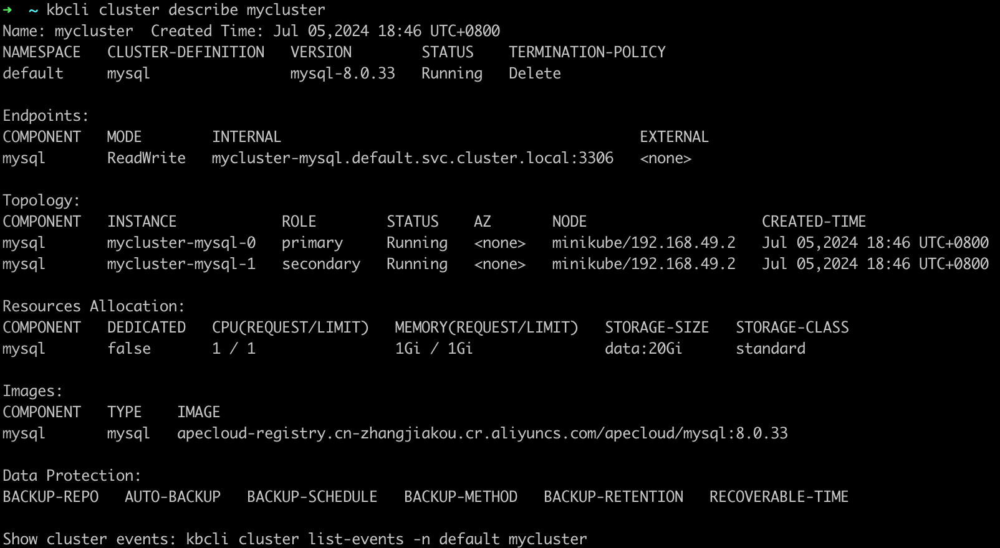
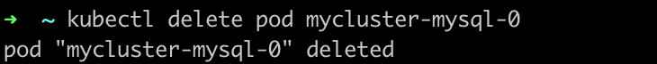
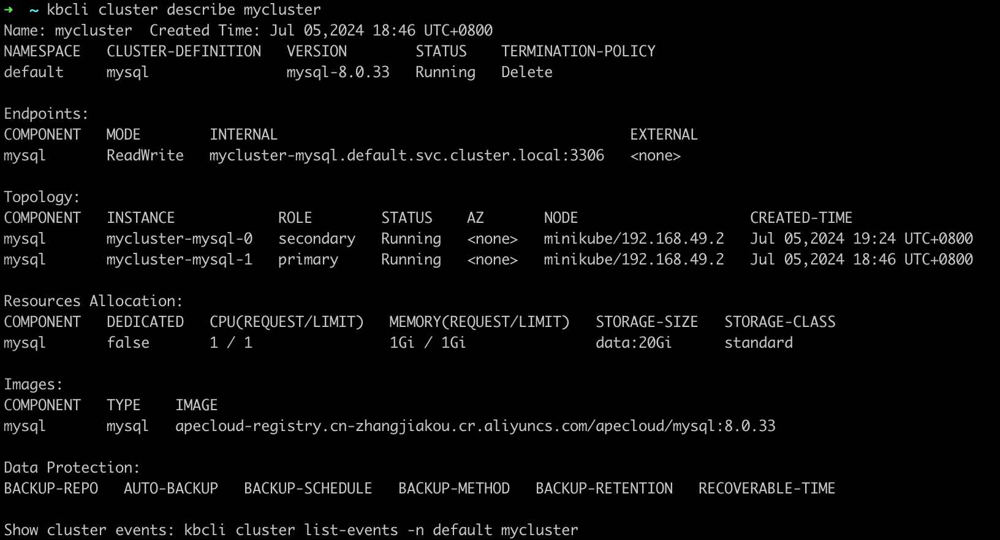
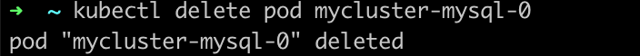
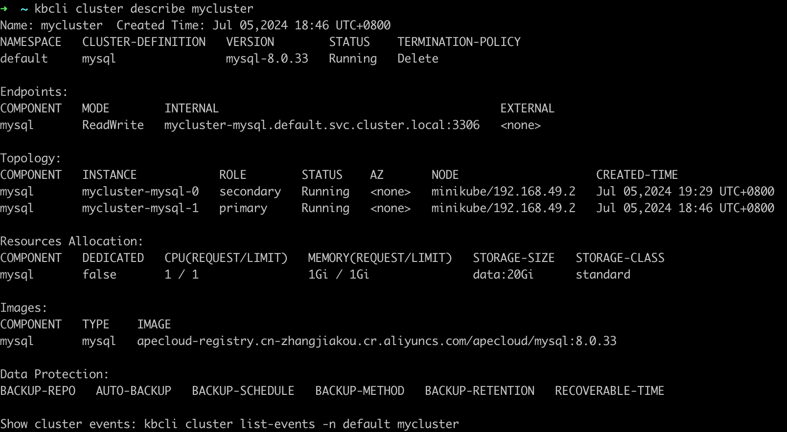
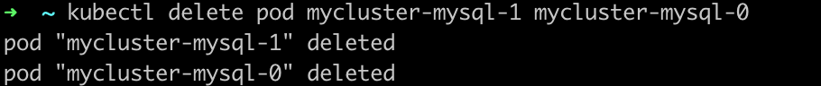
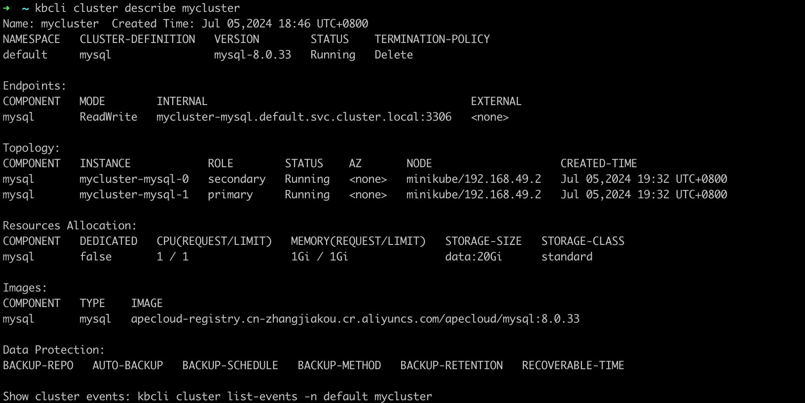

# Failure simulation and automatic recovery

As an open-source data management platform, Kubeblocks currently supports over thirty database engines and is continuously expanding. Due to the varying high availability capabilities of databases, KubeBlocks has designed and implemented a high availability (HA) system for database instances. The KubeBlocks HA system uses a unified HA framework to provide high availability for databases, allowing different databases on KubeBlocks to achieve similar high availability capabilities and experiences.

This tutorial uses MySQL Community edition as an example to demonstrate its fault simulation and recovery capabilities.

## Recovery simulation

:::note

The faults here are all simulated by deleting a pod. When there are sufficient resources, the fault can also be simulated by machine downtime or container deletion, and its automatic recovery is the same as described here.

:::

### Before you start

* [Install KubeBlocks](./../../installation/install-with-kbcli/install-kubeblocks-with-kbcli.md).
* Create a MySQL Replication Cluster, refer to [Create a MySQL cluster](./../cluster-management/create-and-connect-a-mysql-cluster.md).
* Run `kubectl get cd mysql -o yaml` to check whether _rolechangedprobe_ is enabled in the MySQL Replication (it is enabled by default). If the following configuration exists, it indicates that it is enabled:

  ```bash
  probes:
    roleProbe:
      failureThreshold: 2
      periodSeconds: 1
      timeoutSeconds: 1
  ```

### Primary pod fault

***Steps:***

1. View the MySQL Replication Cluster information. View the primary pod name in `Topology`. In this example, the primary pod's name is `mycluster-mysql-1`.

    ```bash
    kbcli cluster describe mycluster
    ```

    
2. Delete the primary pod `mycluster-mysql-0` to simulate a pod fault.

    ```bash
    kubectl delete pod mycluster-mysql-0
    ```

    
3. Run `kbcli cluster describe` to check the status of the pods and Replication Cluster connection.

    ***Results***

    The following example shows that the roles of pods have changed after the old primary pod was deleted and `mycluster-mysql-0` is elected as the new primary pod.

    ```bash
    kbcli cluster describe mycluster
    ```

    

    It shows that this MySQL Replication Cluster can be connected within seconds.

   ***How the automatic recovery works***

   After the primary pod is deleted, the MySQL Replication elects a new primary pod. In this example, `mycluster-mysql-1` is elected as the new primary pod. KubeBlocks detects that the primary pod has changed, and sends a notification to update the access link. The original exception node automatically rebuilds and recovers to the normal Replciation Cluster state. It normally takes 30 seconds from exception to recovery.

### Secondary pod exception

***Steps:***

1. View the MySQL Replication Cluster information and view the secondary pod name in `Topology`. In this example, the secondary pod is `mycluster-mysql-0`.

    ```bash
    kbcli cluster describe mycluster
    ```

    
2. Delete the secondary pod mycluster-mysql-0.

    ```bash
    kubectl delete pod mycluster-mysql-0
    ```

    
3. View the Replication Cluster status and you can find the secondary pod is being terminated in `Component.Instance`.

    ```bash
    kbcli cluster describe mycluster
    ```

    

   ***How the automatic recovery works***

   One secondary exception doesn't trigger re-electing of the primary or access link switch, so the R/W of the cluster is not affected. The secondary pod exception triggers recreation and recovery. The process takes no more than 30 seconds.

### Both pods exception

***Steps:***

1. Run the command below to view the MySQL Replication Cluster information and view the pods' names in `Topology`.

    ```bash
    kbcli cluster describe mycluster
    ```

    
2. Delete all pods.

    ```bash
    kubectl delete pod mycluster-mysql-1 mycluster-mysql-0
    ```

    
3. Run the command below to view the deleting process. You can find the pods are pending.

    ```bash
    kbcli cluster describe mycluster
    ```

    

   ***How the automatic recovery works***

   Every time the pod is deleted, recreation is triggered. And then MySQL automatically completes the cluster recovery and the election of a new primary. After the election of the primary is completed, KubeBlocks detects the new primary and updates the access link. This process takes less than 30 seconds.
