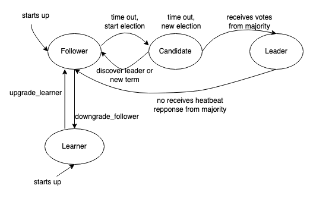

# ApeCloud MySQL introduction

ApeCloud MySQL is a high-availability MySQL database provided by ApeCloud. It is fully compatible with MySQL with high availability(HA) and disaster recovery(DR) to help ensure business continuity for your database workloads.

- When there are 3 or more replicas,  a strong consistent high-availability cluster is created with the consensus algorithm protocol to ensure that RPO=0 in the case of a single availability zone failure. Among them, the primary instance provides read/write capacity, and the remaining instances provide read-only services.
- When there are 2 replicas, a Primary-Secondary replication cluster is created, in which the primary instance provides read/write capacity, and the secondary instance keeps in sync with the primary instance with asynchronous replication, providing read-only and fault tolerance capabilities.
- When there is only 1 replica, a standalone cluster is created to provide read/write capacity. Automatic fault recovery capability is still provided, and RPO=0 remains ensured if the cloud disk is not damaged.

:::note

In this guide, we use KubeBlocks to manage ApeCloud MySQL.

:::

## Instance Roles

ApeCloud MySQL supports four roles, **Leader**, **Follower**, **Candidate**, and **Learner**. The Leader and a Follower form a high-availability cluster and ensure RPO=0.

- Leader: This role is the primary instance of the cluster, and supports R/W with forced consistency. It is voted by all the Candidates participating in the election. The Candidates with the majority of votes become the Leader, and the other Candidates become the Follower.
- Follower: Follower supports data consistency with read-only capacity, and forms a high-availability cluster with Leader and other Followers.
- Learner: This role is usually used for cross-regional consistent read-only data. Data synchronization is performed through the Paxos protocol, and the data source can be a Leader or a Follower. The learner is a special role in the consensus algorithm protocol, and does not participate in voting or being elected as a Candidate role.
- Candidate: The Candidate is an intermediate role that exists only during the election process or when a majority number is not enough to select the Leader role.  Normally, all Candidates in a high availability cluster will eventually become a Leader or a Follower after the election is completed.

 Role |  Leader |Follower | Learner | Candidate |
  ---- |----| ----|----|----|
  **Capcity**|RW/HA|RO/HA|RO|-|

### Failover

A failover is the redirection of traffic and switches the running tasks from a primary instance to a secondary instance.

### Read-only

Replicas provide read-only capabilities. In addition to the Follower that can provide read-only capabilities, you can also expand the read-only capabilities of the cluster by adding Learner roles. It should be noted that when performing read-only operations through Follower or Learner, there may be a data delay with the Leader. This delay may be caused by a log synchronization delay or a log playback delay.

### Fault tolerance

The cluster supports node fault tolerance. Suppose the number of replicas is n, then the number of faulty replicas that can be tolerated is `floor (n/2) + 1，n=[1,99]`, which meets the requirements of the Paxos algorithm protocol. Based on this, it can be obtained that under the specified tolerable number f of ApeCloud MySQL cluster nodes, the number of replicas that need to be created is n=2*f+1, f>=0. For example, if the tolerable number of faulty replicas is 1, then according to the formula, the minimum number of replicas in the cluster is 3, that is, in a Paxos group, the continuous service capability of the cluster with 1 faulty replica is guaranteed. According to the table below, it can be seen that it is more cost-effective to create an odd number of replicas.

 Replicas in Cluster | Node Majority | Nodes Tolerable |
  ---- |----| ----|
  3 | 2 | 1 |
  4 | 3 | 1 |
  5 | 3 | 2 |
  6 | 4 | 2 |
  7 | 4 | 3 |
  8 | 5 | 3 |
  9 | 5 | 4 |
  10 | 6 | 4 |
