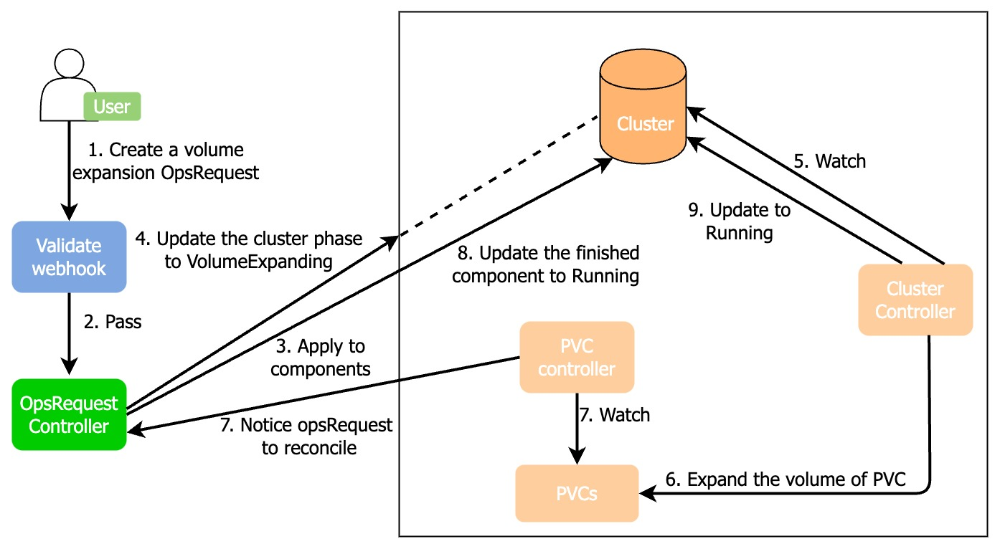

# Expand volume
You can expand the storage volume size of each pod.

:::note

Volume expansion triggers pod restart, all pods restart in the order of learner -> follower -> leader and the leader pod may change after the operation.

:::

## How KubeBlocks expands the volume



1. A user creates a volume expansion OpsRequest CR.
2. This CR passes the webhook validation.
3. The OpsRequest controller handles this OpsRequest and updates the storage size of the specified component and VolumeClaimTemplate to the configured amount.
4. The OpsRequest controller updates the cluster phase to `VolumeExpanding`.
5. The cluster controller watches the cluster CR.
6. The cluster controller changes the capacity of the corresponding PVC.
7. The PVC controller listens to the PVC changes and asks the OpsRequest controller to reconcile the phases of the cluster and OpsRequest.
8. If the PVC of a component is expanded successfully, the OpsRequest controller updates this component phase to `Running`. When all components are expanded successfully, the OpsRequest controller updates this OpsRequest to `Succeed`.
9. The cluster controller watches the component phase changes and when all components are Running, the cluster controller updates the cluster phase to `Running`.

## Before you start

Run the command below to check whether the cluster STATUS is `Running`. Otherwise, the following operations may fail.
```bash
kbcli cluster list <name>
```

***Example***

```bash
kbcli cluster list mysql-cluster
>
NAME                 NAMESPACE        CLUSTER-DEFINITION    VERSION                  TERMINATION-POLICY        STATUS         CREATED-TIME
mysql-cluster        default          postgresql            postgresql-14.7.0        Delete                    Running        Mar 3,2023 10:29 UTC+0800
```
   
## Option 1. Use kbcli

Configure the values of `--component-names`, `--volume-claim-template-names`, and `--storage`, and run the command below to expand the volume.
```bash
kbcli cluster volume-expand pg-cluster --component-names="postgresql" \
--volume-claim-template-names="data" --storage="2Gi"
```

- `--component-names` describes the component name for volume expansion.
- `--volume-claim-template-names` describes the VolumeClaimTemplate names in components.
- `--storage` describes the volume storage size.
   
## Option 2. Create an OpsRequest

Run the command below to expand the volume of a cluster.
```bash
kubectl apply -f - <<EOF
apiVersion: apps.kubeblocks.io/v1alpha1
kind: OpsRequest
metadata:
  name: ops-volume-expansion
spec:
  clusterRef: pg-cluster
  type: VolumeExpansion
  volumeExpansion:
  - componentName: postgresql
    volumeClaimTemplates:
  - name: data
    storage: "2Gi"
EOF
```

## Option 3. Change the YAML file of the cluster

Change the value of `spec.components.volumeClaimTemplates.spec.resources` in the cluster YAML file. `spec.components.volumeClaimTemplates.spec.resources` is the storage resource information of the pod and changing this value triggers the volume expansion of a cluster. 

```yaml
apiVersion: apps.kubeblocks.io/v1alpha1
kind: Cluster
metadata:
  name: pg-cluster
  namespace: default
spec:
  clusterDefinitionRef: postgresql
  clusterVersionRef: postgresql-14.7.0
  components:
  - name: postgresql
    type: postgresql
    replicas: 1
    volumeClaimTemplates:
    - name: data
      spec:
        accessModes:
          - ReadWriteOnce
        resources:
          requests:
            storage: 1Gi # Change the volume storage size.
terminationPolicy: Halt
```