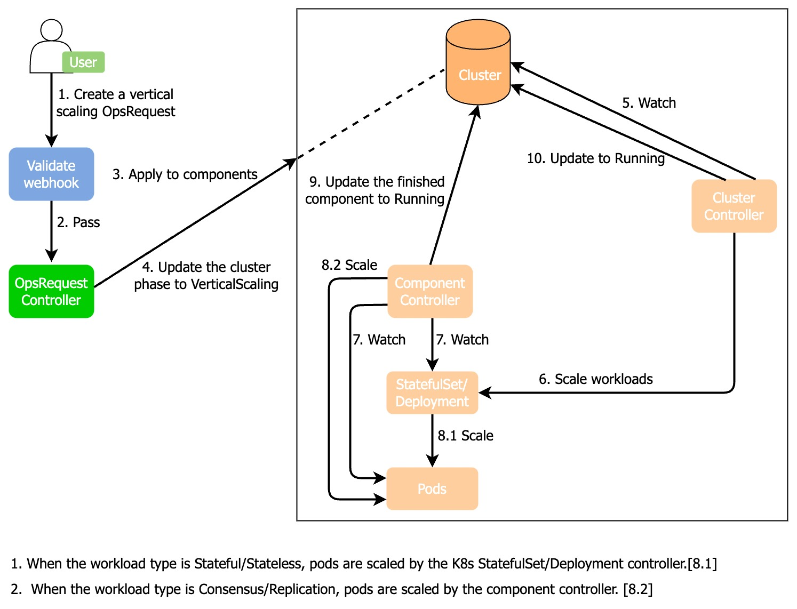
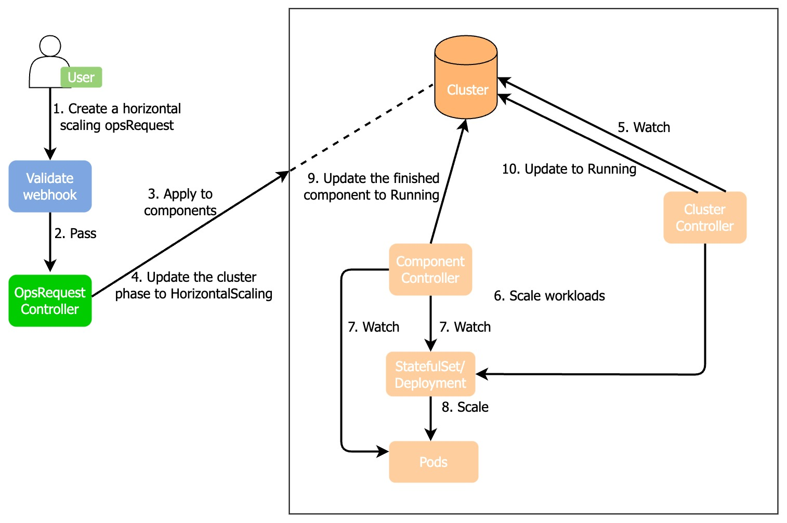

# Scale for ApeCloud MySQL
You can scale ApeCloud MySQL DB instances in two ways, horizontal scaling and vertical scaling. 

## Vertical scaling
You can vertically scale a cluster by changing resource requirements and limits (CPU and storage). For example, if you need to change the resource demand from 1C2G to 2C4G, vertical scaling is what you need.

:::note

During the vertical scaling process, all pods restart in the order of learner -> follower -> leader and the leader pod may change after the restarting.

:::

### How KubeBlocks vertically scales a cluster



1. A user creates a vertical scaling OpsRequest CR (custom resources).
2. This OpsRequest CR passes the webhook validation.
3. The OpsRequest controller applies the specified resource size of this OpsRequest to the corresponding components of the cluster.
4. The OpsRequest controller updates the cluster phase to VerticalScaling.
5. The cluster controller watches the cluster CR.
6. The cluster controller updates the parameter changes to the corresponding StatefulSet/Deployment controller.
7. The component controller watches the StatefulSet/Deployment controller and pods.
8. When the component type is Stateful or Stateless, the Kubernetes StatefulSet/Deployment controller applies a rolling update to pods. The component controller applies vertical scaling to pods when the component type is Consensus/Replication.
9. After the vertical scaling is completed, the component controller updates the cluster component phase to `Running`.
10. The cluster controller watches component changes and when all components are `Running`, the cluster controller changes the cluster phase to `Running`.
11. The OpsRequest controller reconciles the status when the cluster component status changes.

### Before you start

Run the command below to check whether the cluster STATUS is `Running`. Otherwise, the following operations may fail.
```bash
kbcli cluster list <name>
```

***Example***

```bash
kbcli cluster list mysql-cluster
>
NAME                 NAMESPACE        CLUSTER-DEFINITION        VERSION                TERMINATION-POLICY        STATUS         CREATED-TIME
mysql-cluster        default          apecloud-mysql            ac-mysql-8.0.30        Delete                    Running        Jan 29,2023 14:29 UTC+0800
```
### Steps

1. Change configuration. There are 3 ways to apply vertical scaling.
   
   **Option 1.** (**Recommended**) Use kbcli
   
   Configure the parameters `component-names`, `requests`, and `limits` and run the command.
   
   ***Example***
   
   ```bash
   kbcli cluster vscale mysql-cluster \
   --component-names="mysql" \
   --requests.memory="2Gi" --requests.cpu="1" \
   --limits.memory="4Gi" --limits.cpu="2"
   ```
   - `component-names` describes the component name ready for vertical scaling.
   - `requests` describes the minimum amount of computing resources required. If `requests` is omitted for a container, it uses the `limits` value if `limits` is explicitly specified, otherwise uses an implementation-defined value. For more details, see [Resource Management for Pods and Containers](https://kubernetes.io/docs/concepts/configuration/manage-resources-containers/).
   - `--limits` describes the maximum amount of computing resources allowed. For more details, see [Resource Management for Pods and Containers](https://kubernetes.io/docs/concepts/configuration/manage-resources-containers/)
  
   **Option 2.** Create an OpsRequest
  
   Run the command below to apply an OpsRequest to the specified cluster. Configure the parameters according to your needs.
   ```bash
   kubectl apply -f - <<EOF
   apiVersion: apps.kubeblocks.io/v1alpha1
   kind: OpsRequest
   metadata:
     name: ops-vertical-scaling
   spec:
     clusterRef: mysql-cluster
     type: VerticalScaling 
     verticalScaling:
     - componentName: mysql
       requests:
         memory: "2Gi"
         cpu: "1000m"
       limits:
         memory: "4Gi"
         cpu: "2000m"
   EOF
   ```
  
   **Option 3.** Change the YAML file of the cluster

   Change the configuration of `spec.components.resources` in the YAML file. `spec.components.resources` controls the requirement and limit of resources and changing them triggers a vertical scaling. 

   ***Example***

   ```YAML
   apiVersion: apps.kubeblocks.io/v1alpha1
   kind: Cluster
   metadata:
     name: mysql-cluster
     namespace: default
   spec:
     clusterDefinitionRef: apecloud-mysql
     clusterVersionRef: ac-mysql-8.0.30
     components:
     - name: mysql
       type: mysql
       replicas: 1
       resources: # Change the values of resources.
         requests:
           memory: "2Gi"
           cpu: "1000m"
         limits:
           memory: "4Gi"
           cpu: "2000m"
       volumeClaimTemplates:
       - name: data
         spec:
           accessModes:
             - ReadWriteOnce
           resources:
             requests:
               storage: 1Gi
     terminationPolicy: Halt
   ```
  
2. Validate the vertical scaling.
    Run the command below to check the cluster status to identify the vertical scaling status.
    ```bash
    kbcli cluster list <name>
    ```

    ***Example***

    ```bash
    kbcli cluster list mysql-cluster
    >
    NAME                 NAMESPACE        CLUSTER-DEFINITION        VERSION                TERMINATION-POLICY        STATUS          CREATED-TIME
    mysql-cluster        default          apecloud-mysql            ac-mysql-8.0.30        Delete                    Updating        Jan 29,2023 14:29 UTC+0800
    ```
   - STATUS=Running: it means the vertical scaling operation is applied.
   - STATUS=Updating: it means the vertical scaling is in progress.
   - STATUS=Abnormal: it means the vertical scaling is abnormal. The reason may be the normal instances number is less than the total instance number or the leader instance is running properly while others are abnormal. 
     > To solve the problem, you can check manually to see whether resources are sufficient. If AutoScaling is supported, the system recovers when there are enough resources, otherwise, you can create enough resources and check the result with kubectl describe command.

## Horizontal scaling
Horizontal scaling changes the amount of pods. For example, you can apply horizontal scaling to scale up from three pods to five pods. The scaling process includes the backup and restoration of data.

### How KubeBlocks horizontally scales a cluster



1. A user creates a horizontal scaling OpsRequest CR.
2. This CR passes the webhook validation.
3. The OpsRequest controller applies the replicas specified by the OpsRequest to the corresponding cluster component.
4. The OpsRequest controller updates the cluster phase to `HorizontalScaling`.
5. The cluster controller watches the cluster CR.
6. The cluster controller updates the parameter changes to the corresponding StatefulSet/Deployment controller.
7. The component controller watches the StatefulSet/Deployment controller and pods.
8. The Kubernetes StatefulSet/Deployment controller applies the scaling operations to replicas in pods.
9. After the scaling operation is completed, the component controller updates the cluster component phase to `Running`.
10. The cluster controller watches component changes and when all components are `Running`, the cluster controller changes the cluster phase to `Running`.
11. The OpsRequest controller reconciles the status when the cluster component status changes.

### Before you start

* Refer to [Backup and restore for MySQL](./../backup-and-restore/backup-and-restore-for-mysql-standalone.md) to make sure the EKS environment is configured properly since the horizontal scaling relies on the backup function.
* Run the command below to check whether the cluster STATUS is `Running`. Otherwise, the following operations may fail.

  ```bash
  kbcli cluster list <name>
  ```

  ***Example***

  ```bash
  kbcli cluster list mysql-cluster
  >
  NAME                 NAMESPACE        CLUSTER-DEFINITION        VERSION                TERMINATION-POLICY        STATUS         CREATED-TIME
  mysql-cluster        default          apecloud-mysql            ac-mysql-8.0.30        Delete                    Running        Jan 29,2023 14:29 UTC+0800
  ```

### Steps

1. Change configuration. There are 3 ways to apply horizontal scaling.
   
   **Option 1.** (**Recommended**) Use kbcli
   
   Configure the parameters `component-names` and `replicas`, and run the command.

   ***Example***

   ```bash
   kbcli cluster hscale mysql-cluster \
   --component-names="mysql" --replicas=3
   ```
   - `--component-names` describes the component name ready for vertical scaling.
   - `--replicas` describe the replicas with the specified components.

   **Option 2.** Create an OpsRequest

   Run the command below to apply an OpsRequest to the specified cluster. Configure the parameters according to your needs.

   ```bash
   kubectl apply -f - <<EOF
   apiVersion: apps.kubeblocks.io/v1alpha1
   kind: OpsRequest
   metadata:
     name: ops-horizontal-scaling
   spec:
     clusterRef: mysql-cluster
     type: HorizontalScaling
     horizontalScaling:
     - componentName: mysql
       replicas: 3
   EOF
   ```

   **Option 3.** Change the YAML file of the cluster

   Change the configuration of `spec.components.replicas` in the YAML file. `spec.components.replicas` stand for the pod amount and changing this value triggers a horizontal scaling of a cluster. 

   ***Example***

   ```YAML
   apiVersion: apps.kubeblocks.io/v1alpha1
   kind: Cluster
   metadata:
    apiVersion: apps.kubeblocks.io/v1alpha1
   kind: Cluster
   metadata:
     name: mysql-cluster
     namespace: default
   spec:
     clusterDefinitionRef: apecloud-mysql
     clusterVersionRef: ac-mysql-8.0.30
     components:
     - name: mysql
       type: mysql
       replicas: 1 # Change the pod amount.
       volumeClaimTemplates:
       - name: data
         spec:
           accessModes:
             - ReadWriteOnce
           resources:
             requests:
               storage: 1Gi
    terminationPolicy: Halt
   ```
2. Validate the horizontal scaling operation.
   Run the command below to check the cluster STATUS to identify the horizontal scaling status.
   ```bash
   kbcli cluster list mysql-cluster
   ```

   * STATUS=Updating: it means horizontal scaling is being applied.
   * STATUS=Running: it means horizontal scaling is applied.

### Handle the snapshot exception

If `STATUS=ConditionsError` occurs during the horizontal scaling process, you can find the cause from `cluster.status.condition.message` for troubleshooting.
In the example below, a snapshot exception occurs.
```
Status:
  conditions: 
  - lastTransitionTime: "2023-02-08T04:20:26Z"
    message: VolumeSnapshot/mysql-cluster-mysql-scaling-dbqgp: Failed to set default snapshot
      class with error cannot find default snapshot class
    reason: ApplyResourcesFailed
    status: "False"
    type: ApplyResources
```

***Reason***

This exception occurs because the `VolumeSnapshotClass` is not configured. This exception can be fixed after configuring `VolumeSnapshotClass`, but the horizontal scaling cannot continue to run. It is because the wrong backup (volumesnapshot is generated by backup) and volumesnapshot generated before still exist. Delete these two wrong resources and then KubeBlocks re-generates new resources.

***Steps:*** 

1. Configure the VolumeSnapshotClass by running the command below.
   ```bash
   kubectl create -f - <<EOF
   apiVersion: snapshot.storage.k8s.io/v1
   kind: VolumeSnapshotClass
   metadata:
     name: csi-aws-vsc
     annotations:
       snapshot.storage.kubernetes.io/is-default-class: "true"
   driver: ebs.csi.aws.com
   deletionPolicy: Delete
   EOF
   ```

2. Delete the wrong backup (volumesnapshot is generated by backup) and volumesnapshot resources.
   ```bash
   kubectl delete backup -l app.kubernetes.io/instance=mysql-cluster
   
   kubectl delete volumesnapshot -l app.kubernetes.io/instance=mysql-cluster
   ```

***Result***

The horizontal scaling continues after backup and volumesnapshot are deleted and the cluster restores to running status.