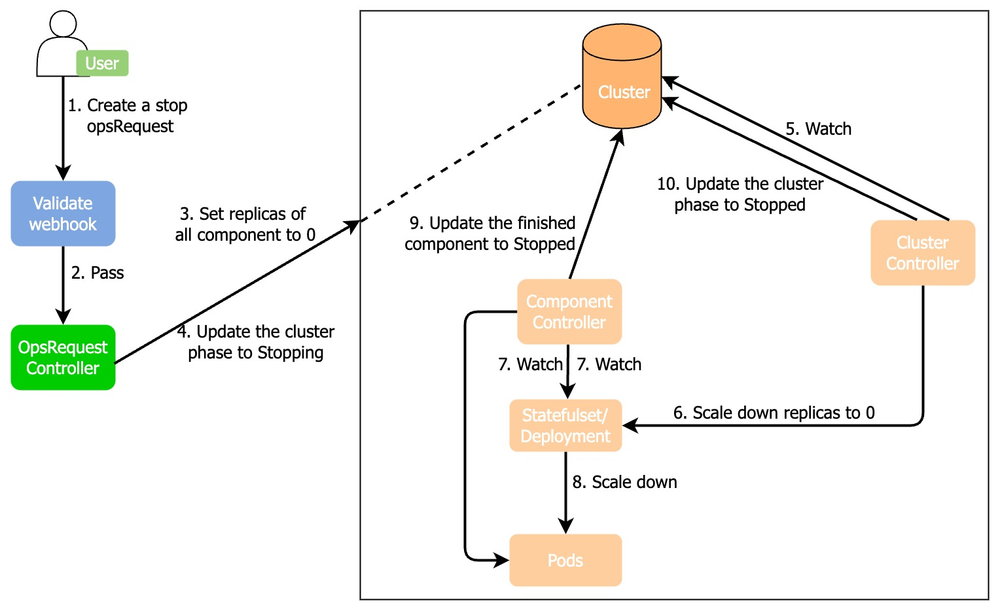
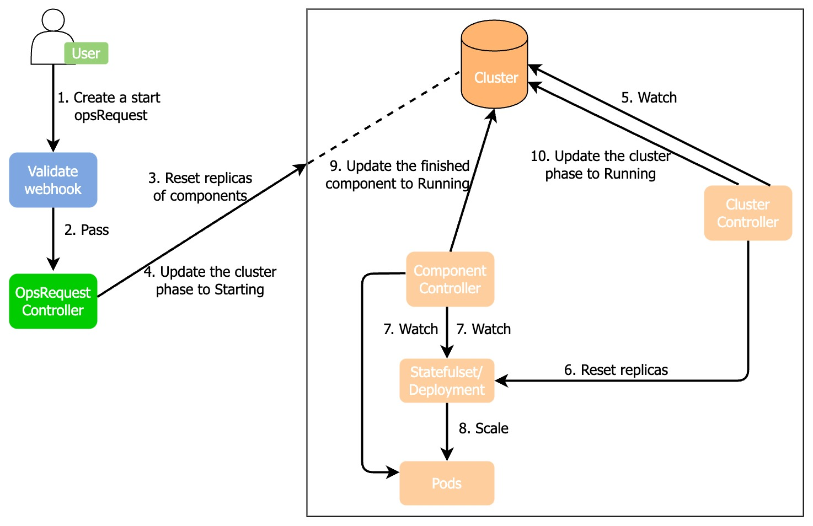

# Start/Stop MySQL Cluster

You can stop/start a cluster to save computing resources. When a cluster is stopped, the computing resources of this cluster are released, which means the pods of Kubernetes are released, but the storage resources are reserved. Start this cluster again if you want to restore the cluster resources from the original storage by snapshots.

## How KubeBlocks starts/stops a cluster

* How KubeBlocks stops a cluster
  


  1. A user creates a stop OpsRequest CR.
  2. The stop OpsRequest CR passes the webhook validation. 
  3. The OpsRequest controller saves the snapshot of the current component replicas in `cluster.annotations` and sets the replicas of all components as 0.
  4. The OpsRequest controller updates the cluster phase to `Stopping`.
  5. The cluster controller watches the cluster CR.
  6. The cluster controller scales the replicas down to 0.
  7. The component controller watches the StatefulSet/Deployment and pods.
  8. The Kubernetes StatefulSet/Deployment controller scales the pods down to 0.
  9. After the pods are deleted, the component controller updates the cluster component phase to `Stopped`.
  10. The cluster controller watches the component phase change and if all components are `Stopped`, the cluster controller updates the cluster phase to `Stopped`.
  11. The OpsRequest controller reconciles the status when the cluster component status changes.

* How KubeBlocks sarts a cluster
  


  1. A user creates a stop OpsRequest CR.
  2. The start OpsRequest CR passes the webhook validation.
  3. The OpsRequest controller restores all component replicas to the ones before they are stopped based on the snapshot of component replicas in `cluster.annotations`.
  4. The OpsRequest controller updates the cluster phase to `Starting`.
  5. The cluster controller watches the cluster CR.
  6. The cluster controller changes the replicas of the StatefulSet/Deployment to the corresponding ones.
  7. The component controller watches the StatefulSet/Deployment and Pods.
  8. The Kubernetes StatefulSet/Deployment controller creates pods.
  9. After pods are created, the component controller updates the cluster component phase to `Running`.
  10. The cluster controller watches the component phase change and if all components are `Running`, the cluster controller updates the cluster phase to `Running`.
  11. The OpsRequest controller reconciles the status when the cluster component status changes.

## Steps

* Stop a cluster
  
  **Option 1.** (Recommended) Use `kbcli`

  Configure the name of your cluster and run the command below to stop this cluster. 

  ```bash
  kbcli cluster stop <name>
  ```
  ***Example***
  ```bash
  kbcli cluster stop mysql-cluster
  ```

  **Option 2.** Create an OpsRequest

  Run the command below to stop a cluster.
  ```bash
  kubectl apply -f - <<EOF
  apiVersion: apps.infracreate.com/v1alpha1
  kind: OpsRequest
  metadata:
    generate-name: stop-
  spec:
    # cluster ref
    clusterRef: mysql-cluster
    type: Stop
  EOF
  ```

  **Option 3.** Change the YAML file of the cluster

  Configure replicas as 0 to delete pods.
  ```yaml
  apiVersion: apps.kubeblocks.io/v1alpha1
  kind: Cluster
  metadata:
     name: mysql-cluster
  spec:
     clusterDefinitionRef: apecloud-mysql
     clusterVersionRef: ac-mysql-8.0.30
     terminationPolicy: WipeOut
     components:
     - name: mysql
       type: mysql
       monitor: false  
       replicas: 0
       volumeClaimTemplates:
     - name: data
       spec:
         storageClassName: standard
         accessModes:
           - ReadWriteOnce
         resources:
           requests:
             storage: 1Gi
  ```

* Start a cluster
  
  **Option 1.** (Recommended) Use `kbcli`

  Configure the name of your cluster and run the command below to stop this cluster. 

  ```bash
  kbcli cluster start <name>
  ```

  ***Example***

  ```bash
  kbcli cluster start mysql-cluster
  ```

  **Option 2.** Create an OpsRequest

  Run the command below to start a cluster.

  ```bash
  kubectl apply -f - <<EOF
  apiVersion: apps.infracreate.com/v1alpha1
  kind: OpsRequest
  metadata:
    generate-name: start-
  spec:
    # cluster ref
    clusterRef: mysql-cluster
    type: Start
  EOF 
  ```

  **Option 3.** Change the YAML file of the cluster

  Change replicas back to the original amount to start this cluster again.

  ```yaml
  apiVersion: apps.kubeblocks.io/v1alpha1
  kind: Cluster
  metadata:
    name: mysql-cluster
  spec:
     clusterDefinitionRef: apecloud-mysql
     clusterVersionRef: ac-mysql-8.0.30
     terminationPolicy: WipeOut
     components:
     - name: mysql
       type: mysql
       monitor: false  
       replicas: 3
       volumeClaimTemplates:
       - name: data
         spec:
         storageClassName: standard
         accessModes:
           - ReadWriteOnce
         resources:
           requests:
             storage: 1Gi
  ```
