# Failure simulation and automatic recovery

As an open-source data management platform, KubeBlocks supports two database forms, ReplicationSet and ConsensusSet. ReplicationSet can be used for single source with multiple replicas, and non-automatic switching database management, such as MySQL and Redis. ConsensusSet can be used for database management with multiple replicas and automatic switching capabilities, such as ApeCloud MySQL Raft Group with multiple replicas, MongoDB, etc. The ConsensusSet database management capability has been released in KubeBlocks v0.3.0, and ReplicationSet is under development. 

This guide takes ApeCloud MySQL as an example to introduce the high availability capability of the database in the form of ConsensusSet. This capability is also applicable to other database engines.

## Recovery simulation

:::note

The faults here are all simulated by deleting a pod. When there are sufficient resources, the fault can also be simulated by machine downtime or container deletion, and its automatic recovery is the same as described here.

:::

### Before you start

* [Install KubeBlocks](./../../installation/install-kubeblocks.md).
* Create an ApeCloud MySQL Raft Group, refer to [Create a MySQL cluster](./../cluster-management/create-and-connect-a-mysql-cluster.md).
* Run `kubectl get cd apecloud-mysql -o yaml` to check whether _rolechangedprobe_ is enabled in the ApeCloud MySQL Raft Group (it is enabled by default). If the following configuration exists, it indicates that it is enabled:

  ```bash
  probes:
  roleProbe:
    failureThreshold: 3
    periodSeconds: 2
    timeoutSeconds: 1
  ```

### Leader pod fault

***Steps:***

1. View the ApeCloud MySQL Raft Group information. View the leader pod name in `Topology`. In this example, the leader pod's name is mysql-cluster-1.

    ```bash
    kbcli cluster describe mysql-cluster
    ```

    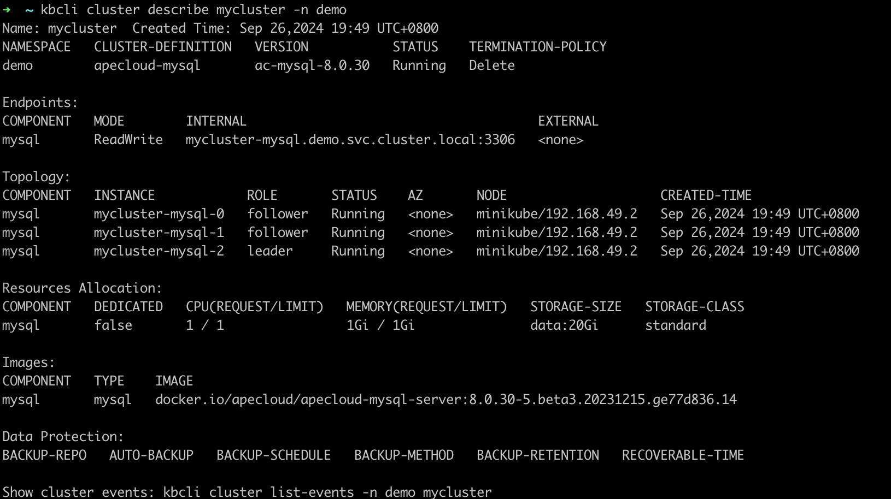
2. Delete the leader pod `mysql-cluster-mysql-1` to simulate a pod fault.

    ```bash
    kubectl delete pod mysql-cluster-mysql-1
    ```

    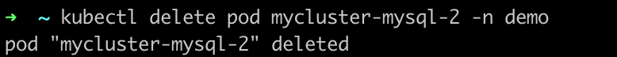
3. Run `kbcli cluster describe` and `kbcli cluster connect` to check the status of the pods and Raft Group connection.

    ***Results***

    The following example shows that the roles of pods have changed after the old leader pod was deleted and `mysql-cluster-mysql-2` is elected as the new leader pod.

    ```bash
    kbcli cluster describe mysql-cluster
    ```

    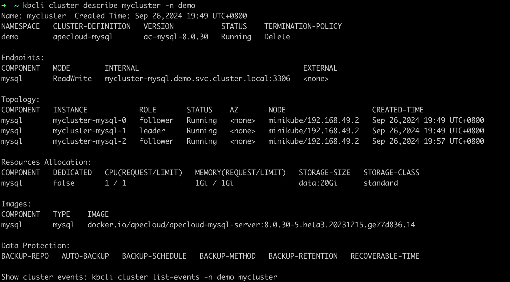
    It shows that this ApeCloud MySQL Raft Group can be connected within seconds.

    ```bash
    kbcli cluster connect mysql-cluster
    ```

    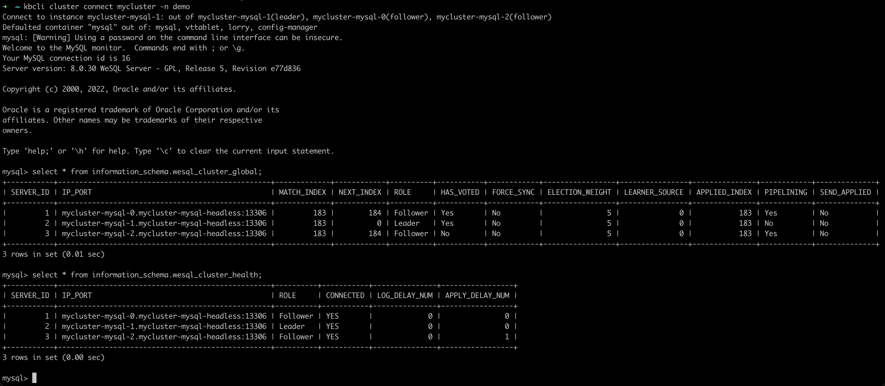

   ***How the automatic recovery works***

   After the leader pod is deleted, the ApeCloud MySQL Raft Group elects a new leader. In this example, `mysql-cluster-mysql-2` is elected as the new leader. KubeBlocks detects that the leader has changed, and sends a notification to update the access link. The original exception node automatically rebuilds and recovers to the normal Raft Group state. It normally takes 30 seconds from exception to recovery.

### Single follower pod exception

***Steps:***

1. View the ApeCloud MySQL Raft Group information and view the follower pod name in `Topology`. In this example, the follower pods are mysql-cluster-mysql-0 and mysql-cluster-mysql-2.

    ```bash
    kbcli cluster describe mysql-cluster
    ```

    
2. Delete the follower pod mysql-cluster-mysql-0.

    ```bash
    kubectl delete pod mysql-cluster-mysql-0
    ```

    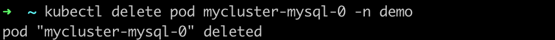
3. View the Raft Group status and you can find the follower pod is being terminated in `Component.Instance`.

    ```bash
    kbcli cluster describe mysql-cluster
    ```

    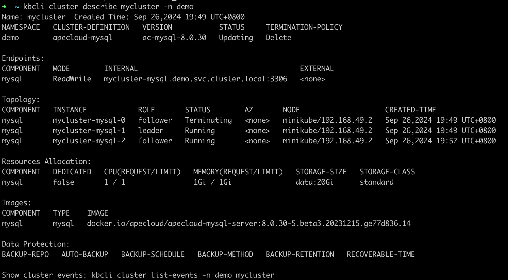
4. Connect to the Raft Group and you can find this single follower exception doesn't affect the R/W of the cluster.

    ```bash
    kbcli cluster connect mysql-cluster
    ```

    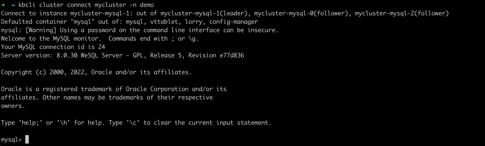

   ***How the automatic recovery works***

   One follower exception doesn't trigger re-electing of the leader or access link switch, so the R/W of the cluster is not affected. Follower exception triggers recreation and recovery. The process takes no more than 30 seconds.

### Two pods exception

The availability of the cluster generally requires the majority of pods to be in a normal state. When most pods are exceptional, the original leader will be automatically downgraded to a follower. Therefore, any two exceptional pods result in only one follower pod remaining.

In this way, whether exceptions occur to one leader and one follower or two followers, failure performance and automatic recovery are the same.

***Steps:***

1. View the ApeCloud MySQL Raft Group information and view the follower pod name in `Topology`. In this example, the follower pods are mysql-cluster-mysql-1 and mysql-cluster-mysql-0.

    ```bash
    kbcli cluster describe mysql-cluster
    ```

    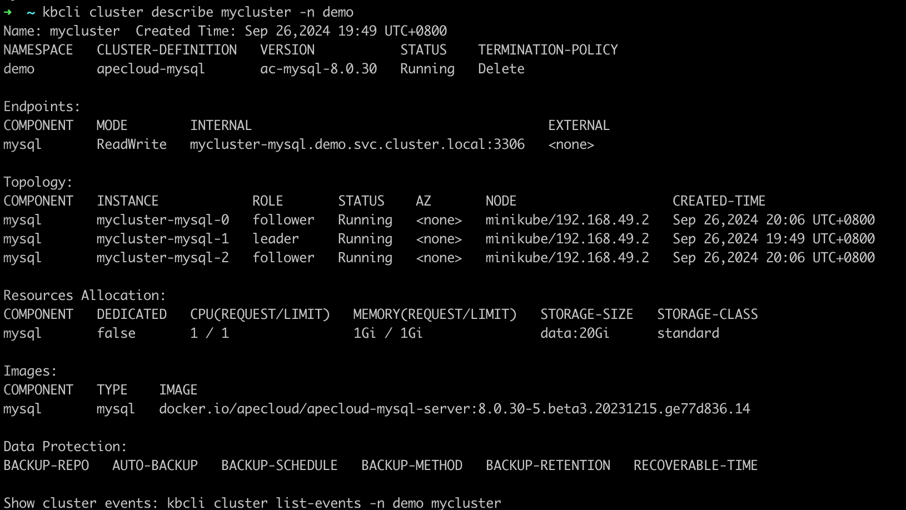
2. Delete these two follower pods.

    ```bash
    kubectl delete pod mysql-cluster-mysql-1 mysql-cluster-mysql-0
    ```

    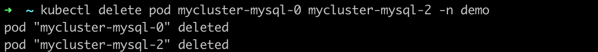
3. View the Raft Group status and you can find the follower pods are pending and a new leader pod is selected.

    ```bash
    kbcli cluster describe mysql-cluster
    ```

    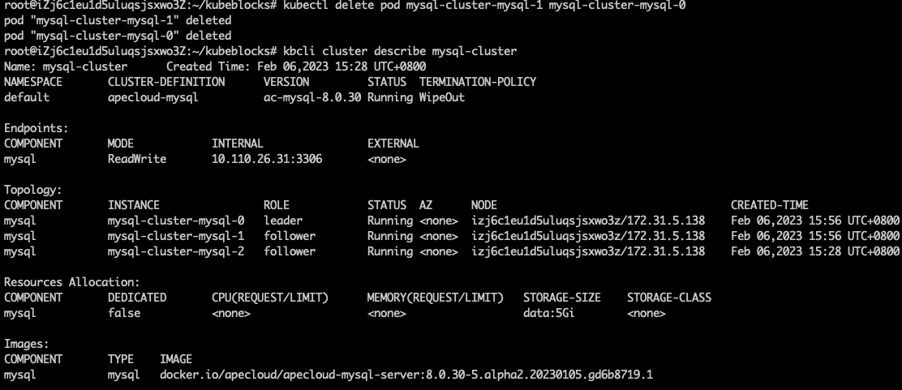
4. Run `kbcli cluster connect mysql-cluster` again after a few seconds and you can find the pods in the Raft Group work normally again in `Component.Instance`.

    ```bash
    kbcli cluster connect mysql-cluster
    ```

    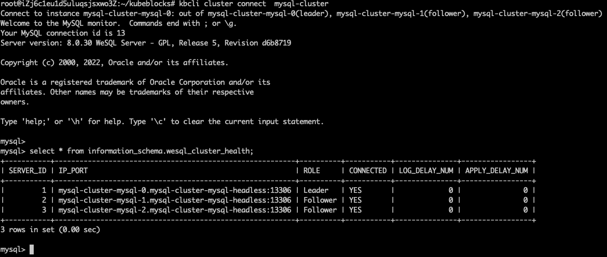

   ***How the automatic recovery works***

   When two pods of the ApeCloud MySQL Raft Group are exceptional, pods are unavailable and cluster R/W is unavailable. After the recreation of pods, a new leader is elected to recover to R/W status. The process takes less than 30 seconds.

### All pods exception

***Steps:***

1. Run the command below to view the ApeCloud MySQL Raft Group information and view the pods' names in `Topology`.

    ```bash
    kbcli cluster describe mysql-cluster
    ```

    
2. Delete all pods.

    ```bash
    kubectl delete pod mysql-cluster-mysql-1 mysql-cluster-mysql-0 mysql-cluster-mysql-2
    ```

    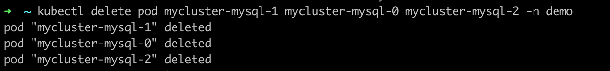
3. Run the command below to view the deleting process. You can find the pods are pending.

    ```bash
    kbcli cluster describe mysql-cluster
    ```

    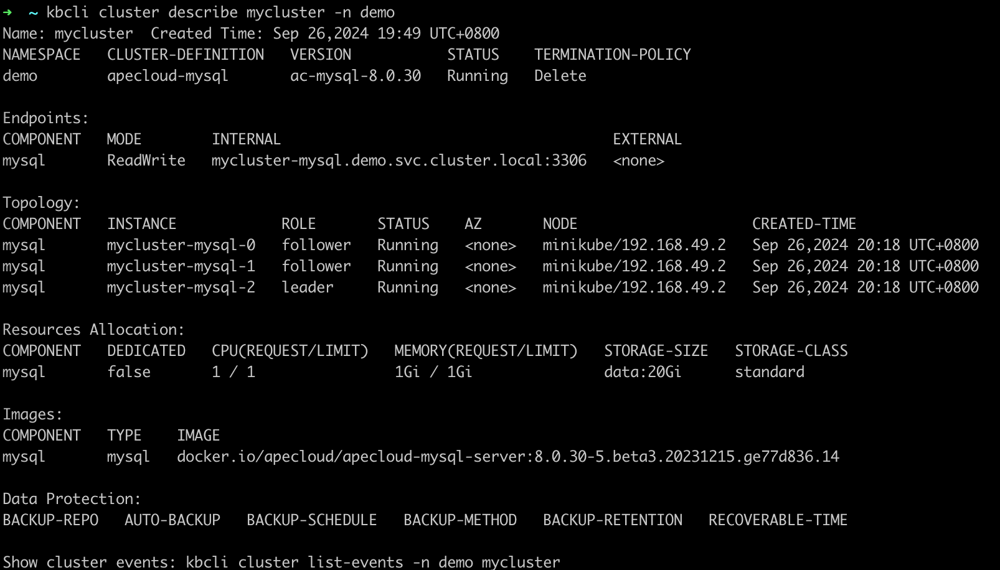
4. Run `kbcli cluster connect mysql-cluster` again after a few seconds and you can find the pods in the Raft Group work normally again.

    ```bash
    kbcli cluster connect mysql-cluster
    ```

    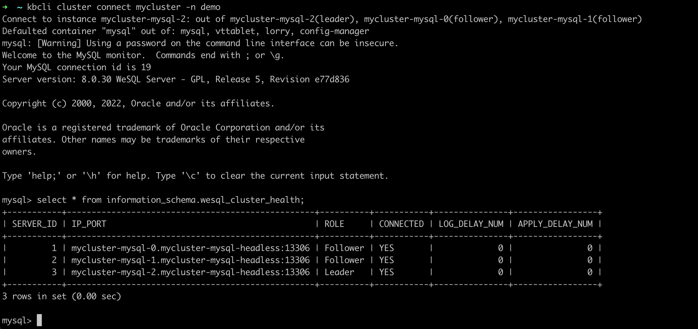

   ***How the automatic recovery works***

   Every time the pod is deleted, recreation is triggered. And then ApeCloud MySQL automatically completes the cluster recovery and the election of a new leader. After the election of the leader is completed, KubeBlocks detects the new leader and updates the access link. This process takes less than 30 seconds.
