# Migration

> ***Notes:***
> 
> * Using the public network and network load balancer causes extra fees.
> * The following tutorial is based on the prerequisite that ApeCloud MySQL is deployed on AWS EKS. Using other Kubernetes clusters to deploy ApeCloud MySQL is not included.

## Step 1. Network configuration

### Expose the target ApeCloud MySQL network

The Kubernetes ClusterIP of ApeCloud MySQL is exposed by default in the EKS environment. But the migration task of DMS  (Database Migration Service) runs in an independent Replication Instance, in which the Replication Instance can be set with the same VPC used by the Kubernetes clusters, but visiting ClusterIP still fails. This solution aims to connect this part of the network.

#### KubeBlocks native solution
1. Make sure the load balancer is enabled when installing KubeBlocks. 
   ```bash
   kbcli kubeblocks install --set loadbalancer.enabled=true
   ```
2. Install ApeCloud MySQL. Refer to [Create an ApeCloud MySQL cluster on AWS](../../quick-start/create-an-apecloud-mysql-cluster-on-aws.md) for details.
3. Fill in the cluster name and run the command below to expose the external IP of the cluster.
   ```bash
   KBCLI_EXPERIMENTAL_EXPOSE="1" kb cluster expose ${mysql clustrName} --on=true
   ```
    
   Run the command below to view the external IP:Port address which can be accessed by the same VPC machine but outside the EKS cluster.
   ```bash
   kbcli cluster describe ${clustrName} | grep -A 3 Endpoints
   ```

   ***Example***

   ```bash
   KBCLI_EXPERIMENTAL_EXPOSE="1" kb cluster expose mysql-cluster --on=true

   kbcli cluster describe mysql-cluster | grep -A 3 Endpoints
   >
   Endpoints:
   COMPONENT       MODE            INTERNAL                EXTERNAL
   mysql           ReadWrite       10.100.51.xxx:3306      172.31.35.xxx:3306 
   ```
4. Configure the external IP:Port as the target endpoint on AWS DMS.
   This operation generates an ENI (Elastic Network Interface) on EC2. If the quota of the low-spec machine is small, pay more attention to the available level of ENI.
   For the corresponding ENI specifications, refer to [Elastic network interfaces - Amazon Elastic Compute Cloud](https://docs.aws.amazon.com/AWSEC2/latest/UserGuide/using-eni.html).

#### Use Network Load Balancer (NLB) to expose the service
1. Install Load Balancer Controller on EKS.
   For installation details, refer to [Installing the AWS Load Balancer Controller add-on](https://docs.aws.amazon.com/eks/latest/userguide/aws-load-balancer-controller.html).
   For how to create NLB in a cluster, refer to [Network load balancing on Amazon EKS](https://docs.aws.amazon.com/eks/latest/userguide/network-load-balancing.html).
2. Create and use the NLB service to expose the ApeCloud MySQL service. 
   Configure `metadata.name`, `metadata.annotations`, `metadata.labels`, and `spec.selector` according to your actual environment.

   ```bash
   cat <<EOF | kubectl apply -f -
   kind: Service
   apiVersion: v1
   metadata:
       name: mysql-service
       annotations:
           service.beta.kubernetes.io/aws-load-balancer-type: nlb-ip
           alb.ingress.kubernetes.io/scheme: internet-facing
           service.beta.kubernetes.io/aws-load-balancer-subnets: ${subnet name1},${subnet name2}
       labels:
         app.kubernetes.io/component-name: mysql
         app.kubernetes.io/instance: ${mysql clustername}
         app.kubernetes.io/managed-by: kubeblocks
         app.kubernetes.io/name: state.mysql-apecloud-mysql     
   spec:
       externalTrafficPolicy: Cluster 
       type: LoadBalancer
       selector:
         app.kubernetes.io/component-name: mysql
         app.kubernetes.io/instance: ${mysql clustername}
         app.kubernetes.io/managed-by: kubeblocks
         cs.dbaas.kubeblocks.io/role: leader
       ports:
           - name: http
             protocol: TCP
             port: 3306
             targetPort: mysql 
   EOF
   ```   
3. Run the command below to make sure the service and NLB run normally.
   ```bash
   kubectl get svc 
   >
   NAME                  TYPE           CLUSTER-IP       EXTERNAL-IP                                        PORT(S)  
   mysql-service         LoadBalancer   10.100.xx.xx     k8s-xx-xx-xx.elb.cn-northwest-1.amazonaws.com.cn   3306:xx/TCP
   ```

   Make sure the server runs normally and can generate EXTERNAL-IP. Meanwhile, verify whether the NLB state is `Active` by the AWS console, then you can access the cluster by EXTERNAL-IP:Port.
   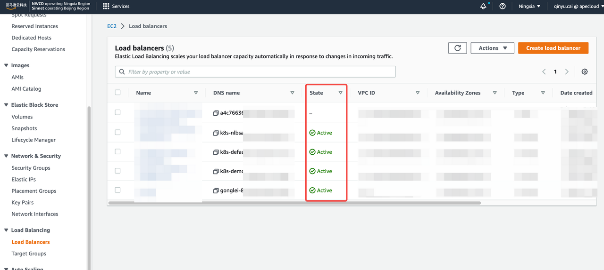

### Expose the source network

There exist four different conditions for the source network. Choose one method to expose the source network according to your actual environment.

- Alibaba Cloud ApsaraDB RDS
  Use the public network. Refer to [Apply for or release a public endpoint for an ApsaraDB RDS for MySQL instance](https://www.alibabacloud.com/help/en/apsaradb-for-rds/latest/apply-for-or-release-a-public-endpoint-for-an-apsaradb-rds-for-mysql-instance) to release a public endpoint then create an endpoint in AWS DMS.

- RDS within the same VPC in AWS
  You only need to specify an RDS when creating an endpoint in DMS and no extra operation is required. 
  For creating an endpoint, refer to step 2 in [Configure AWS DMS tasks](#step-2-configure-aws-dms-tasks).

- RDS within different VPCs in AWS
  Use the public network to create an endpoint. Refer to [this document](https://aws.amazon.com/premiumsupport/knowledge-center/aurora-mysql-connect-outside-vpc/?nc1=h_ls) to make public network access available, then create an endpoint in AWS DMS. For creating an endpoint, refer to step 2 in [Configure AWS DMS tasks](#step-2-configure-aws-dms-tasks).

- MySQL in AWS EKS
  Use NLB to expose the service.

  1. Install Load Balancer Controller
     For installation details, refer to [Installing the AWS Load Balancer Controller add-on](https://docs.aws.amazon.com/eks/latest/userguide/aws-load-balancer-controller.html).
     For how to create NLB in a cluster, refer to [Network load balancing on Amazon EKS](https://docs.aws.amazon.com/eks/latest/userguide/network-load-balancing.html).
  2. Create the service using NLB
     Make sure the value of `some.label.key` in `metadata.labels` is consistent with the value of ApeCloud MySQL you created. 
     Configure `port` and `targetPort` in `spec.ports` according to your current environment.

     ```bash
     cat <<EOF | kubectl apply -f -
     kind: Service
     apiVersion: v1
     metadata:
         name: mysql-local-service
         annotations:
             service.beta.kubernetes.io/aws-load-balancer-type: nlb-ip
             alb.ingress.kubernetes.io/scheme: internet-facing
             service.beta.kubernetes.io/aws-load-balancer-subnets: ${subnet name1},${subnet name2}
         labels:
         some.label.key: some-label-value    
     spec:
         externalTrafficPolicy: Cluster 
         type: LoadBalancer
         selector:
         some.label.key: some-label-value  
         ports:
             - name: http
               protocol: TCP
               port: 3306
               targetPort: 3306 
     EOF
     ```
  3. Make sure Service and NLB run normally.
     Refer to step 3 in [Use Network Load Balancer (NLB) to expose the service](#use-network-load-balancer-nlb-to-expose-the-service) for details.

## Step 2. Configure AWS DMS tasks

Pay attention to the following potential issues during the migration task.
- Double write
  During the migration, make sure no business is writing to the target data instance. Otherwise, double write occurs.

- Disk space of the target instance
  Since the transfer tool uses a concurrent write model when writing to the target database, out-of-order writes may occur, which may trigger page splitting and cause the data space of the target database to be slightly enlarged compared with that of the original instance. It is recommended to plan appropriately when allocating the storage size of the target database, for example, at least 1.5 times the current storage size of the source database.

- DDL and onlineDDL
  Locked structure changes often affect the speed of data migration.
  The lock-free structure change is based on the rename of the temporary table in principle, which causes data problems if the migration object is not the whole database migration. For example, if the migration object chooses to migrate db1.table1 to the target, and an onlineDDL is performed on db1.table1 on the source database during the process, the data of db1.table1 on the target database will be inconsistent with the source database.
  It should be noted that the way some database management tools initiate DDL is performed using lock-free mutation by default.
  Migration is short-term behavior. To avoid unnecessary troubles, it is recommended not to perform DDL operations during the migration process.

- binlog retention hours
  The process of migrating data transmission changes depends on the binlog of the source database. 
  It is recommended to extend the binlog retention hours to avoid a long-term interruption and the situation that the binlog of the source database is cleared during recovery, resulting in the migration not being resumed.
  For example, in AWS RDS, connect to the database and run the command below:

  ```bash
  # View configuration
  # Input: 
  call mysql.rds_show_configuration;
  # Output: Pay attention to the binlog retention hours.
  +------------------------+-------+-----------------------------------------------------------------------------------------------------------+
  | name                   | value | description                                                                                               |
  +------------------------+-------+-----------------------------------------------------------------------------------------------------------+
  | binlog retention hours | 8     | binlog retention hours specifies the duration in hours before binary logs are automatically deleted.      |
  | source delay           | 0     | source delay specifies replication delay in seconds between current instance and its master.              |
  | target delay           | 0     | target delay specifies replication delay in seconds between current instance and its future read-replica. |
  +------------------------+-------+-----------------------------------------------------------------------------------------------------------+

  # Adjust the retention hours to 72 hours
  # Input:
  call mysql.rds_set_configuration('binlog retention hours', 72);
  ```

***Steps:***

1. Create a Replication Instance for migration.
   Go to **DMS** -> **Replication Instance** and click **Create replication instance**. 

   > ***Caution:***
   > 
   > Select the VPC that you have configured in EKS.

   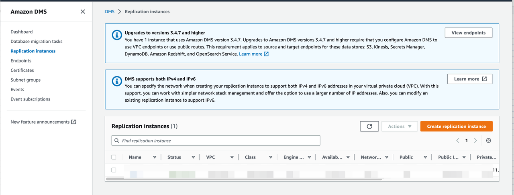

2. Create endpoints.
   Go to **DMS** -> **Endpoints** and click **Create endpoint**.

   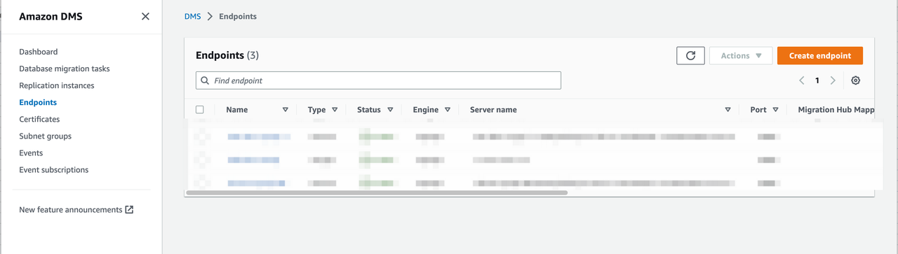

   Create the source endpoint and target endpoint respectively. If the target endpoint is the RDS instance, check **Select RDS DB instance** to configure it.

   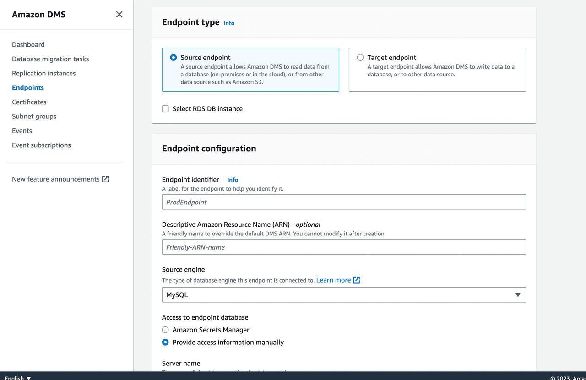

   After configuration, specify a replication instance to test the connection.

   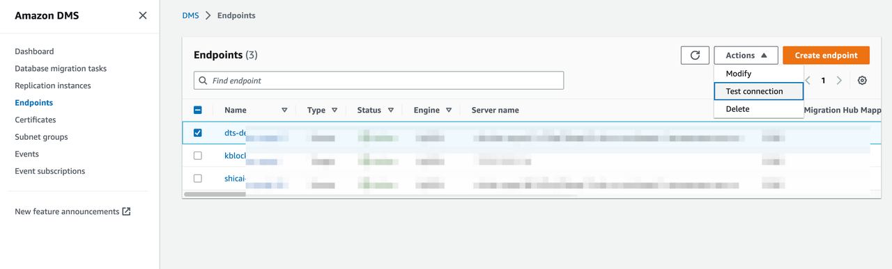

3. Create migration tasks.
   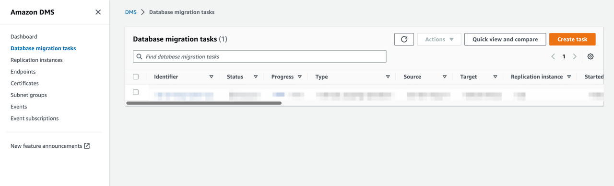
   Click **Create task** and configure the task according to the instructions. 
   Pay attention to the following parameters.

   - Migration Type
    
     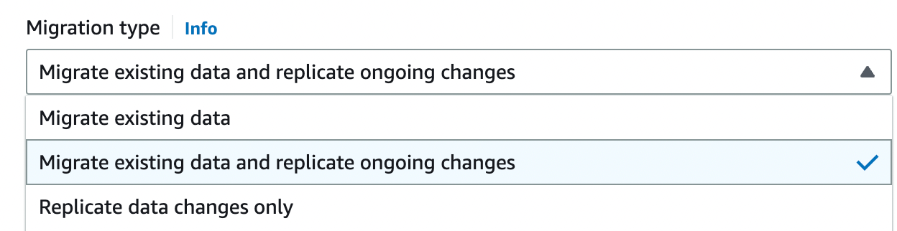

     AWS DMS provides three migration types: 

     - Migrate existing data: AWS DMS migrates only your existing data. Changes to your source data aren’t captured and applied to your target. 
     - Migrate existing data and replicate ongoing changes: AWS DMS migrates both existing data and ongoing data changes, i.e. the existing data before the migration task and the data changes during the migration task will be synchronized to the target instance.
     - Replicate data changes only: AWS DMS only migrates the ongoing data changes. If you select this type, you can use **CDC start mode for source transactions** to specify a location and migrate the data changes.
    For this tutorial, select **Migrate existing data and replicate ongoing changes**.

   - Target table preparation mode

     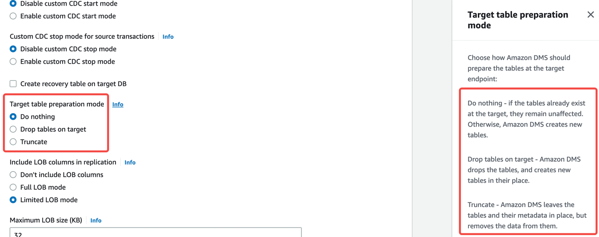

     The target table preparation mode specifies the initial mode of the data structure. You can click Info beside the options to view the definition of each mode. For example, if ApeCloud MySQL is a newly created empty instance, you can select **Do nothing** mode.
     In addition, create a database on ApeCloud MySQL before migration because AWS DMS does not create a database.

   - Turn on validation
     It is recommended to enable this function.

     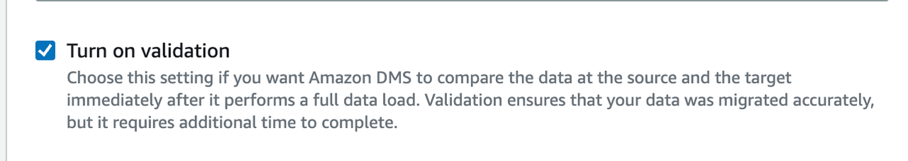

   - Batch-optimized apply
     It is recommended to enable this function as this function enables you to write target instances in batch and can improve the write speed.

     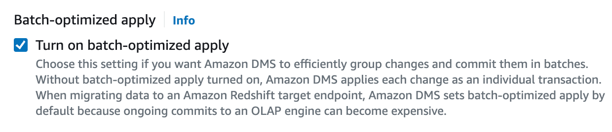

   - Full load tuning settings: Maximum number of tables to load in parallel
     This number decides how many concurrencies DMS uses to get source table data. Theoretically speaking, this will cause pressure on the source table during the full-load migration. Lower this number when the business in the source table is delicate.

     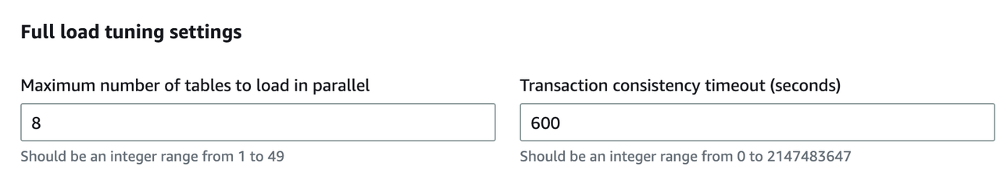

   - Table Mapping
     Table mapping decides which tables in the database are used for migration and can also apply easy conversions. It is recommended to enable **Wizard** mode to configure this parameter.
4. Click the button to start the migration task.
   
## Step 3. Switch applications

***Before you start***

- DMS migration tasks run normally. If you perform a validation task, make sure the results are as expected.
- To differentiate conversation and improve data security, it is recommended to create and authorize a database account solely for migration. 
- It is recommended to switch applications during business off-peak hours because for the sake of safety during the switching process, it is necessary to stop business write.

***Steps:***

1. Make sure the transmission task runs normally.
   Pay attention to **Status**, **Last updated in Table statistics**, and **CDC latency target** in **CloudWatch metrics**.
   You can also refer to [this document](https://aws.amazon.com/premiumsupport/knowledge-center/dms-stuck-task-progress/?nc1=h_ls) to verify the migration task.
   
   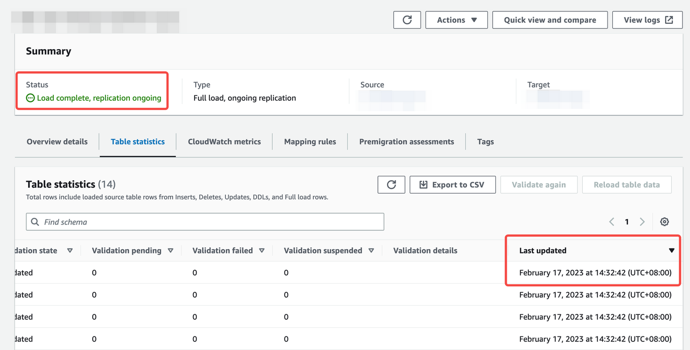

   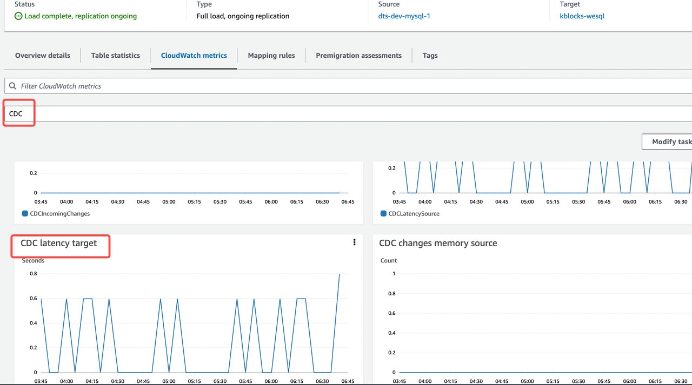

2. Pause business and prohibit new business write in the source database.
3. Verify the transmission task status again to make sure the task runs normally and the running status lasts at least 1 minute.
   Refer to [Step 1](#step-1-network-configuration) to observe whether the link is normal and whether latency exists.
4. Use the target database to resume business.
5. Verify the migration with business.