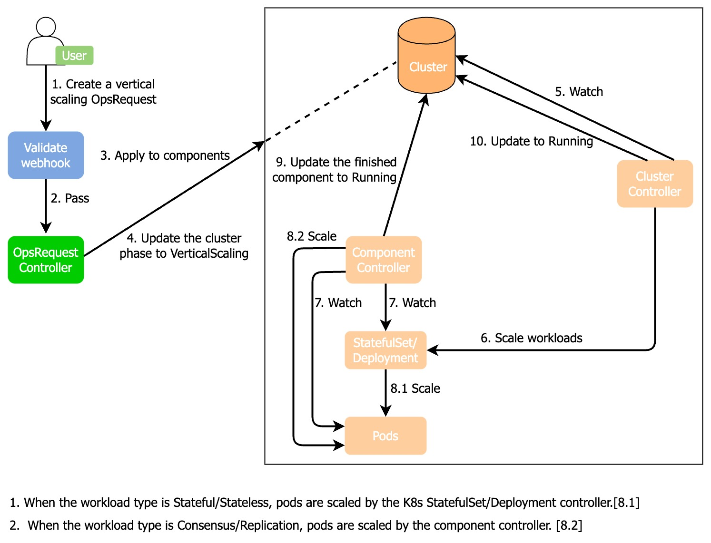

# Scale for PostgreSQL
You can scale PostgreSQL DB instances in two ways, horizontal scaling and vertical scaling. 

## Vertical scaling
You can vertically scale a cluster by changing resource requirements and limits (CPU and storage). For example, if you need to change the resource demand from 1C2G to 2C4G, vertical scaling is what you need.

:::note

During the vertical scaling process, all pods restart in the order of learner -> follower -> leader and the leader pod may change after the restarting.

:::

### How KubeBlocks vertically scales a cluster



1. A user creates a vertical scaling OpsRequest CR (custom resources).
2. This OpsRequest CR passes the webhook validation.
3. The OpsRequest controller applies the specified resource size of this OpsRequest to the corresponding components of the cluster.
4. The OpsRequest controller updates the cluster phase to VerticalScaling.
5. The cluster controller watches the cluster CR.
6. The cluster controller updates the parameter changes to the corresponding StatefulSet/Deployment controller.
7. The component controller watches the StatefulSet/Deployment controller and pods.
8. When the component type is Stateful or Stateless, the Kubernetes StatefulSet/Deployment controller applies a rolling update to pods. The component controller applies vertical scaling to pods when the component type is Consensus/Replication.
9. After the vertical scaling is completed, the component controller updates the cluster component phase to `Running`.
10. The cluster controller watches component changes and when all components are `Running`, the cluster controller changes the cluster phase to `Running`.
11. The OpsRequest controller reconciles the status when the cluster component status changes.

### Before you start

Run the command below to check whether the cluster STATUS is `Running`. Otherwise, the following operations may fail.
```bash
kbcli cluster list <name>
```

***Example***

```bash
kbcli cluster list pg-cluster
>
NAME         NAMESPACE   CLUSTER-DEFINITION           VERSION             TERMINATION-POLICY   STATUS    CREATED-TIME
pg-cluster   default     postgresql-cluster           postgresql-14.7.0   Delete               Running   Mar 03,2023 18:00 UTC+0800
```

### Steps

1. Change configuration. There are 3 ways to apply vertical scaling.
   
   **Option 1.** (**Recommended**) Use kbcli
   
   Configure the parameters `component-names`, `requests`, and `limits` and run the command.
   
   ***Example***
   
   ```bash
   kbcli cluster vscale pg-cluster \
   --component-names="postgresql" \
   --requests.memory="2Gi" --requests.cpu="1" \
   --limits.memory="4Gi" --limits.cpu="2"
   ```
   - `component-names` describes the component name ready for vertical scaling.
   - `requests` describes the minimum amount of computing resources required. If `requests` is omitted for a container, it uses the `limits` value if `limits` is explicitly specified, otherwise uses an implementation-defined value. For more details, see [Resource Management for Pods and Containers](https://kubernetes.io/docs/concepts/configuration/manage-resources-containers/).
   - `--limits` describes the maximum amount of computing resources allowed. For more details, see [Resource Management for Pods and Containers](https://kubernetes.io/docs/concepts/configuration/manage-resources-containers/)
  
   **Option 2.** Create an OpsRequest
  
   Run the command below to apply an OpsRequest to the specified cluster. Configure the parameters according to your needs.
   ```bash
   kubectl apply -f - <<EOF
   apiVersion: apps.kubeblocks.io/v1alpha1
   kind: OpsRequest
   metadata:
     name: ops-vertical-scaling
   spec:
     clusterRef: pg-cluster
     type: VerticalScaling 
     verticalScaling:
     - componentName: postgresql
       requests:
         memory: "2Gi"
         cpu: "1000m"
       limits:
         memory: "4Gi"
         cpu: "2000m"
   EOF
   ```
  
   **Option 3.** Change the YAML file of the cluster

   Change the configuration of `spec.components.resources` in the YAML file. `spec.components.resources` controls the requirement and limit of resources and changing them triggers a vertical scaling. 

   ***Example***

   ```YAML
   apiVersion: apps.kubeblocks.io/v1alpha1
   kind: Cluster
   metadata:
     name: pg-cluster
     namespace: default
   spec:
     clusterDefinitionRef: postgresql-cluster
     clusterVersionRef: postgre-14.7.0
     components:
     - name: postgresql
       type: postgresql
       replicas: 1
       resources: # Change the values of resources.
         requests:
           memory: "2Gi"
           cpu: "1000m"
         limits:
           memory: "4Gi"
           cpu: "2000m"
       volumeClaimTemplates:
       - name: data
         spec:
           accessModes:
             - ReadWriteOnce
           resources:
             requests:
               storage: 1Gi
     terminationPolicy: Halt
   ```
  
2. Validate the vertical scaling.
    Run the command below to check the cluster status to identify the vertical scaling status.
    ```bash
    kbcli cluster list <name>
    ```

    ***Example***

    ```bash
    kbcli cluster list pg-cluster
    >
    NAME              NAMESPACE        CLUSTER-DEFINITION            VERSION                TERMINATION-POLICY   STATUS    CREATED-TIME
    pg-cluster        default          postgresql-cluster            postgresql-14.7.0      Delete               Running   Mar 03,2023 18:00 UTC+0800
    ```
   - STATUS=Running: it means the vertical scaling operation is applied.
   - STATUS=Updating: it means the vertical scaling is in progress.
   - STATUS=Abnormal: it means the vertical scaling is abnormal. The reason may be the normal instances number is less than the total instance number or the leader instance is running properly while others are abnormal. 
     > To solve the problem, you can check manually to see whether resources are sufficient. If AutoScaling is supported, the system recovers when there are enough resources, otherwise, you can create enough resources and check the result with kubectl describe command.
