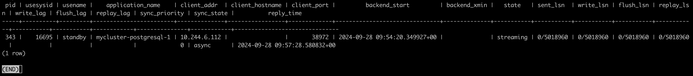
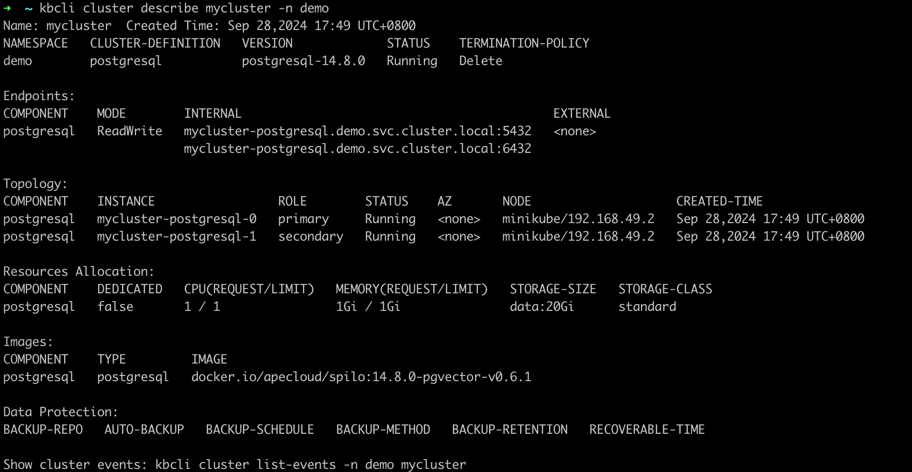

# High availability

KubeBlocks integrates [the open-source Patroni solution](https://patroni.readthedocs.io/en/latest/) to realize high availability and adopts Noop as the switch policy.

## Before you start

* [Install `kbcli` and KubeBlocks](./../../installation/introduction.md): Choose one guide that fits your actual environments.
* [Create a PostgreSQL PrimarySecondary cluster](./../cluster-management/create-and-connect-a-postgresql-cluster.md#create-a-postgresql-cluster).
* Check the Switch Policy and the role probe.
  * Check whether the switch policy is `Noop`.

    ```bash
    kubectl get cluster pg-cluster -o yaml
    >
    spec:
      componentSpecs:
      - name: postgresql
        componentDefRef: postgresql
        switchPolicy:
          type: Noop
    ```

  * Check whether the following role probe parameters exist to verify the role probe is enabled.

    ```bash
    kubectl get cd postgresql -o yaml
    >
    probes:
      roleProbe:
        failureThreshold: 3
        periodSeconds: 2
        timeoutSeconds: 1
    ```

## Steps

1. View the initial status of the PostgreSQL cluster.

   ```bash
   kbcli cluster describe pg-cluster
   ```

   

   Currently, `pg-cluster-postgresql-0` is the primary pod and `pg-cluster-postgresql-1` is the secondary pod.

2. Simulate a primary pod exception.

   ```bash
   # Enter the primary pod
   kubectl exec -it pg-cluster-postgresql-0  -- bash

   # Delete the data directory of PostgreSQL to simulate an exception
   root@postgres-postgresql-0:/home/postgres# rm -fr /home/postgres/pgdata/pgroot/data
   ```

3. View logs to observe how the roles of pods switch  when an exception occurs.

   ```bash
   # View the primary pod logs
   kubectl logs pg-cluster-postgresql-0
   ```

   In the logs, the leader lock is released from the primary pod and an HA switch occurs.

   ```bash
   2023-04-18 08:06:52,338 INFO: Lock owner: pg-cluster-postgresql-0; I am pg-cluster-postgresql-0
   2023-04-18 08:06:52,460 INFO: Leader key released
   2023-04-18 08:06:52,552 INFO: released leader key voluntarily as data dir empty and currently leader
   2023-04-18 08:06:52,553 INFO: Lock owner: pg-cluster-postgresql-1; I am pg-cluster-postgresql-0
   2023-04-18 08:06:52,553 INFO: trying to bootstrap from leader 'pg-cluster-postgresql-1'
   ```

   ```bash
   # View secondary pod logs
   kubectl logs pg-cluster-postgresql-1
   ```

   In the logs, the original secondary pod has obtained the lock and become the leader.

   ```bash
   2023-04-18 08:07:14,441 INFO: no action. I am (pg-cluster-postgresql-1), the leader with the lock
   2023-04-18 08:07:24,354 INFO: no action. I am (pg-cluster-postgresql-1), the leader with the lock
   ```

4. Connect to the PostgreSQL cluster to view the replication information.

   ```bash
   kbcli cluster connect pg-cluster
   ```

   ```bash
   postgres=# select * from pg_stat_replication;
   ```

   

   From the output, `pg-cluster-postgresql-0` has been assigned as the secondary's pod.

5. Describe the cluster and check the instance role.

   ```bash
   kbcli cluster describe pg-cluster
   ```

   

   After the failover, `pg-cluster-postgresql-0` becomes the secondary pod and `pg-cluster-postgresql-1` becomes the primary pod.
