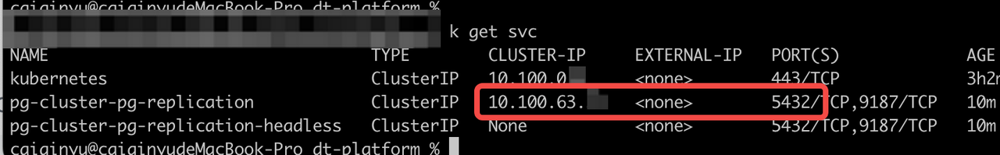
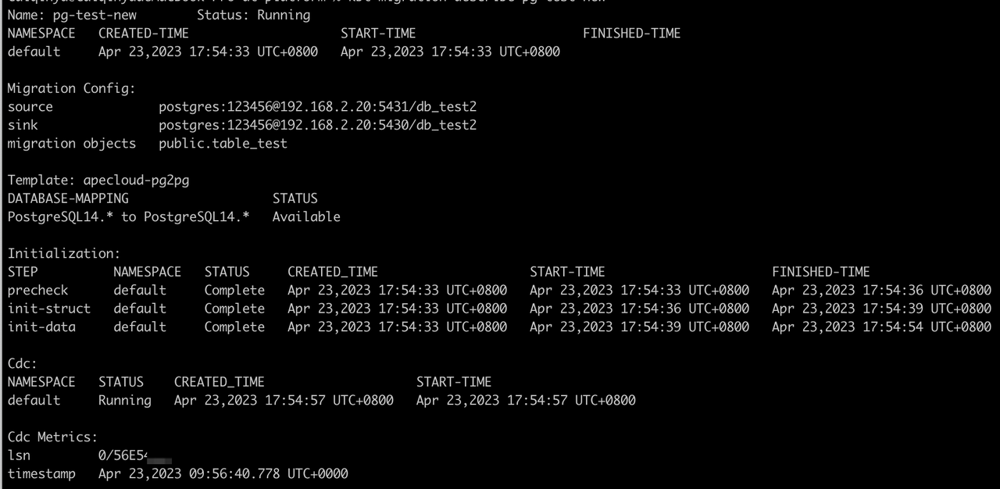
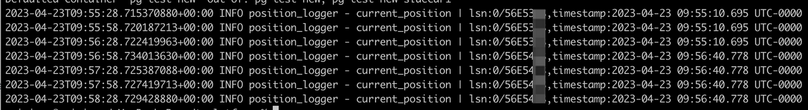

# Migrate data in PostgreSQL to KubeBlocks

## The environment and aim

* Source database: PostgreSQL version 14 installed by Pigsty on Alibaba Cloud ECS. PostGIS plugin is also installed and the open-source map data is imported by osm2pgsql.

* Target database: PostgreSQL version 14.7.0 installed by KubeBlocks on AWS EKS. No plugin is installed.

* Aim: Migrate db_test.public.table_test_1 and db_test.public.table_test2 in the source database to the target database.

## Full feature and limit lists

### Full feature list

* Precheck
  * Database connection
  * Database version
  * Whether the incremental migration is supported by a database
  * The existence of the table structure
  * Whether the table structure of the source database is supported
* Structure initialization
  * PostgreSQL
    * Table Struct
    * Table Constraint
    * Table Index
    * Table Comment
    * Table Sequence
* Data initialization
  * Supports all major data types
* Incremental data migration
  * Supports all major data types
  * Support the resumable upload capability of eventual consistency

### Limit list

* Overall limits
  * If the incremental data migration is used, the source database should enable CDC (Change Data Capture) related configurations (both are checked and blocked in precheck). For detailed configurations, see [Configure the source database](#configure-the-source-database).
  * A table without a primary key is not supported. And a table with a foreign key is not supported (both are checked and blocked in precheck).
  * Except for the incremental data migration module, other modules do not support resumable upload, i.e. if an exception occurs in this module, such as pod failure caused by downtime and network disconnection, a re-migration is required.
  * During the data transmission task, DDL on the migration objects in the source database is not supported.
  * The table name and field name cannot contain Chinese characters and special characters like a single quotation mark (') and a comma (,).
  * During the migration process, the PrimarySecondary switchover in the source library is not supported, which may cause the connection string specified in the task configuration to change. This further causes the migration link failure.
* Permission limits
  * The source account
    * LOGIN
    * The read permission of the source migration objects
    * REPLICATION
  * The target account
    * LOGIN
    * The read/write permission of the target database
* Precheck module: None
* Init-struct module
  * The Array data type is not supported, such as text[], text[3][3], integer[].
  * The user-defined type is not supported.
  * The database character set other than UTF-8 is not supported.
* Init-data module
  * Character sets of the source and target databases should be the same.
* Data incremental migration module
  * Character sets of the source and target databases should be the same.

## Before you start

### Configure the source database

Modify the configuration of the source database to support CDC.

* (1) Set 'wal_level' configuration to 'logical'.
* (2) Make sure that the number of 'max_replication_slots' configured is sufficient.
* (3) Make sure that the number of 'max_wal_senders' configured is sufficient.

:::note

If you install PostgreSQL by Pigsty, you can modify the configuration by executing the `pg edit-config` command.

:::

### Enable public network access to the source database

```bash
# Other hosts can access the source database
vim /pg/data/pg_hba.conf

# Add the following configuration
# IPv4 host connections:
host    all             all             0.0.0.0/0            md5
```

:::note

* Configure the above parameters based on your actual environment, especially for the allowlist address of pg_hba.conf.
* Modifying WAL (Write Ahead Log) and remote access requires restarting the database. Make sure the configuration modification is performed during off-peak hours.

:::

### Check the account permission

Make sure both the source and target account meet the following permissions.

* The source account
  * LOGIN permission
  * The read permission of the source migration objects
  * REPLICATION permission
* The target account
  * LOGIN permission
  * The read/write permission of the target database

### Initialize the target database

1. Create a database named `db_test`.

   ```bash
   create database db_test;
   ```

2. Install PostGIS and import osm data.

   * [Install PostGIS](https://postgis.net/install/). If you install PostgreSQL by Pigsty, PostGIS is built-in and you can execute `CREATE EXTENSION` according to your need.
   * [Import osm data](https://github.com/openstreetmap/osm2pgsql).
  
  :::note

  For the migration function in KubeBlocks version 5.0, there are limits for the structure initialization.

  1. User-defined types are not supported.
  2. A field filled with an Array data type (such as text[], text[3][3], and integer[]) is not supported for migration.

  :::

### Prepare data sampling

It is recommended to prepare data sampling for verification after the migration to ensure correctness.

## Enable kbcli migration

1. [Install KubeBlocks](./../../installation/introduction.md): Choose one guide that fits your actual environments.
2. [Enable the migration add-on](./../../installation/enable-addons.md).

   ```bash
   kbcli addon list

   kbcli addon enable migration
   ```

## Migrate data

### Steps

1. Create a migration task.

   ```bash
   kbcli migration create mytask --template apecloud-pg2pg \
   --source user:123456@127.0.0.1:5432/db_test \
   --sink user:123456@127.0.0.2:5432/db_test \
   --migration-object '"public.table_test_1","public.table_test_2"'

   ```

   :paperclip: Table 1. Options explanation

   | Option     | Descriprion |
   | :--------- | :---------- |
   | mystask    | The name of the migration task. You can customize it. |
   | --template | It specifies the migration template. `--template apecloud-pg2pg` stands for this migration task uses the template of migrating from PostgreSQL to PostgreSQL created by ApeCloud. Run `kbcli migration templates` to view all available templates and the supported database information.   |
   | --source   | It specifies the source database. `user:123456@127.0.0.1:5432/db_test` in the above example stands for `${user_name}:${password}@${database connection url}/${database}`. For this guide, the connect URL uses the public network address. |
   | --sink     | It specifies the target database. `user:123456@127.0.0.2:5432/db_test` in the above example stands for `${user_name}:${password}@${database connection url}/${database}`. For this guide, the connection URL uses the service address inside the Kubernetes cluster. |
   | --migration-object  | It specifies the migration object. The above example describes data in "public.table_test_1" and "public.table_test_2", including structure data, stock data, and incremental data generated during running migration task, will be migrated to the target database.    |

   :::note

   An example of the `--sink` URL:

   

   :::

2. (Optional) Specify migration steps by the option `--steps`.

   The default steps follow the order precheck -> structure initialization -> data initialization -> incremental migration. You can use `--steps` to specify migration steps. For example, perform tasks in the order of precheck, full initialization, and incremental migration.

   ```bash
   kbcli migration create mytask --template apecloud-pg2pg \
   --source user:123456@127.0.0.1:5432/db_test \
   --sink user:123456@127.0.0.2:5432/db_test \
   --migration-object '"public.table_test_1","public.table_test_2"'
   --steps precheck=true,init-struct=false,init-data=true,cdc=true
   ```

3. View the task status.

   ```bash
   # View the migration task list
   kbcli migration list

   # View the details of a specified task
   kbcli migration describe ${migration-task-name}
   ```

   

   Example of `kbcli migration describe`.

   Pay attention to Initialization, CDC, and CDC Metrics.

   * Initialization
     * Precheck
       If the status shows `Failed`, it means the initialization precheck does not pass. Troubleshoot the initialization by [the following examples](#troubleshooting).
     * Init-struct
       Structure initialization. Idempotent processing logic is adopted. A failure occurs only when a severe problem occurs, such as failing to connect a database.
     * Init-data
       Data initialization. If there are a large amount of stock data, it takes a long time to perform this step and you should pay attention to Status.
   * CDC
     Incremental migration. Based on the timestamp recorded by the system before the init-data step, the system starts data migration following eventual consistency and performs capturing the source library WAL (Write Ahead Log) changes -> writing to the target database. Under normal circumstances, the CDC phase continues if the migration link is not actively terminated.
   * CDC Metrics
     Incremental migration indicators. Currently, the indicators mainly provide the WAL LSN (Log Sequencer Number) of the source library and the corresponding timestamp (note that the timestamp shows the local time zone of the Pod Container runtime) when the CDC process has completed "capturing -> writing" process.

     :::note

     The CDC Metrics are updated every 10 minutes by the system, i.e. if there exists continuous data writing into the source database, metrics.timestamp here delays 10 minutes compared with the current time.

     :::

4. Validate the migration with the prepared data sampling.

### Troubleshooting

If any step above fails, run the command below to troubleshoot the failure.

```bash
# --step: Specify the step. Allow values: precheck,init-struct,init-data,cdc
kbcli migration logs ${migration-task-name} --step ${step-name}
```

## Switch applications

### Before you start

* Make sure the KubeBlocks migration task runs normally.
* To differentiate the dialogue information and to improve data security, it is recommended to create and authorize another account dedicated to data migration.
* For the sake of safety, it is necessary to stop the business write and switch the application during off-peak hours.
* Before switching the application, it is recommended to prepare data sampling for verification after switching to ensure correctness.
* Pay attention to serial, sequence, and slot.
* Serial and sequence

   Search the max. value of Sequence before switching applications and set it as the initial value of Sequence in the target database.

   After the business is switched to the target database, the new written Sequence does not take the max. value in the source database as the initial value to continue in an increment order by default.

    ```bash
    # PostgreSQL Function Sample:

    CREATE FUNCTION build_setvals() returns void
    AS $$
    declare
      nsp name;
      rel name;
      val int8;
    begin
      for nsp,rel in select nspname,relname from pg_class t2 , pg_namespace t3 where t2.relnamespace=t3.oid and t2.relkind='S'
      loop
        execute format($_$select last_value from %I.%I$_$, nsp, rel) into val;
        raise notice '%',
        format($_$select setval('%I.%I'::regclass, %s);$_$, nsp, rel, val+1);
      end loop;
    end;
    $$ 
    LANGUAGE plpgsql;

    # Execute:
    psql -hxx -p xx -U xx -d xx -c "set client_min_messages = notice; select build_setvals();" | grep setval

    # Output like:
    NOTICE:  select setval('public.seq_test_1'::regclass, 2);
    NOTICE:  select setval('public.seq_test_2'::regclass, 1001);
    NOTICE:  select setval('public.seq_test_3'::regclass, 203);
    NOTICE:  select setval('public.seq_test_4'::regclass, 476);

    # Execute the above script in the target database
    ```

* Slot lifecycle

  The CDC phase (the incremental migration) relies on the slot. A replication slot and publication are created during the CDC phase and these metadata should be deleted first before deleting the migration task metadata.

  If the incremental migration is performed, the migration task creates a replication slot named after the task name during the initialization phase of the init-data step (hyphens, "-", in the task name are replaced with underlines, "_"). When the incremental migration starts, the migration task creates a publication with the previous replication slot name and "_publication_for_all_tables" in the name to perform WAL consumption.

  When the migration task is deleted (running `kbcli migration terminate`), this task changes to the Terminating status. The termination operation first stops the CDC process, then tries to clear the above replication slot and publication. Only when the above metadata are cleared, is the metadata of the migration task deleted.

  :::note

  If the slot is not cleaned up, it affects the log-cleaning logic in PostgreSQL. When the PostgreSQL disk is insufficient and a redundant slot prevents the log from being cleaned up, a serious failure may occur.

  Therefore, the migration task can be deleted only when the slot cleanup is completed. If there is a PostgreSQL task that keeps the Terminating status for a long time, you need to pay attention to the status of the slot and disk water level and intervene manually when necessary.

  Cleanup operations adopt the idempotent logic, and the reasons for general cleanup failures include but are not limited to the following:

  * While the migration task is running, the connection string of the source library changes, which causes the migration task cannot connect to the source database.
  * While the migration task is running, the account and password of the source database change, which causes the migration task cannot connect to the source database.
  * While the migration task is running, the permissions of the source library account change, which causes the migration task cannot be deleted.

  :::

### Steps

1. Check the migration task status and ensure the task is performed normally.
   1. Describe the migration task details and all steps in Initialization are `Complete` and CDC is `Running`.

      ```bash
      kbcli migration describe ${migration-task-name}
      ```

   2. Under the prerequisite that there exists continuous write into the source database, observe whether the timestamp is still in progress and whether there is almost no delay. For example,

      ```bash
      kbcli migration logs ${migration-task-name} --step cdc | grep current_position
      ```

      The results update every minute.

      
2. Pause the business and stop new business data from being written in the source database.
3. View the migration status again and ensure the migration task runs normally, lasting at least one minute.

   Refer to the operations in step 1 and observe whether the link is normal and the timestamp meets the expectation.
4. Use the target database to restore the business.
5. Validate the switch with the prepared data sampling.

## Clean up the environment

After the migration task is completed, you can terminate the migration task and function.

### Terminate the migration task

Deleting the migration task does not affect the data in the source and target databases.

```bash
kbcli migration terminate ${migration-task-name}
```

### Terminate kbcli migration

1. Check whether there are running migration tasks.

   ```bash
   kbcli migration list
   ```

2. Disable the migration add-on.

   ```bash
   kbcli addon disable migration
   ```

3. Delete the Kubernetes CRD (Custom Resource Definition) manually.

   ```bash
   kubectl delete crd migrationtasks.datamigration.apecloud.io migrationtemplates.datamigration.apecloud.io serialjobs.common.apecloud.io
   ```
