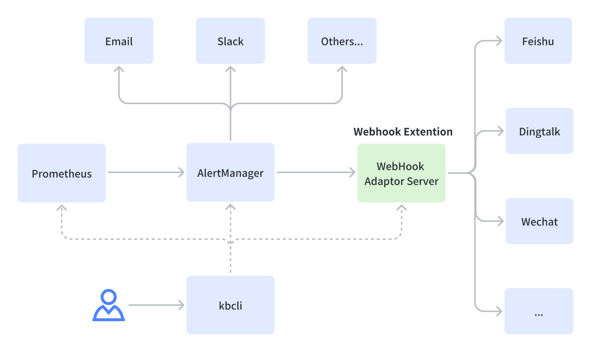

# Configure IM alert

Alerts are mainly used for daily error response to improve system availability. Kubeblocks has a set of built-in common alert rules and integrates multiple notification channels. The alert capability of Kubeblocks can meet the operation and maintenance requirements of production-level online clusters.

## How KubeBlocks alert works

KubeBlocks built-in alert system adopts the mainstream open-source solution in the cloud native scenario, i.e. the combined solution of Prometheus and AlertManager. KubeBlocks also uses the AlertManager Webhook extension to integrate new notification channels, such as Feishu custom bot, Dingtalk custom bot, Wechat custom bot.



## Alert rules

KubeBlocks has a set of general built-in alter rules to meet the alert needs of different types of data products and provides an out-of-the-box experience without further configurations. These alert rules provide the best practice for cluster operation and maintenance. These alarm rules further improve alert accuracy and reduce the probability of false negatives and false positives through experience-based smoothing windows, alarm thresholds, alarm levels, and alarm indicators.

Taking PostgreSQL as an example, the alert rules have built-in common abnormal events, such as instance down, instance restart, slow query, connection amount, deadlock, and cache hit rate. 
The following example shows PostgreSQL alert rules (refer to [Prometheus](https://prometheus.io/docs/prometheus/latest/querying/basics/) for syntax). When the amount of active connections exceeds 80% of the threshold and lasts for 2 minutes, Prometheus triggers a warning and sends it to AlertManager.

```bash
alert: PostgreSQLTooManyConnections
  expr: |
    sum by (namespace,app_kubernetes_io_instance,pod) (pg_stat_activity_count{datname!~"template.*|postgres"})
    > on(namespace,app_kubernetes_io_instance,pod)
    (pg_settings_max_connections - pg_settings_superuser_reserved_connections) * 0.8
  for: 2m
  labels:
    severity: warning
  annotations:
    summary: "PostgreSQL too many connections (> 80%)"
    description: "PostgreSQL has too many connections and the value is {{ $value }}. (instance: {{ $labels.pod }})"
```

You can view all the built-in alert rules in **Alerts Tab** of **Prometheus Dashboards**. Run the commands below to open Prometheus Dashboards.

```bash
# View dashboards list
kbcli dashboard list

# Open Prometheus Dashboards
kbcli dashboard open kubeblocks-prometheus-server # Here is an example and fill in the actual name based on the above dashboard list
```

## Configure IM alert

The alert message notification of Kubeblocks mainly adopts the AlertManager native capability. After receiving the Prometheus alarm, KubeBlocks performs multiple steps, including deduplication, grouping, silence, suppression, and routing, and finally sends it to the corresponding notification channel.
AlertManager integrates a set of notification channels, such as Email and Slack. Kubeblocks extends new IM class notification channels with AlertManger Webhook.

This tutorial takes configuring Feishu as the notification channel as an example.

### Before you start

To receive alerts, you need to deploy monitoring components and enable cluster monitoring first. Refer to [Monitor database](monitor-database.md) for details.

### Step 1. Configure alert channels

Configure the notification channels in advance based on your needs and obtain the necessary information for the following steps. 
Taking Feishu as an example, you can obtain the webhook address after creating a custom robot. If the signature verification in the security configuration is enabled, you can obtain the signature key in advance.

Currently, Feishu custom bot, DingTalk custom bot, WeChat Enterprise custom bot, and Slack are supported. You can refer to the following guides to configure notification channels.

* [Feishu custom bot](https://open.feishu.cn/document/ukTMukTMukTM/ucTM5YjL3ETO24yNxkjN)
* [DingTalk custom bot](https://open.dingtalk.com/document/orgapp/custom-robot-access)
* [WeChat Enterprise custom bot](https://developer.work.weixin.qq.com/document/path/91770)
* [Slack](https://api.slack.com/messaging/webhooks)

:::note

* Each notification channel has its interface call amount and frequency limits and when the limits are reached, the channel limits traffic and alerts are not sent out. 
* The SLA of the service provided by a single channel cannot guarantee the alerts are sent successfully. Therefore, it is recommended to configure multiple notification channels to ensure availability.

:::

### Step 2. Configure the receiver

To improve usability, `kbcli` develops the `alert` subcommand to simplify the receiver configuration. You can set the notification channels and receivers by the `alert` subcommand. This subcommand also supports condition filters, such as cluster names and severity levels. After the configuration succeeds, it takes effect without restarting the service.

Add an alert receiver.
   
   ```bash
   kbcli alert add-receiver 
   --webhook='xxx' --cluster=xx --severity=xx
   ```

***Example***

   The following commands show how to add a receiver to Feishu based on different requirements.
   The webhook address below is an example and you need to replace it with the actual address before running the command.

   ```bash
   # Signature authentication is disabled
   kbcli alert add-receiver
   --webhook='url=https://open.feishu.cn/open-apis/bot/v2/hook/foo'

   # Signature authentication is enabled and sign is used as the value of token
   kbcli alert add-receiver
   --webhook='url=https://open.feishu.cn/open-apis/bot/v2/hook/foo,token=sign'

   # Only receive the alerts from a cluster named pg
   kbcli alert add-receiver
   --webhook='url=https://open.feishu.cn/open-apis/bot/v2/hook/foo' --cluster=pg

   # Only receive the critical alerts from a cluster named pg
   kbcli alert add-receiver
   --webhook='url=https://open.feishu.cn/open-apis/bot/v2/hook/foo' --cluster=pg --severity=critical
   ```

   :::note

   For the detailed command description, run `kbcli alert add-receiver -h`.

   :::
 
Run the command below to view the notification configurations.

  ```bash
  kbcli alert list-receivers
  ```

Run the command below to delete the notification channel and receiver if you want to disable the alert function.

  ```bash
  kbcli alert delete-receiver <receiver-name>
  ```

## Troubleshooting

If you cannot receive alert notices, run the commands below to get the logs of AlertManager and AlertManager-Webhook-Adaptor add-ons. 

```bash
# Find the corresponding Pod of AlertManager and get Pod name
kubectl get pods -n kb-syste -l 'release=kubeblocks,app=prometheus,component=alertmanager'

# Search AlertManeger logs
kubectl logs <pod-name> -n kb-syste -c prometheus-alertmanager

# Find the corresponding Pod of AlertManager-Webhook-Adaptor and get Pod name
kubectl get pods -n kb-syste -l 'app.kubernetes.io/instance=kubeblocks,app.kubernetes.io/name=alertmanager-webhook-adaptor'

# Search AlertManager-Webhook-Adaptor logs
kubectl logs <pod-name> -n kb-syste -c alertmanager-webhook-adaptor
```