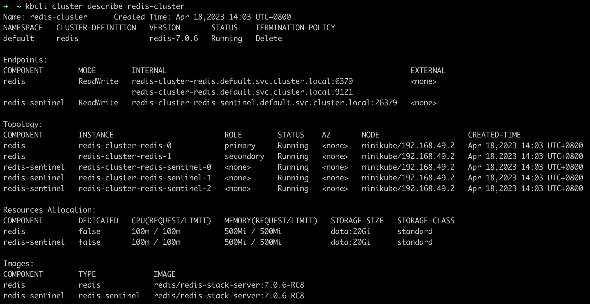
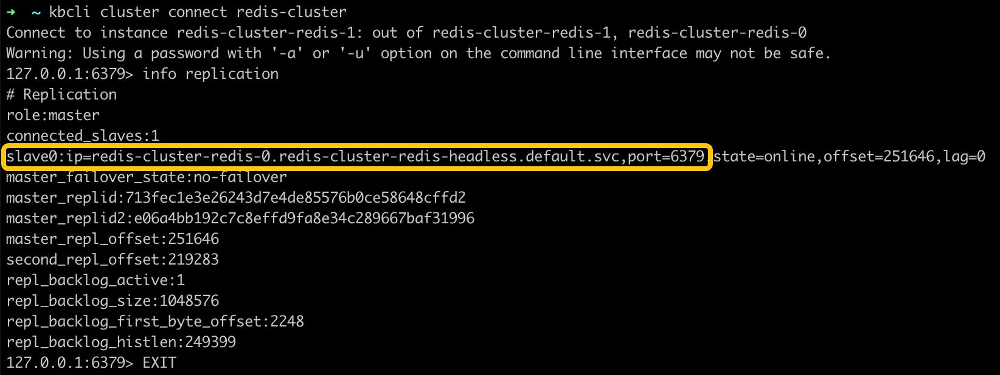
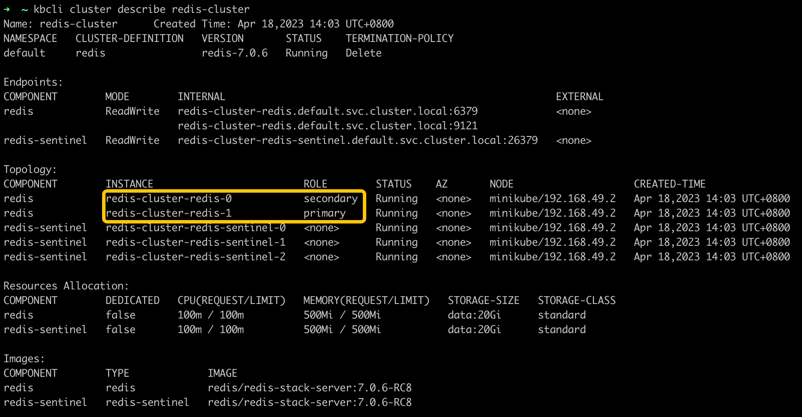

# High availability

KubeBlocks integrates [the official Redis Sentinel solution](https://redis.io/docs/management/sentinel/) to realize high availability and adopts Noop as the switch policy.

Redis Sentinel is the high availability solution for a Redis PrimarySecondary, which is recommended by Redis and is also the main-stream solution in the community.

In the Redis PrimarySecondary provided by KubeBlocks, Sentinel is deployed as an independent component.

## Before you start

* [Install `kbcli`](./../../installation/install-and-uninstall-kbcli-and-kubeblocks.md#install-kbcli).
* [Install KubeBlocks](./../../installation/install-and-uninstall-kbcli-and-kubeblocks.md#install-kubeblocks).
* Create a Redis PrimarySecondary.

  ```bash
  kbcli cluster create redis-cluster --cluster-definition='redis'
  ```

* Check the Switch Policy and the role probe.
  * Check whether the switch policy is `Noop`.

    ```bash
    kubectl get cluster redis-cluster -o yaml
    >
    spec:
      componentSpecs:
      - name: redis
        componentDefRef: redis
        switchPolicy:
        type: Noop
    ```

  * Check whether the following role probe parameters exist to verify the role probe is enabled.

    ```bash
    kubectl get cd redis -o yaml
    >
    probes:
      roleProbe:
        failureThreshold: 3
        periodSeconds: 2
        timeoutSeconds: 1
    ```

## Steps

1. View the initial status of the Redis cluster.

   ```bash
   kbcli cluster describe redis-cluster
   ```

   

   Currently, `redis-cluster-redis-0` is the primary pod and `redis-cluster-redis-1` is the secondary pod.

2. Simulate a primary pod exception.

   ```bash
   # Enter the primary pod
   kubectl exec -it redis-cluster-redis-0  -- bash

   # Execute the debug sleep command to simulate a primary pod exception
   root@redis-redis-0:/# redis-cli debug sleep 30
   ```

3. Open the Redis Sentinel log to view the failover.

   ```bash
   kubectl logs redis-cluster-redis-sentinel-0
   ```

   In the logs, we can view when a high-availability switch occurs.

   ```bash
   1:X 18 Apr 2023 06:13:17.072 # +switch-master redis-cluster-redis-sentinel redis-cluster-redis-0.redis-cluster-redis-headless.default.svc 6379 redis-cluster-redis-1.redis-cluster-redis-headless.default.svc 6379
   1:X 18 Apr 2023 06:13:17.074 * +slave slave redis-cluster-redis-0.redis-cluster-redis-headless.default.svc:6379 redis-cluster-redis-0.redis-cluster-redis-headless.default.svc 6379 @ redis-cluster-redis-sentinel redis-cluster-redis-1.redis-cluster-redis-headless.default.svc 6379
   1:X 18 Apr 2023 06:13:17.077 * Sentinel new configuration saved on disk
   ```

4. Connect to the Redis cluster to view the primary pod information after the exception simulation.

   ```bash
   kbcli cluster connect redis-cluster
   ```

   ```bash
   # View the current primary pod
   127.0.0.1:6379> info replication
   ```

   

   From the output, `redis-cluster-redis-1` has been assigned as the secondary's pod.

5. Describe the cluster and check the instance role.

   ```bash
   kbcli cluster describe redis-cluster
   ```

   

   After the failover, `redis-cluster-redis-0` becomes the secondary pod and `redis-cluster-redis-1` becomes the primary pod.
