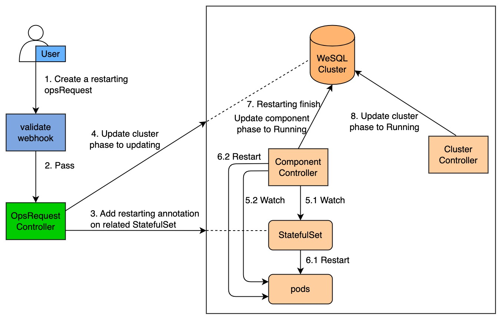

# Cluster restarting

This section gives you an overview of how KubeBlocks restarts an ApeCloud MySQL database cluster.

## Before you start

Make sure you are familiar with the following KubeBlocks concepts:

- [KubeBlocks](../../Introduction/introduction.md)
- [KubeBlocks OpsRequest](../configure_ops_request.md) 

## How KubeBlocks restarts a cluster

The diagram below illustrates how KubeBlocks restarts an ApeCloud MySQL database cluster.

Restarting process consists of the following steps:

1. A user creates a restarting OpsRequest `CR` (custom resources).
2. This restarting OpsRequest `CR` passes the webhook validation.
3. Add the restarting annotation to the StatefulSets corresponding to the components.
4. The OpsRequest controller changes the cluster phase to `Updating`.
5. The component controller watches for StatefulSet and pods.
6. When the component type is `Stateful`/`Stateless`, Kubernetes StatefulSet controller performs a rolling update on the pods. When the component type is `consensus`/`replicationset`, the component controller restarts the pods.
7. When restarting is completed, the component controller changes the component phase to `Running`.
8. The cluster controller watches for the component phase and changes the cluster phase to `Running`.
9. The OpsRequest controller reconciles the OpsRequest status when the component status of the cluster changes.