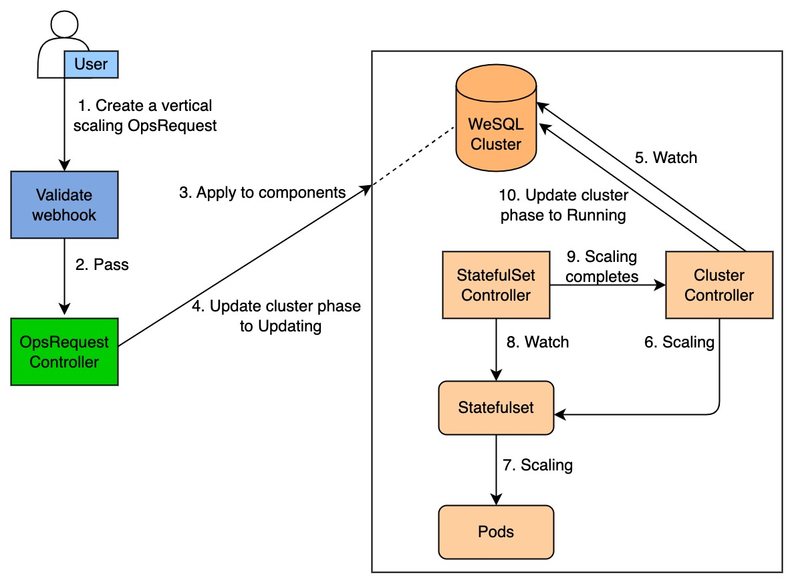

# Vertical scaling

This section gives you an overview of how KubeBlocks scales up an ApeCloud MySQL database cluster.

## Before you start

Make sure you are familiar with the following KubeBlocks concepts:

- [KubeBlocks](../../introduction/introduction.md)
- [KubeBlocks OpsRequest](../configure_ops_request.md)
  
## How KubeBlocks vertically scales a cluster

The diagram below illustrates how KubeBlocks scales up an ApeCloud MySQL database cluster.

The vertical scaling process consists of the following steps:
1. A user creates a vertical scaling OpsRequest `CR` (custom resources).
2. This OpsRequest `CR` passes webhook validation.
3. The OpsRequest applies to the specified components.
4. The OpsRequest controller changes the ApeCloud MySQL cluster phase to `Updating`.
5. The cluster controller watches for the Cluster `CR`.
6. The cluster controller applies vertical scaling parameters to the StatefulSet.
7. The cluster controller watches for StatefulSet and pods.
8. When the component type is `Stateful`/`Stateless`, Kubernetes StatefulSet controller performs a rolling update on the pods. When the component type is `consensus`/`replicationset`, the component controller vertically scales the pods.
9. When the vertical scaling is completed, the component controller changes the component phase to `Running`.
10. The cluster controller watches for the component phase and changes the cluster phase to `Running`.
11. The OpsRequest controller reconciles the OpsRequest status when the component status of the Cluster changes.
