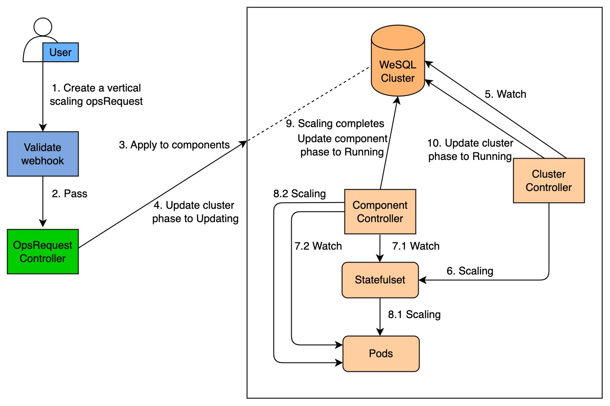

# Vertical scaling

This section gives you an overview of how KubeBlocks scales a WeSQL database cluster.

## Before you start

You should be familiar with the following `KubeBlocks` concepts:

- KubeBlocks #links to be completed
- [KubeBlocks OpsRequest](../configure_ops_request.md)
  
## How vertical scaling works

The diagram below illustrates how KubeBlocks scales a WeSQL database cluster.

The vertical scaling consists of the following steps:
1. A user creates a vertical scaling opsRequest `CR`.
2. This OpsRequest `CR` passes webhook validation.
3. The OpsRequest applies to the specified components.
4. The OpsRequest controller changes the WeSQL cluster phase to `Updating`.
5. The cluster controller watches for the cluster `CR`.
6. The cluster controller applies vertical scaling parameters to the StatefulSet.
7. The cluster controller watches for StatefulSet and pods.
8. When the component type is `Stateful`, Kubernetes StatefulSet controller performs a rolling update on the pods. When the component type is `consensus`/`replicationset`, the component controller vertically scales the pods.
9. When the vertical scaling is completed, the component controller changes the component phase to `Running`.
10. The cluster controller watches for the component phase and changes the cluster phase to `Running`.