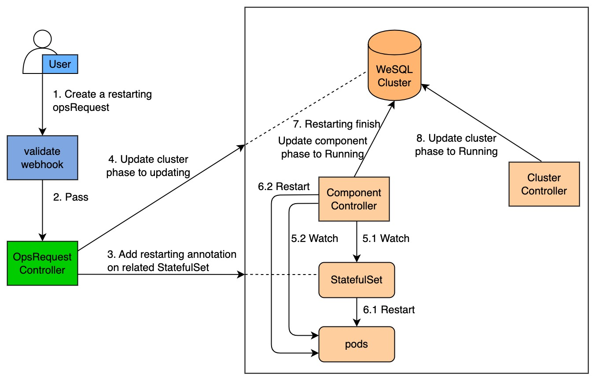

# Restart MySQL cluster
You can restart all pods of the cluster. When an exception occurs in a database, you can try to restart it.

> ***Note:*** 
> 
> All pods restart in the order of `learner -> follower -> leader` and the leader may change after the cluster restarts.

## How KubeBlocks restarts a cluster

The diagram below illustrates how KubeBlocks restarts an ApeCloud MySQL database cluster.



Restarting process consists of the following steps:

1. A user creates a restarting OpsRequest `CR` (custom resources).
2. This restarting OpsRequest `CR` passes the webhook validation.
3. Add the restarting annotation to the StatefulSets corresponding to the components.
4. The OpsRequest controller changes the cluster phase to `Updating`.
5. The component controller watches for StatefulSet and pods.
6. When the component workload type is `Stateful`/`Stateless`, Kubernetes StatefulSet controller performs a rolling update on the pods. When the component workload type is `consensus`/`replicationset`, the component controller restarts the pods.
7. When restarting is completed, the component controller changes the component phase to `Running`.
8. The cluster controller watches for the component phase and changes the cluster phase to `Running`.
9. The OpsRequest controller reconciles the OpsRequest status when the component status of the cluster changes.

***Steps:***

1. Restart a cluster
  You can use `kbcli` or create an OpsRequest to restart a cluster.
  
   **Option 1.** (Recommended) Use `kbcli`.
   
   Configure the values of `component-names` and `ttlSecondsAfterSucceed` and run the command below to restart a specified cluster.
   ```bash
   kbcli cluster restart NAME --component-names="mysql" \
   --ttlSecondsAfterSucceed=30
   ```
   - `component-names` describes the component name that needs to be restarted.
   - `ttlSecondsAfterSucceed` describes the time to live after the restarting succeeds.

   **Option 2.** Create an OpsRequest.

   Run the command below to apply the restarting to a cluster. 
   ```bash
   kubectl apply -f - <<EOF
   apiVersion: apps.kubeblocks.io/v1alpha1
   kind: OpsRequest
   metadata:
     name: ops-restart
   spec:
     clusterRef: mysql-01
     type: Restart 
     restart:
     - componentName: mysql
   EOF
   ```
2. Validate the restarting.
   Run the command below to check the cluster status to check the restarting status.
   ```bash
   kbcli cluster list <name>
   ```
   - STATUS=Updating: means the cluster is restarting.
   - STATUS=Running means the cluster is restarted.
   
   ***Example***

     ```bash
     kbcli cluster list mysql-cluster
     >
     NAME                 NAMESPACE        CLUSTER-DEFINITION        VERSION                TERMINATION-POLICY        STATUS         CREATED-TIME
     mysql-cluster        default          apecloud-mysql            ac-mysql-8.0.30        Delete                    Running        Jan 29,2023 14:29 UTC+0800
     ```
