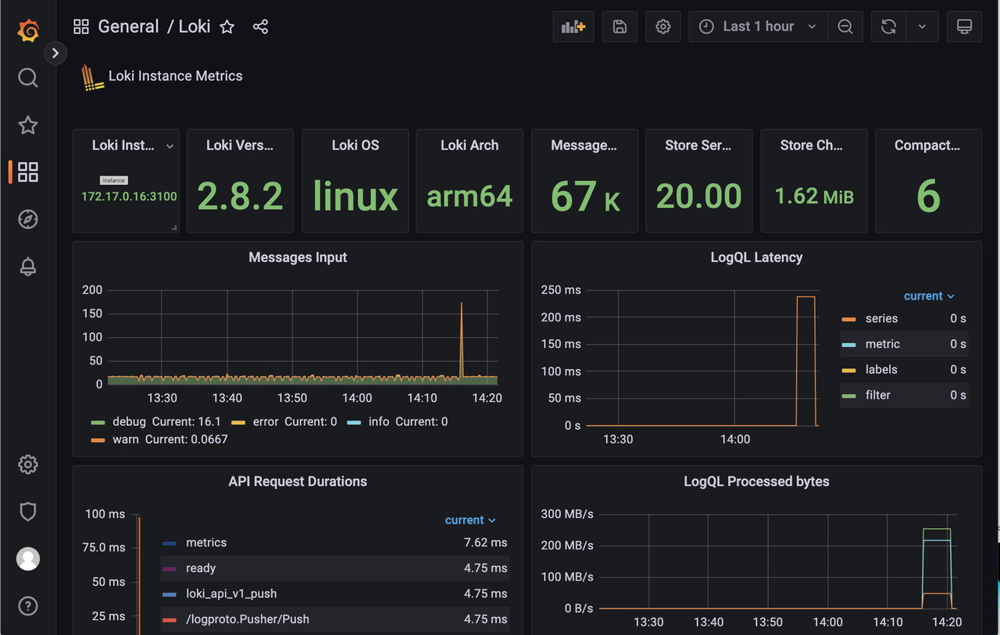
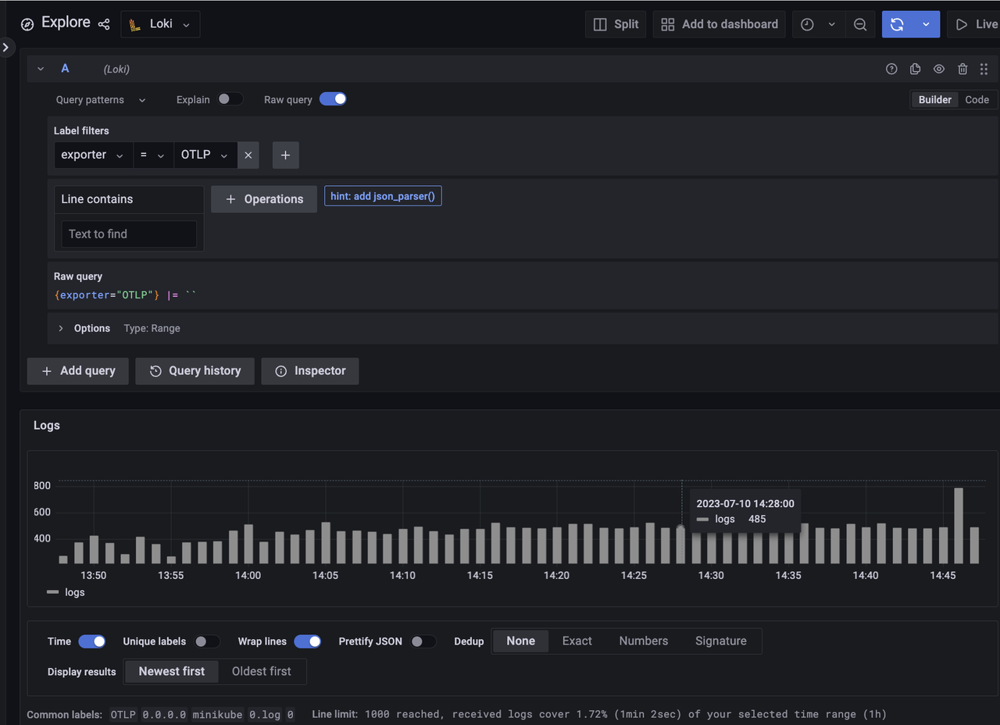

# Advanced logs

Currently, KubeBlocks supports viewing the running logs, error logs, and slow logs of the running database cluster through `kbcli cluster logs`. This method is lightweight and only relies on the log files and tail commands in the target container, without installing any software or plug-ins in the cluster or client.

Its drawbacks are also very obvious. It strongly depends on the survival of the container and the current status of log files. If the container is already abnormal or the log file is deleted, this method cannot work as expected. The above method is called the `cluster logs` function.

The `advanced logs` function can better retain log clues at problem sites, support long-term remote backup of log data, and facilitate integration with external systems.

The advanced logs function supports storing log data to the Loki server in the cluster and the remote AWS S3 service. The data stored in Loki supports `logcli` client and Grafana console access and display. The data stored in S3 supports importing and integrating with other systems for further processing and analysis.

## Add-on introduction

Agamotto, Loki, Prometheus, and other components related to observability are managed by KubeBlocks as add-ons. Each of these add-ons has its specialties.

* Agamotto is a collection add-on that collects performance and logs.
* Loki is a storage add-on that stores log data.
* Grafana is a front-end display add-on that displays the observed data.
* Logcli is a front-end search add-on that provides the native LogQL query capability. It is installed by `kbcli plugin`.

## Before you start

* [Install kubectl](https://kubernetes.io/docs/tasks/tools/).
* [Install KubeBlocks by kbcli](./../installation/install-with-kbcli/install-kubeblocks-with-kbcli.md) or [install KubeBlocks by Helm](./../installation/install-with-helm/install-kubeblocks-with-helm.md).

## Enable advanced logs function

### Enable Loki

The Loki add-on stores the log data and accepts the search request from the front end. Refer to the [Loki official documentation](https://grafana.com/docs/loki/latest/) for details.

:::caution

Before enabling the advanced logs function, deploy a Loki node first and then apply Agamotto collection to avoid log data loss.

:::

1. View the Loki add-on status to check whether it is enabled.

   ```bash
   kbcli addon list | grep loki
   ```

2. If this add-on is not enabled, run the command below to enable this add-on.

   This command runs Loki in the `statefulset` mode. KubeBlocks deploys a single-node Loki of the single binary type, i.e. the `target` in the configuration is `all`, uses a 10-GB PV to store data, and starts a `loki-gateway` service to receive data.

   ```bash
   kbcli addon enable loki
   >
   NAME                           TYPE   PROVIDER    STATUS     AUTO-INSTALL   AUTO-INSTALLABLE-SELECTOR   
   loki                           Helm   apecloud    Enabled    false   
   ```

   Check whether this Pod is running.

   ```bash
   kubectl get pods | grep loki
   >
   NAME                                            READY   STATUS    RESTARTS   AGE
   kb-addon-loki-0                                 1/1     Running   0          47h
   loki-gateway-5f4895c7b-5khv7                    1/1     Running   0          47h
   ```

3. Run Grafana to view the status of Loki. For example,

   

4. (Optional) Disable the Loki add-on.

   ```bash
   kbcli disabled loki
   ```

By default, Loki saves the log data of the last 3 days, and the data older than 72 hours will be automatically deleted. You can use the following commands to adjust the storage policy. Note that when adjusting the policy, you need to pay attention to the host's disk resources and Loki PVC. Currently, Loki does not support size-based retention.

```bash
# The new retention_period must be an integer multiple of 24
kbcli addon enable loki --set loki.loki.limits_config.retention_period=168h
```

Run `kubectl get pv` to view the PV information of the current Loki instance.

```bash
kubectl get pv
>
NAME                                       CAPACITY   ACCESS MODES   RECLAIM POLICY   STATUS   CLAIM                               STORAGECLASS      REASON   AGE
pvc-ed20ec94-9a58-46e4-9c28-b692cba70e79   8Gi        RWO            Delete           Bound    kb-system/storage-kb-addon-loki-0   csi-hostpath-sc            28h
```

If you want to check the disk usage of the current Loki node, you can use the `exec` command to log in to the container and use the `du` command to check the disk usage. For example,

1. Log in to the Loki container.

   ```bash
   kubectl exec -it kb-addon-loki-0 -n kb-system -- /bin/sh
   ```

2. Run the `du` command.

   ```bash
   du -sh /var/loki/*
   >
   152.0K  /var/loki/boltdb-shipper-active
   228.0K  /var/loki/boltdb-shipper-cache
   7.4M    /var/loki/chunks
   4.0K    /var/loki/compactor
   64.0K   /var/loki/retention
   4.0K    /var/loki/rules
   3.5M    /var/loki/wal
   ```

### Enable Agamotto

After the log collection function is enabled, Agamotto detects two localhost folders, `/var/log/pods` and `/var/log/kubeblocks`. All files that fit the following patterns will be collected.

* `/var/log/pods` directory: it stores the standard output of the storage container and the error logs. The file path pattern follows `/var/log/pods/**/**/*.log`.
* `/var/log/kubeblocks` directory: it can customize the storage of log files storage. By default, KubeBlocks stores the logs of database engines, such as error log and slow log. The file path pattern follows `/var/log/kubeblocks/**/**/*.log`.

1. View the Agamotto add-on status to check whether it is enabled.

   ```bash
   kbcli addon list | grep agamotto
   ```

2. If this add-on is not enabled, run the command below to enable this add-on.

   ```bash
   kbcli addon enable agamotto
   >
   NAME                           TYPE   PROVIDER    STATUS     AUTO-INSTALL   AUTO-INSTALLABLE-SELECTOR   
   agamotto                       Helm   apecloud    Enabled    false  
   ```

   Check whether this Pod is running.

   ```bash
   kubectl get pods | grep agamotto
   >
   NAME                                            READY   STATUS    RESTARTS   AGE
   kb-addon-agamotto-kvbr5                         1/1     Running   0          44h
   ```

3. Run the command to upgrade the log function of Agamotto.

   ```bash
   kbcli addon enable agamotto --set log.enabled=true
   ```

4. Upload logs to S3.

   By default, the logs function only restores the log data on the Loki server of the current Kubernetes cluster and does not upload the log data to the remote S3 server.

   Fill in the command below with Access Key, Secret Key, region, and bucket, and run this command to enable uploading log data to S3.

   ```bash
   kbcli addon enable agamotto --set log.enabled=true,log.s3.enabled=true,log.s3.accessKey=user_ak,log.s3.secretKey=user_sk,log.s3.region=user_region,log.s3.bucket=user_bucket
   ```

   The target bucket of the remote S3 creates a directory named after the filename, which stores the real-time data Partition of the corresponding log (partitioned by 5 minutes or 5 MB).

5. (Optional) Disable the Agamotto add-on.

   ```bash
   kbcli addon disable agamotto
   ```

### Enable Grafana

:::note

In the production environment, all monitoring add-ons are disabled by default when installing KubeBlocks and Grafana is also included. You can enable Grafana but it is highly recommended to build your monitoring system or purchase a third-party monitoring service for safety and stability concerns. For integrating a third-party monitoring service, refer to [Integrate a third party monitoring service](./monitor-database.md#for-production-environment).

:::

1. Check whether the Loki and Grafana services are enabled.

   ```bash
   kbcli dashboard list
   >
   NAME                 NAMESPACE   PORT    CREATED-TIME                 
   kubeblocks-grafana   default     13000   Jul 08,2023 15:37 UTC+0800   
   kubeblocks-logs      default     13100   Jul 08,2023 15:36 UTC+0800  
   ```

2. Open the dashboard of the container logs.

   ```bash
   kbcli dashboard open kubeblocks-logs
   ```

   Or you can go to the **Explore** page and select **Loki** to search the logs.

   

### Enable LogCLI

kbcli supports the LogCLI plug-in for your convenience of querying logs by command line.

:::note

For more LogCLI and LogQL grammar, refer to the [Loki official documentation](https://grafana.com/docs/loki/latest/tools/logcli/).

:::

1. Install the LogCLI plug-in.

   1. Set the environment variable.

      ```bash
      export PATH="${KBCLI_ROOT:-$HOME/.kbcli}/plugins/bin:$PATH"
      ```

   2. Add the `block-index` of ApeCloud as the `krew index`.

      ```bash
      kbcli plugin index add default https://github.com/apecloud/block-index.git
      ```

   3. View the index status.

      ```bash
      kbcli plugin index list
      >
      INDEX     URL                                           
      default   https://github.com/apecloud/block-index.git   
      ```

   4. Install the LogCLI plug-in.

      ```bash
      kbcli plugin install default/logcli 
      ```

   5. View the plug-in status and check whether LogCLI is installed successfully.

      ```bash
      kbcli plugin list | grep logcli
      ```

2. Use the LogCLI.

   1. Set the environment variable of LogCLI. For example, set the `LOKI_ADDR` pointing to the localhost 3100 port.

      ```bash
      export LOKI_ADDR=http://localhost:3100
      ```

   2. Export the Loki service to the localhost. Note that `port/namespace` should be the same as the settings in the system. For example,

      ```bash
      kubectl port-forward svc/loki-gateway 3100:80 -n kb-system
      ```

   3. Use the LogCLi tool to query log data.

      ```bash
      kbcli logcli query '{exporter="OTLP"}'
      >
      2023/07/10 17:30:18 http://localhost:3100/loki/api/v1/query_range?direction=BACKWARD&end=1688981418606367000&limit=30&query=%7Bexporter%3D%22OTLP%22%7D&start=1688977818606367000
      2023/07/10 17:30:18 Common labels: {exporter="OTLP", host_ip="0.0.0.0", host_name="minikube", log_file_name="0.log", restart_num="0"}
      2023-07-10T17:30:18+08:00 {container="nginx", log_file_path="/var/log/pods/kb-system_loki-gateway-748cbf767f-6jpdw_54c6db59-10d5-419b-963e-0f116358e14a/nginx/0.log", namespace="kb-system", pod="loki-gateway-748cbf767f-6jpdw", pod_id="54c6db59-10d5-419b-963e-0f116358e14a"}                                                             {"log":"172.17.0.1 - - [10/Jul/2023:09:30:18 +0000]  204 \"POST /loki/api/v1/push HTTP/1.1\" 0 \"-\" \"Go-http-client/1.1\" \"-\"\n","stream":"stderr","time":"2023-07-10T09:30:18.230393596Z"}
      2023-07-10T17:30:18+08:00 {container="nginx", log_file_path="/var/log/pods/kb-system_loki-gateway-748cbf767f-6jpdw_54c6db59-10d5-419b-963e-0f116358e14a/nginx/0.log", namespace="kb-system", pod="loki-gateway-748cbf767f-6jpdw", pod_id="54c6db59-10d5-419b-963e-0f116358e14a"}
      ```

### MySQL Slow logs and error logs

By default, in the ClusterDefinition of MySQL, there is a sidecar container named `metrics` in the podSpec definition of the `mysql component`.

This `metrics` container detects the error logs and slow logs output by MySQL in real-time, and dumps the logs to the host's `/var/log/KubeBlocks` directory. To prevent taking up too much host disk space, the default size of each file is 10 MB, and a maximum of 2 files can be saved.

In addition, the Agamotto component deployed on the host detects the `/var/log/KubeBlocks` folder in real-time and collects the log data in it to complete the entire log data collection link.

```yaml
- name: metrics
  image:  {{ .Values.metrics.image.registry | default "docker.io" }}/{{ .Values.metrics.image.repository }}:{{ .Values.metrics.image.tag }}
  imagePullPolicy: {{ .Values.metrics.image.pullPolicy | quote }}
  securityContext:
    runAsNonRoot: false
    runAsUser: 0
  env:
    - name: DB_TYPE
      value: MySQL
    - name: ENDPOINT
      value: {{ printf "localhost:3306" }}
    - name: MYSQL_USER
      valueFrom:
        secretKeyRef:
          name: $(CONN_CREDENTIAL_SECRET_NAME)
          key: username
          optional: false
    - name: MYSQL_PASSWORD
      valueFrom:
        secretKeyRef:
          name: $(CONN_CREDENTIAL_SECRET_NAME)
          key: password
          optional: false
  command:
    - "/bin/agamotto"
    - "--config=/opt/agamotto/agamotto-config.yaml"
  ports:
    - name: http-metrics
      containerPort: {{ .Values.metrics.service.port }}
  volumeMounts:
    - name: agamotto-configuration
      mountPath: /opt/agamotto
    - name: data
      mountPath: /data/mysql
    - name: log-data
      mountPath: /var/log/kubeblocks
      readOnly: false
```
