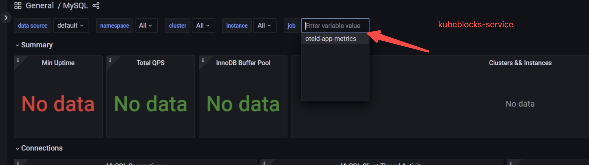

import Tabs from '@theme/Tabs';
import TabItem from '@theme/TabItem';

# Monitor a database

With the built-in database observability, you can observe the database health status and track and measure your database in real-time to optimize database performance. This section shows you how database monitoring tools work with KubeBlocks and how to use the function.

## For Playground/demo environment

KubeBlocks integrates open-source monitoring components, such as Prometheus, AlertManager, and Grafana, by Addons and adopts the custom `apecloud-otel-collector` to collect the monitoring indicators of databases and host machines. You can use these Addons for the test or demo environment.

* `prometheus`: it includes Prometheus and AlertManager addons.
* `grafana`: it includes Grafana monitoring addons.
* `victoria-metrics`: it collects metrics from various sources and stores them to VictoriaMetrics.
* `victoria-metrics-agent`: it collects metrics from various sources, relabel and filter the collected metrics and store them in VictoriaMetrics or any other storage systems via Prometheus `remote_write` protocol or via VictoriaMetrics `remote_write` protocol.
* `alertmanager-webhook-adaptor`: it includes the notification extension and is used to extend the notification capability of AlertManager. Currently, the custom bots of Feishu, DingTalk, and Wechat Enterprise are supported.
* `apecloud-otel-collector`: it is used to collect the indicators of databases and the host machine.

If you are using KubeBlocks Playground, these addons are enabled by default.

### Steps

<Tabs>

<TabItem value="kbcli" label="kbcli" default>

1. View all built-in Addons and make sure the monitoring Addons are enabled. If the monitoring Addons are not enabled, [enable these addons](./../installation/install-addons.md) first.

   ```bash
   # View all addons supported
   kbcli addon list
   ...
   grafana                        Helm   Enabled                   true                                                                                    
   alertmanager-webhook-adaptor   Helm   Enabled                   true                                                                                    
   prometheus                     Helm   Enabled    alertmanager   true 
   ...
   ```

2. Check whether the monitoring function of the cluster is enabled. If the monitoring function is enabled, the output shows `disableExporter: false`.

   ```bash
   kubectl get cluster mycluster -o yaml
   >
   apiVersion: apps.kubeblocks.io/v1alpha1
   kind: Cluster
   metadata:
   ......
   spec:
     ......
     componentSpecs:
     ......
       disableExporter: false
   ```

   If `disableExporter: false` is not shown in the output, it means the monitoring function of this cluster is not enabled and you need to enable it first.

   ```bash
   kbcli cluster update mycluster --disable-exporter=false
   ```

3. View the dashboard list.

   ```bash
   kbcli dashboard list
   >
   NAME                                 NAMESPACE   PORT    CREATED-TIME
   kubeblocks-grafana                   kb-system   13000   Jul 24,2023 11:38 UTC+0800
   kubeblocks-prometheus-alertmanager   kb-system   19093   Jul 24,2023 11:38 UTC+0800
   kubeblocks-prometheus-server         kb-system   19090   Jul 24,2023 11:38 UTC+0800
   ```

4. Open and view the web console of a monitoring dashboard. For example,

   ```bash
   kbcli dashboard open kubeblocks-grafana
   ```

</TabItem>

<TabItem value="kubectl" label="kubectl">

#### Enable monitoring addons

:::note

Here is an example of enabling the `prometheus` Addon. You can enable other monitoring addons by replacing `prometheus` in the example with the name of other Addons.

:::

1. (Optional) Add the KubeBlocks repo. If you install KubeBlocks with Helm, just run `helm repo update`.

   ```bash
   helm repo add kubeblocks https://apecloud.github.io/helm-charts
   helm repo update
   ```

2. View the addon versions.

   ```bash
   helm search repo kubeblocks/prometheus --devel --versions
   ```

3. Install the addon.

   ```bash
   helm install prometheus kubeblocks/prometheus --namespace kb-system --create-namespace
   ```

4. Verify whether this addon is installed.

   The STATUS is deployed and this addon is installed successfully.

   ```bash
   helm list -A
   >
   NAME         NAMESPACE   REVISION    UPDATED                                 STATUS      CHART                APP VERSION
   ...
   prometheus   kb-system   1           2024-05-31 12:01:52.872584 +0800 CST    deployed    prometheus-15.16.1   2.39.1 
   ```

#### Enable the monitoring function for a database

The open-source or customized Exporter is injected after the monitoring function is enabled. This Exporter can be found by the Prometheus server automatically and scrape monitoring indicators at regular intervals.

If you disable the monitoring function when creating a cluster, run the command below to enable it.

```bash
kubectl patch cluster mycluster -n demo --type "json" -p '[{"op":"add","path":"/spec/componentSpecs/0/disableExporter","value":false}]'
```

If you want to disable the monitoring function, run the command below to disable it.

```bash
kubectl patch cluster mycluster -n namespace --type "json" -p '[{"op":"add","path":"/spec/componentSpecs/0/disableExporter","value":true}]'
```

You can also edit the `cluster.yaml` to enable/disable the monitoring function.

```bash
kubectl edit cluster mycluster -n demo
```

Edit the value of `spec.componentSpecs.disableExporter`.

```yaml
...
componentSpecs:
  - name: mysql
    componentDefRef: mysql
    enabledLogs:
    - error
    - general
    - slow
    disableExporter: false # Change this value
```

#### View the dashboard

Use the `grafana` addon provided by KubeBlocks to view the dashboard.

1. Get the username and password of the `grafana` addon.

   ```bash
   kubectl get secret grafana -n kb-system -o jsonpath='{.data.admin-user}' |base64 -d

   kubectl get secret grafana -n kb-system -o jsonpath='{.data.admin-password}' |base64 -d
   ```

2. Run the command below to connect to the Grafana dashboard.

   ```bash
   kubectl port-forward svc/grafana -n kb-system 3000:80
   >
   Forwarding from 127.0.0.1:3000 -> 3000
   Forwarding from [::1]:3000 -> 3000
   Handling connection for 3000
   ```

3. Open the web browser and enter the address `127.0.0.1:3000` to visit the dashboard.
4. Enter the username and password obtained from step 1.

:::note

If there is no data in the dashboard, you can check whether the job is `kubeblocks-service`. Enter `kubeblocks-service` in the job field and press the enter button.



:::

</TabItem>

<TabItem value="kbcli" label="kbcli">

1. View all built-in Addons and make sure the monitoring Addons are enabled. If the monitoring Addons are not enabled, [enable these addons](./../installation/install-with-kbcli/install-addons.md) first.

   ```bash
   # View all addons supported
   kbcli addon list
   ...
   grafana                        Helm   Enabled                   true                                                                                    
   alertmanager-webhook-adaptor   Helm   Enabled                   true                                                                                    
   prometheus                     Helm   Enabled    alertmanager   true 
   ...
   ```

2. Check whether the monitoring function of the cluster is enabled. If the monitoring function is enabled, the output shows `disableExporter: false`.

   ```bash
   kubectl get cluster mycluster -o yaml
   >
   apiVersion: apps.kubeblocks.io/v1alpha1
   kind: Cluster
   metadata:
   ...
   spec:
     ...
     componentSpecs:
     ...
       disableExporter: false
   ```

   If `disableExporter: false` is not shown in the output, it means the monitoring function of this cluster is not enabled and you need to enable it first.

   ```bash
   kbcli cluster update mycluster --disable-exporter=false
   ```

3. View the dashboard list.

   ```bash
   kbcli dashboard list
   >
   NAME                                 NAMESPACE   PORT    CREATED-TIME
   kubeblocks-grafana                   kb-system   13000   Jul 24,2023 11:38 UTC+0800
   kubeblocks-prometheus-alertmanager   kb-system   19093   Jul 24,2023 11:38 UTC+0800
   kubeblocks-prometheus-server         kb-system   19090   Jul 24,2023 11:38 UTC+0800
   ```

4. Open and view the web console of a monitoring dashboard. For example,

   ```bash
   kbcli dashboard open kubeblocks-grafana
   ```

</TabItem>

</Tabs>

## For production environment

For the production environment, it is highly recommended to build your monitoring system or purchase a third-party monitoring service.

### Integrate dashboard and alert rules

Kubeblocks provides Grafana Dashboards and Prometheus AlertRules for mainstream engines, which you can obtain from [the repository](https://github.com/apecloud/kubeblocks-mixin), or convert and customize according to your needs.

For the importing method, refer to the tutorials of your third-party monitoring service.

### Enable the monitoring function for a database

Check whether the monitoring function of the cluster is enabled. If the monitoring function is enabled, the output shows `disableExporter: false`.

<Tabs>

<TabItem value="kubectl" label="kubectl" default>

If you disable the monitoring function when creating a cluster, run the command below to enable it.

```bash
kubectl patch cluster mycluster -n demo --type "json" -p '[{"op":"add","path":"/spec/componentSpecs/0/disableExporter","value":false}]'
```

If you want to disable the monitoring function, run the command below to disable it.

```bash
kubectl patch cluster mycluster -n namespace --type "json" -p '[{"op":"add","path":"/spec/componentSpecs/0/disableExporter","value":true}]'
```

You can also edit the `cluster.yaml` to enable/disable the monitoring function.

```bash
kubectl edit cluster mycluster -n demo
```

Edit the value of `spec.componentSpecs.disableExporter`.

```yaml
...
componentSpecs:
  - name: mysql
    componentDefRef: mysql
    enabledLogs:
    - error
    - general
    - slow
    disableExporter: true # Change this value
```

</TabItem>

<TabItem value="kbcli" label="kbcli">

```bash
kubectl get cluster mycluster -o yaml
>
apiVersion: apps.kubeblocks.io/v1alpha1
kind: Cluster
metadata:
...
spec:
   ...
   componentSpecs:
   ...
      disableExporter: false
```

If `disableExporter: false` is not shown in the output, it means the monitoring function of this cluster is not enabled and you need to enable it first.

```bash
kbcli cluster update mycluster --disable-exporter=false
```

</TabItem>

</Tabs>

### View the dashboard

You can view the dashboard of the corresponding cluster via Grafana Web Console. For more detailed information, see the [Grafana dashboard documentation](https://grafana.com/docs/grafana/latest/dashboards/).

### (Optional) Enable remote write

Remote write is an optional step and you can enable it based on your actual needs. KubeBlocks provides an Addon, `victoria-metrics-agent`, to push the monitoring data to a third-party monitoring system compatible with the Prometheus Remote Write protocol. Compared with the native Prometheus, [vmgent](https://docs.victoriametrics.com/vmagent.html) is lighter and supports the horizontal extension. For detailed settings, you can refer to [Victoria Metrics docs](https://artifacthub.io/packages/helm/victoriametrics/victoria-metrics-agent).

<Tabs>

<TabItem value="kubectl" label="kubectl" default>

Install the `victoria-metrics-agent` Addon.

```bash
helm install vm kubeblocks/victoria-metrics-agent --set remoteWriteUrls={http://<remoteWriteUrl>:<port>/<remote write path>}
```

</TabItem>

<TabItem value="kbcli" label="kbcli">

1. Enable data push.

   You just need to provide the endpoint which supports the Prometheus Remote Write protocol and multiple endpoints can be supported. Refer to the tutorials of your third-party monitoring system for how to get an endpoint.

   The following examples show how to enable data push by different options.

   ```bash
   # The default option. You only need to provide an endpoint with no verification.
   # Endpoint example: http://localhost:8428/api/v1/write
   kbcli addon enable victoria-metrics-agent --set remoteWriteUrls={http://<remoteWriteUrl>:<port>/<remote write path>}
   ```

   ```bash
   # Basic Auth
   kbcli addon enable victoria-metrics-agent --set "extraArgs.remoteWrite\.basicAuth\.username=<your username>,extraArgs.remoteWrite\.basicAuth\.password=<your password>,remoteWriteUrls={http://<remoteWriteUrl>:<port>/<remote write path>}"
   ```

   ```bash
   # TLS
   kbcli addon enable victoria-metrics-agent --set "extraArgs.tls=true,extraArgs.tlsCertFile=<path to certifle>,extraArgs.tlsKeyFile=<path to keyfile>,remoteWriteUrls={http://<remoteWriteUrl>:<port>/<remote write path>}"
   ```

   ```bash
   # AWS SigV4
   kbcli addon enable victoria-metrics-agent --set "extraArgs.remoteWrite\.aws\.region=<your AMP region>,extraArgs.remoteWrite\.aws\.accessKey=<your accessKey>,extraArgs.remoteWrite\.aws\.secretKey=<your secretKey>,remoteWriteUrls={http://<remoteWriteUrl>:<port>/<remote write path>}"
   ```

2. (Optional) Horizontally scale the `victoria-metrics-agent` addon.

   When the amount of database instances continues to increase, a single-node vmagent becomes the bottleneck. This problem can be solved by scaling vmagent. The multiple-node vmagent automatically divides the task of data collection according to the Hash strategy.

   ```bash
   kbcli addon enable victoria-metrics-agent --replicas <replica count> --set remoteWriteUrls={http://<remoteWriteUrl>:<port>/<remote write path>}
   ```

3. (Optional) Disable the `victoria-metrics-agent` addon.

   ```bash
   kbcli addon disable victoria-metrics-agent
   ```

</TabItem>

</Tabs>
