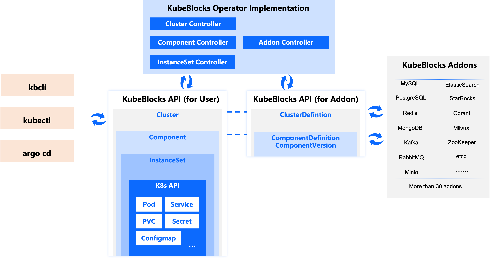

# Concepts

You've already seen the benefits of using unified APIs to represent various databases in the section ["How Unified APIs Reduces Your Learning Curve"](./introduction.md#how-unified-apis-reduces-your-learning-curve). If you take a closer look at those examples, you'll notice two key concepts in the sample YAML files: **Cluster** and **Component**. For instance, `test-mysql` is a Cluster that includes a Component called `mysql` (with a componentDef of `apecloud-mysql`). Similarly, `test-redis` is also a Cluster, and it includes two Components: one called `redis` (with a componentDef of `redis-7`), which has two replicas, and another called `redis-sentinel` (with a componentDef of `redis-sentinel`), which has three replicas.

In this document, we will explain the reasons behind these two concepts and provide a brief introduction to the underlying API (i.e., CRD).

## Motivation of KubeBlocks’ Layered API
In KubeBlocks, to support the management of various databases through a unified API, we need to abstract the topologies and characteristics of different databases.

We’ve observed that database systems deployed in production environments often use a topology composed of multiple components. For example, a production MySQL cluster might include several Proxy nodes (such as ProxySQL, MaxScale, Vitess, WeScale, etc.) alongside multiple MySQL server nodes (like MySQL Community Edition, Percona, MariaDB, ApeCloud MySQL, etc.) to achieve higher availability and read-write separation. Similarly, Redis deployments typically consist of a primary node and multiple read replicas, managed for high availability via Sentinel. Some users even use twemproxy for horizontal sharding to achieve greater capacity and throughput.

This modular approach is even more pronounced in distributed database systems, where the entire system is divided into distinct components with clear and singular responsibilities, such as data storage, query processing, transaction management, logging, and metadata management. These components interact over the network to ensure strong consistency and transactional guarantees similar to those of a single-node database, enabling complex operations such as load balancing, distributed transactions, and disaster recovery with failover capabilities.

So KubeBlocks employs a design of layered API (i.e. CRDs), consisting of **Cluster** and **Component**, to accommodate the multi-component and highly variable deployment topology of database systems. These abstractions allow us to flexibly represent and manage the diverse and dynamic topologies of database systems when deployed on Kubernetes, and to easily assemble Components into Clusters with the chosen topology.

Components serve as the building blocks of a Cluster. Actually Addon developers can define how multiple Components are assembled into different topologies within the ClusterDefinition (But wait, does that sound complicated? If you're not an Addon developer, you don't need to worry about the details of ClusterDefinition; you just need to know that Addons can provide different topologies for you to choose from). For example, the Redis Addon provides three topologies: "standalone" "replication" and "replication-twemproxy". Users can specify the desired topology when creating a Cluster.
Here is an example that creates a Redis Cluster with `clusterDefinitionRef` and `topology`:

```yaml
apiVersion: apps.kubeblocks.io/v1alpha1
kind: Cluster
metadata:
  name: test-redis-use-topology
  namespace: default
spec:
  clusterDefinitionRef: redis
  topology: replication
  terminationPolicy: Delete
  componentSpecs:
  - name: redis
    replicas: 2
    disableExporter: true
    resources:
      limits:
        cpu: '0.5'
        memory: 0.5Gi
      requests:
        cpu: '0.5'
        memory: 0.5Gi
    volumeClaimTemplates:
    - name: data
      spec:
        accessModes:
        - ReadWriteOnce
        resources:
          requests:
            storage: 10Gi
  - name: redis-sentinel
    replicas: 3
    resources:
      limits:
        cpu: '0.5'
        memory: 0.5Gi
      requests:
        cpu: '0.5'
        memory: 0.5Gi
    volumeClaimTemplates:
      - name: data
        spec:
          accessModes:
            - ReadWriteOnce
          resources:
            requests:
              storage: 10Gi
```
If you have a sharp eye, you'll notice that by specifying `clusterDefinitionRef` and `topology` in Cluster, you no longer need to specify `componentDef` for each Component.

Lastly, here’s an interesting fact: do you know why this project is called KubeBlocks? You see, through the Component API, we package database containers into standardized building blocks that can be assembled into a database Cluster according to the specified topology and run on Kubernetes. We think this process feels a lot like building with Lego blocks.

## Take a closer look at the KubeBlocks API

The major KubeBlocks CRDs are illustrated in the diagram below. We have specifically highlighted the layered structure of the API. Other important APIs, such as OpsRequest, Backup, and Restore, are not shown in this diagram. They were omitted to keep the focus on the layering, making the diagram clearer. We will explain these additional APIs in other documents.



KubeBlocks' CRDs can be categorized into two major classes: those for users and those for Addons.

**CRDs for users**

The CRDs for users include Cluster, Component, and InstanceSet. When creating a database cluster with KubeBlocks, these CRs will be generated. Specifically:
- The Cluster object is created by the user.
- The Component object is a child resource recursively created by the KubeBlocks Cluster Controller when it detects the Cluster object.
- The InstanceSet object is a child resource recursively created by the KubeBlocks Component Controller when it detects the Component object. The InstanceSet Controller then recursively creates the Pod and PVC objects.

**CRDs for Addons**

The CRDs for Addons include ClusterDefinition, ComponentDefinition, and ComponentVersion. These CRs are written by Addon developers and bundled within the Addon's Helm chart.

:::note

Although users do not need to write CRs for ClusterDefinition and ComponentDefinition, they do need to use these CRs. As seen in the previous examples of creating a Redis Cluster, when users create a Cluster, they either specify the name of the corresponding ComponentDefinition CR in each Component's `componentDef` or specify the name of the corresponding ClusterDefinition CR in `clusterDefinitionRef` and the desired topology.
:::


### KubeBlocks API for User

#### Cluster
A Cluster object represents an entire database cluster managed by KubeBlocks. A Cluster can include multiple Components. Users specify the configuration for each Component here, and the Cluster Controller will generate and reconcile corresponding Component objects. Additionally, the Cluster Controller manages all Service addresses that are exposed at the Cluster level.

For distributed databases with a sharded-nothing architecture, like Redis Cluster, the Cluster supports managing multiple shards, with each shard managed by a separate Component. This architecture also supports dynamic resharding: if you need to scale out and add a new shard, you simply add a new Component; conversely, if you need to scale in and reduce the number of shards, you remove a Component.

#### Component
Component is a fundamental building block of a Cluster object. For example, a Redis Cluster can include Components like ‘redis’, ‘sentinel’, and potentially a proxy like ‘twemproxy’.

The Component object is responsible for managing the lifecycle of all replicas within a Component, It supports a wide range of operations including provisioning, stopping, restarting, termination, upgrading, configuration changes, vertical and horizontal scaling, failover, switchover, scheduling configuration, exposing Services, managing system accounts.

Component is an internal sub-object derived from the user-submitted Cluster object. It is designed primarily to be used by the KubeBlocks controllers, users are discouraged from modifying Component objects directly and should use them only for monitoring Component statuses.

#### InstanceSet
Starting from KubeBlocks v0.9, we have replaced StatefulSet with InstanceSet.

A database instance, or replica, consists of a Pod and several other auxiliary objects (PVC, Service, ConfigMap, Secret). InstanceSet is a Workload CRD responsible for managing a group of instances. In KubeBlocks, all workloads are ultimately managed through InstanceSet. Compared to Kubernetes native Workload CRDs like StatefulSet and Deployment, InstanceSet incorporates more considerations and designs specific to the database domain, such as each replica's role, higher availability requirements, and operational needs like taking specific nodes offline.

### KubeBlocks API for Addon

::: note

Only Addon developers need to understand the ClusterDefinition and ComponentDefinition APIs. As a result, KubeBlocks users can easily bypass these two APIs.
:::

#### ClusterDefinition
ClusterDefinition is an API used to define all available topologies of a database cluster, offering a variety of topological configurations to meet diverse deployment needs and scenarios.

Each topology includes a list of component, each linked to a ComponentDefinition, which enhances reusability and reduce redundancy. For example, widely used components such as etcd and Zookeeper can be defined once and reused across multiple ClusterDefinitions, simplifying the setup of new systems.

Additionally, ClusterDefinition also specifies the sequence of startup, upgrade, and shutdown for components, ensuring a controlled and predictable management of component lifecycles.

#### ComponentDefinition
ComponentDefinition serves as a reusable blueprint or template for creating Components, encapsulating essential static settings such as Component description, Pod templates, configuration file templates, scripts, parameter lists, injected environment variables and their sources, and event handlers. ComponentDefinition works in conjunction with dynamic settings from the Component, to instantiate Components during Cluster creation.

Key aspects that can be defined in a ComponentDefinition include:

- PodSpec template: Specifies the PodSpec template used by the Component.
- Configuration templates: Specify the configuration file templates required by the Component.
- Scripts: Provide the necessary scripts for Component management and operations.
- Storage volumes: Specify the storage volumes and their configurations for the Component.
- Pod roles: Outlines various roles of Pods within the Component along with their capabilities.
- Exposed Kubernetes Services: Specify the Services that need to be exposed by the Component.
- System accounts: Define the system accounts required for the Component. 

ComponentDefinitions also enable defining reactive behaviors of the Component in response to events, such as member join/leave, Component addition/deletion, role changes, switch over, and more. This allows for automatic event handling, thus encapsulating complex behaviors within the Component.


## What's Addon

KubeBlocks uses Addons to extend support for various database engines. An Addon represents an extension for a specific database engine, such as MySQL Addon, PostgreSQL Addon, Redis Addon, MongoDB Addon, and Kafka Addon. There are currently over 30 Addons available in the KubeBlocks repository.

An Addon includes CRs (Custom Resources) based on the ClusterDefinition, ComponentDefinition, and ComponentVersion CRDs, as well as some ConfigMaps (used as configuration templates or script file templates), script files, CRs defining how to perform backup and restore operations, and Grafana dashboard JSON objects.

The Addon will be packaged and installed in the form of a Helm chart. After the user installs a certain database engine's addon, they can reference the ClusterDefinition CR and ComponentDefinition CR included in the Addon when creating a Cluster, allowing them to create a Cluster for the corresponding database engine.
