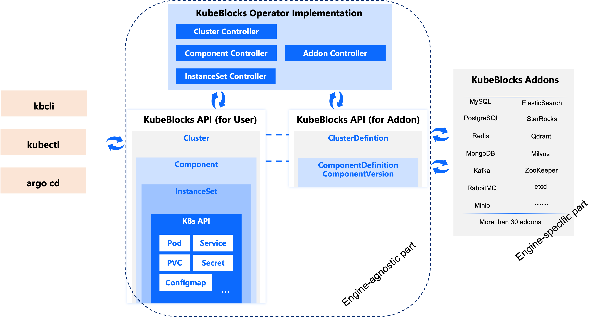

# Introduction

## What is KubeBlocks

KubeBlocks is an open-source Kubernetes operator for databases, enabling users to run and manage multiple types of databases on Kubernetes. As far as we know, most database operators typically manage only one specific type of database. For example:
- CloudNativePG, Zalando, CrunchyData, StackGres operator can manage PostgreSQL
- Strimzi manages Kafka
- Oracle and Percona MySQL operator manage MySQL

In contrast, KubeBlocks is designed to be a **general-purpose database operator**. This means that when designing the KubeBlocks API, we didn’t tie it to any specific database. Instead, we abstracted the common features of various databases, resulting in a universal, engine-agnostic API. Consequently, the operator implementation developed around this abstract API is also agnostic to the specific database engine.



In above diagram, Cluster, Component, and InstanceSet are all CRDs provided by KubeBlocks. If you'd like to learn more about them, please refer to [concepts](concept.md).

KubeBlocks offers an Addon API to support the integration of various databases. For instance, we currently have the following KubeBlocks Addons for mainstream open-source database engines:
- MySQL
- PostgreSQL
- Redis
- MongoDB
- Kafka
- RabbitMQ
- Minio
- Elasticsearch
- StarRocks
- Qdrant
- Milvus
- ZooKeeper
- etcd
- ...

For a detailed list of Addons and their features, please refer to [supported addons](supported-addons.md).

The unified API makes KubeBlocks an excellent choice if you need to run multiple types of databases on Kubernetes. It can significantly reduce the learning curve associated with mastering multiple operators.

## How unified APIs reduces your learning curve

Here is an example of how to use KubeBlocks' Cluster API to write a YAML file and create a MySQL Cluster with three replicas.

```yaml
apiVersion: apps.kubeblocks.io/v1alpha1
kind: Cluster
metadata:
  name: test-mysql
  namespace: default
spec:
  terminationPolicy: Delete
  componentSpecs:
  - name: mysql
    componentDef: apecloud-mysql
    replicas: 3
    resources:
      limits:
        cpu: '0.5'
        memory: 0.5Gi
      requests:
        cpu: '0.5'
        memory: 0.5Gi
    volumeClaimTemplates:
    - name: data
      spec:
        accessModes:
        - ReadWriteOnce
        resources:
          requests:
            storage: 10Gi
```
Then, here comes the magic: with just a few modifications to some fields, you can create a PostgreSQL Cluster with two replicas! The same applies to MongoDB and Redis (the Redis example is slightly longer because it creates two components: redis-server and sentinel), and this approach works with a long list of engines.

<Tabs>
<TabItem value="PostgreSQL" label="PostgreSQL" default>

```yaml
apiVersion: apps.kubeblocks.io/v1alpha1
kind: Cluster
metadata:
  name: test-postgresql
  namespace: default
spec:
  terminationPolicy: Delete
  componentSpecs:
  - name: postgresql
    componentDef: postgresql
    replicas: 2
    resources:
      limits:
        cpu: '0.5'
        memory: 0.5Gi
      requests:
        cpu: '0.5'
        memory: 0.5Gi
    volumeClaimTemplates:
    - name: data
      spec:
        accessModes:
        - ReadWriteOnce
        resources:
          requests:
            storage: 10Gi
```

</TabItem>

<TabItem value="MongoDB" label="MongoDB">

```yaml
apiVersion: apps.kubeblocks.io/v1alpha1
kind: Cluster
metadata:
  name: test-mongodb
  namespace: default
spec:
  terminationPolicy: Delete
  componentSpecs:
  - name: mongodb
    componentDef: mongodb
    replicas: 3
    resources:
      limits:
        cpu: '0.5'
        memory: 0.5Gi
      requests:
        cpu: '0.5'
        memory: 0.5Gi
    volumeClaimTemplates:
    - name: data
      spec:
        accessModes:
        - ReadWriteOnce
        resources:
          requests:
            storage: 10Gi
```
</TabItem>

<TabItem value="Redis" label="Redis">

```yaml
apiVersion: apps.kubeblocks.io/v1alpha1
kind: Cluster
metadata:
  name: test-redis
  namespace: default
spec:
  terminationPolicy: Delete
  componentSpecs:
  - name: redis
    componentDef: redis-7
    replicas: 2
    resources:
      limits:
        cpu: '0.5'
        memory: 0.5Gi
      requests:
        cpu: '0.5'
        memory: 0.5Gi
    volumeClaimTemplates:
    - name: data
      spec:
        accessModes:
        - ReadWriteOnce
        resources:
          requests:
            storage: 10Gi
  - name: redis-sentinel
    componentDef: redis-sentinel
    replicas: 3
    resources:
      limits:
        cpu: '0.5'
        memory: 0.5Gi
      requests:
        cpu: '0.5'
        memory: 0.5Gi
    volumeClaimTemplates:
      - name: data
        spec:
          accessModes:
            - ReadWriteOnce
          resources:
            requests:
              storage: 10Gi
```
</TabItem>

</Tabs>

This means that managing multiple databases on Kubernetes becomes simple, efficient, and standardized, saving you a lot of time that would otherwise be spent searching through manuals and API references.

## Key features

- Provisioning and destroy database clusters.
- Start, stop, and restart database clusters
- Supports selecting a deployment topology provided by the engine's Addon when creating a cluster, such as Redis with options for Sentinel-based read-write separation or Redis Cluster; MySQL with optional Proxy for read-write separation and HA solutions, e.g. the built-in Raft consensus plugin, external etcd as the coordinator, or Orchestrator.
- Supports having different configurations for multiple replicas within a single database cluster. This is common, for example, in a MySQL cluster where the primary instance uses 8 CPUs while the read replicas use 4 CPUs. Kubernetes' StatefulSet does not support this capability.
- Flexible Network Management:
  - Expose database access endpoints as Services (ClusterIP, LoadBalancer, NodePort) Dynamically.
  - Support for HostNetwork.
  - Some databases support access through a so-called Smart Client, which redirects requests to other nodes or handles read-write separation based on the node addresses returned by the server. Databases that with the Smart Client access mode include Redis, MongoDB, and Kafka. Additionally, some databases, such as etcd, have clients that implement automatic failover between replicas. For these databases, KubeBlocks supports assigning a service address to each Pod (Pod Service).
- Supports a Wide Range of Day-2 Operations:
  - Horizontal scaling (increasing and decreasing the number of replicas)
  - Vertical scaling (adjusting CPU and memory resources for each replica) 
  - PVC Volume capacity expansion
  - Backup and restore capabilities
  - Configuration changes (and hot reload, if possible)
  - Parameter modification
  - Switchover 
  - Rolling upgrades
  - Decommission a specific replica
  - Minor version upgrades
- In addition to the declarative API, KubeBlocks also offers an Ops API for executing one-time operational tasks on database clusters. The Ops API supports additional features such as queuing, concurrency control, progress tracking, and operation rollback.
- Observability: Supports integration with Prometheus and Grafana.
- Includes a powerful and intuitive command-line tool `kbcli`, which makes operating KubeBlocks CRs on Kubernetes more straightforward and reduces keystrokes. For those well-versed in Kubernetes, kbcli can be used alongside kubectl to provide a more streamlined way of performing operations.

## Deployment Architecture
Below is a typical diagram illustrating the deployment of KubeBlocks in a cloud environment.

Kubernetes should be deployed in an environment where nodes can communicate with each other over the network (e.g., within a VPC). The KubeBlocks Operator is deployed in a dedicated namespace (kb-system), while database instances are deployed in user-specified namespaces.

In a production environment, we recommend deploying the KubeBlocks Operator (along with Prometheus and Grafana, if installed) on different nodes from the databases. By default, multiple replicas of a database cluster are scheduled to run on different nodes using anti-affinity rules to ensure high availability. Users can also configure AZ-level anti-affinity to distribute database replicas across different availability zones (AZs), thereby enhancing disaster recovery capabilities.

Each database replica runs within its own Pod. In addition to the container running the database process, the Pod includes several sidecar containers: one called `lorry` (which will be renamed to kbagent starting from KubeBlocks v1.0) that executes Action commands from the KubeBlocks controller, and another called `config-manager` that manages database configuration files and supports hot updates. Optionally, The engine's Addon may have an exporter container to collect metrics for Prometheus monitoring.


