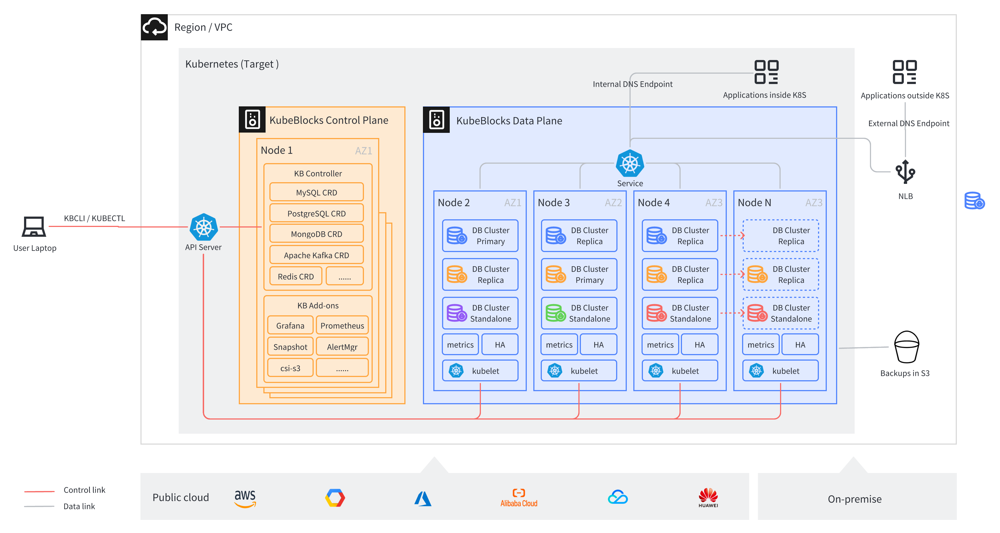

# Introduction

## What is KubeBlocks

KubeBlocks is an open-source control plane software that runs and manages databases, message queues and other data infrastructure on K8s. The name KubeBlocks is inspired by Kubernetes and LEGO blocks, signifying that running and managing data infrastructure on K8s can be standard and productive, like playing with LEGO blocks.

KubeBlocks could manage various type of engines, including RDBMSs (MySQL, PostgreSQL), Caches(Redis), NoSQLs (MongoDB), MQs(Kafka, Pulsar), and vector databases(Milvus, Qdrant, Weaviate), and the community is actively integrating more types of engines into KubeBlocks. Currently it has supported 36 types of engines!

The core of KubeBlocks is a K8s operator, which defines a set of CRDs to abstract the common attributes of various engines. KubeBlocks helps developers, SREs, and platform engineers deploy and maintain dedicated DBPaaS, and supports both public cloud vendors and on-premise environments.

## Why you need KubeBlocks

Kubernetes has become the de facto standard for container orchestration. It manages an ever-increasing number of stateless workloads with the scalability and availability provided by ReplicaSet and the rollout and rollback capabilities provided by Deployment. However, managing stateful workloads poses great challenges for Kubernetes. Although StatefulSet provides stable persistent storage and unique network identifiers, these abilities are far from enough for complex stateful workloads.

To address these challenges, and solve the problem of complexity, KubeBlocks introduces ReplicationSet and ConsensusSet, with the following capabilities:

- Role-based update order reduces downtime caused by upgrading versions, scaling, and rebooting.
- Maintains the status of data replication and automatically repairs replication errors or delays.

## Key features

- Be compatible with AWS, GCP, Azure, and Alibaba Cloud.
- Supports MySQL, PostgreSQL, Redis, MongoDB, Kafka, and more.
- Provides production-level performance, resilience, scalability, and observability.
- Simplifies day-2 operations, such as upgrading, scaling, monitoring, backup, and restore.
- Contains a powerful and intuitive command line tool.
- Sets up a full-stack, production-ready data infrastructure in minutes.

## Architecture

