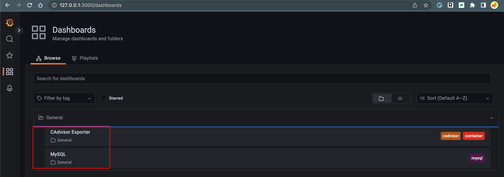
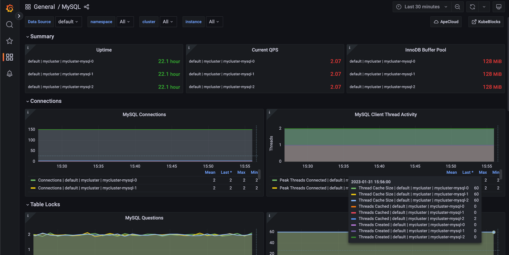
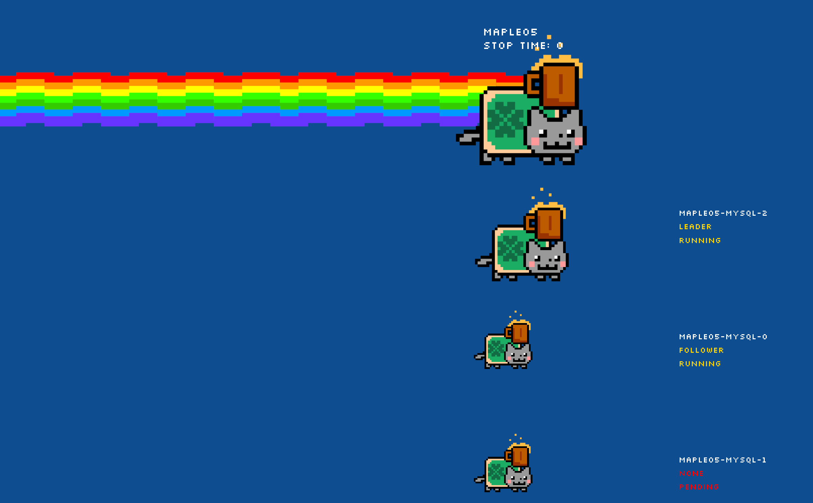

# Try out KubeBlocks in 5 minutes on your laptop

This guide walks you through the quickest way to get started with KubeBlocks, demonstrating how to create a KubeBlocks demo environment (Playground) with one command.

## Before you start

Meet the following requirements for a smooth user experience:

* Minimum system requirements:
  * CPU: 4 cores, use `sysctl hw.physicalcpu` command to check CPU;
  * RAM: 4 GB, use `top -d` command to check memory.

* Make sure the following tools are installed on your laptop:
  * [Docker](https://docs.docker.com/get-docker/): v20.10.5 (runc ≥ v1.0.0-rc93) or above;
  * [kubectl](https://kubernetes.io/docs/tasks/tools/#kubectl): it is used to interact with Kubernetes clusters;
  * [kbcli](./../installation/install-kbcli.md): it is used for the interaction between Playground and KubeBlocks.

## Initialize Playground

***Steps:***

1. Install Playground.

   ```bash
   kbcli playground init
   ```

   This command:
   1. Creates a Kubernetes cluster in the container with [K3d](https://k3d.io/v5.4.6/).
   2. Deploys KubeBlocks in the K3d cluster.
   3. Creates a standalone MySQL cluster.

2. Check the MySQL cluster repeatedly until the status becomes `Running`. 

   ```bash
   kbcli cluster list
   ```

   **Result:**

   You just created a cluster named `mycluster` in the default namespace. You can find the user guide under the installation success tip. View this guide again by running `kbcli playground init -h`.

## Try KubeBlocks with Playground

You can explore KubeBlocks, by referring to [Describe a MySQL cluster](#describe-a-mysql-cluster), [Access a MySQL cluster](#access-a-mysql-cluster), [Observe a MySQL cluster](#observe-a-mysql-cluster), and [High availability](#high-availability-of-mysql). Go through the following instructions to try basic features of KubeBlocks.

:::note

Playground does not support volume expansion, backup, and restore functions.

:::

### Describe a MySQL cluster

***Steps:***

1. View the database cluster list.

    ```bash
    kbcli cluster list
    ```

2. View the details of a specified database cluster and get information like `STATUS`, `Endpoints`, `Topology`, `Images`, and `Events`.

    ```bash
    kbcli cluster describe mycluster
    ```

### Access a MySQL cluster

**Option 1.** Connect database inside Kubernetes cluster.

Wait until the status of this cluster is `Running`, then run `kbcli cluster connect` to access a specified database cluster. For example,

```bash
kbcli cluster connect mycluster
```

**Option 2.** Connect database from host network.

***Steps:***

1. Get Credentials.
   ```bash
   kbcli cluster connect --show-example --client=cli mycluster
   ```
3. Run `port-forward` to connect the cluster from host network.

   ```bash
   kubectl port-forward service/mycluster-mysql 3306:3306
   >
   Forwarding from 127.0.0.1:3306 -> 3306
   Forwarding from [::1]:3306 -> 3306

3. Open another terminal tab to connect the MySQL Client.

   ```bash
   mysql -h 127.0.0.1 -P 3306 -u root -paiImelyt
   >
   ...
   Type 'help;' or '\h' for help. Type '\c' to clear the current input statement.

   mysql> show databases;
   >
   +--------------------+
   | Database           |
   +--------------------+
   | information_schema |
   | mydb               |
   | mysql              |
   | performance_schema |
   | sys                |
   +--------------------+
   5 rows in set (0.02 sec)
   ```

### Observe a MySQL cluster

KubeBlocks supports complete observability capabilities. This section demonstrates the monitoring function of KubeBlocks.

***Steps:***

1. Open the grafana dashboard.

   ```bash
   kbcli dashboard open kubeblocks-grafana
   ```

   **Result**

   A monitoring page on Grafana website is loaded automatically after the command is executed.

2. Click the Dashboard icon on the left bar and monitoring panels show on the page.
   
3. Click **General** -> **MySQL** to monitor the status of the MySQL cluster.
   

### High availability of MySQL

This guide shows a simple failure simulation to show you the failure recovery capability of MySQL.

#### Delete the Standalone MySQL cluster

Delete the Standalone MySQL cluster before trying out high availability.

```bash
kbcli cluster delete mycluster
```

#### Create a Raft MySQL cluster

You can use `kbcli` to create a Raft MySQL cluster. The following is an example of creating a Raft MySQL cluster with default configurations.

```bash
kbcli cluster create --cluster-definition='apecloud-mysql' --set replicas=3
```

#### Simulate leader pod failure recovery

In this example, delete the leader pod to simulate a failure.

***Steps:***

1. Make sure the newly created cluster is `Running`.

   ```bash
   kbcli cluster list
   ```

2. Find the leader pod name in `Topology`. In this example, the leader pod's name is maple05-mysql-1.

   ```bash
   kbcli cluster describe maple05
   >
   Name: maple05         Created Time: Jan 27,2023 17:33 UTC+0800
   NAMESPACE        CLUSTER-DEFINITION        VERSION                STATUS         TERMINATION-POLICY
   default          apecloud-mysql            ac-mysql-8.0.30        Running        WipeOut

   Endpoints:
   COMPONENT        MODE             INTERNAL                EXTERNAL
   mysql            ReadWrite        10.43.29.51:3306        <none>

   Topology:
   COMPONENT        INSTANCE               ROLE            STATUS         AZ            NODE                                                 CREATED-TIME
   mysql            maple05-mysql-1        leader          Running        <none>        k3d-kubeblocks-playground-server-0/172.20.0.3        Jan 30,2023 17:33 UTC+0800
   mysql            maple05-mysql-2        follower        Running        <none>        k3d-kubeblocks-playground-server-0/172.20.0.3        Jan 30,2023 17:33 UTC+0800
   mysql            maple05-mysql-0        follower        Running        <none>        k3d-kubeblocks-playground-server-0/172.20.0.3        Jan 30,2023 17:33 UTC+0800

   Resources Allocation:
   COMPONENT        DEDICATED        CPU(REQUEST/LIMIT)        MEMORY(REQUEST/LIMIT)        STORAGE-SIZE        STORAGE-CLASS
   mysql            false            <none>                    <none>                       <none>              <none>

   Images:
   COMPONENT        TYPE         IMAGE
   mysql            mysql        docker.io/apecloud/wesql-server:8.0.30-5.alpha2.20230105.gd6b8719

   Events(last 5 warnings, see more:kbcli cluster list-events -n default mycluster):
   TIME        TYPE        REASON        OBJECT        MESSAGE
   ```

3. Delete the leader pod.

   ```bash
   kubectl delete pod maple05-mysql-1
   >
   pod "maple05-mysql-1" deleted
   ```

4. Connect to the Raft MySQL cluster. It can be accessed within seconds.

   ```bash
   kbcli cluster connect maple05
   >
   Connect to instance maple05-mysql-2: out of maple05-mysql-2(leader), maple05-mysql-1(follower), maple05-mysql-0(follower)
   Welcome to the MySQL monitor.  Commands end with ; or \g.
   Your MySQL connection id is 33
   Server version: 8.0.30 WeSQL Server - GPL, Release 5, Revision d6b8719

   Copyright (c) 2000, 2022, Oracle and/or its affiliates.

   Oracle is a registered trademark of Oracle Corporation and/or its
   affiliates. Other names may be trademarks of their respective
   owners.

   Type 'help;' or '\h' for help. Type '\c' to clear the current input statement.

   mysql>
   ```

#### Demonstrate availability failure by NON-STOP NYAN CAT (for fun)

The above example uses `kbcli cluster connect` to test availability, in which the changes are not obvious to see.

NON-STOP NYAN CAT is a demo application to observe how the database cluster exceptions affect actual businesses. Animations and real-time key information display provided by NON-STOP NYAN CAT can directly show the availability influences of database services.

***Steps:***

1. Install the NYAN CAT demo application.

   ```bash
   kbcli addon enable nyancat
   ```

   <details>

   <summary>Expected output</summary>

   ```bash
   addon.extensions.kubeblocks.io/nyancat enabled   
   ```

   </details>

2. Check the NYAN CAT add-on status and when its status is `Enabled`, this application is ready.

   ```bash
   kbcli addon list | grep nyancat 
   ```

3. Open the web page.

   ```bash
   kbcli dashboard open kubeblocks-nyancat
   ```

4. Open another terminal tab and delete the leader pod. Then view the influences on the ApeCloud MySQL cluster through the NYAN CAT page.

   ```bash
   kubectl delete pod maple05-mysql-1
   ```

   

5. Uninstall the NYAN CAT demo application after your trial.

   ```bash
   kbcli addon disable nyancat
   ```

## Destroy Playground

Destroying Playground cleans up resources and data:

* Delete all KubeBlocks database clusters.
* Uninstall KubeBlocks.
* Delete the Kubernetes cluster created by K3d.

Destroy Playground.

```bash
kbcli playground destroy
```
