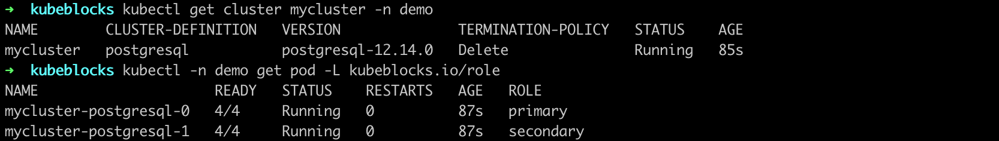
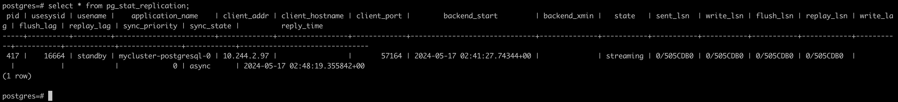
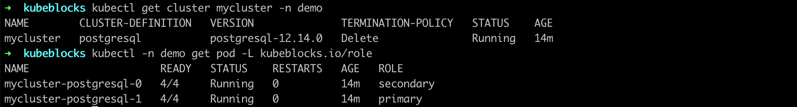

# High availability

KubeBlocks integrates [the open-source Patroni solution](https://patroni.readthedocs.io/en/latest/) to realize high availability and adopts Noop as the switch policy.

## Before you start

* [Install KubeBlocks](./../../installation/install-kubeblocks.md).
* [Create a PostgreSQL Replication Cluster](./../cluster-management/create-and-connect-a-postgresql-cluster.md#create-a-postgresql-cluster).
* Check whether the following role probe parameters exist to verify the role probe is enabled.

    ```bash
    kubectl get cd postgresql -o yaml
    >
    probes:
      roleProbe:
        failureThreshold: 2
        periodSeconds: 1
        timeoutSeconds: 1
    ```

## Steps

1. View the initial status of the PostgreSQL cluster and pods.

   ```bash
   kubectl get cluster mycluster -n demo

   kubectl -n demo get pod -L kubeblocks.io/role
   ```

   

   Currently, `mycluster-postgresql-0` is the primary pod and `mycluster-postgresql-1` is the secondary pod.

2. Simulate a primary pod exception.

   ```bash
   # Enter the primary pod
   kubectl exec -it mycluster-postgresql-0 -n demo -- bash

   # Delete the data directory of PostgreSQL to simulate an exception
   root@mycluster-postgresql-0:/home/postgres# rm -fr /home/postgres/pgdata/pgroot/data
   ```

3. View logs to observe how the roles of pods switch  when an exception occurs.

   ```bash
   # View the primary pod logs
   kubectl logs mycluster-postgresql-0 -n demo
   ```

   In the logs, the leader lock is released from the primary pod and an HA switch occurs.

   ```bash
   2024-05-17 02:41:23,523 INFO: Lock owner: mycluster-postgresql-0; I am mycluster-postgresql-0
   2024-05-17 02:41:23,702 INFO: Leader key released
   2024-05-17 02:41:23,904 INFO: released leader key voluntarily as data dir empty and currently leader
   2024-05-17 02:41:23,905 INFO: Lock owner: mycluster-postgresql-1; I am mycluster-postgresql-0
   2024-05-17 02:41:23,906 INFO: trying to bootstrap from leader 'mycluster-postgresql-1'
   ```

   ```bash
   # View secondary pod logs
   kubectl logs mycluster-postgresql-1 -n demo
   ```

   In the logs, the original secondary pod has obtained the lock and become the leader.

   ```bash
   2024-05-17 02:41:35,806 INFO: no action. I am (mycluster-postgresql-1), the leader with the lock
   2024-05-17 02:41:45,804 INFO: no action. I am (mycluster-postgresql-1), the leader with the lock
   ```

4. Connect to the PostgreSQL cluster to view the replication information.

   ```bash
   kubectl get secrets -n demo mycluster-conn-credential -o jsonpath='{.data.\username}' | base64 -d
   >
   postgres

   kubectl get secrets -n demo mycluster-conn-credential -o jsonpath='{.data.\password}' | base64 -d
   >
   shgkz4z9

   kubectl exec -ti -n demo mycluster-postgresql-1 -- bash

   root@mycluster-postgresql-0:/home/postgres# psql -U postgres -W
   Password: shgkz4z9
   ```

   ```bash
   postgres=# select * from pg_stat_replication;
   ```

   

   From the output, `pg-cluster-postgresql-0` has been assigned as the secondary pod.

5. View the status of the PostgreSQL cluster and pods again.

   ```bash
   kubectl get cluster mycluster -n demo

   kubectl -n demo get pod -L kubeblocks.io/role
   ```

   

   After the failover, `mycluster-postgresql-0` becomes the secondary pod and `pg-cluster-postgresql-1` becomes the primary pod.
