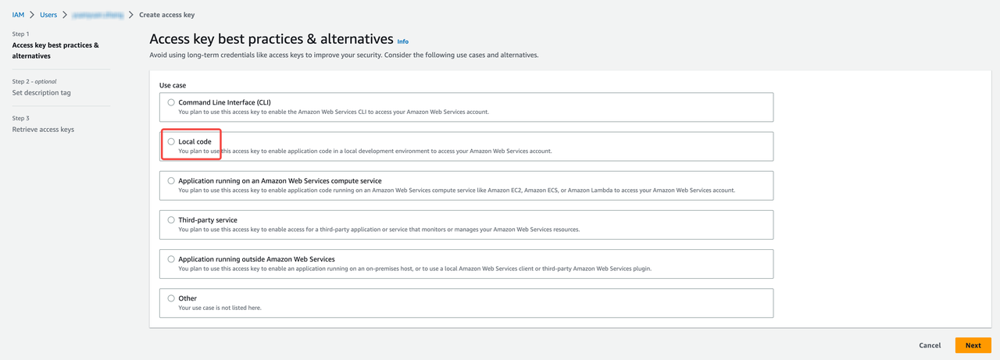

import Tabs from '@theme/Tabs';
import TabItem from '@theme/TabItem';

# 前提条件

## 检查权限

故障注入需要 `local code` 权限，请确保访问密钥已被授予 `local code` 权限。

<Tabs>
<TabItem value="EKS" label="EKS" default>

前往 [IAM](https://console.amazonaws.cn/iamv2/home?#/home)，点击**用户** -> **用户名** -> **创建访问密钥**，然后选择**本地代码**。



:::note

在创建新的访问密钥后，需要重新设置 `aws configure`。

:::

</TabItem>

<TabItem value="GKE" label="GKE">

验证帐户是否具有创建 Podchaos 的权限。

```bash
kubectl auth can-i create podchaos.chaos-mesh.org -n default --as "useraccont"
```

如果输出为 yes，则表示已具备所需的权限。

如果输出为 no，请删除验证流程，解决此问题。

```bash
kubectl delete validatingwebhookconfigurations.admissionregistration.k8s.io chaos-mesh-validation-auth
```

如果输出为 `reauth related error`，则可能与你的 GKE 帐户权限有关。执行以下命令，重置权限并清理环境。

```bash
rm -rf .config/gcloud

gcloud init

gcloud auth application-default login

export GOOGLE_PROJECT=xxx

kubectl delete secret cloud-key-secret-gcp
```

</TabItem>

</Tabs>

## 部署 Chaos Mesh

KubeBlocks 支持通过 Helm 或 kbcli 部署 Chaos Mesh。

这里使用 ChaosMesh v2.5.2，并启用 DNS 服务器进行 DNS 故障注入。

<Tabs>
<TabItem value="kbcli" label="kbcli" default>

执行以下命令，在 Containerd 中安装 ChaosMesh：

```bash
kbcli addon enable fault-chaos-mesh
```

执行以下命令，在 k3d/k3s 中安装 ChaosMesh：

```bash
kbcli addon enable fault-chaos-mesh --set dnsServer.create=true --set chaosDaemon.runtime=containerd --set chaosDaemon.socketPath=/run/k3s/containerd/containerd.sock
```

如果设置了污点（taints），可以使用以下命令设置容忍度（tolerations）：

```bash
# 默认情况下，ChaosMesh 遵循 KubeBlocks 的容忍度
# 你可以根据需要为 fault-chaos-mesh 的四个组件（controllerManager、chaosDaemon、dashboard 和 dnsServer）指定容忍度。
# 一旦为某个组件指定了容忍度，所有组件的默认容忍度都将失效。建议要么为四个组件都指定容忍度，要么都不指定。
kbcli addon enable fault-chaos-mesh \
--tolerations '[{"key":"kb-controller","operator":"Equal","effect":"NoSchedule","value":"true"}]' \
--tolerations 'chaosDaemon:[{"key":"kb-controller","operator":"Equal","effect":"NoSchedule","value":"true"},{"key":"kb-data","operator":"Equal","effect":"NoSchedule","value":"true"}]' \
--tolerations 'dashboard:[{"key":"kb-controller","operator":"Equal","effect":"NoSchedule","value":"true"}]' \
--tolerations 'dnsServer:[{"key":"kb-controller","operator":"Equal","effect":"NoSchedule","value":"true"}]' 
```

</TabItem>

<TabItem value="Helm" label="Helm">

```bash
helm repo add chaos-mesh https://charts.chaos-mesh.org
kubectl create ns chaos-mesh
```

执行以下命令，在 Containerd 中安装 ChaosMesh：

```bash
helm install chaos-mesh chaos-mesh/chaos-mesh -n=chaos-mesh --version 2.5.2 --set chaosDaemon.privileged=true --set dnsServer.create=true --set chaosDaemon.runtime=containerd --set chaosDaemon.socketPath=/run/containerd/containerd.sock
```

执行以下命令，在 k3d/k3s 中安装 ChaosMesh：

```bash
helm install chaos-mesh chaos-mesh/chaos-mesh -n=chaos-mesh --version 2.5.2 --set chaosDaemon.privileged=true --set dnsServer.create=true --set chaosDaemon.runtime=containerd --set chaosDaemon.socketPath=/run/k3s/containerd/containerd.sock
```

</TabItem>

</Tabs>
