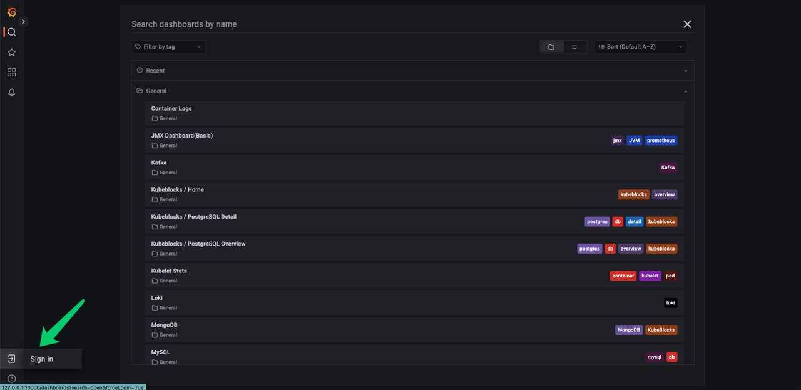

# 监控

本文档以 Oracle MySQL 为例，介绍如何在 KubeBlocks 中配置监控（点击参考[完整 PR](https://github.com/apecloud/learn-kubeblocks-addon/tree/main/tutorial-4-monitor-cluster/oracle-mysql)）。

## 开始之前

1. 了解 K8s 基本概念，例如 Pod、Sidecar 模式等。
2. 阅读并完成[添加数据库引擎](./how-to-add-an-add-on.md)文档中的步骤。
3. 了解基本的监控系统概念，例如 Prometheus、 Grafana 等。

## 背景知识

监控是 Kubernetes 可观测体系的一个重要部分，可以帮助开发者查看系统运行状态，快速定位问题。

Kubeblocks 目前以数据库引擎 add-on 的形式集成了 Prometheus 和 Grafana 监控组件。本文档介绍如何适配 Prometheus/Grafana 方案。

### Prometheus 简介

Prometheus 提供了一个开源监控解决方案，集成了指标收集、指标存储、告警通知等功能。

Prometheus 在云原生、容器化和微服务架构中广泛应用，它可以帮助开发人员和运维团队实时监控应用程序的性能和健康状态，以便更快速地识别和解决问题，确保应用程序的可靠性和可用性。它通常与 Grafana 一起使用，以创建强大的监控和可观察性解决方案。

### Grafana 简介

Grafana 是一个开源的分析和监控平台，广泛用于可视化时间序列数据。它允许用户创建交互式和可自定义的仪表盘，以监视、分析和理解来自各种来源的数据。

:paperclip: Table 1. Terminology

| 术语 | 说明 |
| :--  | :---------- |
| Prometheus Exporter | Prometheus 导出器是一个用于采集监控数据并通过 Prometheus 监控规范对外提供数据的组件。<br /> 更详细的 Exporter 列表可参考 [Prometheus  Exporter List](https://prometheus.io/docs/instrumenting/exporters/)。 |
| Prometheus Metrics | Prometheus 指标通常用于监控和性能分析的数据，例如应用程序的请求计数、响应时间、CPU使用率、内存使用量等。 |
| Grafana Dashboard | Grafana 仪表盘是一个可视化界面，用于呈现和展示数据，通常用于监控和分析各种时间序列数据。 |

KubeBlocks 集成的 Prometheus 已经配置了抓取任务，因此用户只需要配置 Exporter 即可。在 KubeBlocks 中，Exporter 以 Sidecar 的形式和数据库引擎的主容器部署在同一个 Pod 中。

## 配置 Exporter

先选择一个合适的 Exporter。本文档基于 Oracle MySQL，所以需要一个 mysql-exporter。

### 配置 Exporter 版本

修改 ClusterVersion (`clusterversion.yaml`)。

可以从开源社区（比如 [Prometheus in Docker](https://hub.docker.com/u/prom)）找到合适的 Exporter。

```yaml
componentVersions:
- componentDefRef: mysql-compdef
  versionsContext:
    containers:
    - name: mysql-container
      image: ...
      imagePullPolicy: ..
    - name: mysql-exporter               
      image: prom/mysqld-exporter:v0.14.0
```

指定 mysql-exporter 镜像为 prom/mysqld-exporter，版本是 v0.14.0。

### 添加 Exporter 容器

修改 `clusterdefinition.yaml` 文件，以 Sidecar 形式配置 mysql-exporter。

```yaml
podSpec:
  containers:
    # mysql container 和其他 containers ->
    - name: mysql-exporter
      ports:
        - name: metrics
          containerPort: 9104
          protocol: TCP
      env:
        - name: "MYSQL_MONITOR_USER"
          valueFrom:
            secretKeyRef:
              name: $(CONN_CREDENTIAL_SECRET_NAME)
              key: username
        - name: "MYSQL_MONITOR_PASSWORD"
          valueFrom:
            secretKeyRef:
              name: $(CONN_CREDENTIAL_SECRET_NAME)
              key: password          
        - name: "DATA_SOURCE_NAME"
          value: "$(MYSQL_MONITOR_USER):$(MYSQL_MONITOR_PASSWORD)@(localhost:3306)/"
```

如 Line 4~ 21 所示，这里在原来的 PodSpec 中添加了一个新的容器，其中 `DATA_SOURCE_NAME` 为 mysql-exporter 的环境变量。

:::caution

不同的 Exporter 所需的环境变量不同，需要根据具体的 Exporter 特性来配置。

本文档使用的是 mysql exporter 0.14.0，在最新版本 mysql exporter 0.15.0 已经不再支持 `DATA_SOURCE_NAME`  变量。

:::

### 配置 monitor 属性

修改 `clusterdefinition.yaml` 文件，配置 `monitor` 属性。

```yaml
componentDefs:
  - name: mysql-compdef
    characterType: mysql
    service: ..
    monitor:
      exporterConfig:
        scrapePort: 9104        # Exporter 监听端口，用于 Prometheus Pull 数据
        scrapePath: "/metrics"  # Exporter 路径，用于 Prometheus Pull 数据
```

KuBeBlocks 支持多种监控方案。如果用开源的 Prometheus/Grafana 方案，需要在 `monitor` 中需要配置 Exporter 的监听端口和 metrics 路径。这里的配置需要和[添加 Exporter 容器](#添加-exporter-容器)中配置的容器端口（container-port）对应。

## 配置 Grafana 仪表盘

### 获取 Grafana 仪表盘配置

Grafana 仪表盘可以帮助用户实时监控、分析和理解数据的趋势。对主流数据库，用户可以轻松找到多种仪表盘的配置文件（JSON 格式）。
- [Grafana 官网](https://grafana.com/grafana/dashboards)。
- [KubeBlocks 仪表盘](https://github.com/apecloud/kubeblocks-mixin)。

### 添加到集群配置

在 Grapha 仪表盘页面中直接导入下载的 JSON 文件，或者将其配置到你的集群模板中。

后者更通用一些，所有通过该模板产生的集群都可以复用相同的配置。

为此，需要在原有的 Helm chart 上，新加两个文件：

- dashboards：保存 dashboard JSON 文件。
- grafana：创建一个 ConfigMap 保存 dashbaord JSON 文件中的内容。

```yaml
tree oracle-mysql
.
├── Chart.yaml
├── dashboards
│   └── mysql.json
├── templates
│   ├── NOTES.txt   
│   ├── _helpers.tpl
│   ├── clusterdefinition.yaml
│   └── clusterversion.yaml
│   └── grafana
│       └── configmap-dashboards.yaml
└── values.yaml

4 directories, 8 files
```

## 监控集群数据

### 准备环境，开启 Prometheus 监控组件

执行 `kbcli addon list` 命令查看下列监控相关插件是否已启用（状态为 `Enabled`）。 

```bash
kbcli addon list
>
...
grafana                        Helm   Enabled                   true  
alertmanager-webhook-adaptor   Helm   Enabled                   true    
prometheus                     Helm   Enabled    alertmanager   true
...
```

如果未启用（状态为 `Disabled`），则需要逐一启用：

```bash
kbcli addon enable prometheus
kbcli addon enable alertmanager-webhook-adaptor
kbcli addon enable grafana
```

启用后，可以看到集成的三个 Dashboard。

```bash
kbcli dashboard list
>
NAME                                 NAMESPACE   PORT    CREATED-TIME
kubeblocks-grafana                   kb-system   13000   Jul 24,2023 11:38 UTC+0800
kubeblocks-prometheus-alertmanager   kb-system   19093   Jul 24,2023 11:38 UTC+0800
kubeblocks-prometheus-server         kb-system   19090   Jul 24,2023 11:38 UTC+0800
```

### 创建数据库集群

1. 安装集群模板。

   ```bash
   helm install oracle-mysql ./path-to-your-helm-chart/oracle-mysql
   ```

2. 开启监控。

   Opt 1. 创建集群时开启

   ```bash
   kbcli cluster create mycluster --cluster-definition='oracle-mysql' --monitor='true'
   ```

   Opt 2. 在已有集群中开启

   ```bash
   kbcli cluster update mycluster --monitor='true'
   ```

### 打开仪表盘

   ```bash
   # 查看可用的仪表盘
   kbcli dashboard list
   >
   NAME                                      NAMESPACE        PORT        CREATED-TIME
   kubeblocks-grafana                        default          3000        Jan 13,2023 10:53 UTC+0800
   kubeblocks-prometheus-alertmanager        default          9093        Jan 13,2023 10:53 UTC+0800
   kubeblocks-prometheus-server              default          9090        Jan 13,2023 10:53 UTC+0800

   # 选择 Grafana，使用默认浏览器打开网页控制台
   kbcli dashboard open kubeblocks-grafana
   ```

### 登录仪表盘



:::note

如果提示需要登录，请使用以下用户名和密码。

```bash
Username: admin 
Password: kubeblocks
```

:::

## 总结

本文档介绍了如何快速适配 Prometheus/Grafana 方案来监控你的数据库集群。KubeBlocks 未来还会推出基于 OpenTelemetry 的监控方案，敬请期待。

## 参考资料

1. [Prometheus](https://prometheus.io/)。
2. [Grafana 仪表盘](https://grafana.com/grafana/dashboards/)。
3. [创建仪表盘](https://grafana.com/docs/grafana/latest/dashboards/build-dashboards/create-dashboard/)。

## 附录

### A.1 关闭集群监控

KubeBlocks 支持通过 `kbcli` 动态启动和关闭某一个集群的监控：

```bash
kbcli cluster update mycluster --monitor='false'
```
