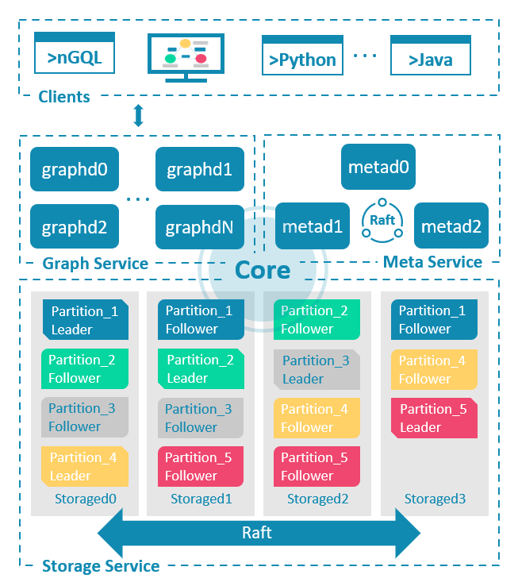
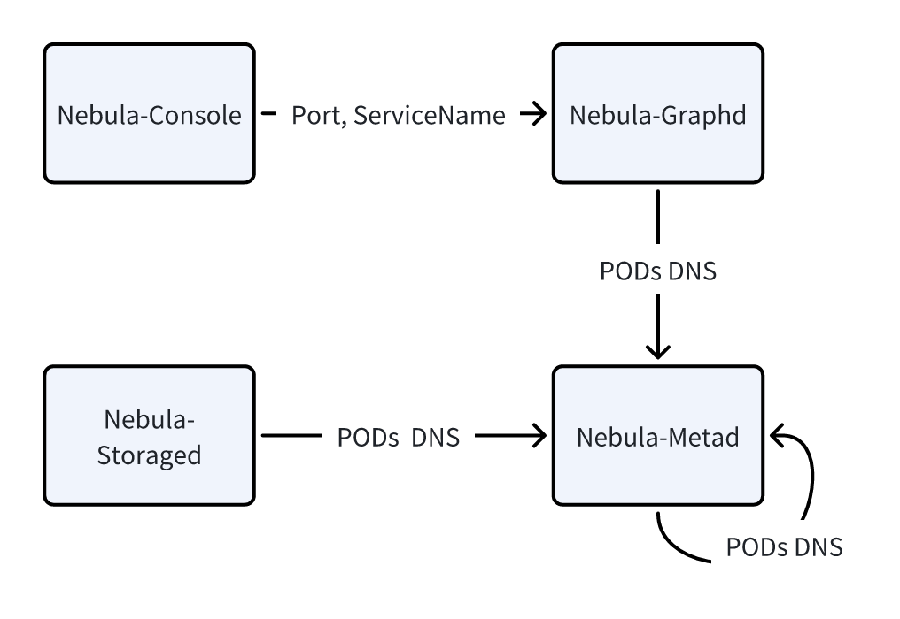

# 多组件配置

之前的文档介绍了单组件集群（例如 Oracel-MySQL）的定义、备份和配置。

本文档将以 NebulaGraph 为例，说明如何接入一个多组件集群，以及解释多组件配置中的几个常见问题（点击参考[完整 PR](https://github.com/apecloud/kubeblocks-addons/tree/main/addons/nebula)。

## 开始之前

- 阅读[添加数据库引擎](./how-to-add-an-add-on.md)文档。
- 了解 KubeBlocks 常见概念，例如 ClusterDefinition、Cluster、ComponentRef、Component 等。

## NebulaGraph 架构

在配置前，先了解一下 NebulaGraph 的整体架构。

NebulaGraph 是一种存储与计算分离的架构，由三种服务构成：Graph 服务、Meta 服务和 Storage 服务。具体架构见下图。



- Metad：是基于 Raft 协议的组件，负责数据管理。例如 Schema 操作、集群管理和用户权限管理等。
- Graphd：是计算组件，主要负责处理查询请求，包括解析查询语句、校验语句、生成和执行查询计划等。
- Storaged：是基于 Multi Group Raft 的分布式存储组件，负责存储数据。

如果把客户端也考虑进来：就多了一个组件。

- Client：是无状态组件，用于连接 Graphd，下发 graph query。

## 配置集群拓扑

现在你已经了解了 NebulaGraph 由哪 4 个组件组成，每个组件如何启动和配置了。

和单组件集群一样，你可以快速整理出一个多组件集群的定义。

```yaml
apiVersion: apps.kubeblocks.io/v1alpha1
kind: ClusterDefinition
metadata:
  name: nebula
spec:
  componentDefs:
    - name: nebula-console    # client
      workloadType: Stateless
      characterType: nebula
      podSpec: ...
    - name: nebula-graphd     # graphd
      workloadType: Stateful
      podSpec: ...
    - name: nebula-metad      # metad
      workloadType: Stateful
      podSpec: ...
    - name: nebula-storaged   # storaged
      workloadType: Stateful
      podSpec: ...
---
apiVersion: apps.kubeblocks.io/v1alpha1
kind: ClusterVersion
metadata:
  name: nebula-3.5.0
spec:
  clusterDefinitionRef: nebula   # clusterdef name
  componentVersions:
    - componentDefRef: nebula-console  # 指定 client image
      versionsContext:
        containers:
        - name: nebula-console
          image: ...
    - componentDefRef: nebula-graphd  # 指定 graphd image
      versionsContext:
        containers:
        - name: nebula-graphd
          image: 
    - componentDefRef: nebula-metad   # 指定 metad image
      versionsContext:
        containers:
        - name: nebula-metad
          image: ...
    - componentDefRef: nebula-storaged  # 指定 storaged image
      versionsContext:
        containers:
        - name: nebula-storaged
          image: ...
```

上述 YAML 文件展示了 NebulaGraph 的 ClusterDefinition 和 ClusterVersion 的大纲。

这里对应 NebulaGraph 的架构分别定义了 4 个组件（包括客户端）及其版本信息。

如果每个组件可以独立启动，那上述文件提供的信息就足够了。

但是一般来说，多组件集群的组件之间往往有属性依赖，该如何说明这一部分组件依赖的关系呢?

## 配置组件间依赖

在配置多组件集群的过程中可以发现，组件之间往往存在一些信息依赖。下图展示了 NebulaGraph 集群各个组件之间的依赖，例如：

1. Nebula-Console 需要知道 Nebula-Graphd 的端口号和服务名（Service Name）。
2. Nebula-Graphd 需要知道 metad 组件每个 Pod 的地址。
3. Nebula-Storaged 需要知道 metad 组件每个 Pod 的地址。



以下是 3 类常见的组件间依赖：

1. **Service Reference**

   例如 Nebula-Console 需要获取 Nebula-Graphd 的 Service Name。

2. **HostName Reference**

   例如 Nebula-Graphd 需要配置 Nebula-metad 的所有 Pod 的地址。该引用通常指向一个有状态的组件。

3. **Field Reference**

   例如 Nebula-Console 需要获取 Nebula-Graph 的某一个服务端口名。

这些被依赖的信息需要在集群启动时，通过环境变量的方式注入到该组件的 Pod 中（不论是通过 configmap 加载，还是定义为 pod env），这样才能确保集群正常启动。

在 KubeBlocks 中，可以通过 `ComponentDefRef` API 来实现。`ComponentDefRef` 引入了以下几个 API：

- `componentDefName` 用于指定被依赖的组件定义名；
- `componentRefEnv`,定义了一组需要被注入的环境变量：
  - `name`  定义了被注入的环境变量变量名称；
  - `valueFrom` 定义了个环境变量值的来源。

下面逐一说明 `ComponentDefRef` 是如何解决前面提到的 3 类重建依赖的。

### Service Reference

场景 1：Nebula-Console 需要获取 Nebula-Graphd 的 Service Name。

在定义 `nebula-console` 时，添加如下组件引用定义（见 `componentDefRef`）：

```yaml
    - name: nebula-console
      workloadType: Stateless
      characterType: nebula
      componentDefRef:
        - componentDefName: nebula-graphd
          componentRefEnv:
            - name: GRAPHD_SVC_NAME
              valueFrom:
                type: ServiceRef
```

- 指定被依赖的组件为 `nebula-graphd`。
- 被注入的环境变量名为 `GRAPHD_SVC_NAME`。
- 变量的值类型为 `ServerRef`，表示值来源于被依赖组件的 Service Name。

:::note

在 KubeBlocks 中，如果已经为某一个组件定义了 `service` 属性，那么在创建集群时，KubeBlocks 会为该组件创建一个名为 `{clusterName}-{componentName}` 的 Service。

:::

### HostName Reference

场景 2:  Nebula-Graphd 需要配置 Nebula-Metad 的所有 Pod 的地址。

```yaml
    - name: nebula-graphd
      workloadType: Statelful    
      componentDefRef:
        - componentDefName: nebula-metad
          componentRefEnv:
            - name: NEBULA_METAD_SVC
              valueFrom:
                type: HeadlessServiceRef
                format: $(POD_FQDN):9559    # 可选，指定值的格式
```

- 指定被依赖的组件为 `nebula-metad`。
- 被注入的环境变量名为 `NEBULA_METAD_SVC`。
- 变量的值类型为 `HeadlessServiceRef`。
  - 表示值来源于被依赖组件的所有 Pod FQDN，默认会用 `,` 连接多个值。
  - 若默认的 FQDN 格式不能满足你的需求，可以通过 `format` API 自定义格式 (如 Line 9 所示)。

:::note

KuBeBlocks 提供了三个内置变量作为 place-holder，在集群创建时会被替换为具体的值：

- `${POD_ORDINAL}`，即 Pod 的序数；
- `${POD_NAME}`，即 Pod 的名称，格式为 `{clusterName}-{componentName}-{podOrdinal}`；
- `${POD_FQDN}`，即 Pod 的 Full Qualified Domain Name（FQDN）。

在 KubeBlocks 中，每一个有状态的组件默认都会有一个 Headless Service，名为:
`headlessServiceName = {clusterName}-{componentName}-headless`。

因此，每个有状态组件的 Pod FQDN 的格式为
`POD_FQDN = {clusterName}-{componentName}-{podIndex}.{headlessServiceName}.{namespace}.svc`。

:::

### Field Reference

场景 3: Nebula-Console 需要获取 Nebula-Graph 的某一个服务端口名。

在 `nebula-console` 组件定义时，可添加如下配置（见 `componentDefRef`）。

```yaml
    - name: nebula-console
      workloadType: Stateless
      characterType: nebula
      componentDefRef:
        - componentDefName: nebula-graphd
          componentRefEnv:
            - name: GRAPHD_SVC_PORT
              valueFrom:
                type: FieldRef
                fieldPath: $.componentDef.service.ports[?(@.name == "thrift")].port
```

- 指定被依赖的组件为 `nebula-graphd`。
- 被注入的环境变量名为 `GRAPHD_SVC_PORT`。
- 变量的值类型为 `FieldRef`，表示值来源于被依赖组件的某一个属性值，通过 `fieldPath` 指定。

`fieldPath` 提供了一种通过 JSONPath 语法来解析属性值的方式。

KubeBlocks 在解析这里的 JSONPath 时，会默认注册两个 root objects：

- **componentDef**：即被引用的componentDef 对象。
- **components**：即创建的 Cluster 中，被引用的 componentDef 对应的所有组件。

因此，在 `fieldPath` 中可以用 `$.componentDef.service.ports[?(@.name == "thrift")].port` 表示获取该组件定义的 service 中名为 `thrift` 的端口号。

## 总结

本文档以 NebulaGraph 为例，介绍了多组件之间依赖的几种类型和解决方案。

除了 NebulaGraph，目前 GreptimeDB、Pulsar、RisingWave、StarRocks 等引擎也都使用了 `componentDefRef` API 来解决组件间引用的问题，可以参考它们的实现。

更多 `componentDefRef` API 的说明请参考 [ComponentDefRef API](https://kubeblocks.io/docs/release-0.6/developer_docs/api-reference/cluster#apps.kubeblocks.io/v1alpha1.ComponentDefRef)。

## 附录

### A1. YAML 小贴士

graphd、metad、storaged 都需要 metad 中集群各个 Pod FQDN，无需重复配置，只需要利用 YAML 的锚点就可以轻松解决：

```yaml
- name: nebula-graphd
  # ...
  componentDefRef:
    - &metadRef # 通过 `&` 定义锚点
      componentDefName: nebula-metad
      componentRefEnv:
        - name: NEBULA_METAD_SVC
          valueFrom:
            type: HeadlessServiceRef
            format: $(POD_FQDN){{ .Values.clusterDomain }}:9559
            joinWith: ","
- name: nebula-storaged
  componentDefRef:
    - *metadRef # 通过 `*` 使用锚点，避免重复定义
```
