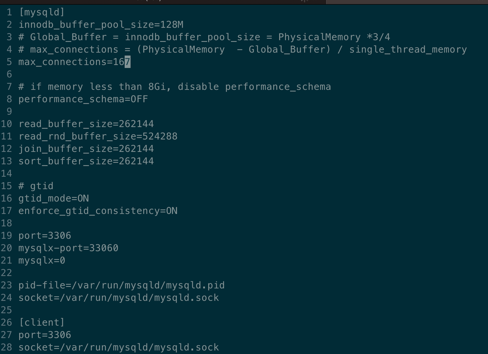
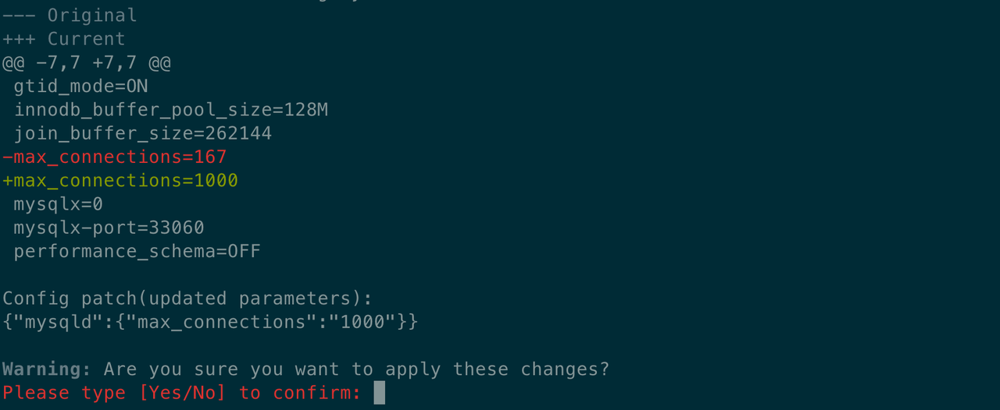

import Tabs from '@theme/Tabs';
import TabItem from '@theme/TabItem';

# 参数更新

本文档继续以 Oracle MySQL 为例，介绍如何在 KubeBlocks 中配置参数模板并更新参数（点击参考[完整 PR](https://github.com/apecloud/learn-kubeblocks-addon/tree/main/tutorial-3-config-and-reconfig/)）。

## 开始之前

1. 了解 K8s 基本概念，例如 Pod、ConfigMap 等。
2. 完成[教程 3](./parameter-template.md)。
3. 了解 Go Template (非必须)。
4. 了解 CUE Lang (非必须)。

## 背景知识

KubeBlocks 通过将 ConfgMap 挂载到卷的方式来添加配置，并秉持 Kubernetes-Native 的理念，即：`ConfigMap is the only source-of-truth`，将参数变更的入口收敛到 ConfigMap，防止出现配置漂移（drifting）。所以 KubeBlocks 的参数变更遵从以下顺序：
1. 先修改 ConfigMap 中的参数值；
2. 根据 ConfigMap 的变更推导出参数变化（add/delete/update）；
3. 将变更应用到引擎。

不同参数的更新方式不同，主要有以下两类：
- 静态参数，通过重启集群生效（冷更新）；
- 动态参数，通过动态刷参生效（热更新）。

Table 1. 枚举了 4 种常见的动态刷参方式，包括 UNIX Signal、SQL、Auto 等。目前 KubeBlocks 对接的引擎都可以通过其中一种或者多种方式来实现。例如，在 PostgreSQL 中，要实现动态刷参，可以：
- UNIX Signal：下发 `SIGHUP` 信号；
- Tools：调用 `pg_ctl` 命令；
- SQL：执行 SQL 语句，直接更新内存参数。

:paperclip: Table 1. 参数热更新方式总结

| 变更方式     | 说明 | 适用范围 |
| :---------- | :----------- | :------------ |
| Unix Signal | 例如 PostgreSQL。 <br /> 参数变更后，如果需要重新加载配置文件，可以给 PG 发送 `SIGHUP` 信号。 | 适用于支持 UNIX Signal 变更的引擎。 |
| SQL         | 例如 MySQL。 <br /> 需要通过 SQL 语句发下变更内容 `SET GLOBAL <var> =<value>`。 | 适用于大部分 RDBMS 引擎。 <br /> **注**: 需要适配 `execSQL` 接口。目前 KubeBlocks 只支持 MySQL 和 PostgreSQL。 |
| Tools       | 例如 Redis or MongoDB。 <br /> 提供了相关的 tools 工具来更新参数。 | 通过自定义脚本或者本地工具实现，通用性高。 |
| Auto        | 引擎本身会 watch 配置文件的变化，检查到配置文件变更后，会主动更新。 | 依赖引擎是否支持自动加载。 |

在[参数模板](./parameter-template.md)一文中提到，K8s 通过卷挂载方式使用 ConfigMap 时，该 ConfigMap 的变更会被更新到 Pod。但这个变更不是实时的。因此，KuBeBlocks 不仅需要区分参数的更新方式，还要 watch 对应的变更是否已经同步到 Pod 上。
了解这些背景之后，来看看 KubeBlocks 是怎么通过 `ConfigConstraint` API 管理参数变更的。

## ConfigConstraint

作为一个支持多引擎的平台，KubeBlocks 需要了解如下信息，更好地支持配置变更：

1. 配置文件的格式。

   不同格式的配置文件的结构不同。KubeBlocks 会根据结构解析配置文件，推导出每次变更的信息(增加/删除/更新的参数)。

2. 参数的作用方式。

   指定参数的作用方式（effect scope），知道哪些是动态参数，哪些是静态参数，哪些是不可变参数，帮助决策，使参数快速生效。

3. 参数动态变更的方式。

   如 Table 1. 所示，参数动态变更的方式很多。需要根据引擎指定其适用的动态变更方式。

4. 定义参数校验规则。

   用于校验参数的有效值，防止误操作。在生产环境中，经常会有“手误”写错了参数值，导致数据库无法启动的情况。参数校验增加了一层保护，提前做校验，防止此类误操作。

:::note

KubeBlocks 会为配置了 `ConfigConstraint` 的 Component 创建一个 config-manager sidecar，用于感知配置文件的更新、下发 Signal、执行参数更新脚本等。

:::

这些信息被抽象到 KubeBlocks 的 `ConfigConstraint`（参数约束）中，如下所示。其中一共有 4 个部分，对应前文提到的 4 个关键配置信息。

```yaml
apiVersion: apps.kubeblocks.io/v1alpha1
kind: ConfigConstraint
metadata:
  name: oracle-mysql-config-constraints
spec:
  # 1. 指定配置文件格式为 INI，且只关注其中 mysqld 小节的内容
  formatterConfig:
    format: ini
    iniConfig:
      sectionName: mysqld

  # 2. MySQL 的动态刷参方式，通过 reload-script 执行 SQL 语句
  reloadOptions:
    tplScriptTrigger:
      sync: true
      # 指定用哪个脚本文件更新
      scriptConfigMapRef: oracle-mysql-reload-script
      namespace: {{ .Release.Namespace }}

  ## 3.1 配置静态参数列表
  staticParameters:
    - open_files_limit
    - performance_schema
    - enforce_gtid_consistency

  ## 3.2 配置动态参数列表
  dynamicParameters:
    - innodb_buffer_pool_size
    - max_connections
    - gtid_mode

  ## 4. 通过 CUE 模板，定义参数校验规则 
  cfgSchemaTopLevelName: MysqlParameter
  configurationSchema:
    cue: |-
      {{- .Files.Get "config/oracle-mysql-config-constraint.cue" | nindent 6 }}
```

下面逐个解释每个 API 的使用方法。

### FormatterConfig

FormatterConfig 描述了配置文件的格式。常见的格式有 `ini`、`yaml`、`json`、`xml`、`properties` 等。配置文件本身只是一个文本信息，不同格式的文件都需要不同的解析器。

当 KubeBlocks 感知到配置文件变更时，会根据已知的格式推导出参数的变更(增/删/改)，并通知 Pod 去更新。

例如，MySQL 的可调整的参数来自 `ini` 格式，且只解析其中的 `mysqld` 字段信息。

```bash
  formatterConfig:
    format: ini               # 配置文件格式，目前支持 ini、xml、yaml、json、hcl 等格式
    iniConfig:
      sectionName: mysqld     # 如果是 ini 格式，可能包含多个 section，需要指定 section 名称
```

### ReloadOptions

ReloadOptions 描述了动态刷参的方式。

Table 1. 总结了 4 种常见的动态刷参方式。相应的，KubeBlocks 也支持配置多种刷参方式：

- tplScriptTrigger：通过模板文件刷参数；
- shellTrigger：通过执行脚本刷参；
- unixSignalTrigger：通过 UNIX Signal 刷参；
- 不配置：即 AutoLoad 模式，交由数据库引擎自动更新。

***示例***
- tplScriptTrigger

  本例选择 `tplScriptTrigger`，通过定义模板文件中的内容来配置参数。


  ```bash
    reloadOptions:
      tplScriptTrigger:                                 # 通过模板文件刷参
        sync: true                                      # 同步更新
        scriptConfigMapRef: oracle-mysql-reload-script  # 引用的模板文件 
        namespace: {{ .Release.Namespace }}
  ```

- shellTrigger

  `shellTrigger` 通过 Shell 脚本动态刷参。这是一种更通用的方案，因为大部分数据库都支持通过客户端更新参数。

  ```yaml
    reloadOptions:
      shellTrigger:
        sync: true
        command:
          - "update-dynamic-config.sh" 
  ```

:::note

这些 ReloadOptions 中的脚本会被加载到 Pod 上，通过前文提到的 config-manager sidecar 执行。

:::

### Static/Dynamic Parameters

KubeBlocks 支持配置动态参数（dynamic）、静态参数（static）和不可变参数（immutable）。这样区分是为了识别变更的参数类型，来决策参数的生效方式。

KubeBlocks 内置了多种刷参策略，根据变更内容，智能选择最合适的变更策略。

下面枚举了几个常见的 MySQL 参数，比如静态参数 `performance_schema`，动态参数 `max_connection`。如果参数列表过长，推荐使用 `.Files.Get` 函数处理。

```yaml
  ## 3.1 配置静态参数列表
  staticParameters:
    - open_files_limit
    - performance_schema
    - enforce_gtid_consistency

  ## 3.2 配置动态参数列表
  dynamicParameters:
    - innodb_buffer_pool_size
    - max_connections
    - gtid_mode
```

### ConfigurationSchema

在变更时，有时会因为写入了无效参数值，导致集群启动失败。

KubeBlocks 提供了 ConfigurationSchema 用于参数值有效性校验，主要使用 CUE 语言来做校验。通过描述每个参数的类型、默认值、取值范围等，防止因为参数值错误而导致问题。

下面提供了一个 MySQL 参数值校验配置。

```yaml
#MysqlParameter: {

    // Sets the autocommit mode
    autocommit?: string & "0" | "1" | "OFF" | "ON"

    open_files_limit: int | *5000

    // Enables or disables the Performance Schema
    performance_schema: string & "0" | "1" | "OFF" | "ON" | *"0"
    
    // The number of simultaneous client connections allowed.
    max_connections?: int & >=1 & <=100000    
    ...
 }
```

这里为 MySQL 中的参数 `performance_schema` 定义了一些约束。

- 参数值类型为 string；
- 参数取值可以为 ON，OFF 或者 0，1；
- 参数默认值为 0。

```yaml
    // Enables or disables the Performance Schema
    performance_schema: string & "0" | "1" | "OFF" | "ON" | *"0"
```

## 如何更新参数

KubeBlocks 通过命令行 kbcli 提供了更便捷的参数管理方式。

### 创建集群

KubeBlocks 支持用 kbcli 和 Helm 进行创建。

<Tabs>

<TabItem value="kbcli" label="kbcli" default>

```bash
kbcli cluster create mycluster --cluster-definition='oracle-mysql' --cluster-version oracle-mysql-8.0.32
```

</TabItem>

<TabItem value="Helm" label="Helm">

```bash
helm install oracle-mysql path-to-your-helm-chart/oracle-mysql
```

</TabItem>

</Tabs>

### 查看参数配置

可以看到详细的配置信息，包括配置模板名和配置约束名等。

```bash
kbcli cluster describe-config mycluster
>
ConfigSpecs Meta:
CONFIG-SPEC-NAME   FILE     ENABLED   TEMPLATE                       CONSTRAINT                        RENDERED                            COMPONENT    CLUSTER
mysql-config       my.cnf   true      oracle-mysql-config-template   oracle-mysql-config-constraints   mycluster-mysql-comp-mysql-config   mysql-comp   mycluster

History modifications:
OPS-NAME   CLUSTER   COMPONENT   CONFIG-SPEC-NAME   FILE   STATUS   POLICY   PROGRESS   CREATED-TIME   VALID-UPDATED
```

### 更新参数

例如，如果要修改 MySQL 的 max_connection 参数，根据前文配置可以知道：

- 它是动态参数；
- 它的取值范围是 [1, 10000]。

:::note

对于 KubeBlocks v0.6.0 及更高版本，请运行 `kbcli cluster edit-config` 来配置参数。

:::

```bash
kbcli cluster edit-config mycluster
```

然后会看到一个交互的编辑界面。我们直接将 max_connection 修改为 1000。



保存变更后再次确认变更信息， 即可实现参数的更新。



### 查看变更历史

再次查看参数配置。可以看到，除了参数模板之外，还记录了参数的历史修改信息和变更的具体内容。

```bash
kbcli cluster describe-config mycluster
>
ConfigSpecs Meta:
CONFIG-SPEC-NAME   FILE     ENABLED   TEMPLATE                       CONSTRAINT                        RENDERED                            COMPONENT    CLUSTER
mysql-config       my.cnf   true      oracle-mysql-config-template   oracle-mysql-config-constraints   mycluster-mysql-comp-mysql-config   mysql-comp   mycluster

History modifications:
OPS-NAME                        CLUSTER     COMPONENT    CONFIG-SPEC-NAME   FILE     STATUS    POLICY   PROGRESS   CREATED-TIME                 VALID-UPDATED
mycluster-reconfiguring-7p442   mycluster   mysql-comp   mysql-config       my.cnf   Succeed            1/1        Aug 25,2023 18:27 UTC+0800   {"my.cnf":"{\"mysqld\":{\"max_connections\":\"1000\"}}"}
```

## 参考资料

- [Configure a Pod to Use a ConfigMap](https://kubernetes.io/docs/tasks/configure-pod-container/configure-pod-configmap/)
- [CUE Lang Overview](https://cuetorials.com/zh/overview/)
- [KubeBlocks ApeCloud MySQL Configuration](https://cn.kubeblocks.io/docs/preview/user-docs/overview/introduction)

## 附录

### A.1 如何查看变更流程？

参数变更是一种 KubeBlocks 的 `operations`，简称 `ops`。

用户通过 `kbcli` 下发变更后，可以看到 KubeBlocks 中产生了一个 `Reconfigration` 类型的 `ops`。如[查看变更历史](#查看变更历史)一节所示，用户可以看到有一个名为 `mycluster-reconfiguring-7p442` 的 `ops`。还可以通过下面的命令查看参数变更的详细信息，包括变更内容、变更策略、变更时间等。

```bash
kbcli cluster describe-op <your-reconfig-ops-name>
```

### A.2 如何两次配置之间的差异？

执行 `diff-config` 命令，比较两次配置的差异。

```bash
kbcli cluster diff-config <your-reconfig-ops1> <your-reconfig-ops2>
```
