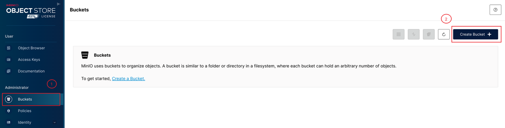

import Tabs from '@theme/Tabs';
import TabItem from '@theme/TabItem';

# BackupRepo

## 概述

BackupRepo 是备份数据的存储仓库，支持配置 OSS（阿里云对象存储），S3（亚马逊对象存储），COS（腾讯云对象存储），GCS（谷歌云对象存储），OBS（华为云对象存储），MinIO 等兼容 S3 协议的对象存储作为备份仓库，同时支持 K8s 原生的 PVC 作为备份仓库。

用户可以创建多个 BackupRepo 以适应不同的场景。例如，根据不同的业务需求，可以把业务 A 的数据存储在 A 仓库，把业务 B 的数据存储在 B 仓库，或者可以按地区配置多个仓库以实现异地容灾。在创建备份时，你需要指定备份仓库。你也可以创建一个默认的备份仓库，如果在创建备份时未指定具体的仓库，KubeBlocks 将使用此默认仓库来存储备份数据。

## 开始之前

请确保你已经：

* [安装 kbcli](./../../installation/install-with-kbcli/install-kbcli.md)。
* [安装 kubectl](https://kubernetes.io/docs/tasks/tools/#kubectl)。
* [安装 Helm](https://helm.sh/docs/intro/install/)。
* 使用 [kbcli](./../../installation/install-with-kbcli/install-kubeblocks-with-kbcli.md) 或 [Helm](./../../installation/install-with-helm/install-kubeblocks-with-helm.md) 安装 KubeBlocks。

## 安装 MinIO

如果你没有使用云厂商的对象存储，可在 Kubernetes 中部署开源服务 MinIO，用它来配置 BackupRepo。如果你正在使用云厂商提供的对象存储服务，可以直接跳转至[配置 BackupRepo](#配置-backuprepo)。

***步骤：***

1. 在 `kb-system` 命名空间中安装 MinIO。

   ```bash
   helm repo add kubeblocks-apps https://jihulab.com/api/v4/projects/152630/packages/helm/stable
   helm install minio kubeblocks-apps/minio --namespace kb-system --create-namespace --set "extraEnvVars[0].name=MINIO_BROWSER_LOGIN_ANIMATION" --set "extraEnvVars[0].value=off"
   ```

   获取初始的用户名和密码：

   ```bash
   # 初始 username
   echo $(kubectl get secret --namespace kb-system minio -o jsonpath="{.data.root-user}" | base64 -d)

   # 初始 password
   echo $(kubectl get secret --namespace kb-system minio -o jsonpath="{.data.root-password}" | base64 -d)
   ```

2. 生成连接凭证。

   执行 `kubectl port-forward --namespace default svc/minio 9001:9001`，然后访问 `127.0.0.1:9001` 进入登录页面。

   登录到仪表盘后，生成 `access key` 和 `secret key`。

   

3. 创建 bucket。

   在 MinIO 仪表盘上创建一个名为 `test-minio` 的存储桶。

   
   

    :::note

    安装的 MinIO 的访问地址（端口）为 `http://minio.kb-system.svc.cluster.local:9000`，用于配置 BackupRepo。在本例中，`kb-system` 是安装 MinIO 的命名空间的名称。

    :::

## 配置 BackupRepo

准备好对象存储服务后，就可以配置 BackupRepo 了。KubeBlocks 提供两种配置方式：

* 安装 KubeBlocks 时自动配置 BackupRepo；
* 按需手动配置 BackupRepo。
  
### 访问 BackupRepo

备份和恢复任务在运行时，有两种访问远端对象存储的方式：

* 使用命令行工具，通过网络直接访问远端存储。
* 通过 CSI Driver 将远端存储映射到本地，工作进程可以像访问本地文件一样访问远端存储。

我们将这两种访问方式分别命名为 “Tool” 和 “Mount” 。用户在创建 BackupRepo 时可以通过 `accessMethod` 字段指定其访问方式，创建之后不能修改。
  
一般来说，推荐使用 “Tool”，因为相比 “Mount”，它不必安装额外的 CSI Driver，减少了一层依赖。

不过，由于备份和恢复任务需要运行在数据库集群所在的 namespace 下，在 “Tool” 方式下，我们会自动将访问远端存储所需的密钥以 secret 资源的形式同步到这些 namespace 中，以供我们的数据传输工具使用。在多租户隔离的情况下，如果你认为这种同步 secret 的做法会带来安全隐患，可以选择使用 “Mount”。

### 自动配置 BackupRepo

安装 KubeBlocks 时，可以通过配置文件指定 BackupRepo 相关信息，KubeBlocks 会根据配置信息创建 BackupRepo 并自动安装必要的 CSI Driver。

1. 准备配置文件。

   以 AWS 的 S3 为例，配置文件 `backuprepo.yaml` 如下：

    ```yaml
    backupRepo:
      create: true
      storageProvider: s3
      config:
        region: cn-northwest-1
        bucket: test-kb-backup
      secrets:
        accessKeyId: <ACCESS KEY>
        secretAccessKey: <SECRET KEY>
    ```

    * `region` 表示 S3 所在区域。
    * `bucket` 表示 S3 的桶名称。
    * `accessKeyId` 表示 AWS 的 Access Key。
    * `secretAccessKey` 表示 AWS 的 Secret Key。
    * `storageProvider` 表示对象存储提供者，该示例中为 s3。

    :::note

    * 在 KubeBlocks v0.7.0 中，`storageProvider` 目前可选 `s3`、`cos`、`gcs-s3comp`、`obs`、`oss`、`minio`、`pvc`。
    * 不同 `storageProvider` 所需的配置信息并不统一，上面展示的 `config` 和 `secrets` 适用于 s3。
    * 执行 `kubectl get storageproviders.storage.kubeblocks.io` 命令可以查看支持的 `storageProvider`。

    :::

2. 安装 KubeBlocks 时指定配置文件。

   ```bash
   kbcli kubeblocks install -f backuprepo.yaml
   ```

   安装完成后，可以执行命令查看 BackupRepo。

   <Tabs>

   <TabItem value="kbcli" label="kbcli" default>

   ```bash
   kbcli backuprepo list
   ```

   </TabItem>

   <TabItem value="kubectl" label="kubectl">

   ```bash
   kubectl get backuprepo
   ```

   </TabItem>

   </Tabs>

### 手动配置 BackupRepo

如果在安装 KubeBlocks 时没有配置 BackupRepo 信息，你可以按照以下说明进行手动配置。

1. 安装 S3 CSI driver （仅访问方式为 “Mount” 时需要安装）。

    <Tabs>

    <TabItem value="kbcli" label="kbcli" default>

    ```bash
    # 启用 CSI-S3 引擎
    kbcli addon enable csi-s3

    # 如需控制 addon 的安装，则添加其他参数
    # 默认 csi-s3 会在所有 node 安装 daemonSet pod，可以配置 tolerations，安装在指定 node
    kbcli addon enable csi-s3 \
      --tolerations '[{"key":"taintkey","operator":"Equal","effect":"NoSchedule","value":"true"}]' \
      --tolerations 'daemonset:[{"key":"taintkey","operator":"Equal","effect":"NoSchedule","value":"true"}]'

    # 查看 csi-s3 状态，确保其状态为 enabled  
    kbcli addon list csi-s3
    ```

    </TabItem>

    <TabItem value="Helm" label="Helm">

    ```bash
    helm repo add kubeblocks https://jihulab.com/api/v4/projects/85949/packages/helm/stable
    helm install csi-s3 kubeblocks/csi-s3 --version=0.7.0 -n kb-system

    # 还可以添加下面的参数来控制安装
    # 默认 csi-s3 会在所有 node 安装 daemonSet pod，可以配置 tolerations，安装在指定 node
    --set-json tolerations='[{"key":"taintkey","operator":"Equal","effect":"NoSchedule","value":"taintValue"}]'
    --set-json daemonsetTolerations='[{"key":"taintkey","operator":"Equal","effect":"NoSchedule","value":"taintValue"}]'
    ```

    </TabItem>

    </Tabs>

2. 创建 BackupRepo。

    <Tabs>

    <TabItem value="kbcli" label="kbcli" default>

      <Tabs>

      <TabItem value="S3" label="S3" default>

      ```bash
      kbcli backuprepo create my-repo \
        --provider s3 \
        --region cn-northwest-1 \
        --bucket test-kb-backup \
        --access-key-id <ACCESS KEY> \
        --secret-access-key <SECRET KEY> \
        --access-method Tool \ # 也可以填 Mount
        --default
      ```

      </TabItem>

      <TabItem value="OSS" label="OSS">

      ```bash
      kbcli backuprepo create my-repo \
        --provider oss \
        --region cn-zhangjiakou \
        --bucket  test-kb-backup \
        # --endpoint https://oss-cn-zhangjiakou-internal.aliyuncs.com \ 可以显示指定 oss endpoint
        --access-key-id <ACCESS KEY> \
        --secret-access-key <SECRET KEY> \
        --access-method Tool \ 
        --default
      ```

      </TabItem>

      <TabItem value="OBS" label="OBS">

      ```bash
      kbcli backuprepo create my-repo \
        --provider obs \
        --region cn-north-4 \
        --bucket  test-kb-backup \
        --access-key-id <ACCESS KEY> \
        --secret-access-key <SECRET KEY> \
        --access-method Tool \
        --default
      ```

      </TabItem>

      <TabItem value="COS" label="COS">

      ```bash
      kbcli backuprepo create my-repo \
        --provider cos \
        --region ap-guangzhou \
        # 腾讯云中存储桶的命名格式为 <BucketName-APPID>，APPID 为腾讯云自动生成
        # 设置 bucket 时先通过腾讯云的控制台创建 bucket，获取存储桶名称
        --bucket  test-kb-backup \ 
        --access-key-id <ACCESS KEY> \
        --secret-access-key <SECRET KEY> \
        --access-method Tool \
        --default
      ```

      </TabItem>

      <TabItem value="GCS" label="GCS">

      ```bash
      # 目前的 gcs 为谷歌云的 s3 兼容版
      kbcli backuprepo create my-repo \
        --provider gcs \
        --region auto \
        --bucket  test-kb-backup \
        --access-key-id <ACCESS KEY> \
        --secret-access-key <SECRET KEY> \
        --access-method Tool \
        --default
      ```

      </TabItem>

      <TabItem value="MinIO" label="MinIO">

      ```bash
      kbcli backuprepo create my-repo \
        --provider minio \
        --endpoint <ip:port> \    # 以上部署的 MinIO 的访问地址为 http://minio.kb-system.svc.cluster.local:9000
        --bucket test-minio \
        --access-key-id <ACCESS KEY> \
        --secret-access-key <SECRET KEY> \
        --access-method Tool \
        --default
      ```

      </TabItem>

      <TabItem value="PVC" label="PVC">

      ```bash
      kbcli backuprepo create --provider pvc \
        --storage-class-name "nfs-storage" \
        --access-mode "ReadWriteMany" \
        --volume-capacity "100Gi" \
        --default
      ```

      </TabItem>
      </Tabs>

      以上命令创建了一个名为 `my-repo` 的默认备份仓库。

      * `my-repo` 为仓库名，可以留空不填，此时 kbcli 会使用形如 `backuprepo-xxxxx` 的随机名字。
      * `--default` 表示该仓库是默认仓库。全局只能有一个默认仓库，如果系统中存在多个默认仓库，KubeBlocks 无法选出应该使用哪个仓库（这个行为跟 K8s 的 default StorageClass 类似），会导致备份失败。使用 kbcli 创建 BackupRepo 能避免出现这种情况，因为 kbcli 在创建时会确保当前没有第二个默认仓库。
      * `--provider` 参数对应后端存储类型，即 `storageProvider`，可选值为 `s3`、`cos`、`gcs-s3comp`、`obs`、`oss` 和 `minio`。不同存储所需的命令行参数不同，可以通过 `kbcli backuprepo create --provider STORAGE-PROVIDER-NAME -h` 命令查看参数信息（注意 `--provider` 参数是必需的）。

        `kbcli backuprepo create` 命令执行成功后，就会在系统中创建一个类型为 BackupRepo 的 K8s 资源，可以通过修改该资源的 annotation 来调整默认仓库。

        ```bash
        # 取消默认仓库
        kubectl annotate backuprepo old-default-repo \
          --overwrite=true \
          dataprotection.kubeblocks.io/is-default-repo=false
        ```

        ```bash
        # 设置新的默认仓库
        kubectl annotate backuprepo backuprepo-4qms6 \
          --overwrite=true \
          dataprotection.kubeblocks.io/is-default-repo=true
        ```

    </TabItem>

    <TabItem value="kubectl" label="kubectl">

      使用 `kubectl` 同样可以配置 BackupRepo，但相比使用 kbcli，会缺少参数校验和默认仓库检查，推荐使用 kbcli。

      <Tabs>

      <TabItem value="S3" label="S3" default>

      ```bash
      # 创建 secret，保存 S3 的访问 AK
      kubectl create secret generic s3-credential-for-backuprepo \
        -n kb-system \
        --from-literal=accessKeyId=<ACCESS KEY> \
        --from-literal=secretAccessKey=<SECRET KEY>

      # 创建 BackupRepo 资源
      kubectl apply -f - <<-'EOF'
      apiVersion: dataprotection.kubeblocks.io/v1alpha1
      kind: BackupRepo
      metadata:
        name: my-repo
        annotations:
          dataprotection.kubeblocks.io/is-default-repo: "true"
      spec:
        storageProviderRef: s3
        accessMethod: Tool
        pvReclaimPolicy: Retain
        volumeCapacity: 100Gi
        config:
          bucket: test-kb-backup
          endpoint: ""
          mountOptions: --memory-limit 1000 --dir-mode 0777 --file-mode 0666
          region: cn-northwest-1
        credential:
          name: s3-credential-for-backuprepo
          namespace: kb-system
      EOF
      ```

      </TabItem>

      <TabItem value="OSS" label="OSS">

      ```bash
      # 创建 secret，保存 OSS 的访问 AK
      kubectl create secret generic oss-credential-for-backuprepo \
        -n kb-system \
        --from-literal=accessKeyId=<ACCESS KEY> \
        --from-literal=secretAccessKey=<SECRET KEY>

      # 创建 BackupRepo 资源
      kubectl apply -f - <<-'EOF'
      apiVersion: dataprotection.kubeblocks.io/v1alpha1
      kind: BackupRepo
      metadata:
        name: my-repo
        annotations:
          dataprotection.kubeblocks.io/is-default-repo: "true"
      spec:
        storageProviderRef: oss
        accessMethod: Tool
        pvReclaimPolicy: Retain
        volumeCapacity: 100Gi
        config:
          bucket: test-kb-backup
          mountOptions: ""
          endpoint: ""
          region: cn-zhangjiakou
        credential:
          name: oss-credential-for-backuprepo
          namespace: kb-system
      EOF
      ```

      </TabItem>

      <TabItem value="OBS" label="OBS">

      ```bash
      # 创建 secret，保存 OBS 的访问 AK
      kubectl create secret generic obs-credential-for-backuprepo \
      -n kb-system \
      --from-literal=accessKeyId=<ACCESS KEY> \
      --from-literal=secretAccessKey=<SECRET KEY>

      # 创建 BackupRepo 资源
      kubectl apply -f - <<-'EOF'
      apiVersion: dataprotection.kubeblocks.io/v1alpha1
      kind: BackupRepo
      metadata:
        name: my-repo
        annotations:
          dataprotection.kubeblocks.io/is-default-repo: "true"
      spec:
        storageProviderRef: obs
        accessMethod: Tool
        pvReclaimPolicy: Retain
        volumeCapacity: 100Gi
        config:
          bucket: test-kb-backup
          mountOptions: ""
          endpoint: ""
          region: cn-north-4
        credential:
          name: obs-credential-for-backuprepo
          namespace: kb-system
      EOF
      ```

      </TabItem>

      <TabItem value="COS" label="COS">

      ```bash
      # 创建 secret，保存 COS 的访问 AK
      kubectl create secret generic cos-credential-for-backuprepo \
        -n kb-system \
        --from-literal=accessKeyId=<ACCESS KEY> \
        --from-literal=secretAccessKey=<SECRET KEY>

      # 创建 BackupRepo 资源
      kubectl apply -f - <<-'EOF'
      apiVersion: dataprotection.kubeblocks.io/v1alpha1
      kind: BackupRepo
      metadata:
        name: my-repo
        annotations:
          dataprotection.kubeblocks.io/is-default-repo: "true"
      spec:
        storageProviderRef: cos
        accessMethod: Tool
        pvReclaimPolicy: Retain
        volumeCapacity: 100Gi
        config:
          bucket: test-kb-backup
          mountOptions: ""
          endpoint: ""
          region: ap-guangzhou
        credential:
          name: cos-credential-for-backuprepo
          namespace: kb-system
      EOF
      ```

      </TabItem>

      <TabItem value="GCS" label="GCS">

      ```bash
      # 创建 secret，保存 GCS 的访问 AK
      kubectl create secret generic gcs-credential-for-backuprepo \
        -n kb-system \
        --from-literal=accessKeyId=<ACCESS KEY> \
        --from-literal=secretAccessKey=<SECRET KEY>

      # 创建 BackupRepo 资源
      kubectl apply -f - <<-'EOF'
      apiVersion: dataprotection.kubeblocks.io/v1alpha1
      kind: BackupRepo
      metadata:
        name: my-repo
        annotations:
          dataprotection.kubeblocks.io/is-default-repo: "true"
      spec:
        storageProviderRef: gcs
        accessMethod: Tool
        pvReclaimPolicy: Retain
        volumeCapacity: 100Gi
        config:
          bucket: test-kb-backup
          mountOptions: ""
          endpoint: ""
          region: auto
        credential:
          name: gcs-credential-for-backuprepo
          namespace: kb-system
      EOF
      ```

      </TabItem>

      <TabItem value="MinIO" label="MinIO">

      ```bash
      # 创建 secret，保存 MinIO 的访问 AK
      kubectl create secret generic minio-credential-for-backuprepo \
        -n kb-system \
        --from-literal=accessKeyId=<ACCESS KEY> \
        --from-literal=secretAccessKey=<SECRET KEY>

      # 创建 BackupRepo 资源
      kubectl apply -f - <<-'EOF'
      apiVersion: dataprotection.kubeblocks.io/v1alpha1
      kind: BackupRepo
      metadata:
        name: my-repo
        annotations:
          dataprotection.kubeblocks.io/is-default-repo: "true"
      spec:
        storageProviderRef: minio
        accessMethod: Tool
        pvReclaimPolicy: Retain
        volumeCapacity: 100Gi
        config:
          bucket: test-kb-backup
          mountOptions: ""
          endpoint: <ip:port>
        credential:
          name: minio-credential-for-backuprepo
          namespace: kb-system
      EOF
      ```

      </TabItem>

      </Tabs>

    </TabItem>

    </Tabs>

3. 查看 BackupRepo 及其状态。
   如果 STATUS 为 `Ready`，说明 BackupRepo 已经准备就绪。

   <Tabs>

   <TabItem value="kbcli" label="kbcli" default>

   ```bash
   kbcli backuprepo list
   ```

   </TabItem>

   <TabItem value="kubectl" label="kubectl">

   ```bash
   kubectl get backuprepo
   ```

   </TabItem>

   </Tabs>
