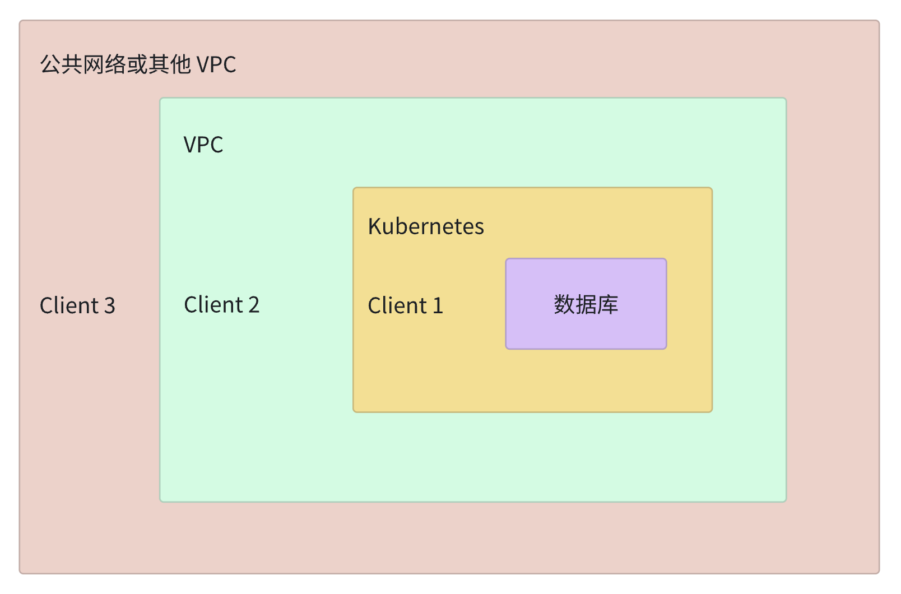

# 在生产环境中连接数据库

在生产环境中，使用 CLI 和 SDK 客户端连接数据库是很常见的。主要有以下三种场景：
- 场景 1：Client1 和数据库位于同一个 Kubernetes 集群中。如果要连接 Client1 和数据库，请参考[方案 3](#方案-3-连接在同一个-kubernetes-集群中的客户端)。
- 场景 2：Client2 在 Kubernetes 集群之外，但与数据库位于同一个 VPC 中。如果要连接 Client2 和数据库，请参考[方案 5](#方案-5-连接在-kubernetes-集群之外但与-kubernetes-集群位于同一-vpc-中的客户端)。
- 场景 3：Client3 和数据库位于不同的 VPC，例如其他 VPC 或公共网络。如果要连接 Client3 和数据库，请参考[方案 4](#方案-4-连接在其他-vpc-或公共网络中的客户端)。

参考下面的网络位置关系图。


## 方案 3. 连接在同一个 Kubernetes 集群中的客户端

你可以使用数据库的 ClusterIP 或域名进行连接。使用 `kbcli cluster describe ${cluster-name}` 检查数据库的端口。

```bash
kbcli cluster describe x
>
Name: x         Created Time: Mar 01,2023 11:45 UTC+0800
NAMESPACE   CLUSTER-DEFINITION   VERSION           STATUS    TERMINATION-POLICY
default     apecloud-mysql       ac-mysql-8.0.30   Running   Delete

Endpoints:
COMPONENT   MODE        INTERNAL                                 EXTERNAL
x           ReadWrite   x-mysql.default.svc.cluster.local:3306   <none>

Topology:
COMPONENT   INSTANCE    ROLE     STATUS    AZ                NODE                                                       CREATED-TIME
mysql       x-mysql-0   leader   Running   cn-northwest-1b   ip-10-0-2-184.cn-northwest-1.compute.internal/10.0.2.184   Mar 01,2023 11:45 UTC+0800

Resources Allocation:
COMPONENT   DEDICATED   CPU(REQUEST/LIMIT)   MEMORY(REQUEST/LIMIT)   STORAGE-SIZE   STORAGE-CLASS
mysql       false       1 / 1                1Gi / 1Gi               data:10Gi      <none>

Images:
COMPONENT   TYPE    IMAGE
mysql       mysql   registry.cn-hangzhou.aliyuncs.com/apecloud/apecloud-mysql-server:8.0.30-5.alpha2.20230105.gd6b8719.2

Events(last 5 warnings, see more:kbcli cluster list-events -n default x):
TIME   TYPE   REASON   OBJECT   MESSAGE
```

## 方案 4. 连接在其他 VPC 或公共网络中的客户端

你可以启用云厂商提供的外部负载均衡器。

:::note

以下命令能够为数据库创建一个负载均衡器实例，并可能会产生云厂商的费用。

:::

```bash
kbcli cluster expose ${cluster-name} --type internet --enable=true
```

要禁用负载均衡器实例，请执行以下命令。

```bash
kbcli cluster expose ${cluster-name} --type internet --enable=false
```

:::note

禁用负载均衡器实例后，实例将无法访问。

:::

## 方案 5. 连接在 Kubernetes 集群之外但与 Kubernetes 集群位于同一 VPC 中的客户端

使用一个稳定的域名以实现长期连接。你可以使用云厂商提供的内部负载均衡器来实现这一目的。

:::note

以下命令会为数据库实例创建一个负载均衡器实例，并可能会产生云厂商的费用。

:::

```bash
kbcli cluster expose ${cluster-name} --type vpc --enable=true
```

要禁用负载均衡器实例，请执行以下命令。

:::note

一旦禁用，实例将无法访问。

:::

```bash
kbcli cluster expose ${cluster-name} --type vpc --enable=false
```
