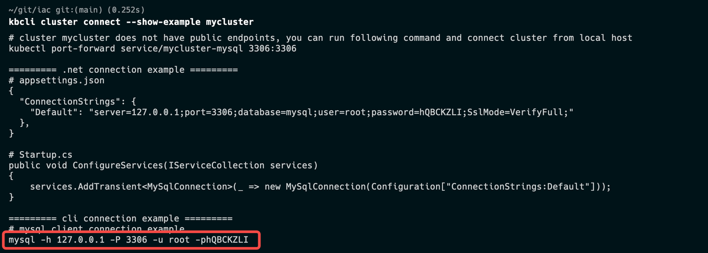

# 在测试环境中连接数据库

## 方案 1. 使用 kbcli cluster connect 命令

你可以使用 `kbcli cluster connect` 命令并指定要连接的集群名称。

```bash
kbcli cluster connect ${cluster-name}
```

它的底层命令是 `kubectl exec`。只要能够访问 K8s API 服务器，就可以使用该命令。

## 方案 2. 使用 CLI 或者 SDK 客户端连接数据库

执行以下命令以获取目标数据库的网络信息，并使用其打印输出的 IP 地址进行连接。

```bash
kbcli cluster connect --show-example ${cluster-name}
```

其打印输出的信息包括数据库地址、端口号、用户名和密码。下图以 MySQL 数据库为例。

- 地址：-h 表示服务器地址。在下面的示例中为 127.0.0.1。
- 端口：-P 表示端口号。在下面的示例中为 3306。
- 用户名：-u 表示用户名。
- 密码：-p 表示密码。在下面的示例中为 hQBCKZLI。

:::note

密码不包括 -p 本身。

:::


