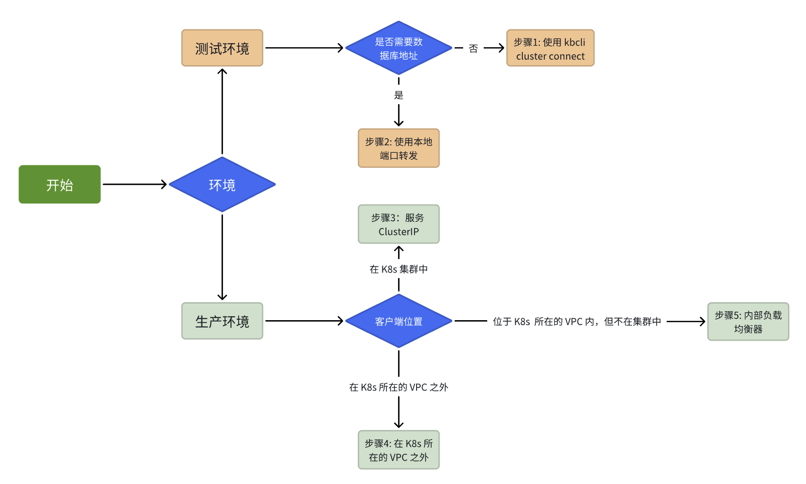

import Tabs from '@theme/Tabs';
import TabItem from '@theme/TabItem';

# 创建 MySQL 集群

KubeBlocks 支持管理多种数据库引擎，针对每一种引擎的创建集群的命令都是一样的。但是配置细节上略有差别。本小节以创建 MySQL 集群为例。

KubeBlocks 支持创建两种类型的 MySQL 集群：单机版（Standalone）和集群版（RaftGroup）。单机版仅支持一个副本，适用于对可用性要求较低的场景。 集群版包含三个副本，适用于对高可用性要求较高的场景。为了确保高可用性，所有的副本都默认分布在不同的节点上。

<Tabs>

<TabItem value="kbcli" label="kbcli" default>

创建 MySQL 单机版。

```bash
kbcli cluster create mysql <clustername>
```

创建 MySQL 集群版。

```bash
kbcli cluster create mysql --mode raftGroup <clustername>
```

如果只有一个节点用于部署 MySQL 集群版，请在创建集群时将 `availability-policy` 设置为 `none`。

```bash
kbcli cluster create mysql --mode raftGroup --availability-policy none <clustername>
```

:::note

* 生产环境中，不建议将所有副本部署在同一个节点上，因为这可能会降低集群的可用性。
* 执行以下命令，查看创建 MySQL 集群的选项和默认值。
  
  ```bash
  kbcli cluster create mysql -h
  ```

:::

</TabItem>

<TabItem value="kubectl" label="kubectl">

KubeBlocks 实现了用 `Cluster` CRD 来定义集群。比如，可以通过下面的命令创建 MySQL 集群版：

   ```bash
   cat <<EOF | kubectl apply -f -
   apiVersion: apps.kubeblocks.io/v1alpha1
   kind: Cluster
   metadata:
     name: mysql-cluster
     namespace: demo
   spec:
     clusterDefinitionRef: apecloud-mysql
     clusterVersionRef: ac-mysql-8.0.30
     componentSpecs:
     - componentDefRef: mysql
       name: mysql
       replicas: 3
       resources:
         limits:
           cpu: "1"
           memory: 1Gi
         requests:
           cpu: "1"
           memory: 1Gi
       volumeClaimTemplates:
       - name: data
         spec:
           accessModes:
           - ReadWriteOnce
           resources:
             requests:
               storage: 20Gi
     terminationPolicy: Delete
   EOF
   ```

* `spec.clusterDefinitionRef` 是集群定义 CRD 的名称，用来定义集群组件。
* `spec.clusterVersionRef` 是集群版本 CRD 的名称，用来定义集群版本。
* `spec.componentSpecs` 是组件列表，用来定义集群组件。
* `spec.componentSpecs.componentDefRef` 是组件定义的名称，在 ClusterDefinition 中定义。你可以使用 `kubectl get clusterdefinition vape cloud-MySQL -o json | jq '.spec.componentDefs[].name'` 获取组件定义的名称。
* `spec.componentSpecs.name` 是组件的名称。
* `spec.componentSpecs.replicas` 是组件的副本数。
* `spec.componentSpecs.resources` 是组件的资源要求。
* `spec.componentSpecs.volumeClaimTemplates` 是卷声明模板的列表，用于定义组件的卷声明模板。
* `spec.terminationPolicy` 表示集群的终止策略，默认值为 `Delete`，有效值为 `DoNotTerminate`、`Halt`、`Delete` 和 `WipeOut`。`DoNotTerminate` 禁止一切删除操作。`Halt` 会删除工作负载资源，如 statefulset 和 deployment 等，但是保留 PVC。`Delete` 在 `Halt` 的基础上进一步删除了 PVC。`WipeOut` 在 `Delete` 的基础上从备份存储的位置完全删除所有卷快照和快照数据。

KubeBlocks operator 监听 `Cluster` CRD，创建集群及其依赖资源。你可以使用以下命令获取该集群创建的所有资源。

```bash
kubectl get all,secret,rolebinding,serviceaccount -l app.kubernetes.io/instance=mysql-cluster -n demo
```

查看所创建的 MySQL 集群对象：

```bash
kubectl get cluster mysql-cluster -n demo -o yaml
```

<details>
<summary>输出</summary>

```yaml
apiVersion: apps.kubeblocks.io/v1alpha1
kind: Cluster
metadata:
  annotations:
    kubectl.kubernetes.io/last-applied-configuration: |
      {"apiVersion":"apps.kubeblocks.io/v1alpha1","kind":"Cluster","metadata":{"annotations":{},"name":"mysql-cluster","namespace":"demo"},"spec":{"clusterDefinitionRef":"apecloud-mysql","clusterVersionRef":"ac-mysql-8.0.30","componentSpecs":[{"componentDefRef":"mysql","name":"mysql","replicas":1,"resources":{"limits":{"cpu":"0.5","memory":"1Gi"},"requests":{"cpu":"0.5","memory":"1Gi"}},"volumeClaimTemplates":[{"name":"data","spec":{"accessModes":["ReadWriteOnce"],"resources":{"requests":{"storage":"20Gi"}}}}]}],"terminationPolicy":"Delete"}}
  creationTimestamp: "2023-07-17T09:03:23Z"
  finalizers:
  - cluster.kubeblocks.io/finalizer
  generation: 1
  labels:
    clusterdefinition.kubeblocks.io/name: apecloud-mysql
    clusterversion.kubeblocks.io/name: ac-mysql-8.0.30
  name: mysql-cluster
  namespace: demo
  resourceVersion: "27158"
  uid: de7c9fa4-7b94-4227-8852-8d76263aa326
spec:
  clusterDefinitionRef: apecloud-mysql
  clusterVersionRef: ac-mysql-8.0.30
  componentSpecs:
  - componentDefRef: mysql
    monitor: false
    name: mysql
    noCreatePDB: false
    replicas: 1
    resources:
      limits:
        cpu: "0.5"
        memory: 1Gi
      requests:
        cpu: "0.5"
        memory: 1Gi
    volumeClaimTemplates:
    - name: data
      spec:
        accessModes:
        - ReadWriteOnce
        resources:
          requests:
            storage: 20Gi
  terminationPolicy: Delete
status:
  clusterDefGeneration: 2
  components:
    mysql:
      consensusSetStatus:
        leader:
          accessMode: None
          name: ""
          pod: Unknown
      phase: Failed
      podsReady: true
      podsReadyTime: "2023-07-17T09:03:37Z"
  conditions:
  - lastTransitionTime: "2023-07-17T09:03:23Z"
    message: 'The operator has started the provisioning of Cluster: mysql-cluster'
    observedGeneration: 1
    reason: PreCheckSucceed
    status: "True"
    type: ProvisioningStarted
  - lastTransitionTime: "2023-07-17T09:03:23Z"
    message: Successfully applied for resources
    observedGeneration: 1
    reason: ApplyResourcesSucceed
    status: "True"
    type: ApplyResources
  - lastTransitionTime: "2023-07-17T09:03:37Z"
    message: all pods of components are ready, waiting for the probe detection successful
    reason: AllReplicasReady
    status: "True"
    type: ReplicasReady
  - lastTransitionTime: "2023-07-17T09:03:23Z"
    message: 'pods are unavailable in Components: [mysql], refer to related component
      message in Cluster.status.components'
    reason: ComponentsNotReady
    status: "False"
    type: Ready
  observedGeneration: 1
  phase: Running
```

</details>

</TabItem>

</Tabs>


你可以通过客户端界面或 `kbcli` 连接到数据库。如下图所示，首先你需要明确连接数据库的目的是什么。
- 如果你想试用 KubeBlocks、测试数据库功能或进行低流量基准测试，请参阅[在测试环境中连接数据库](../create-and-connect-databases/connect-to-database-in-testing-environment.md)。
- 如果你想在生产环境中连接数据库或进行高流量压力测试，请参阅[在生产环境中连接数据库](../create-and-connect-databases/connect-to-database-in-production-environment.md)。
